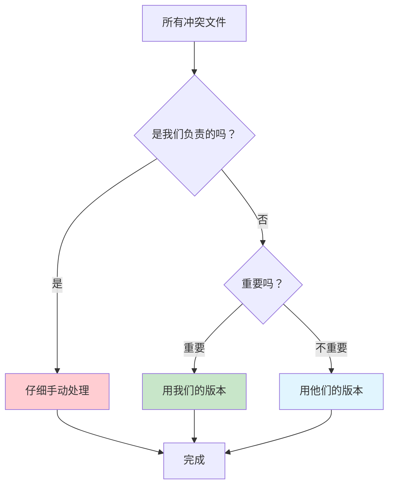

想象一下，你和同事们在同一个项目上工作，就像几个人同时整理一个大文件柜。突然有一天，你发现有些文件被不同的人改动了，系统不知道该保留谁的版本。这就是代码开发中的"冲突"现象。

今天，我要分享一个真实的解决经验，教你如何像整理文件夹一样，轻松处理这类问题。

<!--more-->

## 问题的起因：当多人改动遇到合并

### 真实场景重现

我们团队遇到了这样一个情况：
- **A分支**：日常工作的主线，就像办公室的主要文件柜
- **B分支**：上次发布版本的备份，就像存档柜
- **C分支**：想要把B的内容搬到A里，就像把存档的东西重新整理回主文件柜

问题来了：在搬运过程中，系统发现有些文件在两边都被改动过，不知道该听谁的。

### 团队分工的智慧

关键的洞察是：**不是所有文件都需要我们处理**。

就像公司里每个部门只负责自己的文件一样，我们团队只需要关心 `devops/`（运维相关）这个文件夹的冲突，其他部门的事情让他们自己解决。

## 解决方案：分步骤，有重点

### 第一步：搞清楚状况


首先，我们要看看到底哪些文件有问题：

```bash
# 就像查看哪些文件有标签冲突
git diff origin/A...origin/C --name-only -- devops/
```

这个命令会告诉你，在我们负责的 `devops/` 文件夹里，到底有哪些文件需要处理。

### 第二步：创建安全的工作空间

```bash
# 创建一个临时工作台，不影响原始文件
git checkout -b local-C origin/C
```

这就像在办公桌上铺一张白纸，在上面试验各种整理方案，不会弄乱原来的文件柜。

### 第三步：让冲突显现出来

```bash
# 尝试合并，但不要真的执行
git merge origin/A --no-commit
```

这个 `--no-commit` 参数很重要，就像"先看看会有什么问题，但不要真的动手整理"。系统会告诉你所有的冲突情况。

### 第四步：重点解决我们的部分

现在重点来了。我们看到所有冲突后，要做三件事：

1. **仔细处理我们负责的文件夹**
```bash
# 查看devops/文件夹的具体冲突
git status -- devops/
```

2. **聪明地处理其他冲突**
   - 对于不重要的文件：`git checkout --theirs filename`（用他们的版本）
   - 对于要保留的文件：`git checkout --ours filename`（用我们的版本）

3. **手动解决重要冲突**
   打开冲突文件，你会看到这样的标记：
   ```
   <<<<<<< HEAD
   我们的版本内容
   =======
   他们的版本内容
   >>>>>>> origin/A
   ```
   
   删除这些标记，保留正确的内容即可。

### 第五步：提交并更新

```bash
# 保存我们的解决方案
git add .
git commit -m "解决devops/目录冲突，自动处理其他冲突"

# 把解决方案推送回原来的分支
git push origin local-C:C
```

最后一个命令很神奇：它把我们本地的工作成果（`local-C`）推送到原来的分支（`C`），这样在线的合并请求就自动更新了。

## 为什么这个方法特别好用？

### 像做家务一样分类处理



1. **省时间**：不用每个文件都仔细研究
2. **降风险**：只改动我们熟悉的部分
3. **保和谐**：其他团队的工作不受影响

### 实际效果

- ✅ 我们的 `devops/` 文件夹：仔细解决，确保正确
- ✅ 其他团队文件：智能选择，快速处理
- ✅ 整个项目：顺利合并，所有人都满意

## 给新手的贴心提醒

### 使用这个方法前，先问自己：
1. 我清楚自己负责哪些文件夹吗？
2. 其他冲突文件我可以放心自动处理吗？
3. 我有没有先备份重要内容？

### 万一出错了怎么办？
不用担心！因为我们用的是本地分支（`local-C`），原始内容都还在。大不了重新开始：
```bash
git checkout main
git branch -D local-C  # 删除出错的尝试
# 重新开始
```

## 总结

解决代码冲突其实没那么可怕。关键是要：
- **分清责任范围**：专注自己负责的部分
- **使用安全方法**：先预览，再行动
- **善用自动化**：让工具帮你处理简单重复的工作

就像整理办公室一样，方法对了，效率自然就高了。

你遇到过类似的团队协作问题吗？不妨试试这个方法，说不定会有意外的收获！
