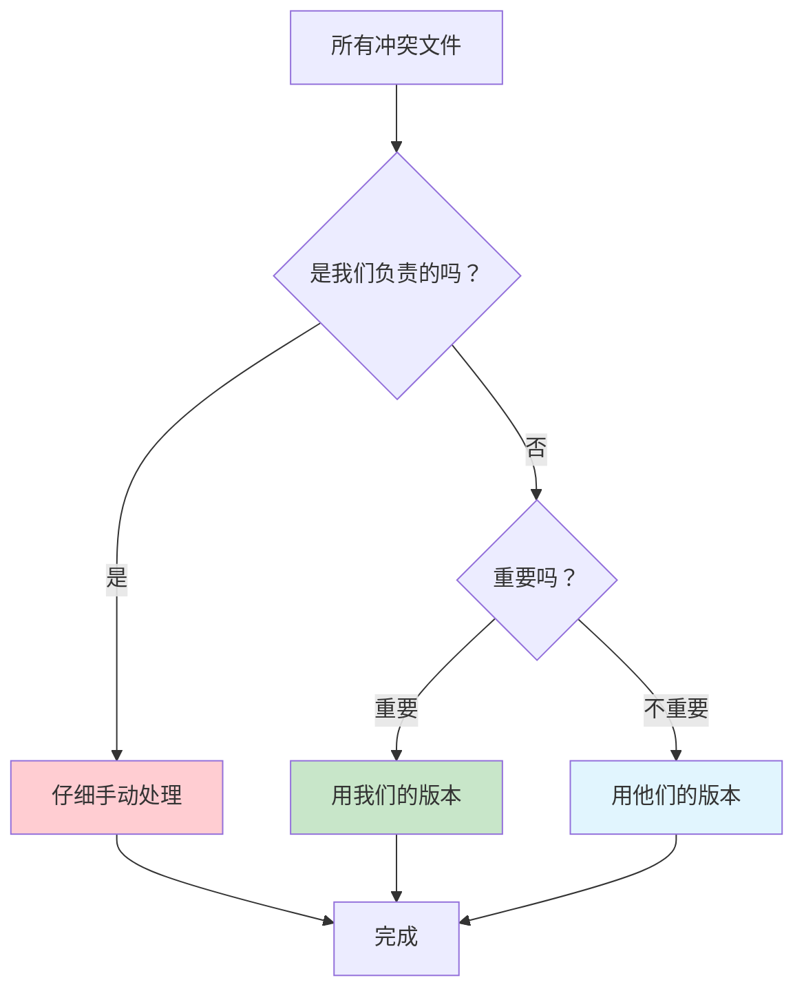

Представьте, что вы и ваши коллеги работаете над одним и тем же проектом, как несколько человек, одновременно организующих большую картотеку. И вдруг в один прекрасный день вы понимаете, что некоторые файлы были изменены разными людьми, и система не знает, чью версию оставить. Это и есть феномен "конфликта" в разработке кода.

Сегодня я поделюсь реальным опытом, чтобы научить вас решать подобные проблемы так же легко, как упорядочивать папки.

<! -еще-->

## Причина проблемы: когда несколько изменений встречаются при слиянии

### Реальные сценарии воссозданы ###

Наша команда столкнулась с такой ситуацией:
- **Ветвь A**: основная линия ежедневной работы, как главный шкаф с документами в офисе.
- **Ветвь B**: резервная копия последнего релиза, как архивный шкаф.
- **Ветвь C**: хотим переместить содержимое B в A, как будто переставляем архив обратно в главную картотеку.

Вот в чем проблема: во время перемещения система обнаруживает, что некоторые файлы были изменены с обеих сторон, и не знает, к кому прислушаться.

### Мудрость разделения труда в команде

Ключевой момент заключается в том, что **не все файлы должны обрабатываться нами**.

Подобно тому, как каждый отдел в компании отвечает только за свои файлы, нашей команде нужно заботиться только о конфликтах в папке __PROTECTED_INLINE_CODE__9__ (связанной с Ops), а остальные отделы пусть заботятся о себе сами.

## Решение: пошаговое и целенаправленное

### Шаг 1: выясните ситуацию

```mermaid
graph LR
    A[主文件柜 A] 
    B[存档柜 B]
    C[临时搬运箱 C]
    
    B -->|复制| C
    C -->|想放入但有冲突| A
    
    style C fill:#ffeb3b
    style A fill:#e8f5e9
```_.

Для начала нам нужно выяснить, с какими именно файлами возникли проблемы:

```bash
# 就像查看哪些文件有标签冲突
git diff origin/A...origin/C --name-only -- devops/
```

Эта команда точно скажет вам, какие файлы в папке `devops/`, за которые мы отвечаем, нужно обработать.

### Шаг 2: Создайте безопасное рабочее пространство

```bash
# 创建一个临时工作台，不影响原始文件
git checkout -b local-C origin/C
```

Это все равно что разложить на столе чистый лист бумаги и поэкспериментировать с различными вариантами организации, которые не будут загромождать ваш оригинальный картотечный шкаф.

### Шаг 3: Сделайте конфликт видимым

```bash
# 尝试合并，但不要真的执行
git merge origin/A --no-commit
```

Параметр `--no-commit` важен, как "сначала посмотрите, что идет не так, но не разбирайтесь с этим". Система сообщит вам обо всех конфликтах.

### Шаг 4: Фокусировка на нашей части решения

А теперь самое интересное. После того как мы увидим все конфликты, мы сделаем три вещи:

1. **Внимательно разберемся с папками, за которые мы отвечаем.
```bash
# 查看devops/文件夹的具体冲突
git status -- devops/
```.

2. ** Разумно справимся с остальными конфликтами.
   - Для неважных файлов: `git checkout --theirs filename` (используйте их версию).
   - Для файлов, которые нужно сохранить: `git checkout --ours filename` (используйте нашу версию)

3. **Ручное разрешение критических конфликтов**
   Откройте файл с конфликтом и увидите такую разметку:
   ```
   <<<<<<< HEAD
   我们的版本内容
   =======
   他们的版本内容
   >>>>>>> origin/A
   ```.

   Просто удалите эти флаги и сохраните правильное содержимое.

### Шаг 5: Зафиксируйте и обновите

```bash
# 保存我们的解决方案
git add .
git commit -m "解决devops/目录冲突，自动处理其他冲突"

# 把解决方案推送回原来的分支
git push origin local-C:C
```

Последняя команда удивительна: она переносит наш локальный рабочий продукт (`local-C`) в исходную ветку (`C`), так что запросы на слияние в сети автоматически обновляются.

## Почему этот метод работает особенно хорошо?

### Разберитесь с этим как с рутиной.



1. **Экономия времени**: не нужно просматривать каждый файл.
2. **Снижение риска**: изменяем только те части, которые хорошо знаем
3. **Защита гармонии**: работа других команд не пострадает.

### Фактические результаты

- ✅ Наша папка `devops/`: тщательно решена, чтобы убедиться в ее правильности!
- ✅ Другие файлы команды: грамотный выбор, быстрая обработка
- ✅ Весь проект: слияние прошло гладко, и все остались довольны

## Продуманные напоминания для новичков

### Прежде чем использовать этот метод, спросите себя:
1. знаю ли я, за какие папки я отвечаю?
2. могу ли я быть уверен, что другие конфликтующие файлы будут обработаны автоматически?
3. создал ли я резервную копию важных файлов?

### Что делать, если что-то пойдет не так?
Не волнуйтесь! Поскольку мы используем локальную ветку (`local-C`), исходное содержимое все еще там. Главное - начать сначала:
```bash
git checkout main
git branch -D local-C  # 删除出错的尝试
# 重新开始
```

## Резюме

Разрешение конфликтов кода на самом деле не так страшно. Главное - это:
- **Разграничьте области ответственности**: сосредоточьтесь на тех частях, за которые вы отвечаете.
- **Использовать безопасные методы**: предварительно просматривать, прежде чем действовать
- **Использовать автоматизацию**: позволять инструментам выполнять простые повторяющиеся задачи за вас

Как и при организации офиса, правильный подход естественным образом приводит к эффективности.

Вы сталкивались с подобными проблемами при работе в команде? Почему бы не попробовать этот метод, ведь он может принести неожиданные выгоды!
