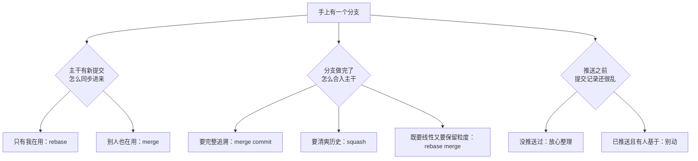

如果你在网上搜「Git 合并分支到底用 merge 还是 rebase」，会得到一堆互相矛盾的建议：有人说「永远用 merge，rebase 会害死团队」，有人说「历史乱得像毛线团」，还有人推荐 squash。

这三句话都不算错——它们看起来在回答同一个问题，实际上在回答**三个不同的问题**。这篇文章把「合并分支」拆成三个独立的决定：拆开之后你会发现，merge、squash、rebase 根本不构成竞争关系，它们负责流水线上不同的环节。

<!--more-->

## 一、先看一张图：合并到底在合并什么

先说一个更基础的问题：历史长什么样，为什么值得在意？

因为 Git 历史不是给机器看的，是给**未来的某个人**看的——可能是三个月后排查 bug 的你，可能是新加入团队的同事，也可能是半夜急着回滚一次线上事故的值班工程师。好的历史，能让这些人在最短时间内找到答案；坏的历史，会让每个人多花两小时。

Git 的历史不是一个"列表"，而是一张"图"。

每次提交，Git 都会记录两样东西：这次改了什么，以及**这次是基于哪个提交改的**（术语叫"父提交"）。于是历史自然就长成了这样：

```
A --- B --- C          ← main
       \
        D --- E        ← feature
```

这张图的读法：A 到 C 是主干上依次发生的事；feature 是从 B 这里分出去的，在它上面又发生了两次提交 D 和 E。

"合并分支"要解决的，就是这种**分叉**：两条线各自往前走了，现在要重新接上。

但在讲怎么接之前，必须先理解一个贯穿全文的概念：**提交的编号**。

每个提交都有一个独一无二的编号，比如 `a3f9c21`。这不是流水号，而是根据「提交的内容 + 父提交的编号 + 作者 + 时间」算出来的哈希值——**内容是因，编号是果**。

由此可以推出本篇最重要的一条结论：

> **只要改动了父提交，编号必然改变。**

记住这一条，后面所有的"风险"和"注意事项"你都能自己推导出来。

## 二、三种做法，各自在图上做了什么

### merge commit：只做加法

`git merge` 是三者中唯一**不修改任何已有提交**的操作。它只是在末尾新增一个提交，这个提交的特殊之处是有**两个父提交**——它同时记住了两条线：

```
A --- B --- C ------- M    ← main
       \             /
        D --- E -----      ← feature
```

M 就是合并提交，它像一条拉链，把两条历史拉在一起。

过去发生的每一件事都原样保留在图上：功能分支哪天分出去的、中途做了几次提交、什么时候合回来的，一清二楚。如果将来要排查"这个 bug 是哪次改动引入的"，完整的分支结构能帮你把范围缩得更准。

**代价**：分支结构本身就是"噪音"。当主干上有几十个功能分支来来往往，`git log --graph` 画出来的图会相当壮观，`git log` 的输出里也会混进大量 `Merge branch 'xxx' into 'yyy'` 这样的记录。

后文会讲到，这个问题有一个很优雅的解法。

### squash：在主干上留一份"总结陈词"

squash 的意思是"压扁"：把分支上的所有改动**汇总成一个提交**，放到主干上。

```
A --- B --- C --- S        ← main
       \
        D --- E            ← feature 原样不动，但与 main 已"失联"
```

这张图里最关键的一点：**S 和 D、E 之间没有任何父子关系**。S 是一个全新的提交，内容等于 D+E 的总和，但它不认识 D 和 E。原分支的那些提交并没有"进入"主干的历史。

所以 squash 之后，主干历史是一条干净的直线：**一个功能 = 一个提交**。

这也是它最实用的两个好处：

- **回滚简单**：一个功能整体出问题，revert 那一个提交就行，不用在一堆关联提交里挑拣。
- **主干可读**：`git log --oneline` 从上往下读，就是一份功能清单。"修了三次拼写错误""调试用的临时提交"这类中间过程，不会出现在主干上。

**代价**：细粒度的开发过程被丢弃了。你无法再看到"这个功能当初是怎么一步步搭起来的"——而这有时恰恰是排查问题时最想知道的。

### rebase：把提交"重做"一遍

rebase 的官方译名叫"变基"。它做的事是：把你分支上的提交逐个"摘下来"，重新接到主干的最新位置之后。

注意"重新"这个词。这不是移动，是**重做**——因为父提交变了，编号必然变（还记得第一节那条结论吗）：

```
A --- B --- C --- D' --- E'   ← feature（D、E 被"重做"成了 D'、E'）
```

D' 和 E' 的内容和 D、E 一模一样，但它们是全新的提交对象。原来那两个提交还躺在 Git 的数据库里（直到被清理），只是没有任何分支再指向它们了。

rebase 之后立刻合并的话，主干只需要把指针"快进"一下即可——因为 feature 已经长在主干的最前面了，根本不需要合并提交：

```
A --- B --- C --- D' --- E'   ← main 和 feature 指向同一个位置
```

这就是所谓的 **fast-forward（快进）**。顺带解释一个常见困惑：为什么有时候 `git merge` 不产生合并提交？——当主干自始至终没有新提交时，Git 默认就直接快进了。想让合并提交"无论如何都出现"，要加 `--no-ff`（no fast-forward）参数。

### 三种做法的本质差异，一张表说完

| | 已有的提交 | 主干上新增什么 | 历史形状 |
|---|---|---|---|
| **merge** | 一个都不动 | 一个合并提交（两个父提交） | 保留分叉，有"拉链" |
| **squash** | 一个都不动 | 一个汇总提交（内容=全部改动） | 直线 |
| **rebase** | **复制重建**，编号改变 | 不动主干，分支被"搬"到最新处 | 直线 |

## 三、真正要做的三个决定

现在进入正题。所谓"我该用 merge 还是 squash 还是 rebase"，其实是三个独立的决定被压缩成了一句话：



下面逐个说。

### 决定一：主干有更新，怎么同步到我的分支？

场景：你在功能分支上开发了三天，这期间主干被别人合进了二十个提交。你现在需要把主干的变更同步进来。

两条路：

- 在 feature 分支上执行 `git merge main` —— 产生一个合并提交，历史多出一个分叉节点。
- 在 feature 分支上执行 `git rebase main` —— 你的提交被重做到 main 的最新位置后面，历史保持直线。

判断标准只有一条：**这个分支除了你，还有别人基于它在工作吗？**

- **只有我一个人用** → rebase。为什么不呢？历史干净，没有多余的合并提交。
- **别人也在用** → merge。因为你 rebase 会改变提交编号，而别人手里拿的是旧编号的版本。

这里有一个常见的误解需要澄清："我的分支已经推送了,是不是就不能 rebase 了？"——**推送本身不是问题，别人基于它做了工作才是问题**。你自己的功能分支推送到远程仓库备份，然后 rebase 后 force push，完全安全（除非正好有人在 review 你的分支并 checkout 了旧版本，这种概率很小，但团队大时值得留个心眼）。

还有一个高频噪音值得一提：如果你在 feature 分支上执行 `git pull`（它默认等于 fetch + merge），你本地就会多出一个 `Merge branch 'main' into feature` 的提交。这类提交没有任何信息量，是纯粹的噪音。

解法是可以用配置一次性消灭的——见第六节。

### 决定二：分支做完了，怎么合入主干？

这是三个决定里**唯一一个属于团队策略的**。前一个决定（怎么同步）只影响你自己看得见的那条线；这一个决定（怎么合入）会**永久写进主干历史**，而后文所有基于主干工作的人都要看它。

三个选项对应的价值观：

- **merge commit**：主干历史是"档案"，追求完整可追溯。适合长期维护、需要精确回溯的项目（典型如 Linux 内核）。
- **squash**：主干历史是"清单"，追求可读和易回滚。适合迭代快、以功能为单位的项目（大量互联网产品的默认选择）。
- **rebase merge**：折中，主干是线性的，但保留 PR 内的每个提交。适合对提交质量有把握的团队。

如果让我给一个适合大多数团队的默认建议：**squash**。原因是它的两个优点恰好命中日常最痛的场景——主干 `git log` 一眼能读懂，回滚一个功能是单个 revert。代价（丢失中间过程）对多数团队来说可以接受，因为那些过程本来也是"改错别字"和"调试输出"。

**但有一条纪律比选哪个更重要：不要混用。**

一旦团队里有人 merge、有人 squash，主干历史就既不是完整的档案，也不是工整的清单——它变成了一锅什么都有的杂烩，两种方式的优点你一个都得不到。

所以这件事**一旦团队定了，成员服从就完了**，不要凭个人喜好另搞一套。

顺带说一句：如果你是个人项目，最简单的答案是"根本不用分支，直接往主干上提交"。三个决定的烦恼一次性消失。

### 决定三：推送前，要不要整理我的提交？

这是最灵活、最没有负担的一个决定，因为它**完全是你自己的事**——只要还没推送，怎么折腾都不影响别人。

```bash
git rebase -i HEAD~5    # 整理最近 5 个提交
```

`-i` 是 interactive（交互式）的意思。它打开的编辑器里列着你最近的提交，你可以：

- 把几个提交**合并**成一个（改关键词为 `squash` 或 `fixup`）
- 修改提交信息（`reword`）
- 调整顺序
- 删掉某个提交

判断标准：**这些提交对未来的读者有信息量吗？**

"wip""fix typo""调试用的临时提交"——这些对任何人都没有价值，合并掉。而如果是"先加数据层、再加业务层、最后接入接口"这种有逻辑分段的提交，保留下来反而是一份很好的开发笔记。

值得注意的是：如果你们的团队用 squash 合并，整理的意义会打折扣（反正最后会被压扁）——但它对**代码审查**仍然有价值：评审人看到的是一份有条理的变更，而不是二十个零碎补丁。

### 三个决定可以自由组合

最关键的一点来了。这三个决定**互不冲突**，可以任意组合。举一个常见的自洽组合：

```
同步主干：    git pull --rebase      （保持分支直线）
推送前：      git rebase -i          （把 WIP 合并掉）
合入主干：    squash merge           （主干一个功能一个提交）
```

这三条同时使用，一点都不矛盾。而"我该用 merge 还是 rebase"这个问题之所以让人困惑，就是因为它把这条流水线上的三个环节揉成了一团。

## 四、场景速查：你属于哪一类

| 你的情况 | 同步主干 | 合入主干 | 说明 |
|---|---|---|---|
| **个人项目** | 随意 | 随意 | 甚至可以不用分支，直接提交主干 |
| **小团队** | `pull --rebase` | squash | 主干清爽，回滚简单 |
| **中大型 / 长周期项目** | `pull --rebase` | 按仓库规范（常见 merge 或 squash） | 一致性比选择更重要 |
| **给开源项目提 PR** | rebase 到最新上游 | 看 `CONTRIBUTING.md` | 维护者定规矩，照做 |
| **已发布版本的维护分支** | **merge，绝不 rebase** | merge | 别人已经基于它发版了 |

最后一行需要特别强调：**发布分支（release）、长期维护分支、多人共用的主干分支，永远不要 rebase**。因为这些分支的特点就是"别人一定基于它做了工作"，rebase 等于把所有人的地基抽掉。

## 五、三个"别做"，以及搞砸之后的救命方法

### 1. 别 rebase 别人正在用的分支

这是所有 git 事故里最常见的一类。原理其实在第一节就埋好了：

rebase 会创建编号全新的提交。你的同事手里还是旧编号的版本，并且已经基于旧版本做了改动。当你 force push 之后，同事那边的历史会变成"两个平行世界"：他认为自己改的提交（旧编号）和你这边的（新编号）是两拨不相干的变更。等他推送时，Git 会认为两边都在改同一段代码，于是冲突、重复内容、甚至把已经删掉的代码"复活"回来，就会接连出现。

判断方法简单直接：**这个分支推送了吗？有人可能基于它工作吗？** 两个都是"是"，就别 rebase。

### 2. 别在 squash 合并后继续用同一个分支开发

这是 squash 特有的一个坑，很多人踩过但不知道原因。

场景：你的 PR 被 squash 合并了（主干上留下了汇总提交 S），你觉得"分支还没删，正好接着开发下一个功能"，于是在同一个 feature 分支上继续提交、再开第二个 PR。

问题出现了：Git 只知道主干上的 S 是"全新提交"，并不知道它等于 D+E 的总和。所以在第二个 PR 的 diff 里，**D 和 E 的改动会重新出现一遍**——看起来像是你又要提交一遍同样的代码。审查者一脸困惑。

解法很简单：**合并后删掉分支**（GitHub 合并 PR 后会有"Delete branch"按钮），下次从最新主干重新切分支。习惯了之后，这就是一秒钟的事。

### 3. 搞砸了不要慌：reflog 是你的撤销键

如果上面的提醒没拦住你，或者你 rebase 到一半发现弄错了——先深呼吸。**只要没有 force push，一切都还在本地，一切都能救回来。**

Git 有一个叫 reflog 的机制，记录着 HEAD 的每一次移动。执行：

```bash
git reflog
```

你会看到一串历史位置，每一步操作前的位置都在。找到 rebase 之前的那一行，比如 `HEAD@{5}`，然后：

```bash
git reset --hard HEAD@{5}
```

世界就回到从前了。

还有一个更省事的办法：rebase 或 merge 开始前的位置会被自动记在 `ORIG_HEAD` 里。如果刚做完 rebase 就后悔了，直接：

```bash
git reset --hard ORIG_HEAD
```

一条命令回到操作之前。这个冷知识值得记住——它会让你在尝试新操作时少一半的心理负担。

## 六、把选择写进配置，而不是记在脑子里

前面讲的判断标准，如果每做一次操作都要回忆一遍，迟早会忘。更好的做法是把它们**写进配置**，让工具替你把规矩执行掉。

打开（或创建）你的全局配置 `~/.gitconfig`，加入这几行：

```ini
[pull]
    rebase = true

[rerere]
    enabled = true

[merge]
    conflictStyle = diff3
```

逐条解释：

- **`pull.rebase = true`**：以后 `git pull` 自动用 rebase 方式同步，不再产生"Merge branch 'main' into feature"的噪音提交。Git 2.27 之后的版本会主动提示你设置这一项，可见它是官方推荐。
- **`rerere.enabled = true`**：rerere 是"reuse recorded resolution"的缩写。它会把每次冲突的解决方案记下来，**遇到相同冲突时自动套用**。这个功能简直是替 rebase 量身定做的——rebase 时同一个冲突反复出现的情况很多，开了它之后，第二次遇到就自动解决了。
- **`merge.conflictStyle = diff3`**：冲突标记里会多出"原始版本"，你能同时看到"改之前是什么样、我改成了什么样、对方改成了什么样"，解决冲突时判断起来容易得多。

另外，如果团队用 GitHub / GitLab，**平台层面也可以强制统一**：仓库设置里只保留一种合并方式（GitHub 在 Settings → Pull Requests 里取消勾选其他选项），从源头上消灭不一致。

这背后是一条通用的工程原则：**不要指望每个人记住规范，要把规范变成配置**。写在文档里的规矩总会有人忘记，写进工具的规则不需要任何人记住。

## 最后

回到开头那三句互相矛盾的建议——现在你应该能看出，它们分别说的是哪个决定：

- 「永远用 merge，rebase 会害死团队」说的是**决定一**和**共享分支**的场景，对了一半；
- 「历史乱得像毛线团」抱怨的是**决定二**里 merge commit 的噪音问题，也对了一半；
- 「squash 让历史清爽」讲的同样是**决定二**，但是另一种价值观。

它们都没有错，只是都在用"一句话结论"回答一个需要"分环节讨论"的问题。

最后留一个可执行的练习给你。打开你手头任意一个仓库，运行：

```bash
git log --graph --oneline -20
```

看着这张图，判断一下：它是清晰的，还是像一团毛线？如果乱，乱在哪里——是合并提交太多，是"回合并"的噪音，还是提交粒度太碎？

**这张图就是你（和你的团队）工作流的真实写照，它比任何规范文档都诚实。**
