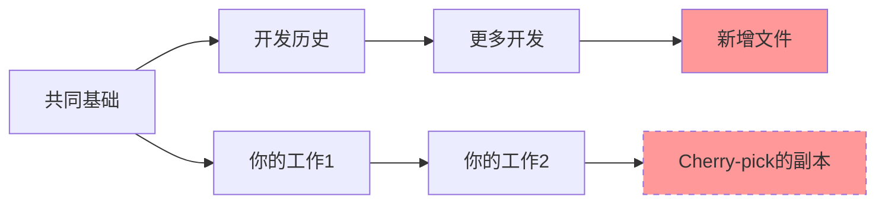
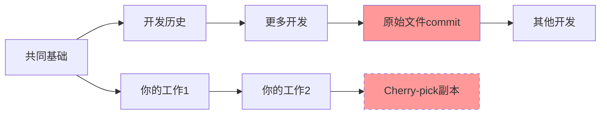
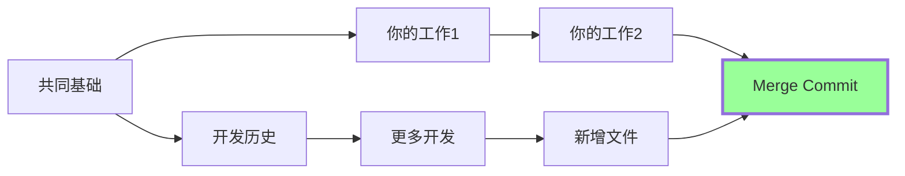
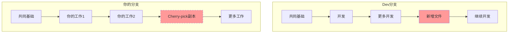
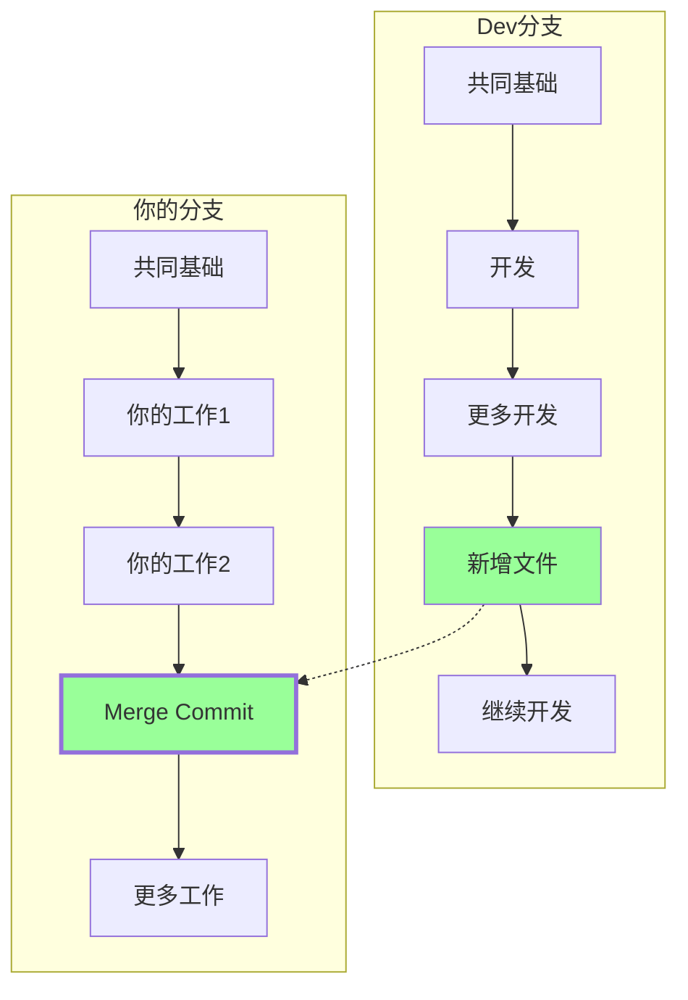
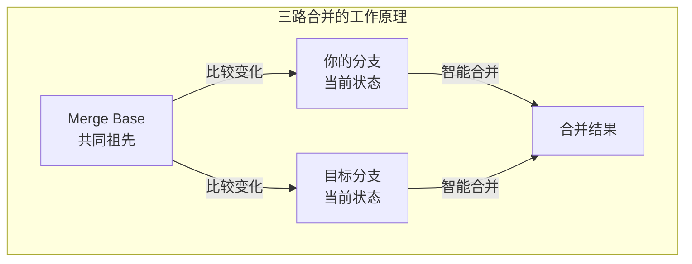

作为程序员，我们每天都在使用Git，但你真的理解它的设计哲学吗？最近在一个开发场景中，我遇到了一个有趣的问题：当我的开发分支缺少一个即将被推送到主分支的文件时，应该用cherry-pick还是merge来解决？这个看似简单的选择，背后藏着Git设计的核心智慧。

<!--more-->

## 问题的起源：一个常见的开发场景

想象这样一个场景：你基于dev分支创建了feature分支开始开发，但发现缺少一个关键文件。此时你的同事告诉你，他马上会把这个文件推送到dev分支。这时你会怎么做？

很多开发者的第一反应是使用cherry-pick：既然知道是哪个commit，直接"摘"过来不就行了？这个想法看起来很合理，但Git的设计者们考虑得更深远。

## Cherry-pick的"表面"vs"本质"

让我们先看看cherry-pick实际上做了什么：



Cherry-pick会创建一个内容相同但hash完全不同的新commit（D'）。虽然文件内容一样，但在Git眼中，D和D'是两个完全不同的commit。这就像是复印了一份文档，内容相同但它们是两个独立的存在。

## Git如何"思考"：关系重于内容

Git的设计哲学非常独特：它更关注**commit之间的关系**，而不仅仅是文件内容的变化。每个commit都记录着一个重要信息——它的"父节点"是谁。

```bash
# 查看commit的内部结构
git cat-file -p <commit-hash>

# 输出类似：
tree abc123...      # 文件快照
parent def456...    # 父节点
author ...
committer ...
```

这种设计让Git能够构建出完整的"关系图谱"。当你后续要将feature分支合并回dev时，Git会发现一个令人困惑的情况：



Git看到两个不同的commit（D和D'）做了相同的事情，但它无法确定：这是重复的更改？还是冲突的更改？这种歧义在复杂的合并场景中可能导致不可预期的结果。

## Merge Commit：Git的"智能链接"

相比之下，merge commit采用了一种更优雅的解决方案。它就像一个有两个"软链接"的特殊节点：



Merge commit的结构是这样的：

```bash
# Merge commit的内部结构
tree abc123...      # 合并后的文件快照
parent def456...    # 第一个父节点（你的分支）
parent ghi789...    # 第二个父节点（被合并的分支）
author ...
committer ...
```

这种"双父节点"设计让Git能够清楚地理解：
1. 这是一次合并操作，不是普通的线性提交
2. 两个分支的历史都被保留了
3. 文件的来源和关系都有明确的追溯路径

## 实际的差异：当你最终合并回主分支时

让我们看看两种方式在最终合并时的表现：

### Cherry-pick的困境



当最终合并时，Git需要处理两个看起来相同但实际不同的commit，这可能导致：
- 重复的更改被标记为冲突
- 历史记录变得混乱
- 需要手动解决"假冲突"

### Merge的优雅



当最终合并时，Git能够智能地识别：
- D1的内容已经通过merge commit包含在你的分支中
- 只有你的新工作（B2、F2、G2）需要被合并
- 没有重复或冲突的风险

## Git的三路合并算法

Git的合并智能来自于它的"三路合并"算法。当进行合并时，Git会查找：

1. **Merge Base**：两个分支的共同祖先
2. **你的分支状态**：从merge base到你当前的更改
3. **目标分支状态**：从merge base到目标分支的更改



这种算法让Git能够：
- 自动处理不冲突的更改
- 准确识别真正的冲突
- 理解合并的上下文和意图

## 从软件设计角度看Git的智慧

Git的这种设计体现了几个重要的软件工程原则：

**1. 关系模型优于内容模型**
Git将版本控制视为一个关系图问题，而不是简单的文件差异问题。这让它能够处理复杂的分支合并场景。

**2. 上下文信息的重要性**
每个commit不仅存储了"是什么"，还存储了"来自哪里"。这种上下文信息在复杂操作中至关重要。

**3. 可预测性设计**
通过明确的关系定义，Git让复杂的合并操作变得可预测和可理解。

## 实用建议：选择正确的工具

基于这些理解，我们可以总结出实用的指导原则：

**使用Merge当：**
- 你需要保持清晰的分支历史
- 你的分支最终会合并回主干
- 你想要可预测的合并行为
- 团队协作中需要追溯更改来源

**使用Cherry-pick当：**
- 你需要将特定修改应用到多个分支
- 你确定这个commit不会被重复合并
- 你在做热修复（hotfix）而不是常规开发

**实际操作建议：**
```bash
# 推荐的做法：使用merge
git checkout dev
git pull origin dev
git checkout your-feature-branch
git merge dev

# 而不是：
git cherry-pick <commit-hash>  # 除非你确实需要这样做
```

## 结语：理解工具背后的哲学

作为程序员，我们常常专注于"如何使用工具"，但理解"工具为什么这样设计"同样重要。Git的设计哲学告诉我们，在处理复杂系统时，关系和上下文往往比单纯的内容更重要。

下次当你面临cherry-pick还是merge的选择时，不要只考虑眼前的便利，想想Git设计者们的深远考虑。选择merge，你就是在与Git的智能设计协作，而不是与之对抗。

这种设计哲学不仅适用于版本控制，在我们设计系统架构、数据库关系、甚至是业务逻辑时，都有着深刻的启发意义。毕竟，优秀的软件设计往往体现在这些看似细微的决策中。
