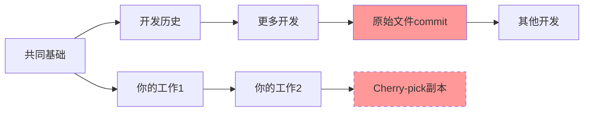
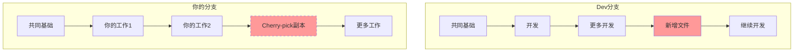
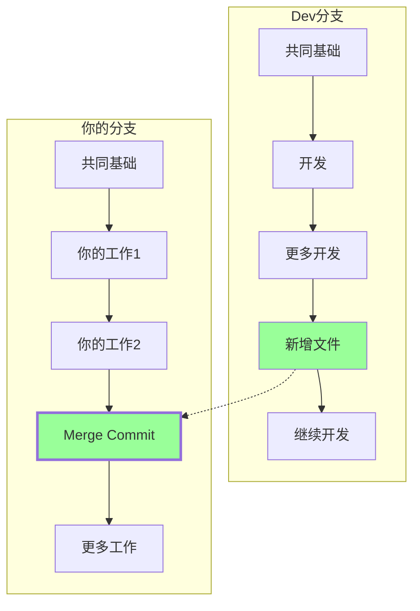

Как программисты, мы используем Git каждый день, но действительно ли вы понимаете философию его дизайна? Недавно в процессе разработки я столкнулся с интересной проблемой: когда в моей ветке разработки не хватает файла, который должен быть отправлен в мастер-ветку, должен ли я использовать cherry-pick или merge для решения этой проблемы? За этим, казалось бы, простым выбором скрывается основная мудрость дизайна Git.

<! ---далее-->

## Происхождение проблемы: распространенный сценарий разработки

Представьте себе сценарий, в котором вы создаете ветку feature на основе ветки dev, чтобы начать разработку, но обнаруживаете, что критический файл отсутствует. Ваш коллега говорит вам, что скоро переместит этот файл в ветку dev. Что бы вы сделали?

Первая реакция многих разработчиков - использовать cherry-pick: раз уж вы знаете, в каком коммите он находится, вы можете просто "выбрать" его, верно? Это кажется разумной идеей, но разработчики Git'а думали глубже.

## "Поверхность" Cherry-pick против "сути".

Давайте посмотрим, что на самом деле делает cherry-pick:

```mermaid
graph LR
    A[共同基础] --> B[开发历史]
    B --> C[更多开发]
    C --> D[新增文件]
    
    A --> E[你的工作1]
    E --> F[你的工作2]
    F --> D'[Cherry-pick的副本]
    
    style D fill:#ff9999
    style D' fill:#ff9999
    style D' stroke-dasharray: 5 5
```.

Cherry-pick создаёт новый коммит (D') с тем же содержимым, но с совершенно другим хэшем. Хотя содержимое файла одинаково, в глазах Git'а D и D' - это два совершенно разных коммита. Это всё равно что создать копию документа с тем же содержимым, но это две отдельные сущности.

## Как думает Git: отношения важнее содержимого

Философия дизайна Git'а уникальна: он больше фокусируется на отношениях между **коммитами**, чем на изменениях в содержимом файла. Каждый коммит записывает важную информацию - кто является его "родителем".

```bash
# 查看commit的内部结构
git cat-file -p <commit-hash>

# 输出类似：
tree abc123...      # 文件快照
parent def456...    # 父节点
author ...
committer ...
```

Такая конструкция позволяет Git'у построить полный "граф отношений". Когда вы впоследствии объединяете фичерную ветку обратно в dev, Git обнаруживает запутанную ситуацию:



Git видит два разных коммита (D и D'), выполняющих одно и то же действие, но не может определить: это дублирующее изменение? Или это противоречащее изменение? Эта двусмысленность может привести к непредвиденным результатам в сложных сценариях слияния.

## Слияние коммитов: "умная ссылка" Git'а

В отличие от этого, коммиты слияния используют более элегантное решение. Это как специальный узел с двумя "мягкими ссылками":

```mermaid
graph LR
    A[共同基础] --> B[开发历史]
    B --> C[更多开发] 
    C --> D[新增文件]
    
    A --> E[你的工作1]
    E --> F[你的工作2]
    F --> M[Merge Commit]
    D --> M
    
    style M fill:#99ff99
    style M stroke-width:3px
```.

Структура коммита слияния выглядит следующим образом:

```bash
# Merge commit的内部结构
tree abc123...      # 合并后的文件快照
parent def456...    # 第一个父节点（你的分支）
parent ghi789...    # 第二个父节点（被合并的分支）
author ...
committer ...
```

Такая "двухродительская" конструкция даёт понять Git'у, что. 1:
1. это слияние, а не линейный коммит
2. история обеих веток сохраняется
3. есть четкий путь назад к исходному тексту и взаимосвязям файлов.

## Фактическая разница: когда вы в конце концов сливаетесь обратно в мастер-ветку

Давайте посмотрим, как эти два подхода ведут себя при окончательном слиянии:

### The Cherry-pick dilemma ###



Когда происходит окончательное слияние, Git должен обработать два коммита, которые выглядят одинаково, но на самом деле являются разными, что может привести к:
- Дублирующиеся изменения будут отмечены как конфликты
- История будет испорчена.
- Ложные конфликты приходится разрешать вручную.

### Элегантность Merge



Когда финальное слияние завершено, Git способен разумно распознать его:
- содержимое D1 было включено в вашу ветку через merge commit.
- Осталось слить только вашу новую работу (B2, F2, G2).
- Нет риска дублирования или конфликта

## Алгоритм трёхстороннего слияния Git'а

Интеллектуальность слияния в Git'е обеспечивается его алгоритмом "трехстороннего слияния". При слиянии Git ищет:

1. **базу слияния**: общего предка обеих веток
2. **Состояние вашей ветки**: изменение от базы слияния до вашего текущего изменения
3. **Состояние целевой ветки**: изменения от базы слияния до целевой ветки

```mermaid
graph TB
    subgraph "三路合并的工作原理"
        MB[Merge Base<br/>共同祖先] 
        YB[你的分支<br/>当前状态]
        TB[目标分支<br/>当前状态]
        
        MB --> |"比较变化"| YB
        MB --> |"比较变化"| TB
        YB --> |"智能合并"| Result[合并结果]
        TB --> |"智能合并"| Result
    end
```.

Этот алгоритм позволяет Git'у:
- Автоматически обрабатывать неконфликтные изменения
- Точно определять истинные конфликты
- Понимать контекст и намерение слияния

## Мудрость Git'а с точки зрения проектирования программного обеспечения

Дизайн Git воплощает в себе несколько важных принципов программной инженерии:

**1. Реляционное моделирование предпочтительнее моделирования содержимого**.
Git рассматривает контроль версий как проблему реляционного графа, а не как простую проблему разделения файлов. Это позволяет ему справляться со сложными сценариями слияния ветвей.

**2. Важность контекстной информации
Каждый коммит хранит не только "что", но и "откуда" он взялся. Эта контекстная информация имеет решающее значение при выполнении сложных операций.

**Предсказуемость по замыслу
Git делает сложные операции слияния предсказуемыми и понятными благодаря явному определению взаимосвязей.

## Практические советы: выбор правильного инструмента

Исходя из этих представлений, мы можем сформулировать практические рекомендации:

** Используйте Merge, когда:**.
- Вам нужно вести четкую историю ветвей
- Ваши ветки в конечном итоге сольются обратно в ствол
- Вам нужно предсказуемое поведение при слиянии
- Вам нужно предсказуемое поведение слияния Вам нужно отслеживать источник изменений при совместной работе в команде

**Использование Cherry-pick в следующих случаях:**
- Вам нужно применить определенные изменения к нескольким веткам
- Вы хотите быть уверены, что коммит не будет сливаться снова и снова.
- Вы делаете хотфикс вместо обычной разработки.

**Практические советы:**
```bash
# 推荐的做法：使用merge
git checkout dev
git pull origin dev
git checkout your-feature-branch
git merge dev

# 而不是：
git cherry-pick <commit-hash>  # 除非你确实需要这样做
```

## Заключение: Понимание философии, стоящей за инструментами

Как программисты, мы часто фокусируемся на том, "как использовать инструмент", но не менее важно понять, "почему инструмент разработан именно так", а философия дизайна Git учит нас, что при работе со сложными системами отношения и контекст часто важнее, чем просто содержание.

В следующий раз, когда вы окажетесь перед выбором: сделать виш-пикинг или объединить, подумайте не только о сиюминутном удобстве, но и о более глубоких задачах, которые ставили перед собой разработчики Git'а. Выбирая слияние, вы работаете с интеллектуальным дизайном Git'а, а не против него.

Эта философия дизайна применима не только к контролю версий, но и глубоко вдохновляет нас при разработке системных архитектур, отношений баз данных и даже бизнес-логики. В конце концов, отличный дизайн программного обеспечения часто отражается в этих, казалось бы, тонких решениях.
