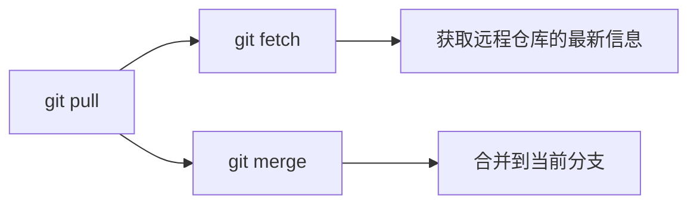
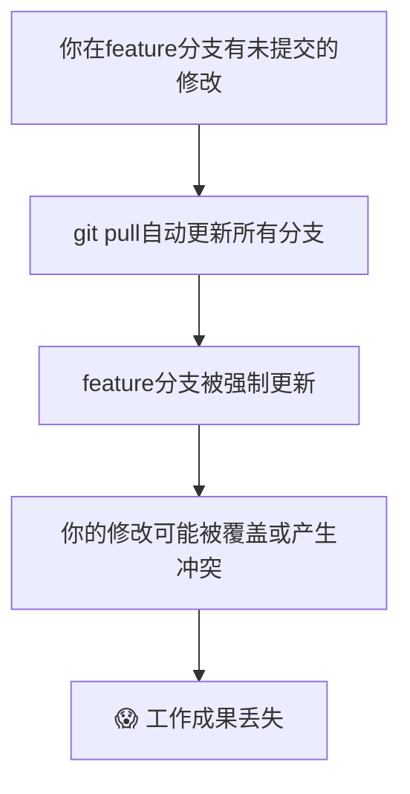
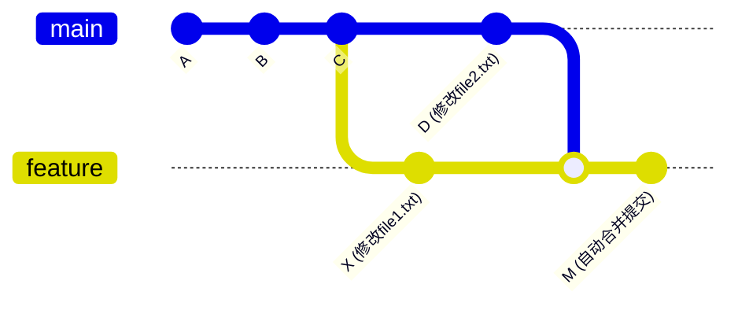
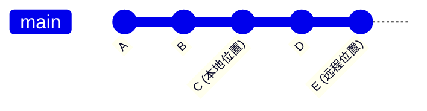
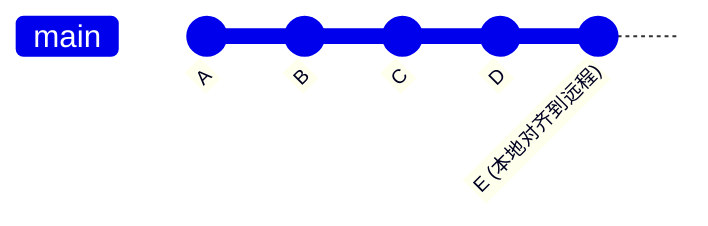

当你在团队项目中使用Git时，是否遇到过这样的困惑：明明执行了`git pull`，为什么其他分支还是旧的？为什么切换到另一个分支后，还要再次pull才能获得最新代码？

如果你有这样的疑问，那么你并不孤单。今天我们就来彻底搞清楚`git pull`到底做了什么，以及为什么Git要这样设计。

<!--more-->

## 一个常见的困惑场景

假设你是一名前端开发工程师，正在一个名为`web-app`的项目中工作。你的日常工作流程可能是这样的：

```bash
# 在开发分支上工作
git switch dev
git pull

# 突然需要切换到发布分支检查bug
git switch release/1.0.1
# 咦？怎么代码还是旧的？
git pull  # 又要pull一次？
```

这种情况让很多开发者感到困惑：为什么`git pull`不能一次性更新所有分支呢？

## Git Pull 的本质：拆解这个"组合拳"

要理解这个问题，我们首先需要知道`git pull`实际上是两个命令的组合：



### Git Fetch：信息收集员

`git fetch`就像一个信息收集员，它的工作是：
- 连接到远程仓库（比如GitHub、GitLab）
- 下载所有分支的最新提交信息
- 更新本地的远程分支引用（如`origin/dev`、`origin/main`）

重要的是，`git fetch`只是更新**引用信息**，不会修改你的工作目录或当前分支的内容。

### Git Merge：内容整合员

`git merge`则是内容整合员，它负责：
- 将远程分支的变更合并到当前检出的分支
- 只操作你正在工作的那一个分支

## 为什么Git不同步所有分支？安全性设计

Git的这种设计并非偶然，而是出于**安全性**考虑：

### 1. 保护你的工作成果

想象一下，如果`git pull`自动更新所有分支，可能发生这样的情况：



### 2. 避免意外的合并冲突

如果Git自动合并所有分支，你可能会在不知情的情况下引入冲突，这些冲突只有在你切换到相应分支时才会被发现。

### 3. 明确的操作意图

Git要求你明确地选择要更新哪个分支，这让版本控制更加可控和透明。

## 冲突处理：两个层面的理解

在我们的讨论中，我们区分了两种不同层面的"冲突"：

### Commit层面的分歧（自动处理）

当两个分支有不同的提交历史，但修改的是不同文件或不同位置时：



Git会自动创建一个合并提交(Merge Commit)。

### File层面的冲突（需要手动处理）

当两个分支修改了同一文件的同一位置时：

```bash
# Git会停止并提示：
Auto-merging config.json
CONFLICT (content): Merge conflict in config.json
Automatic merge failed; fix conflicts and then commit the result.
```

此时你需要：
1. 编辑冲突文件，选择保留哪个版本
2. 使用`git add`标记冲突已解决
3. 使用`git commit`完成合并

## Fast-forward：Git的"对齐"机制

当你的本地分支只是落后于远程分支（没有新的本地提交）时，Git会执行"fast-forward"：



Fast-forward后：



这种情况下不会创建合并提交，只是简单地"对齐"到远程分支。

## 实用的工作流建议

### 方法1：逐个分支更新（最安全）
```bash
# 先获取所有远程信息
git fetch --all

# 然后逐个更新需要的分支
git switch release/1.0.1
git pull

git switch dev
git pull
```

### 方法2：查看后再决定
```bash
# 获取最新信息
git fetch --all

# 查看哪些分支有更新
git log --oneline --graph --all

# 根据需要更新特定分支
git switch target-branch
git pull
```

### 方法3：直接合并（适合有经验的用户）
```bash
git fetch --all
# 直接将远程分支合并到本地，无需切换
git merge origin/release/1.0.1
```

## 总结：理解Git的设计哲学

Git的设计哲学是**明确性胜过便利性**。虽然一次性更新所有分支看起来更方便，但Git选择了更安全的方式：

1. **分离关注点**：fetch负责获取信息，merge负责合并内容
2. **用户控制**：让开发者明确决定何时更新哪个分支
3. **工作保护**：避免意外覆盖正在进行的工作

理解了这些原理，你就能更好地驾驭Git，避免常见的困惑，让版本控制成为你开发工作的得力助手。

## 思考练习

下次当你执行`git pull`时，试着观察命令的输出信息。你能识别出哪些是fetch的结果，哪些是merge的结果吗？这样的观察会帮助你更深入地理解Git的工作机制。
