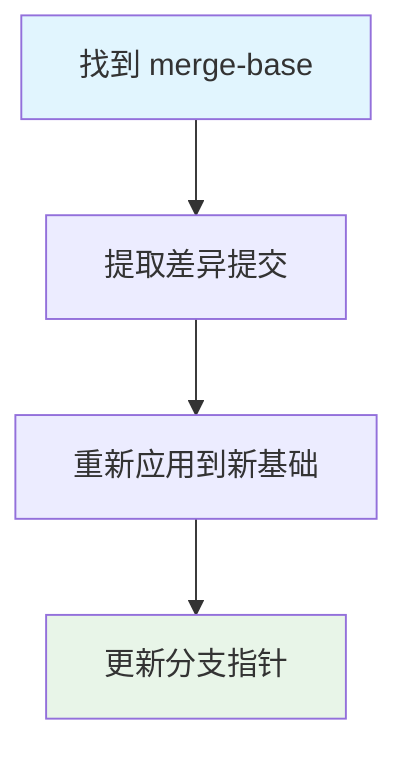
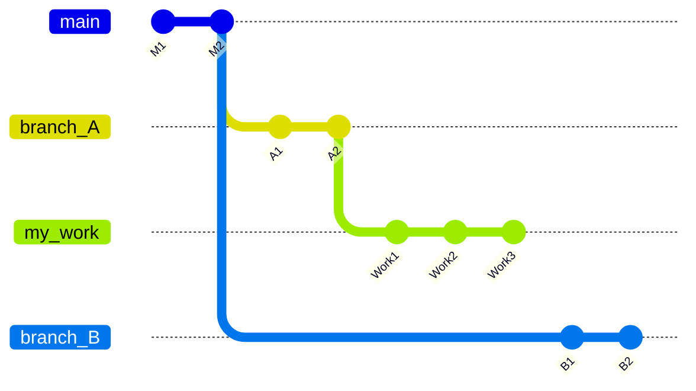
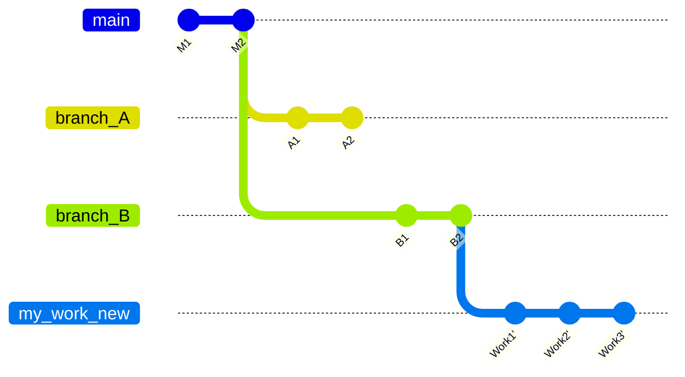

在复杂的项目环境中，我们经常遇到需要重新调整分支基础的情况。当你的工作分支基于一个分支，但后来发现应该基于另一个分支时，`git rebase --onto` 就是那个精确而优雅的解决方案。

<!--more-->

## 为什么需要 Rebase --onto？

想象这样一个场景：你是一名技术人员，刚完成了三个工作提交，这些提交基于分支A（branch_A）。但现在你发现，由于分支A包含了太多你不熟悉的新内容，你更希望这些工作基于更稳定的分支B（branch_B）。

传统的解决方案可能是创建一个新分支，然后使用 cherry-pick 逐一挑选提交。但 `git rebase --onto` 提供了一个更系统化的方法。

## Rebase --onto 的工作原理

`git rebase --onto` 的语法是：
```bash
git rebase --onto <新基础> <旧基础> [目标分支]
```

这个命令的执行逻辑是：
1. 找到目标分支与旧基础分支的公共祖先（merge-base）
2. 提取从公共祖先到目标分支的所有提交
3. 将这些提交重新应用到新基础分支上



### 具体案例分析

假设我们有这样的分支结构：



执行 `git rebase --onto branch_B branch_A my_work` 后：



## 实战演练：真实工作场景

让我们用一个实际的工作场景来演示 `rebase --onto` 的威力。

### 场景设定
- 你有一个工作分支 `my_work`，包含 3 个重要提交
- 这个分支当前基于 `branch_A` 分支
- 你希望将它重新基于稳定的 `branch_B` 分支

### 操作步骤

```bash
# 1. 确保所有分支都是最新的
git fetch origin

# 2. 切换到你的工作分支
git checkout my_work

# 3. 执行 rebase 操作
git rebase --onto branch_B branch_A

# 4. 验证结果
git log --oneline --graph -10
```

### 为什么选择 Rebase --onto 而不是 Cherry-pick？

**Rebase --onto 的优势：**
- **自动化程度高**：一条命令完成整个操作
- **保持提交逻辑**：维护原有的提交顺序和关系
- **历史清晰**：不创建重复的提交记录
- **拓扑感知**：理解分支之间的真实关系

**Cherry-pick 的局限：**
- 需要手动指定每个提交
- 创建新的提交哈希，可能导致后续合并混乱
- 对于连续提交，操作繁琐

## 高级应用场景

### 1. 部分分支迁移

如果你只想迁移最近的几个提交，可以使用：
```bash
git rebase --onto target_branch HEAD~3
```

### 2. 处理合并冲突

当 rebase 过程中遇到冲突：
```bash
# 解决冲突后
git add <resolved-files>
git rebase --continue

# 如果想要中止操作
git rebase --abort
```

### 3. 交互式 Rebase 结合

```bash
git rebase --onto branch_B branch_A --interactive
```

这允许你在迁移过程中同时编辑、合并或删除提交。

## 最佳实践与注意事项

### 安全措施
```bash
# 在操作前创建备份分支
git checkout my_work
git checkout -b my_work_backup

# 执行 rebase
git checkout my_work
git rebase --onto branch_B branch_A
```

### 团队协作考虑
- **避免对已推送的公共分支使用 rebase**
- **及时通知团队成员分支变更**
- **在自动化流程中验证 rebase 结果**

### 验证清单
```bash
# 检查分支基础是否正确
git merge-base my_work branch_B

# 验证提交内容
git log --oneline -5

# 检查文件变更
git diff HEAD~3 HEAD
```

## 原理深入：Git 对象模型视角

从 Git 内部原理来看，`rebase --onto` 实际上是在操作提交对象的父指针。每个提交对象包含：
- 内容快照的树对象引用
- 父提交的引用
- 作者和提交者信息
- 提交消息

Rebase 过程创建新的提交对象，这些对象有相同的内容和消息，但父引用指向新的基础提交。

## 扩展应用：在不同工作流程中的价值

### 1. 模块化开发
```bash
# 将功能模块从一个基础迁移到另一个基础
git rebase --onto stable_base experimental_base feature_module
```

### 2. 紧急修复管理
```bash
# 将紧急修复从主分支迁移到特定分支
git rebase --onto stable_branch main urgent_fix
```

### 3. 多版本支持
当管理多个版本的代码时，rebase --onto 帮助保持变更的一致性和可追溯性。

## 技术发展的展望

随着版本控制在软件开发中的应用越来越广泛，我们可能会看到：
- **智能分支策略推荐**：分析代码依赖关系，自动推荐最佳的 rebase 策略
- **冲突预测与解决**：预测 rebase 过程中可能出现的冲突，并提供解决建议
- **自动化工作流程**：基于分支状态自动选择 rebase 或 merge 策略

## 总结

`git rebase --onto` 是一个强大而精确的工具，特别适合需要重新组织分支结构的场景。它不仅仅是一个技术命令，更是一种思维方式——理解代码历史的拓扑关系，并能够精确地重构这种关系。

对于任何需要处理复杂分支场景的技术人员而言，掌握这个工具意味着能够更优雅地处理代码管理、版本控制和协作流程中的复杂分支场景。记住，最好的工具不是最复杂的，而是最适合解决问题的。

