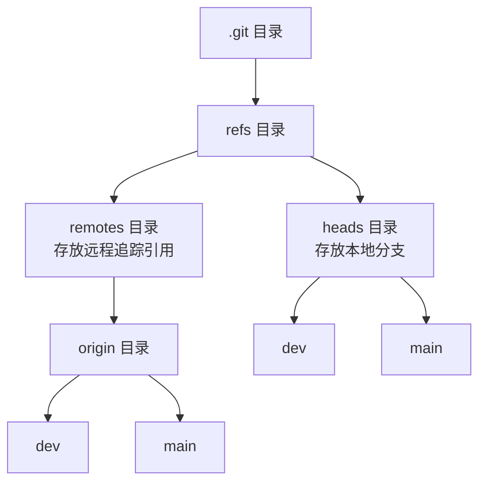

当我们在协作开发中使用 Git 时，有时会遇到一些令人困惑的错误。比如明明是个简单的 `git pull` 操作，却突然报错，而且错误信息还与当前分支看似无关。本文将深入解析 Git 的引用系统，帮你理解并解决一个常见但令人困惑的问题：引用冲突导致的 pull 失败。

<!--more-->

## 问题现象

当执行 `git pull` 命令时，遇到如下错误：

```shell
error: cannot lock ref 'refs/remotes/origin/devops': 'refs/remotes/origin/devops/JJEAPP-1234' exists; cannot create 'refs/remotes/origin/devops'
From gitlab.com:jiejue/example-app
 ! [new branch]      devops     -> origin/devops  (unable to update local ref)
error: some local refs could not be updated; try running
 'git remote prune origin' to remove any old, conflicting branches
```

随后我们发现，即使在 `dev` 分支上执行 `git pull`，也无法更新分支，尽管 Git 提示本地 `dev` 分支落后于远程 3 个提交：

```shell
$ git switch dev
Switched to branch 'dev'
Your branch is behind 'origin/dev' by 3 commits, and can be fast-forwarded.
  (use "git pull" to update your local branch)

$ git pull
# 同样的错误...
```

## 理解 Git 的引用系统

要解决这个问题，首先需要了解 Git 的引用系统是如何工作的。

### 什么是 Git 引用？

在 Git 中，引用（references）是指向特定提交的指针。Git 使用这些引用来跟踪分支、标签等。引用实际上作为文件存储在 Git 仓库的 `.git/refs/` 目录下：

- 本地分支存储在 `.git/refs/heads/` 目录
- 远程分支的本地缓存（称为远程追踪引用）存储在 `.git/refs/remotes/origin/` 目录

例如，一个名为 `dev` 的本地分支会有一个对应的引用文件 `.git/refs/heads/dev`，而远程 `origin/dev` 分支则有一个引用文件 `.git/refs/remotes/origin/dev`。



### Git 引用的命名规则

由于引用是作为文件系统路径存储的，所以它们遵循文件系统的限制：

- 不能同时存在文件和同名目录
- 目录不能与其子目录下的文件同名

例如，你不能同时拥有 `devops` 文件和 `devops/JJEAPP-1234` 文件，这就是导致问题的根本原因。

## 问题的根源

在我们的例子中，问题的根源在于：

1. 本地有一个远程追踪引用 `refs/remotes/origin/devops/JJEAPP-1234`，对应远程的 `devops/JJEAPP-1234` 分支
2. 远程创建了一个新的 `devops` 分支
3. 当执行 `git pull` 或 `git fetch` 时，Git 试图在本地创建 `refs/remotes/origin/devops` 引用
4. 由于已经存在 `refs/remotes/origin/devops/JJEAPP-1234`，Git 无法创建 `refs/remotes/origin/devops`，因为在文件系统中不能同时存在一个文件和一个同名的目录

这种冲突会阻止整个 `fetch` 过程，导致所有远程分支都无法更新，包括当前的 `dev` 分支。

## 解决步骤

### 1. 清理远程追踪引用

使用 Git 建议的命令来清理过期的远程追踪引用：

```shell
git remote prune origin
```

这个命令会删除那些在远程已经不存在，但在本地仍保留追踪引用的分支信息。在我们的例子中，它会删除 `refs/remotes/origin/devops/JJEAPP-1234`。

### 2. 重新获取远程更新

清理完成后，再次执行拉取操作：

```shell
git fetch origin
# 或
git pull origin dev
```

此时，Git 应能正常创建 `refs/remotes/origin/devops` 引用，并更新所有远程分支信息。

### 3. 更新当前分支

如果只执行了 `git fetch`，还需要合并或变基来更新当前分支：

```shell
git merge origin/dev  # 合并方式
# 或
git rebase origin/dev  # 变基方式
```

## 深入理解 git remote prune

`git remote prune` 命令的功能是清理"僵尸引用"——那些在远程已经被删除，但本地仍然保留引用的分支。

具体工作原理是：
1. 获取远程仓库的分支列表
2. 对比本地的远程追踪引用
3. 删除那些在远程不存在但本地有引用的记录

可以用一个生活中的例子来理解：想象你的通讯录（本地 Git 仓库）里保存了公司各部门的联系方式（远程追踪引用）。原来有个"技术部/张工"的联系人（devops/JJEAPP-1234），但张工已经离职（远程分支被删除），你的通讯录却还保留着这个旧联系人。

现在公司成立了新的"技术部"工作组（新的 devops 分支），要添加到你的通讯录。但因为已经有了"技术部/张工"这个联系人，通讯系统不允许再创建一个叫"技术部"的分类。这时你需要先清理通讯录里的过期联系人，然后才能添加新的工作组。

## 如何避免这类问题

为了避免类似问题，建议定期执行以下维护操作：

1. 定期清理远程追踪引用：
```shell
git remote prune origin
```

2. 使用更安全的拉取命令，比如：
```shell
git pull --prune
```
这个命令会在拉取的同时自动清理过期的远程追踪引用。

3. 配置 Git 自动清理：
```shell
git config --global fetch.prune true
```
这样设置后，每次执行 `git fetch` 或 `git pull` 时都会自动清理过期的远程追踪引用。

## 总结

Git 的引用系统是其核心概念之一，但也是许多开发者容易忽视的部分。了解引用如何工作，特别是它们与文件系统的关系，能帮助我们理解和解决许多常见的 Git 问题。

当遇到类似 "cannot lock ref" 错误时，记住可能是因为引用命名冲突，使用 `git remote prune origin` 清理过期引用通常能解决问题。更好的做法是养成定期维护 Git 仓库的好习惯，或配置 Git 自动清理过期引用。

你还遇到过其他令人困惑的 Git 问题吗？欢迎在评论区分享你的经验和解决方法！
