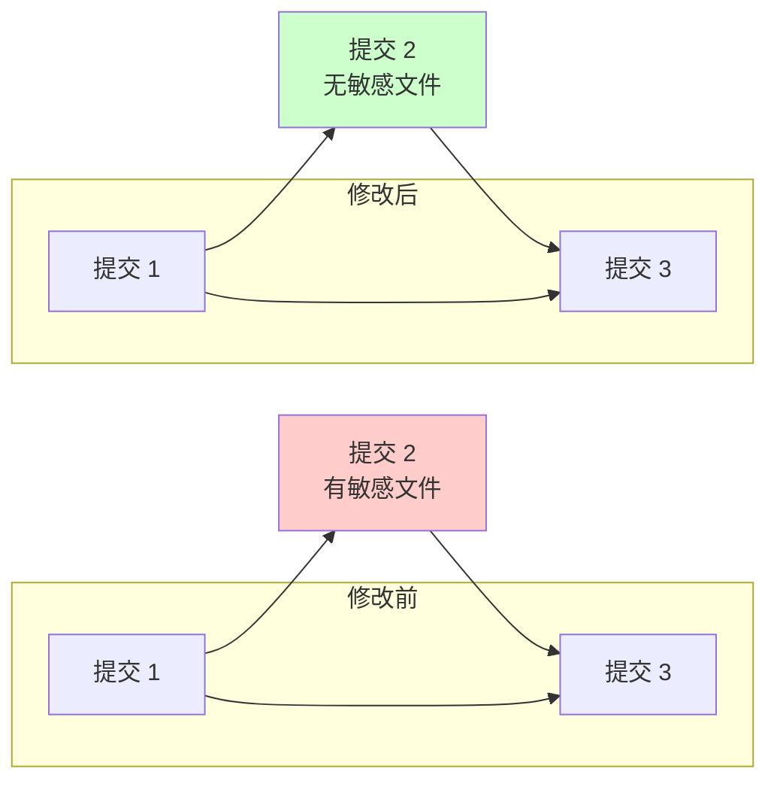

开发中不小心把敏感文件（比如配置文件、密钥）提交到了 Git 仓库？别慌，这篇文章告诉你如何干净利落地处理这个问题。

<!--more-->

## 问题场景

假设你在开发过程中，不小心把一个包含敏感信息的配置文件 `config.secret.yaml` 提交到了 Git 仓库。这个文件在前天的一次提交中被加入，现在你需要：
1. 从 Git 历史中完全移除这个文件
2. 保持其他的代码修改不受影响
3. 确保文件在本地依然可用，只是不再被 Git 追踪

## 解决步骤

### 1. 定位敏感文件的提交

首先，我们需要找到引入敏感文件的那次提交。如果你大概记得是在最近几次提交中，可以用这个命令来查看：

```bash
git diff HEAD~3 HEAD~2 --name-only
```

这个命令会显示在倒数第三个和倒数第二个提交之间新增或修改的文件列表。

### 2. 使用交互式 rebase

找到相关提交后，我们使用交互式 rebase 来修改历史：

```bash
git rebase -i HEAD~3 --committer-date-is-author-date
```

这个命令会打开一个编辑器，显示最近三个提交的列表，类似这样：

```text
pick abc1234 feat: 添加新功能
pick def5678 feat: 更新配置文件  # 这是包含敏感文件的提交
pick ghi9012 feat: 修复问题
```

### 3. 标记需要编辑的提交

在编辑器中，将包含敏感文件的那个提交前的 `pick` 改为 `edit`：

```text
pick abc1234 feat: 添加新功能
edit def5678 feat: 更新配置文件  # 改这一行
pick ghi9012 feat: 修复问题
```

保存并关闭编辑器。

### 4. 移除敏感文件

Git 会暂停在你标记为 `edit` 的提交处。这时，使用以下命令移除敏感文件：

```bash
git rm --cached config.secret.yaml
```

这个命令会将文件从 Git 的版本控制中移除，但保留在你的工作目录中。

### 5. 更新提交

移除文件后，使用 `--amend` 来更新这个提交：

```bash
git commit --amend
```

### 6. 完成 rebase

最后，继续完成 rebase 过程：

```bash
git rebase --continue
```

### 7. 预防未来的意外提交

为了防止以后再次意外提交敏感文件，立即创建或更新 `.gitignore` 文件：

```bash
echo "config.secret.yaml" >> .gitignore
git add .gitignore
git commit -m "chore: 更新 .gitignore 排除敏感文件"
```

## 原理解释

让我们用一个简单的比喻来理解这个过程：



- 想象你在整理一本相册（Git 历史）
- 发现中间有一页（commit）包含了不该出现的照片（敏感文件）
- 使用 `git rebase -i` 就像是在那一页停下
- `git rm --cached` 就像是取出那张不该出现的照片
- `git commit --amend` 则是重新封好这一页
- 最后的 `git rebase --continue` 就是合上相册，完成整理

## 注意事项

1. 如果仓库已经推送到远程，你需要使用 `git push --force` 来更新远程仓库
2. 在操作前最好创建一个备份分支：`git branch backup-before-remove`
3. 如果是团队协作的项目，确保其他成员知道你要修改历史
4. 使用 `--committer-date-is-author-date` 参数可以保持提交时间的一致性

## 总结

这种方法的优点是：
- 精确：只移除指定的敏感文件，不影响其他改动
- 干净：完全从 Git 历史中移除，不留痕迹
- 安全：本地文件保持不变，只是不再被 Git 追踪

记住，预防胜于治疗。建立一个好的 `.gitignore` 文件，可以帮你避免很多不必要的麻烦。如果你的项目中可能包含敏感文件，建议在项目初始就设置好相应的忽略规则。

最后，如果你需要处理更复杂的情况（比如需要从整个项目历史中清除某类文件），可以考虑使用 `git-filter-repo` 这个专门的工具，它比传统的 `git filter-branch` 更安全和高效。
