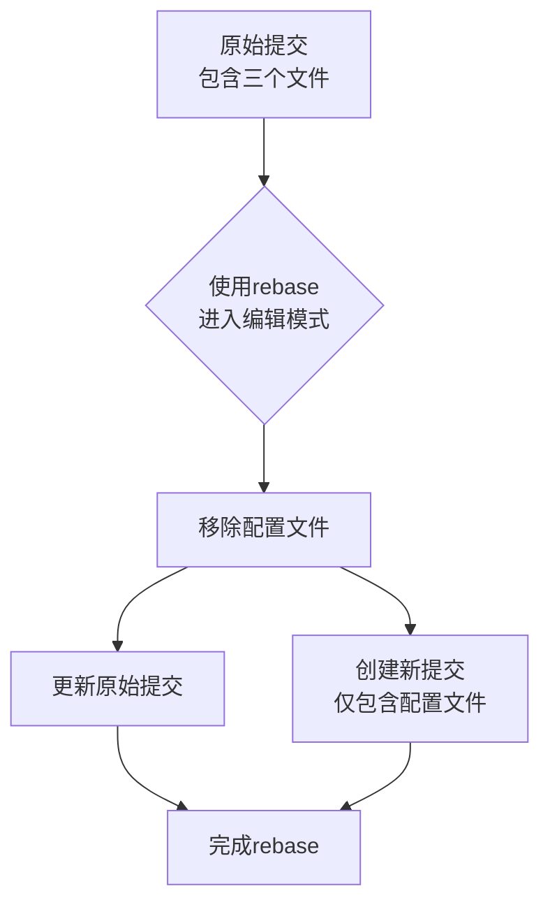

小明最近在开发一个新功能，刚刚提交了一些代码。但提交完他突然发现，自己不小心把一个还没完成的配置文件也一起提交了进去。他想把这个文件从刚才的提交中分离出来，单独提交，该怎么办呢？

<!--more-->

## 问题背景

这个场景其实很常见：
- 你刚刚用 `git commit` 提交了一批文件
- 突然发现其中有个文件不应该和其他文件一起提交
- 你想把这个文件从刚才的提交中拿出来，重新提交

比如：
- 一个配置文件应该单独提交，方便以后回滚
- 一个新功能的测试代码应该和实现分开提交
- 不小心把实验性的代码和正式代码一起提交了

## 解决方案

我来教你一个既安全又不会丢失提交信息的方法。

### 第一步：创建备份分支（以防万一）
```fish
git branch tmp-backup
```

这一步不是必须的，但强烈建议你养成这个习惯。万一后面的操作出了问题，随时可以回到这个备份。

### 第二步：开始修改最近的提交
```fish
git rebase -i HEAD^
```
这时会打开一个编辑器，你会看到最近的那个提交。把开头的 `pick` 改成 `edit`，然后保存退出。

```git
edit a3a4837 fix: update handlers to use custom exceptions
pick 3802508 fix: fix logging and variable initialization
pick aae0dbd fix: fix logger function calls
pick eb07cc8 test: update test cases for custom exceptions
pick 62ef260 docs: update changelog for v0.2.9
```

### 第三步：分离文件
```fish
# 把要分离的文件从当前提交中移除
git reset HEAD^ 要分离的文件名
# 更新原来的提交（不包含那个文件了）
git commit --amend

# 创建新的提交，只包含被分离的文件
git add 要分离的文件名
git commit -m "新的提交信息"
```

### 第四步：完成修改
```fish
git rebase --continue
```

### 第五步：确认无误后删除备份（可选）
```fish
git branch -D tmp-backup
```

## 实际案例

让我们通过一个具体例子来理解这个过程：

假设小明正在开发一个网站，他刚刚提交了这些文件：
- `index.html`（主页面更新）
- `style.css`（样式修改）
- `config.dev.json`（开发环境配置）

提交后他发现 `config.dev.json` 应该单独提交，因为这个配置文件以后可能需要单独回滚。



## 注意事项

1. 在开始操作前，确保：
   - 工作区是干净的（没有未提交的修改）
   - 你确实要修改的是最近的提交

2. 有些情况下，分离文件的顺序很重要：
   - 如果是配置文件，先提交基础配置，再提交使用这个配置的代码
   - 如果是测试文件，先提交被测试的代码，再提交测试用例

## 预防措施

其实最好的解决方案是预防：在提交前多花一点时间检查要提交的文件。你可以：

1. 使用 `git status` 查看要提交的文件列表
2. 使用 `git add` 时小心选择文件，而不是用 `git add .`
3. 在 `git commit` 之前用 `git diff --cached` 最后确认一次

## 小贴士

养成好习惯很重要。如果你发现正在处理的改动可以分成独立的部分（比如"修复bug"和"新功能"），最好在开发时就分开提交，而不是等到最后再来拆分。

记住：好的代码提交应该像讲故事一样，每个提交都是一个独立的、有意义的章节。这样不仅方便以后查看历史，也方便在需要时回滚特定的修改。
