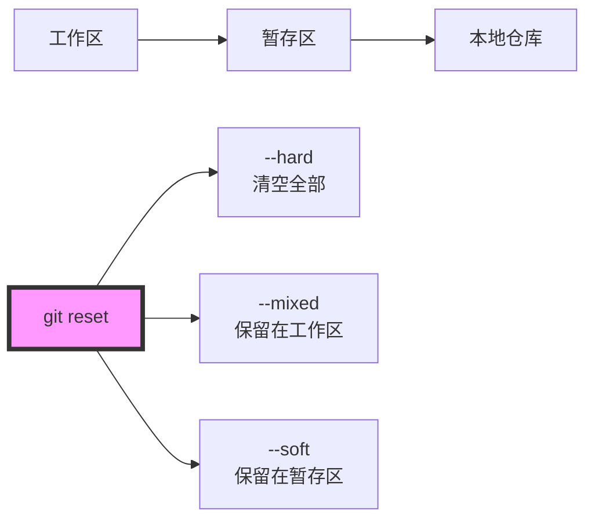

你是不是经常用 `git reset --hard HEAD~1` 来撤销最近的一次提交？其实 Git 的重置功能远比这个强大得多。今天让我们一起来探索 Git Reset 的高级用法，看看如何像使用时光机一样自如地掌控你的代码历史。

<!--more-->

## 从一个真实场景说起

小明在开发一个新功能时，提交了几次代码：

```
$ git reflog
988c685 HEAD@{0}: commit: feature: add image hosting
83c98db HEAD@{1}: commit: fix: update domain redirect
3374901 HEAD@{2}: commit: docs: initial setup
```

提交完后，他突然发现前两次提交的信息写得不够好，想要重新整理一下。这时候，他就需要用到 Git Reset 的不同模式了。

## Git Reset 的三种模式

Git Reset 就像一台时光机，不仅能带你回到过去，还能让你选择带走什么、留下什么。它有三种主要模式：

1. `--soft`：最温柔的重置
   - 只移动指针，所有的改动都保留在暂存区
   - 就像时光机把你送回过去，但让你带着所有东西
   - 适合用来重新整理提交

2. `--mixed`（默认模式）
   - 移动指针，改动保留在工作区但不暂存
   - 就像时光机把你和你的东西分开送回过去
   - 适合重新规划要提交的内容

3. `--hard`：最彻底的重置
   - 完全回到指定的状态，丢弃所有改动
   - 就像时光机彻底重置了时间线
   - 当你确定要放弃某些改动时使用

## 相对引用与绝对引用

在使用 Git Reset 时，我们有两种方式指定目标位置：

1. 相对引用：`HEAD~n`
   ```fish
   git reset --soft HEAD~2  # 回退两个提交
   ```
   就像说"往回走两步"

2. 绝对引用：直接使用 commit ID
   ```fish
   git reset --hard 988c685  # 直接跳到特定提交
   ```
   就像直接输入时光机的目的地坐标

实用小贴士：commit ID 不需要写全，Git 会自动补全，只要能唯一标识那个提交就可以。

## 实用技巧

### 1. 合并最近的几个提交
```fish
# 回退三个提交，但保留改动
git reset --soft HEAD~3
# 重新提交所有改动
git commit -m "一个更好的提交信息"
```

### 2. 补充遗漏的文件
```fish
# 回退到上一个提交
git reset --soft HEAD^
# 添加遗漏的文件
git add forgotten_file.txt
# 使用原来的提交信息重新提交
git commit -c ORIG_HEAD
```

### 3. 使用临时分支作为保险
```fish
# 创建临时分支作为保险
git branch temp_backup
# 尝试重置
git reset --hard COMMIT_ID
# 如果效果不是你想要的
git reset --hard temp_backup
```

## 安全提示

1. 在进行重要的 reset 操作前，可以先创建一个临时分支
2. `ORIG_HEAD` 会记录危险操作前的位置，可以用来恢复
3. 使用 `--hard` 要特别小心，因为它会丢弃所有未提交的改动

## 一个完整的工作流示例

让我们看一个完整的例子，假设你想要重新整理最近的两次提交：

```fish
# 1. 先创建临时分支保险
git branch temp_backup

# 2. 使用 soft reset 回退两个提交
git reset --soft HEAD~2

# 3. 检查状态和改动
git status
git diff --cached  # 查看暂存区的改动

# 4. 重新提交
git commit -m "feature: 完整的图片托管功能"

# 5. 确认无误后删除临时分支
git branch -D temp_backup
```

## 小结

Git Reset 是一个强大的工具，它不仅仅是用来撤销提交，更是帮助我们精确控制代码历史的"时光机"。通过合理使用不同的模式和引用方式，我们可以更优雅地管理我们的代码提交历史。

记住，使用 Git Reset 最重要的是理解你想要达到的目标状态，然后选择合适的模式去实现它。希望这篇文章能帮助你更好地掌握这个强大的工具！


