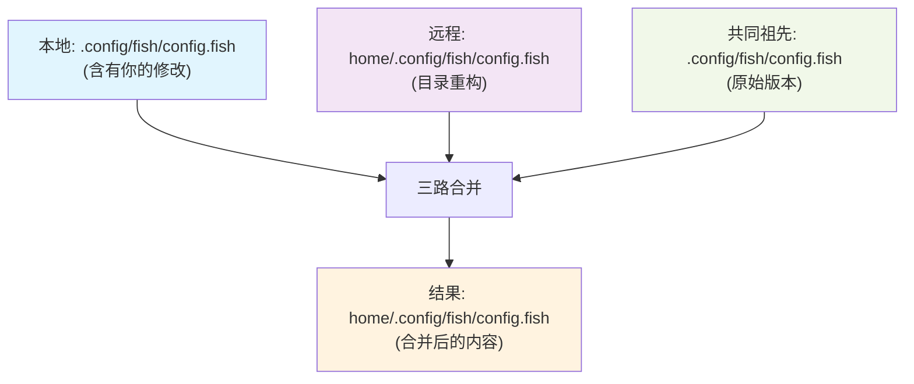

当你遇到`git pull`因为本地修改而失败时，可能会疑惑：为什么有时候简单的stash就能解决，有时候却需要复杂的冲突解决？更神奇的是，当你手动移动文件后，Git竟然能够智能地处理远程的重构操作。这背后的机制远比你想象的更精妙。

<!--more-->

## 问题的起源：不只是路径冲突

假设你正在维护一个dotfiles项目，本地修改了`.config/fish/config.fish`，此时尝试pull远程更新，却得到这样的错误：

```bash
error: Your local changes to the following files would be overwritten by merge:
        .config/fish/config.fish
        .config/fish/fish_variables
Please commit your changes or stash them before you merge.
```

传统的解决方案是stash本地修改，pull更新，然后恢复修改。但如果远程的commit不仅仅是内容修改，而是将整个`.config`目录移动到`home/.config`下呢？

## Git的三重智能检测机制

### 1. 内容哈希检测：超越文件路径

Git的核心不是基于文件名，而是基于内容哈希。当你执行以下操作时：

```bash
mkdir -p home/.config/fish
git mv .config/fish/config.fish home/.config/fish/config.fish
git mv .config/fish/fish_variables home/.config/fish/fish_variables
```

Git并不是简单地记录"删除A，创建B"，而是识别出这是同一个文件的重新定位。即使文件内容有修改，Git也能通过SHA-1哈希值的相似性算法识别出重命名关系。



### 2. 相似度算法：智能重命名检测

Git使用默认50%的相似度阈值来检测文件重命名。你可以通过以下命令验证：

```bash
git log --follow --stat home/.config/fish/config.fish
```

这个`--follow`选项会追踪文件的重命名历史，即使它经历了多次路径变更。

### 3. 三路合并的内容感知

当Git执行merge时，它进行的是三路合并（three-way merge）：

- **Base**：共同祖先版本
- **Local**：你的修改版本  
- **Remote**：远程修改版本

关键在于，Git会在**新路径**上执行内容合并，而不是简单地选择某一个版本。

## 为什么staged changes也能正常pull？

这是最令人困惑的部分。通常我们认为Git需要clean working directory才能pull，但在文件重命名场景下，staged changes实际上是被允许的。

原理在于Git的**路径兼容性检测**：

```bash
# 你的staged状态
renamed: .config/fish/config.fish -> home/.config/fish/config.fish

# 远程的更改
renamed: .config/fish/config.fish -> home/.config/fish/config.fish
```

Git发现两边执行的是**相同的重命名操作**，因此不存在路径冲突。内容差异会在新路径上通过标准的三路合并算法处理。

## 深入理解：Git的文件追踪哲学

### 内容优先于路径

Git的设计哲学是"内容优先于路径"。每个文件的身份由其内容哈希确定，而不是文件名。这使得Git能够：

- 检测文件的重命名和移动
- 处理同时的重命名和内容修改
- 保持文件历史的连续性

### 分布式协作的智能处理

考虑这样的协作场景：
- 开发者A重构了目录结构
- 开发者B在旧路径上修改了文件内容
- 两人的更改需要合并

传统的版本控制系统会产生严重冲突，但Git能够智能地将B的内容修改应用到A重构后的新路径上。

## 实际应用：最佳实践策略

### 策略1：预适应重构（推荐）
```bash
# 当你知道远程有重构时
mkdir -p home/.config/fish
git mv .config/fish/config.fish home/.config/fish/config.fish
git mv .config/fish/fish_variables home/.config/fish/fish_variables
git add .
git pull  # 现在会顺利合并
```

### 策略2：智能stash
```bash
# 只stash冲突文件
git stash push -m "config changes" .config/fish/config.fish .config/fish/fish_variables
git pull
git stash pop  # Git会智能地应用到新路径
```

### 策略3：查看远程更改
```bash
git fetch
git show origin/main --name-status  # 了解远程做了什么
```

## 技术细节：相似度检测算法

Git使用的相似度检测基于以下因素：

1. **行级别的diff**：计算添加和删除的行数比例
2. **内容块匹配**：识别相同的代码块
3. **可配置阈值**：通过`-M`选项调整检测敏感度

```bash
git diff -M85%  # 设置85%相似度才算重命名
git config diff.renames 85  # 全局设置
```

## 扩展应用：在团队开发中的意义

这种智能合并机制对大型项目尤其重要：

- **重构与开发并行**：架构师可以重组代码结构，开发者继续功能开发
- **历史保持完整**：重命名不会断掉`git blame`和`git log --follow`
- **冲突最小化**：只在真正冲突时才需要人工介入

## AI时代的版本控制展望

随着AI工具越来越多地参与代码重构，Git的这种内容感知能力将变得更加重要。未来可能会看到：

- 更智能的重命名检测算法
- 基于语义的文件关联
- AI辅助的冲突解决建议

Git的设计理念——理解内容而不仅仅是路径——为这些发展奠定了坚实基础。这不仅仅是一个版本控制工具，更是一个理解代码演化的智能系统。

当你下次遇到复杂的merge情况时，记住Git不只是在比较文件名，它在理解你的真实意图。学会与这种智能合作，而不是对抗它，会让你的Git工作流更加顺畅。
