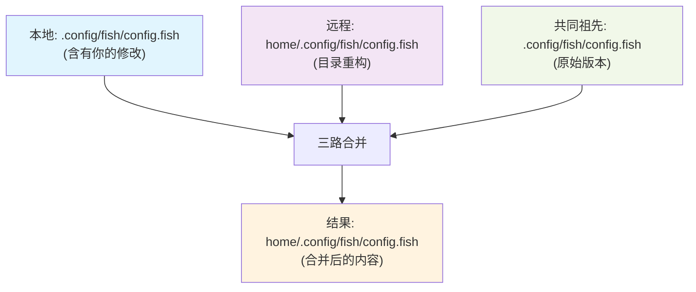

Когда вы сталкиваетесь с тем, что __PROTECTED_INLINE_CODE__9__ не работает из-за локальной модификации, вы можете задаться вопросом: почему иногда простой stash может исправить ситуацию, а иногда требуется сложное разрешение конфликта? Что ещё более удивительно, Git на удивление достаточно умён, чтобы справляться с удалёнными операциями рефакторинга, когда вы вручную перемещаете файлы. Механизм, лежащий в основе этого, гораздо более тонкий, чем вы думаете.

<! -еще-->

## Происхождение проблемы: больше, чем просто конфликты путей

Допустим, вы поддерживаете проект dotfiles и локально изменили `.config/fish/config.fish`, после чего вы пытаетесь извлечь удаленное обновление и получаете эту ошибку:

```bash
error: Your local changes to the following files would be overwritten by merge:
        .config/fish/config.fish
        .config/fish/fish_variables
Please commit your changes or stash them before you merge.
```

Традиционным решением является сохранение локальных изменений, извлечение обновления, а затем возврат изменений. Но что, если удаленный COMMIT не просто изменяет содержимое, а перемещает весь каталог `.config` в `home/.config`?

## Тройной умный механизм обнаружения Git'а

### 1. Определение хэша содержимого: за пределами путей к файлам

В основе Git'а лежат не имена файлов, а хэши содержимого. Когда вы делаете следующее:

```bash
mkdir -p home/.config/fish
git mv .config/fish/config.fish home/.config/fish/config.fish
git mv .config/fish/fish_variables home/.config/fish/fish_variables
```.

Git не просто записывает "Удалить A, Создать B", он распознаёт, что это перемещение одного и того же файла. Даже если содержимое файла было изменено, Git распознает отношения переименования, используя алгоритм сходства хэшей SHA-1.



### 2. Алгоритм сходства: интеллектуальное обнаружение переименований

Для обнаружения переименований файлов Git по умолчанию использует порог сходства 50%. Вы можете проверить это с помощью следующей команды:

```bash
git log --follow --stat home/.config/fish/config.fish
```

Эта опция `--follow` отслеживает историю переименования файла, даже если он неоднократно менял путь.

### 3. Трехстороннее слияние содержимого

Когда Git выполняет слияние, он выполняет трехстороннее слияние:

- **Базовая**: версия общего предка
- **Local**: ваша изменённая версия
- **Удаленная**: версия удаленного слияния

Смысл в том, что Git выполняет слияние содержимого по **Новому пути**, а не просто выбирает конкретную версию.

## Почему ступенчатые изменения тоже тянутся правильно?

Это самая запутанная часть. Обычно мы думаем, что Git должен очистить рабочую директорию для того, чтобы выполнить pull, но в сценарии переименования файлов поэтапные изменения на самом деле разрешены.

Причиной этого является **проверка совместимости путей** в Git'е:

```bash
# 你的staged状态
renamed: .config/fish/config.fish -> home/.config/fish/config.fish

# 远程的更改
renamed: .config/fish/config.fish -> home/.config/fish/config.fish
```.

Git обнаруживает, что обе стороны выполняют **одну и ту же операцию переименования**, поэтому конфликта путей нет. Различия в содержимом обрабатываются на новом пути стандартным алгоритмом трехстороннего слияния.

## Глубокое погружение: философия отслеживания файлов в Git'е

### Содержание имеет приоритет над путями

Философия Git'а - "содержимое превыше всего". Каждый файл идентифицируется по хэшу его содержимого, а не по имени файла. Это позволяет Git'у:

- Определять переименования и перемещения файлов
- обрабатывать одновременные переименования и изменения содержимого
- Сохранять непрерывность истории файлов

### Интеллектуальная обработка для распределенной совместной работы

Рассмотрим этот сценарий совместной работы:
- Разработчик A рефакторит структуру каталогов.
- Разработчик B изменил содержимое файла в старом пути.
- Им обоим нужно объединить свои изменения.

Традиционные системы контроля версий создают серьезные конфликты, но Git разумно применяет изменения содержимого файла B к рефакторингу пути A.

## Практическое применение: стратегии лучших практик

### Стратегия 1: преадаптивный рефакторинг (рекомендуется)
```bash
# 当你知道远程有重构时
mkdir -p home/.config/fish
git mv .config/fish/config.fish home/.config/fish/config.fish
git mv .config/fish/fish_variables home/.config/fish/fish_variables
git add .
git pull  # 现在会顺利合并
```

### Стратегия 2: Smart Stash
```bash
# 只stash冲突文件
git stash push -m "config changes" .config/fish/config.fish .config/fish/fish_variables
git pull
git stash pop  # Git会智能地应用到新路径
``` ### Стратегия 2: Smart Stash

### Стратегия 3: Просмотр удаленных изменений
```bash
git fetch
git show origin/main --name-status  # 了解远程做了什么
``` ### Политика 3: просмотр удаленных изменений

## Технические детали: алгоритм обнаружения сходства

Обнаружение сходства, используемое Git'ом, основано на следующих факторах:

1. **разница на уровне строк**: вычисляется доля добавленных и удаленных строк
2. **сопоставление блоков содержимого**: выявление идентичных блоков кода
3. **настраиваемый порог**: настройка чувствительности обнаружения с помощью параметра `-M`

```bash
git diff -M85%  # 设置85%相似度才算重命名
git config diff.renames 85  # 全局设置
```.

## Расширенное применение: последствия для командной разработки

Этот умный механизм слияния особенно важен для больших проектов:

- **Рефакторинг и разработка идут рука об руку**: архитекторы могут реорганизовать структуру кода, в то время как разработчики продолжают разработку функций.
- **История остается нетронутой**: переименование не нарушает `git blame` и `git log --follow`.
- **Минимализация конфликтов**: ручное вмешательство требуется только в случае реальных конфликтов

## Взгляд на контроль версий в эпоху искусственного интеллекта

Возможность Git учитывать содержимое станет еще более важной по мере того, как инструменты искусственного интеллекта будут все активнее участвовать в рефакторинге кода. Возможно, в будущем:

- Более умные алгоритмы обнаружения переименований
- Ассоциации файлов на основе семантики
- Предложения по разрешению конфликтов с помощью ИИ

Философия разработки Git - понимать содержимое, а не только путь - закладывает прочный фундамент для этих разработок. Это не просто инструмент контроля версий, это интеллектуальная система для понимания эволюции кода.

В следующий раз, когда вы столкнетесь со сложной ситуацией слияния, вспомните, что Git не просто сравнивает имена файлов, он понимает ваши истинные намерения. Научившись работать с этим интеллектом, а не против него, вы сделаете свой рабочий процесс с Git'ом гораздо более гладким.
