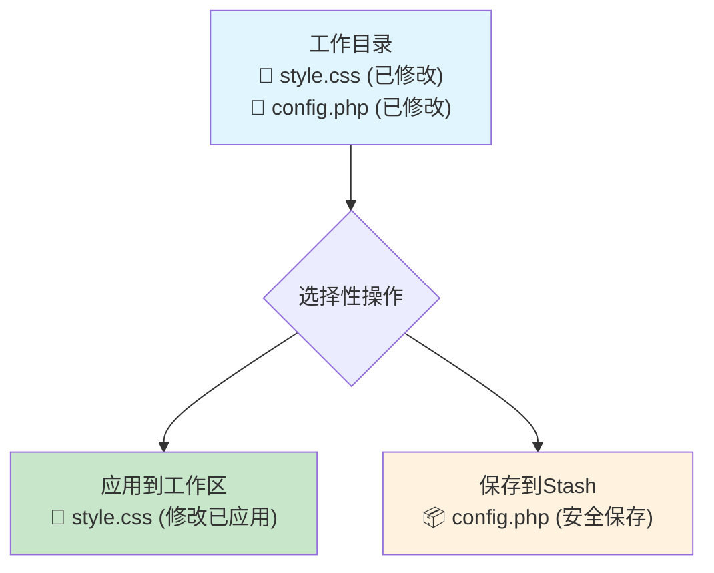
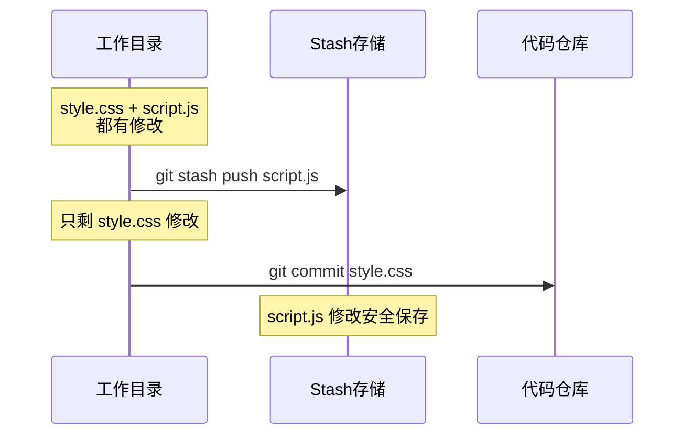
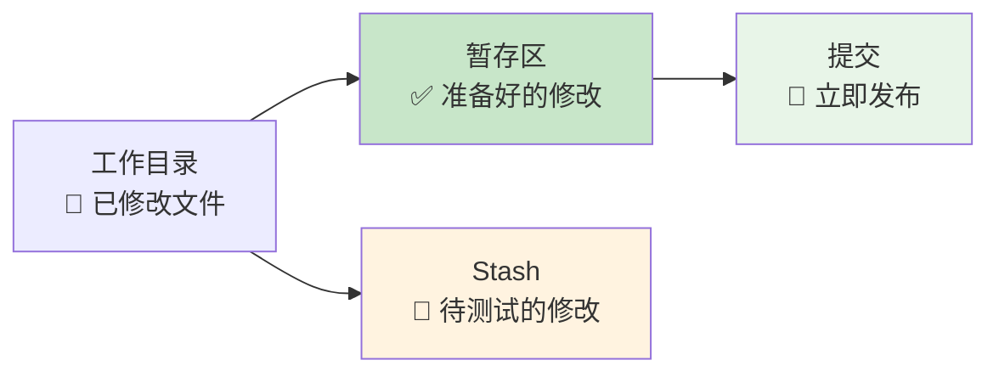

在日常开发中，你是否遇到过这样的情况：修改了多个文件，但只想应用其中某些文件的修改，而把其他文件的修改先放一边？传统的git stash要么全部保存，要么全部恢复，但实际上Git提供了更灵活的选择性操作方法。

<!--more-->

## 什么是Git Stash的选择性应用

想象一下，你正在开发一个网站，同时修改了样式文件（style.css）和数据库配置文件（config.php）。突然需要紧急修复一个bug，但只需要样式的修改，数据库配置还没准备好。这时候，你就需要"选择性地"处理这些修改。

Git Stash的选择性应用就像是一个智能的文件柜，你可以：
- 把某些文件的修改"暂时放进柜子里"
- 只取出需要的文件修改来使用
- 让不需要的修改安全地保存着



## 场景一：分别保存不同文件的修改

### 问题场景
假设你是一名前端开发者，正在同时优化页面样式和调试JavaScript功能。现在需要提交样式修改，但JavaScript代码还需要测试。

### 解决方案：只stash特定文件

```bash
# 只把JavaScript文件的修改放入stash
git stash push -m "保存JS调试代码" script.js

# 现在工作目录中只有样式文件的修改，可以安全提交
git add style.css
git commit -m "优化页面样式"
```

这种方法的好处是：
- **精确控制**：只保存不需要的文件修改
- **保持工作流程**：需要的修改仍在工作目录中
- **安全性高**：不会意外丢失任何代码



## 场景二：从stash中只恢复需要的文件

### 问题场景
你之前把所有修改都stash了，现在只想恢复其中一个文件的修改，其他文件暂时不动。

### 解决方案：选择性恢复

```bash
# 查看stash中保存了什么
git stash list

# 只恢复特定文件的修改（其他文件仍在stash中）
git checkout stash@{0} -- style.css
```

**重要提醒**：这个操作不会从stash中删除内容，stash仍然完整保存着所有修改。

### 更精细的控制：交互式恢复

如果你想更精确地控制恢复哪些具体的代码修改：

```bash
# 交互式选择要恢复的代码块
git checkout -p stash@{0}
```

系统会逐个询问每个修改块（hunk），你可以选择：
- `y` = 应用这个修改
- `n` = 跳过这个修改  
- `q` = 退出
- `?` = 查看更多选项

## 场景三：基于暂存状态的智能分组

### 问题场景
作为项目经理，你在审查代码时发现有些修改可以立即发布，有些需要进一步测试。

### 解决方案：配合暂存区使用

```bash
# 第一步：把准备好的修改添加到暂存区
git add ready-file1.py ready-file2.py

# 第二步：把其他修改stash起来，但保留已暂存的内容
git stash push --keep-index -m "保存待测试的修改"

# 现在暂存区中只有准备好的修改，可以直接提交
git commit -m "发布准备好的功能"
```

`--keep-index`参数的作用：
- **正常stash**：所有修改都被保存，工作目录完全干净
- **使用--keep-index**：已暂存的内容保留在暂存区，未暂存的内容被stash



## 实用技巧和注意事项

### 查看stash内容
在进行选择性操作前，建议先查看stash中保存了什么：

```bash
# 查看stash列表
git stash list

# 查看特定stash的详细内容
git stash show -p stash@{0}
```

### 给stash取有意义的名字
```bash
# ✅ 推荐：使用描述性的消息
git stash push -m "数据库配置调试-待测试" config/

# ❌ 不推荐：使用默认消息
git stash push config/
```

### 安全性检查
在应用stash内容前，确保当前工作目录是干净的，避免冲突：
```bash
git status  # 检查当前状态
```

## 与传统方法的对比

### 传统patch文件方式
```bash
# 生成patch文件
git diff > my-changes.patch
# 应用patch文件  
git apply my-changes.patch
```

**使用场景**：需要在不同电脑、不同项目间传输修改时使用

### Git Stash方式
```bash
# 直接在当前仓库中操作
git stash push -m "临时保存" specific-file
git checkout stash@{0} -- needed-file
```

**使用场景**：本地开发中临时管理修改

**选择建议**：日常开发优先使用stash，需要传输修改时才考虑patch文件。

## 总结

Git Stash的选择性应用让你能够：

**精确控制**哪些修改被保存、哪些被应用，就像是给你的代码修改安装了一个智能分拣系统。无论你是需要紧急切换任务的开发者，还是需要分步骤处理修改的项目管理者，这些技巧都能让你的工作流程更加灵活高效。

掌握这些方法后，你就不再需要为"修改了多个文件但只想提交一部分"这样的情况而烦恼了。Git Stash会成为你代码管理工具箱中的得力助手。
