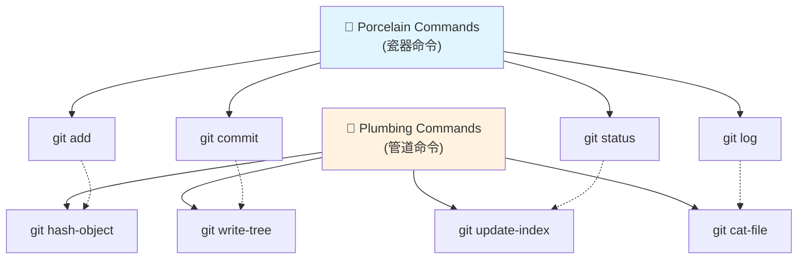
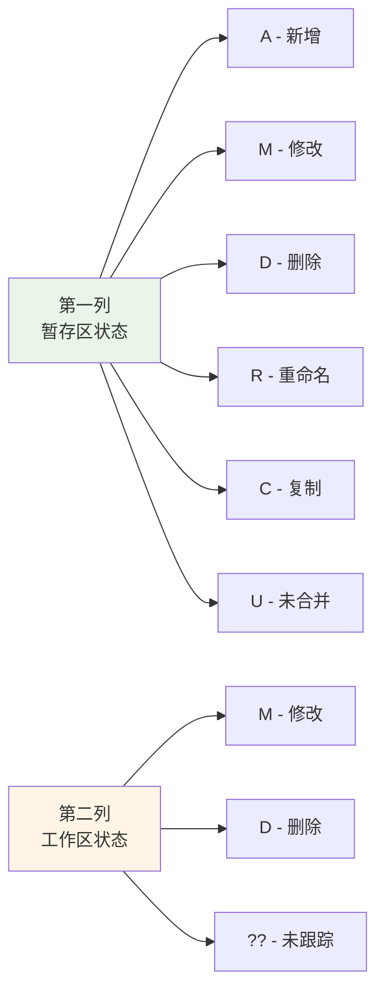
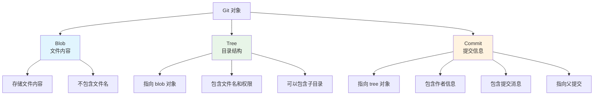

当你在终端中运行 `git status` 时，看到的那些彩色、格式化的输出很漂亮，对吧？但如果你想在脚本中解析这些信息，或者通过管道命令进行进一步处理，那些"美观"的格式反而成了障碍。今天我们来探索 Git 状态输出的两面性：既要美观易读，又要机器友好。

<!--more-->

## 问题的起源：两种不同的需求

想象一下这个场景：你是一名开发者，需要写一个自动化脚本来检查项目中的未跟踪文件。你首先想到的可能是解析 `git status` 的输出，但很快你就会发现一个问题——那些为人类设计的输出格式对脚本来说并不友好。

### 普通的 git status 输出

当我们运行普通的 `git status` 命令时，我们看到的是这样的输出：

```bash
$ git status
On branch main
Your branch is up to date with 'origin/main'.

Changes to be committed:
  (use "git reset HEAD <file>..." to unstage)
        new file:   src/app.js
        modified:   README.md

Changes not staged for commit:
  (use "git add <file>..." to update what will be committed)
  (use "git checkout -- <file>..." to discard changes in working directory)
        modified:   package.json

Untracked files:
  (use "git add <file>..." to include in what will be committed)
        temp.log
        debug.txt
```

这种输出对人类来说很友好——有颜色、有说明、有建议的操作指令。但对脚本来说就是噩梦了：

- 包含大量解释性文字
- 输出格式可能因 Git 版本而变化
- 难以准确提取文件名
- 包含 ANSI 颜色代码

## Git 的双重设计哲学：Porcelain vs Plumbing

这时候我们需要了解 Git 的设计哲学。Git 将其命令分为两类，这个命名来自一个有趣的比喻：



### Porcelain（瓷器）命令
就像浴室里漂亮的瓷质洁具一样：
- **美观易用**：为人类用户设计的友好界面
- **功能丰富**：包含帮助信息、颜色、格式化输出
- **经常使用**：日常工作的主要工具

### Plumbing（管道）命令
就像隐藏在墙后的管道系统：
- **功能性强**：提供核心功能，输出简洁
- **稳定可靠**：格式不会轻易改变，适合脚本使用
- **底层工具**：为上层命令提供基础功能

## 解决方案：`--porcelain` 选项

这里有个有趣的命名"矛盾"：`git status --porcelain` 选项实际上让一个 porcelain 命令表现得像 plumbing 命令一样！

### 获取机器友好的状态输出

```bash
# 脚本友好的输出
$ git status --porcelain
A  src/app.js
M  README.md
 M package.json
?? temp.log
?? debug.txt
```

看到区别了吗？这种输出：
- 没有多余的文字说明
- 每行一个文件，格式固定
- 状态用简单的字符标记
- 保证向后兼容

### 状态代码解释



## 实际应用：提取未跟踪文件列表

现在我们可以轻松获取只包含文件名的未跟踪文件列表：

### 方法1：使用 `--porcelain` 和文本处理

```bash
# 获取未跟踪文件
git status --porcelain | grep '^??' | cut -c4-
```

### 方法2：使用 `git ls-files`（推荐）

```bash
# 直接获取未跟踪文件（更高效）
git ls-files --others --exclude-standard
```

### 方法3：在脚本中使用

```bash
#!/bin/bash
# 检查是否有未跟踪文件
untracked_files=$(git ls-files --others --exclude-standard)
if [ -n "$untracked_files" ]; then
    echo "发现未跟踪文件："
    echo "$untracked_files"
else
    echo "没有未跟踪文件"
fi
```

## Fish Shell 中的实用函数

如果你使用 Fish shell，可以创建一个便捷函数：

```fish
function git-untracked
    git ls-files --others --exclude-standard
end

function git-modified
    git status --porcelain | awk '/^.M/ {print substr($0, 4)}'
end

function git-staged
    git status --porcelain | awk '/^[MADRCU]/ {print substr($0, 4)}'
end
```

## 更深入：探索 Git 的内部机制

如果你对 Git 的内部工作原理感兴趣，这里是一些 plumbing 命令的实际演示：

### 手动创建 Git 对象

```bash
# 创建一个文件对象（blob）
echo "Hello World" | git hash-object -w --stdin
# 输出：557db03de997c86a4a028e1ebd3a1ceb225be238

# 查看对象内容
git cat-file -p 557db03de997c86a4a028e1ebd3a1ceb225be238
# 输出：Hello World

# 查看对象类型
git cat-file -t 557db03de997c86a4a028e1ebd3a1ceb225be238
# 输出：blob
```

### Git 对象的三种类型



## 实践建议

### 什么时候使用哪种方法？

1. **日常使用**：直接用 `git status`，享受美观的输出
2. **脚本自动化**：使用 `git status --porcelain` 或 `git ls-files`
3. **性能要求高**：优先选择 `git ls-files` 系列命令
4. **学习 Git 内部机制**：探索 plumbing 命令

### 现代开发中的应用

在 CI/CD 管道中，这些技术经常被用于：
- 检查代码仓库的状态
- 自动化部署前的文件验证
- 生成变更报告
- 实现自定义的 Git 工作流

## 总结

Git 的 porcelain 和 plumbing 设计体现了优秀软件的双重关注：既要对用户友好，又要对自动化友好。通过理解这种设计哲学，我们可以：

- 在合适的场景使用合适的工具
- 编写更可靠的自动化脚本
- 更深入地理解 Git 的工作原理

下次当你需要在脚本中处理 Git 信息时，记住这个简单的原则：**美观的给人看，简洁的给机器用**。

---

*提示：本文中的代码示例都可以在实际环境中运行。建议在一个测试仓库中尝试这些命令，以加深理解。*
