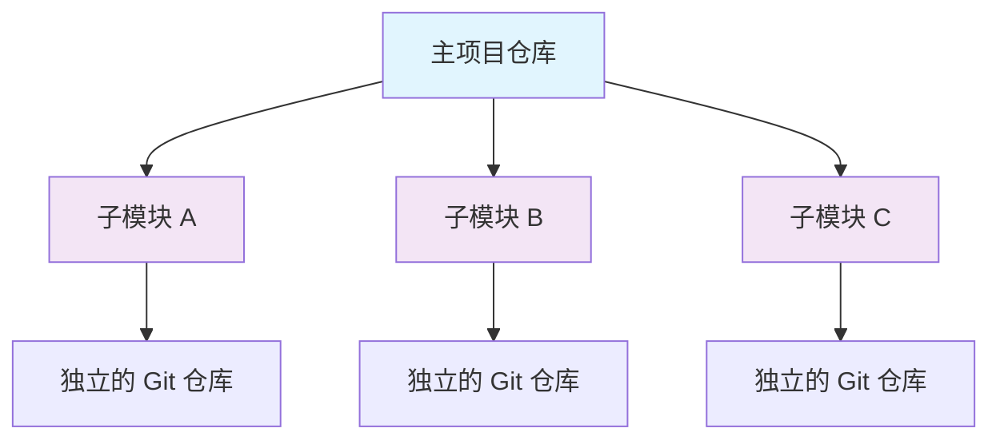
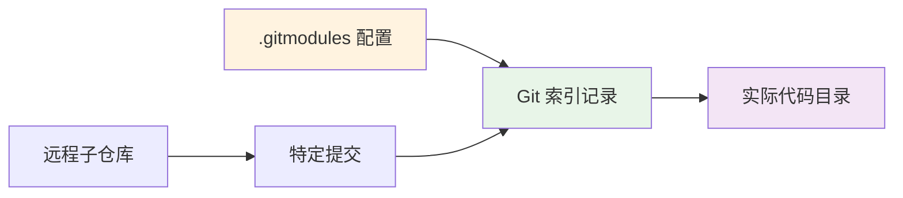

当你在开发一个博客网站，想要引入一个漂亮的主题和评论系统时，突然发现这些都是独立的 Git 仓库。你可能会想：是直接下载代码复制过来，还是有更优雅的方式？Git Submodule（子模块）就是专门解决这个问题的工具。

<!--more-->

## 什么是 Git Submodule？

想象一下，你的项目就像一个大房子，而 Git Submodule 就像是房子里的"租户房间"。每个租户（子模块）都有自己独立的生活空间（独立的 Git 仓库），但同时又是整个房子（主项目）的一部分。

Git Submodule 本质上是**对另一个仓库特定提交的引用**。它不会把子仓库的代码直接复制到你的项目中，而是记录一个"指针"，告诉 Git："在这个位置，我需要来自那个仓库某个特定版本的代码"。



## 为什么需要 Submodule？

考虑这样的场景：你正在开发一个企业网站，需要用到开源的主题和第三方插件。如果直接复制代码，当原作者发布更新时，你就需要手动合并更改，既麻烦又容易出错。而使用 Submodule，你可以：

- **保持同步**：轻松获取原仓库的最新更新
- **版本控制**：精确控制使用哪个版本的依赖
- **独立开发**：可以对子模块进行修改而不影响原仓库
- **清晰结构**：项目结构清晰，依赖关系明确

## 理解 Submodule 的工作原理

### 核心概念

Git Submodule 的工作机制可以用三个关键文件来理解：

1. **`.gitmodules` 文件**：记录子模块的配置信息（仓库地址、本地路径、分支等）
2. **Git 索引**：记录子模块当前指向的具体提交哈希
3. **实际的子模块目录**：包含从子仓库检出的实际代码



### 状态理解

Submodule 有几个重要的状态概念：

- **已初始化**：`.gitmodules` 中的配置已应用到本地 Git 配置
- **已检出**：实际代码已从远程仓库下载到本地
- **同步状态**：本地代码与主项目记录的提交一致
- **分离头状态**（Detached HEAD）：子模块通常处于这个状态，指向特定提交而非分支

## 实战操作指南

### 初次接触：克隆包含 Submodule 的项目

当你克隆一个包含子模块的项目时，默认情况下子模块目录是空的。你需要额外的步骤来获取子模块的代码：

```bash
# 传统方式（三步走）
git clone https://github.com/example/project.git
cd project
git submodule init        # 初始化本地配置
git submodule update      # 检出代码

# 现代方式（一步到位）
git clone --recurse-submodules https://github.com/example/project.git
```

### 添加新的 Submodule

假设你要为博客添加一个主题：

```bash
# 添加主题作为子模块
git submodule add https://github.com/author/awesome-theme.git themes/awesome-theme

# 添加并指定分支
git submodule add -b stable https://github.com/author/comment-system.git comment/system
```

这个命令会：
1. 在 `themes/awesome-theme` 目录下载代码
2. 在 `.gitmodules` 文件中记录配置
3. 在 Git 索引中记录当前的提交哈希

### 更新 Submodule

这是最常用的操作场景。更新分为两种情况：

#### 情况一：更新到项目记录的版本

当团队成员更新了子模块，你需要同步到相同版本：

```bash
# 更新所有子模块到项目记录的版本
git submodule update

# 更新特定子模块
git submodule update themes/awesome-theme
```

#### 情况二：更新到远程最新版本

当你想要获取子模块的最新更新：

```bash
# 更新所有子模块到远程最新
git submodule update --remote

# 只更新特定子模块
git submodule update --remote themes/awesome-theme

# 使用合并方式更新（推荐）
git submodule update --remote --merge
```

**记住**：更新后需要在主项目中提交这个变更：

```bash
git add themes/awesome-theme
git commit -m "Update theme to latest version"
```

### 在 Submodule 中开发

有时你需要修改子模块的代码：

```bash
# 进入子模块目录
cd themes/awesome-theme

# 切换到分支（脱离 detached HEAD 状态）
git checkout main

# 进行修改并提交
git add .
git commit -m "Custom modifications"
git push origin main

# 回到主项目，记录新的提交
cd ../..
git add themes/awesome-theme
git commit -m "Update theme with custom modifications"
```

### 查看和管理状态

```bash
# 查看所有子模块状态
git submodule status

# 在所有子模块中执行命令
git submodule foreach 'git status'

# 查看子模块的远程分支信息
git submodule foreach 'git remote -v'
```

## 常见问题与解决方案

### 问题一：子模块目录为空

**症状**：克隆项目后，子模块目录存在但为空

**解决**：
```bash
git submodule init
git submodule update
```

### 问题二：更新冲突

**症状**：执行 `git submodule update --remote --merge` 时出现合并冲突

**解决**：
```bash
cd <子模块目录>
# 手动解决冲突
git add .
git commit
cd ..
git add <子模块目录>
git commit
```

### 问题三：意外更新了不想更新的子模块

**症状**：执行 `git submodule update --remote` 更新了所有子模块，但只想更新其中一个

**解决**：
```bash
# 恢复不想更新的子模块
git submodule update comment/system

# 只提交想要的更新
git add themes/awesome-theme
git commit -m "Update only theme"
```

## 高效工作的最佳实践

### 配置别名

在 `~/.gitconfig` 中添加常用别名：

```ini
[alias]
    sub = submodule
    sup = submodule update --remote --merge
    sst = submodule status
```

### 自动化配置

```bash
# 克隆时自动初始化子模块
git config --global submodule.recurse true

# 显示子模块的详细差异
git config --global diff.submodule log
```

### 分支策略

为不同的子模块设置跟踪不同的分支：

```bash
# 设置主题跟踪 stable 分支
git config -f .gitmodules submodule.themes/awesome-theme.branch stable

# 设置评论系统跟踪 main 分支
git config -f .gitmodules submodule.comment/system.branch main
```

## 核心命令速查表

| 操作 | 命令 | 用途 |
|------|------|------|
| 克隆含子模块项目 | `git clone --recurse-submodules <url>` | 一步到位获取所有代码 |
| 添加子模块 | `git submodule add <url> <path>` | 引入新的依赖 |
| 初始化子模块 | `git submodule init` | 设置本地配置 |
| 更新到记录版本 | `git submodule update` | 同步团队版本 |
| 更新到最新版本 | `git submodule update --remote` | 获取上游更新 |
| 查看状态 | `git submodule status` | 检查所有子模块状态 |
| 批量操作 | `git submodule foreach '<command>'` | 在所有子模块执行命令 |

## 总结

Git Submodule 虽然概念上有些复杂，但掌握了核心原理后，它就是一个强大的项目管理工具。记住最重要的几点：

1. **Submodule 是引用，不是复制**：它指向其他仓库的特定提交
2. **更新后要提交**：在主项目中记录新的引用关系
3. **区分两种更新**：同步团队版本 vs 获取最新版本
4. **注意分离头状态**：在子模块中开发时要切换到分支

通过理解这些核心概念，你就能够灵活运用 Git Submodule 来管理复杂的项目依赖关系，让你的开发工作更加高效和有序。
