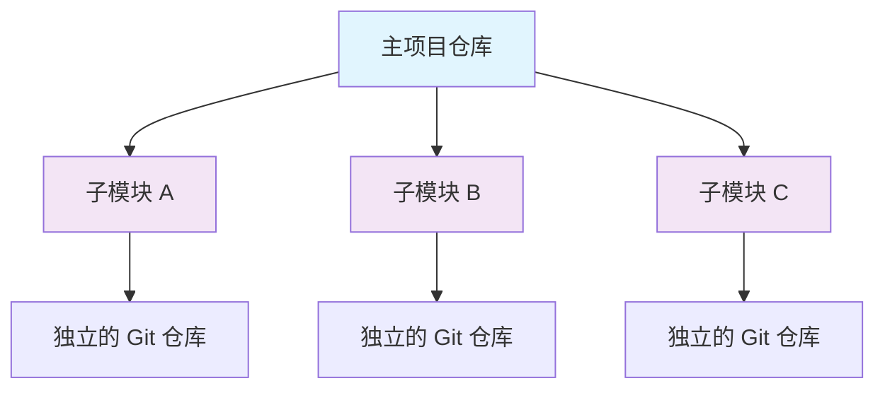
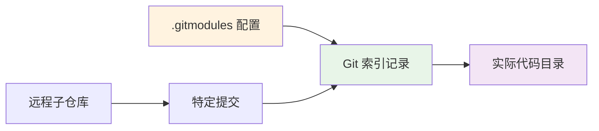

Когда вы разрабатываете сайт блога и хотите внедрить красивую тему и систему комментариев, вы вдруг понимаете, что это отдельные репозитории Git. Вы можете задаться вопросом, стоит ли просто скачать код и скопировать его, или есть более элегантный способ сделать это, и Git Submodule - это инструмент, который решает эту проблему.

<!--more-->

## 什么是 Git Submodule？

Представьте, что ваш проект похож на большой дом, а Git-подмодули - на "комнаты жильцов" в этом доме. У каждого жильца (подмодуля) есть своя жилплощадь (отдельный Git-репозиторий), но в то же время он является частью дома (основного проекта).

Субмодуль Git - это, по сути, **ссылка** на определенный коммит в другом репозитории. Вместо того чтобы копировать код из подрепозитория непосредственно в ваш проект, он записывает "указатель", который говорит Git'у: "Мне нужна определенная версия кода из этого репозитория в этом месте".



## 为什么需要 Submodule？

Рассмотрим такой сценарий: вы разрабатываете корпоративный сайт, который требует использования тем с открытым исходным кодом и сторонних плагинов. Если вы копируете код напрямую, то, когда автор выпускает обновление, вам приходится вручную объединять изменения, что и хлопотно, и чревато ошибками. С другой стороны, с помощью Submodule вы можете:

- **Удерживайте синхронизацию**: легко получайте последние обновления из оригинального репозитория
- **Контроль версий**: точно контролируйте, какая версия зависимости используется
- **Независимая разработка**: вы можете вносить изменения в подмодули, не затрагивая исходный репозиторий
- **Четкая структура**: четкая структура проекта и зависимостей.

## 理解 Submodule 的工作原理

### 核心概念

Механизм работы Git Submodule можно понять с точки зрения трех ключевых файлов:

1. **`.gitmodules` файл**: записывает конфигурационную информацию субмодуля (адрес репозитория, локальный путь, ветвь и т.д.)
2. **Git index**: записывает хэш конкретного коммита, на который в данный момент указывает субмодуль
3. **Каталог фактического подмодуля**: содержит фактический код, извлечённый из подрепозитория



### 状态理解

Субмодуль имеет несколько важных концепций состояния:

- **Initialised**: конфигурация в `.gitmodules` была применена к локальной конфигурации Git
- **Checked out**: фактический код был локально загружен из удаленного репозитория
- **Статус синхронизации**: локальный код соответствует коммитам, записанным в мастер-проекте
- **Detached HEAD: субмодули обычно находятся в этом состоянии, указывая на конкретный коммит, а не на ветку

## 实战操作指南

### 初次接触：克隆包含 Submodule 的项目

Когда вы клонируете проект, содержащий подмодули, по умолчанию каталог подмодулей пуст. Чтобы получить код подмодуля, необходимо выполнить дополнительный шаг:

```bash
# 传统方式（三步走）
git clone https://github.com/example/project.git
cd project
git submodule init        # 初始化本地配置
git submodule update      # 检出代码

# 现代方式（一步到位）
git clone --recurse-submodules https://github.com/example/project.git
```

### 添加新的 Submodule

Допустим, вы хотите добавить тему в свой блог:

```bash
# 添加主题作为子模块
git submodule add https://github.com/author/awesome-theme.git themes/awesome-theme

# 添加并指定分支
git submodule add -b stable https://github.com/author/comment-system.git comment/system
```

Эта команда выполнит:
1. загрузит код в директорию `themes/awesome-theme`.
2. запишет конфигурацию в файл `.gitmodules`.
3. запишет хэш текущего коммита в индекс Git

### 更新 Submodule

Это наиболее распространенный сценарий работы. Обновления делятся на два сценария:

#### 情况一：更新到项目记录的版本

Когда член команды обновляет подмодуль, вам необходимо синхронизировать его с той же версией:

```bash
# 更新所有子模块到项目记录的版本
git submodule update

# 更新特定子模块
git submodule update themes/awesome-theme
```

#### 情况二：更新到远程最新版本

Когда вы хотите получить последние обновления для подмодуля:

```bash
# 更新所有子模块到远程最新
git submodule update --remote

# 只更新特定子模块
git submodule update --remote themes/awesome-theme

# 使用合并方式更新（推荐）
git submodule update --remote --merge
```

**Помните**: это изменение должно быть зафиксировано в основном проекте после обновления:

```bash
git add themes/awesome-theme
git commit -m "Update theme to latest version"
```

### 在 Submodule 中开发

Иногда вам нужно изменить код подмодуля:

```bash
# 进入子模块目录
cd themes/awesome-theme

# 切换到分支（脱离 detached HEAD 状态）
git checkout main

# 进行修改并提交
git add .
git commit -m "Custom modifications"
git push origin main

# 回到主项目，记录新的提交
cd ../..
git add themes/awesome-theme
git commit -m "Update theme with custom modifications"
```

### 查看和管理状态

```bash
# 查看所有子模块状态
git submodule status

# 在所有子模块中执行命令
git submodule foreach 'git status'

# 查看子模块的远程分支信息
git submodule foreach 'git remote -v'
```

## 常见问题与解决方案

### 问题一：子模块目录为空

**симптом**: после клонирования проекта каталог подмодулей существует, но пуст

**解决**：
```bash
git submodule init
git submodule update
```

### 问题二：更新冲突

**симптом**: конфликт слияния при выполнении `git submodule update --remote --merge`.

**解决**：
```bash
cd <子模块目录>
# 手动解决冲突
git add .
git commit
cd ..
git add <子模块目录>
git commit
```

### 问题三：意外更新了不想更新的子模块

**симптом**: выполнение `git submodule update --remote` обновляет все субмодули, но хочет обновить только один.

**解决**：
```bash
# 恢复不想更新的子模块
git submodule update comment/system

# 只提交想要的更新
git add themes/awesome-theme
git commit -m "Update only theme"
```

## 高效工作的最佳实践

### 配置别名

Добавьте общие псевдонимы в `~/.gitconfig`:

```ini
[alias]
    sub = submodule
    sup = submodule update --remote --merge
    sst = submodule status
```

### 自动化配置

```bash
# 克隆时自动初始化子模块
git config --global submodule.recurse true

# 显示子模块的详细差异
git config --global diff.submodule log
```

### 分支策略

Настройте отслеживание разных веток для разных субмодулей:

```bash
# 设置主题跟踪 stable 分支
git config -f .gitmodules submodule.themes/awesome-theme.branch stable

# 设置评论系统跟踪 main 分支
git config -f .gitmodules submodule.comment/system.branch main
```

## 核心命令速查表

|Операции |Команды |Использование |
| ------|------|------|------|
| Клонировать проект с подмодулями | `git clone --recurse-submodules <url>` | Получить весь код за один шаг | `git submodule add <url> <path>` | Ввести новый подмодуль.
| Добавить подмодуль | `git submodule add <url> <path>` | Внедрить новые зависимости |
| Инициализировать субмодули | `git submodule init` | Установить локальную конфигурацию |
| Обновление до версии записи | `git submodule update` | Синхронизация версий команды |
| | Обновление до последней версии | `git submodule update --remote` | Получение обновлений из восходящего потока |
| проверка статуса | `git submodule status` | Проверка статуса всех субмодулей |
| пакетные операции | `git submodule foreach '<команда>'` | Выполнение команд во всех субмодулях |

## 总结

Субмодуль Git концептуально сложен, но как только вы поймете основные принципы, он станет мощным инструментом управления проектами. Запомните самые важные моменты:

1. **Submodule 是引用，不是复制**：它指向其他仓库的特定提交
2. **更新后要提交**：在主项目中记录新的引用关系
3. **区分两种更新**：同步团队版本 vs 获取最新版本
4. **注意分离头状态**：在子模块中开发时要切换到分支

Поняв эти основные концепции, вы сможете использовать подмодули Git для управления сложными зависимостями проекта и сделать свою работу по разработке более эффективной и организованной.