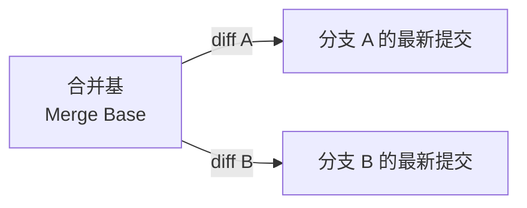

你在两个分支上做了"效果一模一样"的修改，结果合并时 Git 给你报了冲突。你反复确认：两边的最终文件内容完全一致，为什么还会冲突？这篇文章带你从 Git 三路合并（three-way merge）的底层机制出发，彻底理解这个初学者最容易踩的坑。

<!--more-->

## 一个真实的困惑

假设你有一个主分支 `main`，上面有一个提交 B 引入了一段新代码。你从 `main` 拉出两个分支 `hotfix` 和 `feature`，分别做了以下操作：

- `hotfix` 分支：用 `git revert` 生成提交 E，撤销了 B 的改动
- `feature` 分支：手动编辑文件，把 B 引入的代码删掉，生成提交 F

`hotfix` 先合并回 `main`。然后你从 `feature` 向 `main` 发起 PR，Git 报告冲突。

你的直觉告诉你：B 的内容已经被 E 清除了，F 也做了同样的清除，两边的最终结果完全一样，不应该有冲突才对。

但 Git 不这么想。

## Git 不比较"结果"，它比较"变更过程"

理解 Git 合并冲突的关键，在于理解 **三路合并（three-way merge）** 的工作方式。Git 合并两个分支时，参与比较的不是两方，而是三方：



三路合并的逻辑是：

1. 找到两个分支的 **最近公共祖先**（merge base）
2. 分别计算 **merge base → 分支 A** 和 **merge base → 分支 B** 的差异（diff）
3. 尝试把两个 diff 合并到一起

这里的核心要点是：Git 比较的是两条"变更路径"（diff），而不是两个分支的最终文件内容。

## 冲突的真正原因：同一区域的不同 Diff

回到开头的例子，让我们看看三路合并在这个场景下实际做了什么。

合并基（merge base）是 `feature` 从 `main` 分出去的那个点。在那个点上，B 的改动是存在的。当 Git 合并 `feature` 到 `main`（已合并了 `hotfix`）时：

- **merge base → main**：E 的变更（`git revert` 自动生成的精确逆操作）
- **merge base → feature**：F 的变更（你手动编辑的结果）

两个 diff 都修改了同一区域的代码。Git 的判断规则很简单：

- 如果只有一侧修改了某个区域 → 直接采用修改方的版本（无冲突）
- 如果两侧都修改了同一区域，且 **修改内容字面完全一致** → 采用任一方（无冲突）
- 如果两侧都修改了同一区域，且 **修改内容字面不一致** → 冲突

问题就出在第三条。`git revert` 生成的 diff 是精确的逆操作——它严格地把 B 增加的每一行删掉，把 B 删掉的每一行加回来，连空格和换行都不差。而你手动编辑时，很可能在细节上有微妙的差异：多删了一个空行、少缩进了一个空格、或者改了行的顺序。这些在语义上完全等价的差异，在 Git 的逐行文本比较中就是"不一致"。

用一个具体的例子来说明。假设 B 在文件 `config.py` 中加了这段代码：

```python
# B 新增的代码
def validate_input(data):
    if not data:
        return False
    return True
```

`git revert` 生成的 E 会精确地删除这五行。而你在 `feature` 分支手动编辑时，可能是这样做的：

```python
# F 手动删除后的样子（多删了上方的空行）
```

或者你可能不小心改了上下文的缩进。甚至可能你删除的范围比 `git revert` 多了一行或少了一行。Git 看到的是：两侧都修改了同一块区域，但修改内容不完全一致——冲突。

## 用 Git 命令验证

当你遇到这种"不应该冲突却冲突了"的情况时，可以用以下方法定位差异：

```bash
# 找到合并基
git merge-base main feature

# 分别查看两侧的 diff
git diff $(git merge-base main feature) main -- path/to/file
git diff $(git merge-base main feature) feature -- path/to/file
```

把两个 diff 放在一起对比，你就能看到字面上的差异在哪里。

## 为什么 Revert F 之后冲突消失了？

在开头的故事里，作者在 `feature` 分支上 revert 了 F，冲突就消失了。这是怎么回事？

Revert F 之后，`feature` 分支的净变更变成了：B 的改动 + F 的撤销 + F 的 revert = 回到 B 的状态。而 B 的状态就是 merge base 的状态。换句话说，从 merge base 到 `feature` 的 diff 变成了 **空的**——`feature` 分支没有任何变更。

这时三路合并只剩一侧有变更（main 侧的 E），单侧变更不可能冲突，合并自然顺利通过。

但这个"解法"其实意味着 `feature` 分支的那次手动修改（F）被完全抹掉了。如果 F 只是做了和 E 一样的事情（撤销 B），那没问题。但如果 F 还包含其他改动，revert F 会把那些改动也一起抹掉——这才是需要警惕的地方。

## 三类常见的"假冲突"场景

理解了三路合并的机制之后，我们可以归纳出几类初学者容易困惑的"假冲突"场景：

**场景一：重复劳动型**

两个分支独立修复了同一个 bug，改法几乎一样但不完全一致。比如一个人用 `!== null` 另一个人用 `!= null`，语义等价但字面不同。

**场景二：Revert 与手动编辑的微妙差异**

这就是开头描述的情况。`git revert` 生成的 diff 是机器精确计算的逆操作，而手动编辑几乎不可能做到完全一致。哪怕差一个空格、一个换行，Git 都会判定为冲突。

**场景三：格式化工具的介入**

一个分支上有人运行了代码格式化工具（如 Prettier、Black），另一个分支上有人手动修改了同一区域的代码。格式化工具可能改变了缩进、换行、引号风格等，导致 diff 范围远大于实际的逻辑修改，从而与另一分支的改动产生冲突。

## 正确的做法

理解了三路合并的原理之后，规避这类问题的核心思路就是：**不要在不同分支上对同一区域做语义等价但字面不同的修改**。

**做法一：合并前先 rebase**

在从 `feature` 向 `main` 发起 PR 之前，先把 `main` 的最新改动（包括 E）rebase 到 `feature` 上。这样你会在本地发现冲突并解决，而不是在 PR 里看到冲突。更重要的是，rebase 之后 `feature` 的 merge base 会更新，E 的改动已经包含在 `feature` 的历史里，F 就不再与 E 冲突了——因为 F 的 diff 是相对于新 merge base（已包含 E）计算的。

```bash
git checkout feature
git rebase main
# 在 rebase 过程中解决冲突
# 此时 F 的改动会被重新计算为相对于包含 E 的新基准的 diff
```

**做法二：不要手动重复机器已经做过的事**

如果你知道某个改动已经通过 `git revert` 或其他方式在另一个分支上完成了，就不要在自己的分支上再手动做一遍。先把对方的改动合并过来，再在此基础上继续工作。

```bash
git checkout feature
git merge main  # 把 E 的改动带过来
# 然后再做 feature 自己需要做的改动
```

**做法三：理解你的 diff，而不只是你的文件**

很多初学者只关注"我的文件最终长什么样"，而忽略了"从 merge base 到我的文件，diff 是什么"。养成使用 `git diff` 检查变更的习惯，尤其是在合并前：

```bash
# 检查自己分支相对于合并基的变更
git diff $(git merge-base main feature) feature

# 检查对方分支相对于合并基的变更
git diff $(git merge-base main feature) main
```

如果两个 diff 在同一区域有不同的改法，冲突就不可避免。提前发现比在 PR 里处理要好得多。

## 总结

Git 的三路合并是一个纯粹的文本行级操作，它不理解代码语义，只看字面差异。两个分支对同一区域做了"效果一样"的修改，只要字面不完全一致，就会产生冲突。理解了这一点，你就能理解为什么 `git revert` 和手动编辑会打架，为什么格式化工具会制造意外冲突，以及为什么 rebase 和及时同步是避免这类问题的最佳实践。

下次遇到"不应该冲突的冲突"时，不妨跑一下 `git merge-base` 和 `git diff`，用 Git 的眼睛看看你的改动——你大概率会发现，Git 其实说得有道理。
