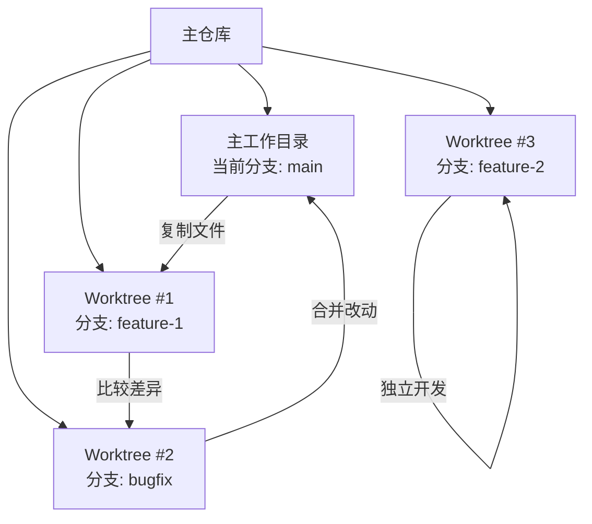

在多人协作的项目中，经常需要比较不同分支中的文件差异，或者从其他分支提取特定文件。传统的做法是克隆多个仓库副本，既浪费磁盘空间又难以管理。本文介绍几种优雅高效的跨分支文件操作方法，帮助你彻底告别笨重的工作方式。

<!--more-->

## 跨分支文件管理的常见需求

作为开发者，我们经常会遇到这些场景：

- 需要比较当前分支和另一个分支中同一文件的差异
- 希望将另一个分支中的特定文件合并到当前工作分支
- 想查看另一个分支中某个文件的内容，但不想切换分支
- 需要同时处理多个分支上的任务

传统解决方案通常是：复制整个代码库到另一个目录，切换到目标分支，然后进行比较或复制操作。这种方式不仅繁琐，还会占用大量磁盘空间，特别是对于大型项目。

## 使用Git命令进行跨分支文件操作

Git实际上提供了多种内置命令来处理跨分支文件操作，无需复制整个仓库。

### 方法一：使用git diff比较文件差异

最基本的比较方法是使用`git diff`命令：

```bash
# 比较两个分支中同一文件的差异
git diff main..feature-branch -- path/to/file.ext
```

如果你配置了外部diff工具（如difft），可以获得更友好的差异显示：

```bash
# 配置外部diff工具
git config --global diff.external difft

# 使用配置好的工具比较
git diff main..feature-branch -- path/to/file.ext
```

### 方法二：从其他分支查看或提取文件

要查看其他分支中某个文件的内容，可以使用`git show`命令：

```bash
# 查看其他分支中的文件内容
git show other-branch:path/to/file.ext
```

如果想将文件保存到本地而不覆盖当前文件，可以重定向输出：

```bash
# 将其他分支的文件保存为新文件
git show other-branch:path/to/file.ext > file_from_other_branch.ext
```

### 方法三：检出其他分支的文件

如果你想直接使用其他分支的文件版本，可以用`git checkout`命令：

```bash
# 检出其他分支的文件（会覆盖当前工作区的同名文件）
git checkout other-branch -- path/to/file.ext
```

需要注意的是，这会将文件变更添加到暂存区，可以通过`git reset`命令取消暂存。

## VSCode中使用GitLens进行跨分支文件操作

如果你使用VSCode作为开发工具，[GitLens扩展](https://marketplace.visualstudio.com/items?itemName=eamodio.gitlens)提供了更加直观的跨分支文件操作界面。

### 安装GitLens

在VSCode的扩展市场中搜索"GitLens"并安装。

### 比较不同分支的文件

1. 点击左侧活动栏中的GitLens图标
2. 找到"Search & Compare"选项（或在Source Control面板中找到它）
3. 点击"Compare References"
4. 选择要比较的两个分支
5. 在文件差异列表中选择要比较的文件

  

最棒的是，在GitLens的比较视图中，你可以直接编辑文件并保存更改，非常方便。

### 右键菜单快速比较

对于单个文件的比较，你还可以：

1. 在编辑器中打开文件或在文件浏览器中右键点击文件
2. 选择"GitLens: Compare with..."或"Open Changes with Branch or Tag..."
3. 选择要比较的分支

## Git Worktree：同时处理多个分支的终极解决方案

Git提供了一个强大但不太为人所知的功能：**Git Worktree**。它允许你在同一个Git仓库中同时检出多个分支到不同的工作目录，而无需创建多个仓库副本。

### Git Worktree的优势

- 共享同一个`.git`目录，节省磁盘空间
- 避免频繁的分支切换和代码暂存
- 可以同时在多个分支上工作
- 文件比较和复制变得简单直观

### 基本用法

```bash
# 添加一个worktree，检出指定分支到新目录
git worktree add ../feature-branch-work feature-branch

# 列出所有worktree
git worktree list

# 完成后删除worktree
git worktree remove ../feature-branch-work
```

### 实际应用场景

假设你正在`main`分支开发，但需要查看和修改`feature-branch`分支中的文件：

```bash
# 添加worktree并检出feature-branch
git worktree add ../feature-work feature-branch

# 现在你可以直接在文件系统中比较文件
code --diff path/to/file.ext ../feature-work/path/to/file.ext

# 或者直接复制文件
cp ../feature-work/path/to/file.ext ./modified-file.ext

# 在两个分支间切换工作就像切换目录一样简单
cd ../feature-work  # 切换到feature分支工作
cd -  # 回到main分支工作

# 完成后清理
git worktree remove ../feature-work
```

这种方法特别适合需要频繁在不同分支间切换工作的场景，或者同时处理多个相关但独立任务的开发团队。

## Git工作流与跨分支操作的最佳实践

在使用这些跨分支操作技巧时，以下是一些建议的最佳实践：

1. **创建有意义的分支名称** - 清晰的命名有助于识别每个分支的用途
2. **定期清理不再需要的worktree** - 避免积累太多工作目录
3. **使用相对路径创建worktree** - 便于在不同环境中移植工作流
4. **结合使用Git GUI工具和命令行** - 取长补短，提高效率



## 结论

git提供了多种高效的方式来处理跨分支文件操作，从简单的`git show`命令到功能强大的Worktree。这些工具可以帮助你告别复制整个仓库的笨重做法，提高工作效率。

对于简单的文件查看和比较，`git show`和`git diff`命令足够用；对于更复杂的场景，GitLens提供了友好的图形界面；而对于需要同时处理多个分支的情况，Git Worktree是最佳选择。

掌握这些技巧后，你将能够更加灵活高效地管理代码，并在多分支开发环境中游刃有余。你是否已经尝试过这些方法？哪一种最适合你的工作流程？不妨实践一下，体验现代化Git工作流带来的便利。
