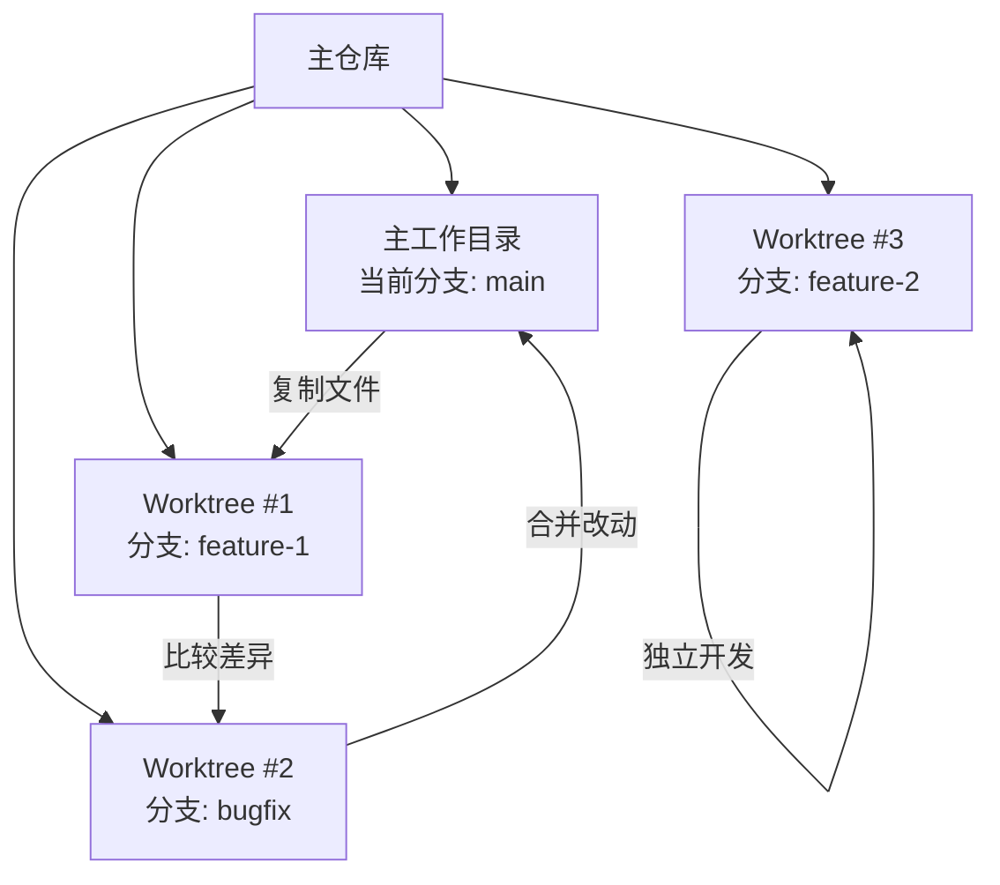

В проектах с несколькими сотрудниками часто возникает необходимость сравнить различия в файлах в разных ветках или извлечь определенные файлы из других веток. Традиционный подход заключается в клонировании нескольких копий репозитория, что является пустой тратой дискового пространства и сложным управлением. В этой статье представлено несколько элегантных и эффективных методов работы с файлами в разных ветках, которые помогут вам распрощаться с таким неудобным способом работы.

<!--more-->

## 跨分支文件管理的常见需求

Как разработчики, мы постоянно сталкиваемся с подобными сценариями:

- Необходимо сравнить различия между одним и тем же файлом в текущей и другой ветке
- Вы хотите объединить определенный файл из другой ветки в текущую рабочую ветку.
- Вы хотите просмотреть содержимое файла в другой ветке, но не хотите переключаться между ветками.
- Вам нужно работать с несколькими ветками одновременно

Традиционное решение - скопировать всю кодовую базу в другой каталог, переключиться на целевую ветку, а затем выполнить операцию сравнения или копирования. Такой подход не только громоздок, но и занимает много места на диске, особенно для больших проектов.

## 使用Git命令进行跨分支文件操作

На самом деле Git предоставляет множество встроенных команд для работы с файлами в разных ветках без необходимости копировать весь репозиторий.

### 方法一：使用git diff比较文件差异

Самый простой способ сравнения - использовать команду `git diff`:

```bash
# 比较两个分支中同一文件的差异
git diff main..feature-branch -- path/to/file.ext
```

Если вы настроите внешнюю утилиту diff (например, difft), вы сможете получить более дружелюбное отображение diff:

```bash
# 配置外部diff工具
git config --global diff.external difft

# 使用配置好的工具比较
git diff main..feature-branch -- path/to/file.ext
```

### 方法二：从其他分支查看或提取文件

Чтобы посмотреть содержимое файла в другой ветке, используйте команду `git show`:

```bash
# 查看其他分支中的文件内容
git show other-branch:path/to/file.ext
```

Если вы хотите сохранить файл локально, не перезаписывая текущий файл, вы можете перенаправить вывод:

```bash
# 将其他分支的文件保存为新文件
git show other-branch:path/to/file.ext > file_from_other_branch.ext
```

### 方法三：检出其他分支的文件

Если вы хотите напрямую использовать версию файла из другой ветки, вы можете воспользоваться командой `git checkout`:

```bash
# 检出其他分支的文件（会覆盖当前工作区的同名文件）
git checkout other-branch -- path/to/file.ext
```

Обратите внимание, что это добавит изменения файлов в область хранения, которые можно отменить командой `git reset`.

## VSCode中使用GitLens进行跨分支文件操作

Если вы используете VSCode в качестве инструмента разработки, [расширение GitLens](https://marketplace.visualstudio.com/items?itemName=eamodio.gitlens) предоставляет более интуитивно понятный интерфейс для работы с файлами в разных ветках.

### 安装GitLens

Найдите "GitLens" в VSCode's Extension Marketplace и установите его.

### 比较不同分支的文件

1. Щелкните значок GitLens на левой панели активности.
2. Найдите опцию "Поиск и сравнение" (или найдите ее на панели управления исходным кодом).
3. Нажмите "Сравнить ссылки". 4.
4. Выберите две ветви, которые нужно сравнить.
5. выберите файлы, которые нужно сравнить, в списке "Различия файлов".


Самое приятное, что в представлении сравнения GitLens можно редактировать файл и сохранять изменения напрямую, что очень удобно.

### 右键菜单快速比较

Для сравнения отдельных файлов вы также можете:

1. Откройте файл в редакторе или щелкните правой кнопкой мыши на файле в браузере файлов.
2. Выберите "GitLens: Compare with..." или "Open Changes with Branch or Tag...". или "Открыть изменения с веткой или тегом...". 3.
3. Выберите ветку, с которой нужно сравнить

## Git Worktree：同时处理多个分支的终极解决方案

Git предоставляет мощную, но менее известную функцию: **Git Worktree**. Она позволяет одновременно проверять несколько веток в разных рабочих каталогах одного и того же Git-репозитория, без необходимости создавать несколько копий репозитория.

### Git Worktree的优势

- Используйте один и тот же каталог `.git` для экономии дискового пространства
- Избегайте частого ветвления и постановки
- Работайте над несколькими ветками одновременно
- Сравнивайте и копируйте файлы легко и интуитивно понятно

### 基本用法

```bash
# 添加一个worktree，检出指定分支到新目录
git worktree add ../feature-branch-work feature-branch

# 列出所有worktree
git worktree list

# 完成后删除worktree
git worktree remove ../feature-branch-work
```

### 实际应用场景

Допустим, вы ведете разработку в ветке `main`, но вам нужно просматривать и изменять файлы в ветке `feature-branch`:

```bash
# 添加worktree并检出feature-branch
git worktree add ../feature-work feature-branch

# 现在你可以直接在文件系统中比较文件
code --diff path/to/file.ext ../feature-work/path/to/file.ext

# 或者直接复制文件
cp ../feature-work/path/to/file.ext ./modified-file.ext

# 在两个分支间切换工作就像切换目录一样简单
cd ../feature-work  # 切换到feature分支工作
cd -  # 回到main分支工作

# 完成后清理
git worktree remove ../feature-work
```

Этот подход особенно хорошо подходит для сценариев, в которых вам нужно часто переключать работу между ветками, или для команд разработчиков, работающих над несколькими связанными, но отдельными задачами одновременно.

## Git工作流与跨分支操作的最佳实践

Вот некоторые рекомендации по использованию этих методов межфилиальных манипуляций:

1. **Создайте осмысленные имена ветвей** - четкое именование помогает определить назначение каждой ветви
2. **Очищайте рабочие деревья, которые больше не нужны на регулярной основе** - позволяет избежать накопления слишком большого количества рабочих каталогов
3. **Создавайте рабочие деревья с использованием относительных путей** - облегчает перенос рабочих процессов в разные среды
4. **Используйте комбинацию инструментов Git GUI и командной строки** - дополняйте сильные стороны друг друга для повышения эффективности.



## 结论

git предоставляет множество эффективных способов работы с файлами кросс-бранчей, от простой команды `git show` до мощного Worktree. Эти инструменты помогут вам распрощаться с неудобной практикой копирования всего репозитория и стать более продуктивными.

Для простого просмотра и сравнения файлов достаточно команд `git show` и `git diff`, для более сложных сценариев - GitLens с удобным графическим интерфейсом, а для ситуаций, когда вам нужно работать с несколькими ветками одновременно, лучше всего подойдет Git Worktree.

Вооружившись этими советами, вы сможете более гибко и эффективно управлять своим кодом и ориентироваться в многоразветвленной среде разработки. Пробовали ли вы использовать любой из этих подходов? Какой из них лучше всего подходит для вашего рабочего процесса? Примените их на практике и ощутите удобство современного рабочего процесса Git.