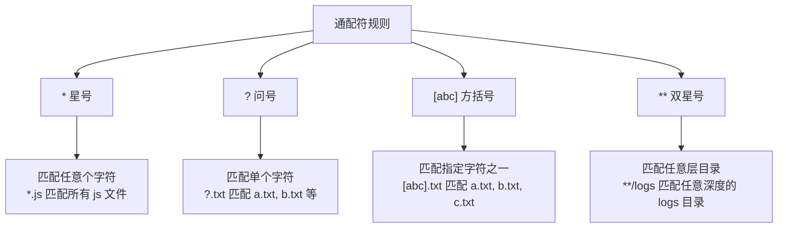
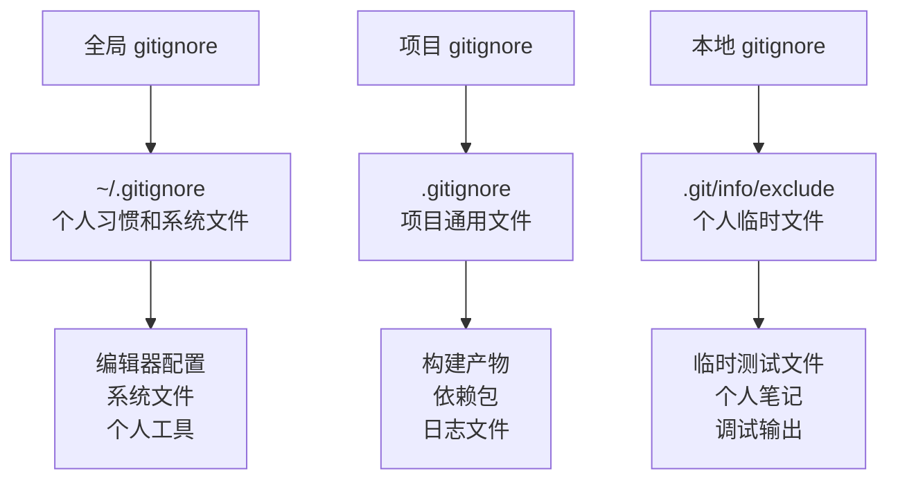

你是不是也有过这样的困扰：打开项目文件夹，密密麻麻的文件让你头晕眼花？测试产生的临时文件、编辑器的备份文件、系统自动生成的缓存文件，还有各种日志文件...每次 `git status` 都显示一大堆"未跟踪的文件"，让你不知道哪些该提交，哪些不该提交。

<!--more-->

想象一下这个场景：你是一名前端开发者，刚完成了一个功能模块，准备提交代码。输入 `git status` 后，屏幕上出现了几十个文件名，包括你刚修改的代码、IDE 自动生成的 `.vscode` 配置、`npm install` 产生的 `node_modules` 文件夹、还有系统生成的 `.DS_Store` 文件...你得仔细筛选，生怕把不该提交的文件误提交了。

这时候，`.gitignore` 就像是你项目的"隐身斗篷"，能够让那些不需要版本控制的文件从 Git 的视野中消失，让你专注于真正重要的代码。

## 什么是 .gitignore？

简单来说，`.gitignore` 是一个特殊的文本文件，它告诉 Git："这些文件我不关心，别理它们。" 

就像整理房间时，你会把重要的东西放在显眼的地方，把杂物收进储物柜一样，`.gitignore` 帮你把项目中的"杂物"藏起来，让重要的代码文件更突出。

## 为什么需要 .gitignore？

### 让项目目录更清爽

没有 `.gitignore` 的项目就像没有垃圾桶的办公室，所有东西都堆在桌面上：

```bash
$ git status
修改尚未暂存以供提交：
  （使用 "git add <文件>..." 更新要提交的内容）
  
未跟踪的文件：
  （使用 "git add <文件>..." 以包含要提交的内容）
        .DS_Store
        .vscode/settings.json
        dist/bundle.js
        dist/bundle.js.map
        node_modules/
        npm-debug.log
        coverage/
        .eslintcache
        temp_backup.js
        TODO.txt
```

有了合适的 `.gitignore` 后：

```bash
$ git status
位于分支 main
无文件要提交，干净的工作区
```

### 避免误提交敏感信息

开发过程中，我们经常会创建包含密码、API 密钥等敏感信息的配置文件。如果没有 `.gitignore`，很容易误提交这些文件，造成安全风险。

### 提高团队协作效率

每个开发者的开发环境不同，使用的编辑器、操作系统也不同。如果没有 `.gitignore`，每次提交都可能包含其他人不需要的文件，造成冲突和混乱。

## .gitignore 的基本规则

### 规则 1：一行一个模式

`.gitignore` 文件的每一行代表一个忽略规则：

```gitignore
# 忽略所有 .log 文件
*.log

# 忽略 temp 目录
temp/

# 忽略 config.json 文件
config.json
```

### 规则 2：支持通配符

Git 使用"glob 模式"（就像简化版的正则表达式）来匹配文件：



### 规则 3：目录和文件的区别

- `temp` - 匹配名为 temp 的文件或目录
- `temp/` - 只匹配名为 temp 的目录

### 规则 4：排除规则（重要！）

使用 `!` 开头可以取消忽略：

```gitignore
# 忽略所有 .log 文件
*.log

# 但是不要忽略 important.log
!important.log
```

### 规则 5：路径相关规则

```gitignore
# 只忽略根目录的 config.json
/config.json

# 忽略任意位置的 config.json
config.json

# 忽略 docs 目录下的所有内容
docs/**
```

## 常见的 .gitignore 模式

### 1. 操作系统生成的文件

每个操作系统都会生成一些系统文件，这些文件对其他开发者毫无意义：

```gitignore
# macOS
.DS_Store
.DS_Store?
._*
.Spotlight-V100
.Trashes

# Windows
Thumbs.db
ehthumbs.db
Desktop.ini

# Linux
*~
```

### 2. 编辑器和 IDE 文件

不同的开发者使用不同的编辑器，这些配置文件不应该共享：

```gitignore
# Visual Studio Code
.vscode/
*.code-workspace

# JetBrains IDEs
.idea/
*.iml

# Vim
*.swp
*.swo

# Emacs
*~
\#*\#
```

### 3. 编程语言特定文件

每种编程语言都有自己的编译产物、依赖包等：

**Node.js 项目：**
```gitignore
# 依赖包
node_modules/

# 构建输出
dist/
build/

# 日志文件
npm-debug.log*
yarn-debug.log*

# 环境变量文件
.env
.env.local
```

**Python 项目：**
```gitignore
# 字节码文件
__pycache__/
*.pyc
*.pyo

# 虚拟环境
venv/
env/
.virtualenv

# 构建产物
build/
dist/
*.egg-info/
```

**Java 项目：**
```gitignore
# 编译产物
*.class
target/

# IDE 文件
.project
.classpath
.settings/

# 日志
*.log
```

## 实战案例：为你的项目定制 .gitignore

### 案例 1：前端项目的困扰

小李是一名前端开发者，他的 React 项目目录是这样的：

```
my-react-app/
├── src/
├── public/
├── node_modules/        # npm 安装的依赖包（几万个文件）
├── build/              # 构建后的文件
├── .env.local          # 本地环境配置（包含 API 密钥）
├── .DS_Store          # macOS 系统文件
├── npm-debug.log      # npm 错误日志
└── coverage/          # 测试覆盖率报告
```

每次 `git status` 都显示成千上万个文件，他需要这样的 `.gitignore`：

```gitignore
# 依赖和构建产物
node_modules/
build/
dist/

# 环境配置文件
.env
.env.local
.env.development.local
.env.test.local
.env.production.local

# 日志文件
npm-debug.log*
yarn-debug.log*
yarn-error.log*

# 测试覆盖率
coverage/

# 系统文件
.DS_Store
Thumbs.db
```

现在 `git status` 只显示他真正修改的源代码文件。

### 案例 2：多环境配置的智能处理

小王的项目有多个环境（开发、测试、生产），配置文件是这样的：

```
config/
├── base.yaml              # 基础配置（需要提交）
├── development.yaml       # 开发环境（需要提交）
├── test.yaml             # 测试环境（需要提交）
├── production.yaml       # 生产环境（需要提交）
├── local.yaml            # 个人本地配置（不应提交）
└── secret.yaml           # 密钥文件（绝对不能提交）
```

他使用了这样的 `.gitignore` 策略：

```gitignore
# 忽略所有个人和敏感配置
config/local.yaml
config/secret.yaml

# 或者更安全的做法：忽略所有 yaml，再排除需要的
# config/*.yaml
# !config/base.yaml
# !config/development.yaml
# !config/test.yaml
# !config/production.yaml
```

### 案例 3：解决团队协作中的文件冲突

小张的团队遇到了这样的问题：每个人都使用不同的编辑器，导致配置文件冲突。团队决定采用这样的策略：

```gitignore
# 编辑器配置文件
.vscode/settings.json      # 个人 VS Code 设置
.idea/workspace.xml        # IntelliJ 个人工作区

# 但保留一些共享的配置
!.vscode/extensions.json   # 推荐的插件列表
!.vscode/launch.json       # 调试配置
!.idea/codeStyles/         # 代码风格配置
```

这样既保护了个人配置的隐私，又能共享团队统一的开发标准。

## 高级技巧：让 .gitignore 更强大

### 技巧 1：使用排除模式精确控制

当你需要忽略某个目录下的大部分文件，但保留少数几个时：

```gitignore
# 忽略整个 logs 目录
logs/*

# 但保留 logs 目录本身和 README
!logs/.gitkeep
!logs/README.md
```

### 技巧 2：处理特殊情况

有时候你需要忽略文件名以 `!` 开头的文件：

```gitignore
# 忽略以感叹号开头的文件（需要转义）
\!important.txt
```

### 技巧 3：使用注释让规则更清晰

```gitignore
# ======================
# 操作系统生成的文件
# ======================
.DS_Store        # macOS 文件夹视图设置
Thumbs.db        # Windows 缩略图缓存

# ======================
# 开发工具
# ======================
.vscode/         # VS Code 配置
.idea/           # JetBrains IDE 配置

# ======================
# 项目特定
# ======================
node_modules/    # npm 依赖包
*.log           # 所有日志文件
```

## 常见陷阱和解决方案

### 陷阱 1：已经被跟踪的文件

如果文件已经被 Git 跟踪了，仅仅添加到 `.gitignore` 是不够的：

```bash
# 错误做法：直接添加到 .gitignore
echo "config.json" >> .gitignore

# 正确做法：先从 Git 中移除，再添加到 .gitignore
git rm --cached config.json
echo "config.json" >> .gitignore
git commit -m "移除配置文件并添加到 gitignore"
```

### 陷阱 2：花括号展开不被支持

这是很多人会犯的错误：

```gitignore
# ❌ 错误：Git 不支持花括号展开
{developing,testing,staging}/config.yaml

# ✅ 正确：逐个列出或使用通配符
developing/config.yaml
testing/config.yaml
staging/config.yaml

# 或者使用更聪明的方法
*/config.yaml
!production/config.yaml
```

### 陷阱 3：排除规则的限制

如果父目录被忽略了，就无法排除其中的文件：

```gitignore
# ❌ 这样不会工作
temp/
!temp/important.txt

# ✅ 正确的做法
temp/*
!temp/important.txt
```

## 团队最佳实践

### 1. 分层管理策略

建议使用三层 `.gitignore` 策略：



### 2. 建立团队规范

在项目 README 中说明 `.gitignore` 策略：

```markdown
## 文件管理规范

### 应该提交的文件
- 源代码文件
- 配置模板（如 config.example.json）
- 文档和说明
- 构建脚本

### 不应该提交的文件
- 个人配置文件
- 构建产物
- 临时文件
- 敏感信息

### 本地开发
请创建 config.local.json 作为个人配置文件（已在 .gitignore 中）
```

### 3. 定期审查和维护

```bash
# 检查是否有应该忽略但未忽略的文件
git status --porcelain | grep '^??'

# 检查 .gitignore 的效果
git check-ignore -v 文件名

# 查看被忽略的文件
git status --ignored
```

## 工具推荐

### 1. 在线生成器

[gitignore.io](https://gitignore.io) 是一个非常好用的在线工具，你只需要输入你的开发环境（如 "Node.js, VSCode, macOS"），它就会生成对应的 `.gitignore` 文件。

### 2. 编辑器插件

- VS Code: "gitignore" 插件
- JetBrains IDEs: 内置 .gitignore 支持
- Vim: vim-gitignore 插件

### 3. 命令行工具

```bash
# 安装 gig（gitignore 生成工具）
npm install -g gitignore

# 生成 Node.js 项目的 gitignore
gig node > .gitignore
```

## 总结

一个好的 `.gitignore` 文件就像一个贴心的助手，它帮你：

- **保持项目整洁**：只关注真正重要的文件
- **避免错误**：防止误提交敏感或无用的文件  
- **提高效率**：让团队协作更顺畅
- **减少冲突**：避免因个人配置文件导致的合并冲突

记住，`.gitignore` 不是一成不变的，随着项目的发展，你可能需要调整忽略规则。定期审查和更新你的 `.gitignore` 文件，让它始终为你的项目服务。

现在就去检查一下你的项目，是不是也需要一个更好的 `.gitignore` 文件呢？

