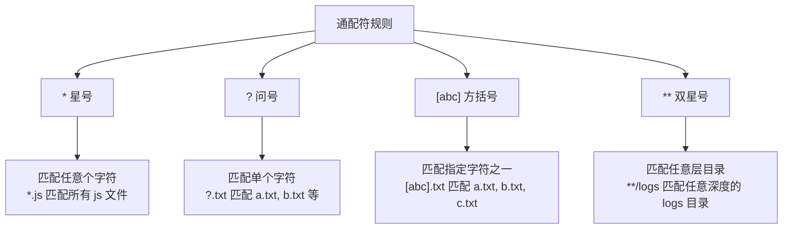
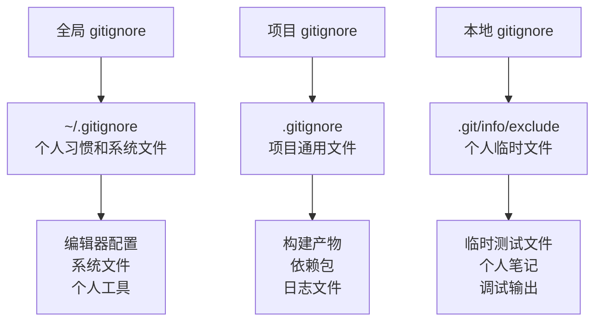

Вы когда-нибудь сталкивались с такой проблемой: открываешь папку с проектом, а от густоты файлов кружится голова? Временные файлы, созданные тестом, резервные файлы редактора, автоматически создаваемые системой кэш-файлы, а также разнообразные лог-файлы... Каждый раз `git status` показывает множество "неотслеживаемых файлов", так что вы не знаете, какие из них следует отправить, а какие нет.

<! -еще-->

Представьте себе такой сценарий: вы фронтенд-разработчик, только что закончили работу над функциональным модулем и готовы его закоммитить. После ввода `git status` на экране появляются десятки имен файлов, включая только что измененный код, автоматически сгенерированную IDE конфигурацию `.vscode`, сгенерированную `npm install`. PROTECTED_INLINE_CODE_30__ папку, и сгенерированный системой `.DS_Store` файл... вам придется просеивать их. Вам придется просмотреть их, чтобы по ошибке не отправить то, что не следовало.

На этом этапе `.gitignore` действует как плащ-невидимка для вашего проекта, удерживая файлы, которые не нужно контролировать по версиям, вне поля зрения Git'а и позволяя вам сосредоточиться на коде, который действительно важен.

## Что такое .gitignore?

Проще говоря, `.gitignore` - это специальный текстовый файл, который говорит Git'у: "Мне нет дела до этих файлов, просто игнорируй их".

Как при наведении порядка в доме вы кладете важные вещи на виду, а беспорядок - в шкафчик, так и `.gitignore` помогает вам скрыть "беспорядок" в вашем проекте и выделить важные файлы кода.

## Зачем мне нужен .gitignore?

### Сделайте каталог проекта чище.

Проект без `.gitignore` похож на офис без мусорного ведра, где все свалено в кучу на рабочем столе:

```bash
$ git status
修改尚未暂存以供提交：
  （使用 "git add <文件>..." 更新要提交的内容）
  
未跟踪的文件：
  （使用 "git add <文件>..." 以包含要提交的内容）
        .DS_Store
        .vscode/settings.json
        dist/bundle.js
        dist/bundle.js.map
        node_modules/
        npm-debug.log
        coverage/
        .eslintcache
        temp_backup.js
        TODO.txt
```.

С правильным `.gitignore`:

```bash
$ git status
位于分支 main
无文件要提交，干净的工作区
```

### Избегайте ошибочного предоставления конфиденциальной информации

В процессе разработки мы часто создаем конфигурационные файлы, содержащие конфиденциальную информацию, например пароли и ключи API. Без `.gitignore` эти файлы легко зафиксировать по ошибке, что создает угрозу безопасности.

### Повышение эффективности командной работы

У каждого разработчика своя среда разработки, он использует разные редакторы и операционные системы. Без `.gitignore` каждый коммит может содержать файлы, которые не нужны другим, что приводит к конфликтам и путанице.

## Основные правила для .gitignore

### Правило 1: Одна строка, один шаблон

Каждая строка файла `.gitignore` представляет собой правило игнорирования:

```gitignore
# 忽略所有 .log 文件
*.log

# 忽略 temp 目录
temp/

# 忽略 config.json 文件
config.json
```

### Правило 2: Поддержка подстановочных знаков

Git использует "шаблоны glob" (как упрощенную версию регулярных выражений) для сопоставления файлов:



### Правило 3: Разница между каталогом и файлом

- `temp` - соответствует файлу или директории с именем temp
- `temp/` - соответствует только директориям с именем temp

### Правило 4: Правила исключения (важно!)

Используйте `!` в начале, чтобы снять запрет:

```gitignore
# 忽略所有 .log 文件
*.log

# 但是不要忽略 important.log
!important.log
```

### Правило 5: Правила, связанные с путями

```gitignore
# 只忽略根目录的 config.json
/config.json

# 忽略任意位置的 config.json
config.json

# 忽略 docs 目录下的所有内容
docs/**
```

## Общие шаблоны .gitignore

### 1. Файлы, созданные ОС

Каждая операционная система генерирует системные файлы, которые не имеют смысла для других разработчиков:

```gitignore
# macOS
.DS_Store
.DS_Store?
._*
.Spotlight-V100
.Trashes

# Windows
Thumbs.db
ehthumbs.db
Desktop.ini

# Linux
*~
```.

### 2. Файлы редактора и IDE

Разные разработчики используют разные редакторы, и эти конфигурационные файлы не должны быть общими:

```gitignore
# Visual Studio Code
.vscode/
*.code-workspace

# JetBrains IDEs
.idea/
*.iml

# Vim
*.swp
*.swo

# Emacs
*~
\#*\#
```

### 3. Файлы, специфичные для языка программирования

Каждый язык программирования имеет свои собственные продукты компиляции, пакеты зависимостей и так далее:

**Проект Node.js: **.
```gitignore
# 依赖包
node_modules/

# 构建输出
dist/
build/

# 日志文件
npm-debug.log*
yarn-debug.log*

# 环境变量文件
.env
.env.local
```.

**Проект Python:** ```gitignore
# 依赖包
node_modules/

# 构建输出
dist/
build/

# 日志文件
npm-debug.log*
yarn-debug.log*

# 环境变量文件
.env
.env.local
```.
```gitignore
# 字节码文件
__pycache__/
*.pyc
*.pyo

# 虚拟环境
venv/
env/
.virtualenv

# 构建产物
build/
dist/
*.egg-info/
```

**Java-проект:** ```gitignore
# 依赖包
node_modules/

# 构建输出
dist/
build/

# 日志文件
npm-debug.log*
yarn-debug.log*

# 环境变量文件
.env
.env.local
``` **Python-проект.
```gitignore
# 编译产物
*.class
target/

# IDE 文件
.project
.classpath
.settings/

# 日志
*.log
```

## Практический пример: настройка .gitignore для вашего проекта

### Пример 1: Устранение неполадок во внешнем проекте

Ли - фронтенд-разработчик, и каталог его проекта React выглядит следующим образом:

```
my-react-app/
├── src/
├── public/
├── node_modules/        # npm 安装的依赖包（几万个文件）
├── build/              # 构建后的文件
├── .env.local          # 本地环境配置（包含 API 密钥）
├── .DS_Store          # macOS 系统文件
├── npm-debug.log      # npm 错误日志
└── coverage/          # 测试覆盖率报告
```.

Каждый раз, когда `git status` показывает тысячи файлов, ему нужен этот `.gitignore`:

```gitignore
# 依赖和构建产物
node_modules/
build/
dist/

# 环境配置文件
.env
.env.local
.env.development.local
.env.test.local
.env.production.local

# 日志文件
npm-debug.log*
yarn-debug.log*
yarn-error.log*

# 测试覆盖率
coverage/

# 系统文件
.DS_Store
Thumbs.db
```.

Теперь `git status` показывает только те исходные файлы, которые он действительно изменил.

### Пример 2: Интеллектуальная обработка нескольких конфигураций окружения

Проект Сяо Ванга имеет несколько окружений (разработка, тестирование, производство), и файл конфигурации выглядит следующим образом:

```
config/
├── base.yaml              # 基础配置（需要提交）
├── development.yaml       # 开发环境（需要提交）
├── test.yaml             # 测试环境（需要提交）
├── production.yaml       # 生产环境（需要提交）
├── local.yaml            # 个人本地配置（不应提交）
└── secret.yaml           # 密钥文件（绝对不能提交）
```

Он использует политику `.gitignore` следующим образом:

```gitignore
# 忽略所有个人和敏感配置
config/local.yaml
config/secret.yaml

# 或者更安全的做法：忽略所有 yaml，再排除需要的
# config/*.yaml
# !config/base.yaml
# !config/development.yaml
# !config/test.yaml
# !config/production.yaml
```

### Пример 3: Разрешение конфликтов файлов при совместной работе в команде

Команда Сяо Чжана столкнулась с проблемой, что все используют разные редакторы, что приводит к конфликтам конфигурационных файлов. Команда решает применить следующую стратегию:

```gitignore
# 编辑器配置文件
.vscode/settings.json      # 个人 VS Code 设置
.idea/workspace.xml        # IntelliJ 个人工作区

# 但保留一些共享的配置
!.vscode/extensions.json   # 推荐的插件列表
!.vscode/launch.json       # 调试配置
!.idea/codeStyles/         # 代码风格配置
```

Это защищает конфиденциальность индивидуальных конфигураций и одновременно разделяет единые стандарты разработки команды.

## Продвинутые советы: делаем .gitignore более мощным

### Совет ### Совет 1: Используйте режим исключения для точного контроля над

Когда вам нужно проигнорировать большинство файлов в каталоге, но оставить несколько:

```gitignore
# 忽略整个 logs 目录
logs/*

# 但保留 logs 目录本身和 README
!logs/.gitkeep
!logs/README.md
```.

### Совет 2: Работа с особыми случаями

Иногда вам нужно игнорировать файлы, имена которых начинаются с `!`:

```gitignore
# 忽略以感叹号开头的文件（需要转义）
\!important.txt
```

### Совет 3: Используйте комментарии, чтобы сделать правила более понятными

```gitignore
# ======================
# 操作系统生成的文件
# ======================
.DS_Store        # macOS 文件夹视图设置
Thumbs.db        # Windows 缩略图缓存

# ======================
# 开发工具
# ======================
.vscode/         # VS Code 配置
.idea/           # JetBrains IDE 配置

# ======================
# 项目特定
# ======================
node_modules/    # npm 依赖包
*.log           # 所有日志文件
```

### Распространенные подводные камни и решения

### Ловушка 1: Файлы, которые уже отслеживаются

Если файл уже отслеживается Git'ом, простого добавления в `.gitignore` недостаточно:

```bash
# 错误做法：直接添加到 .gitignore
echo "config.json" >> .gitignore

# 正确做法：先从 Git 中移除，再添加到 .gitignore
git rm --cached config.json
echo "config.json" >> .gitignore
git commit -m "移除配置文件并添加到 gitignore"
```

### Ловушка 2: Расширение скобок не поддерживается

Это ошибка, которую допускают многие:

```gitignore
# ❌ 错误：Git 不支持花括号展开
{developing,testing,staging}/config.yaml

# ✅ 正确：逐个列出或使用通配符
developing/config.yaml
testing/config.yaml
staging/config.yaml

# 或者使用更聪明的方法
*/config.yaml
!production/config.yaml
```.

### Ловушка 3: Ограничения правил исключения

Если родительский каталог игнорируется, исключить файлы в нем невозможно:

```gitignore
# ❌ 这样不会工作
temp/
!temp/important.txt

# ✅ 正确的做法
temp/*
!temp/important.txt
```.

## Лучшие практики команды

### 1. Иерархическая стратегия управления

Рекомендуется использовать трехуровневую политику `.gitignore`:



### 2. Установите командные нормы

Опишите политику `.gitignore` в README проекта:

```markdown
## 文件管理规范

### 应该提交的文件
- 源代码文件
- 配置模板（如 config.example.json）
- 文档和说明
- 构建脚本

### 不应该提交的文件
- 个人配置文件
- 构建产物
- 临时文件
- 敏感信息

### 本地开发
请创建 config.local.json 作为个人配置文件（已在 .gitignore 中）
```

### 3. Периодический обзор и обслуживание

```bash
# 检查是否有应该忽略但未忽略的文件
git status --porcelain | grep '^??'

# 检查 .gitignore 的效果
git check-ignore -v 文件名

# 查看被忽略的文件
git status --ignored
```

### Рекомендации по использованию инструментов

### 1. Онлайн-генератор

[gitignore.io](https://gitignore.io) - очень полезный онлайн-инструмент, вам просто нужно ввести вашу среду разработки (например, "Node.js, VSCode, macOS"), и он сгенерирует соответствующий `.gitignore` файл .

### 2. Плагины для редактора

- VS Code: плагин "gitignore"
- JetBrains IDEs: встроенная поддержка .gitignore
- Vim: плагин vim-gitignore

### 3. Инструменты командной строки

```bash
# 安装 gig（gitignore 生成工具）
npm install -g gitignore

# 生成 Node.js 项目的 gitignore
gig node > .gitignore
```

## Резюме

Хороший файл `.gitignore` - это как заботливый помощник, он помогает вам:

- **Сохранить проект в порядке**: сосредоточиться только на тех файлах, которые действительно важны!
- **Избежать ошибок**: предотвратить ошибочную отправку важных или бесполезных файлов
- **Повысить эффективность**: сделать совместную работу более плавной
- **Снизить количество конфликтов**: избежать конфликтов при слиянии, вызванных личными профилями

Помните, что `.gitignore` не является чем-то неизменным, и вам может понадобиться скорректировать правило игнорирования по мере развития вашего проекта. Регулярно просматривайте и обновляйте файл `.gitignore`, чтобы он всегда работал для вашего проекта.

Проверьте свой проект сейчас, нужен ли ему лучший файл `.gitignore`?

