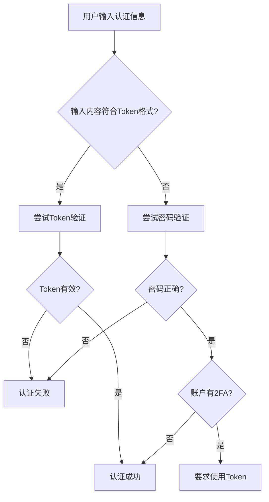

如果你刚开始接触软件开发，可能会遇到这样的困惑：为什么有时候用密码能登录，有时候却需要什么"Token"？为什么Git操作时明明输入了正确的密码，系统却说"访问被拒绝"？今天我们通过一个真实的GitLab登录问题，来深入理解现代软件开发中的认证机制。

<!--more-->

## 故事从一个报错开始

想象一下，你是一名会计，刚刚加入一家技术公司，需要使用公司的GitLab来管理一些数据文件。你按照IT部门给的密码登录了GitLab网站，一切正常。但当你尝试用Git命令下载文件时，却遇到了这样的错误：

```
remote: HTTP Basic: Access denied. The provided password or token is incorrect 
or your account has 2FA enabled and you must use a personal access token 
instead of a password.
```

这个错误信息里提到了两个关键概念：**密码（password）**和**令牌（token）**。作为新手，你可能会问：这两者有什么区别？为什么有时候需要用Token而不是密码？

## 从日常生活理解认证机制

### 密码：你的身份证

密码就像你的身份证号码，它代表"你是谁"。当你在银行柜台办事时，工作人员会要求你出示身份证来验证身份。同样，当你登录一个网站时，系统通过验证用户名和密码来确认"你就是这个账户的主人"。

密码的特点：
- **唯一性**：一个账户只有一个登录密码
- **全权限**：密码验证通过后，你拥有账户的所有权限
- **风险性**：密码泄露意味着账户完全失控

### Token：你的特殊通行证

Token（令牌）更像是一张**特殊用途的通行证**。想象一下，你是一家大公司的员工：

- 你有一张**门禁卡**可以进入办公楼
- 你有一张**打印卡**可以使用打印机
- 你有一张**餐卡**可以在食堂消费
- 你有一张**图书卡**可以借阅资料

每张卡都有不同的权限和用途，而且你可以同时拥有多张卡。更重要的是，如果某张卡丢失了，你可以单独注销它，而不影响其他卡的使用。

## GitLab中的Personal Access Token

在GitLab这样的代码管理平台中，Personal Access Token（个人访问令牌）就是这样的"特殊通行证"。

### 为什么需要Token？

让我们回到最初的问题。当系统提示"must use a personal access token instead of a password"时，通常有以下原因：

1. **增强安全性**：密码用于登录网页，Token用于程序访问
2. **权限控制**：可以为不同用途创建不同权限的Token
3. **两步验证**：当账户启用2FA（双因子认证）时，命令行工具无法处理短信验证码，必须使用Token

### Token的权限范围

在GitLab中创建Token时，你会看到各种权限选项：

- **read_repository**：读取代码仓库（相当于"只能看，不能改"的图书卡）
- **write_repository**：修改代码仓库（相当于"可以编辑"的编辑卡）
- **api**：完整API访问（相当于"万能卡"，权限最大）

这种设计遵循了**最小权限原则**：只给程序它需要的最小权限，降低安全风险。

## 系统如何区分密码和Token？

这里有个有趣的技术细节：当你在Git命令行中输入"密码"时，GitLab是如何知道你输入的是真密码还是Token呢？

答案是**智能识别**。系统的判断逻辑大致是这样的：



Personal Access Token通常有特定的长度和格式，系统可以通过这些特征快速判断输入的是密码还是Token，然后采用相应的验证流程。

## 一个有趣的边缘情况

这里有个有趣的思考：如果有用户把自己的Token当作新密码设置会怎样？

由于系统会优先尝试Token验证，这个用户实际上仍然能够"登录"成功，但他使用的是Token认证而不是密码认证。这种情况虽然罕见，但体现了系统设计的巧妙之处——它实现了向后兼容，让用户在不改变使用习惯的情况下享受更安全的认证机制。

当然，负责任的系统设计通常会包含防护措施，阻止用户将Token格式的字符串设置为密码。

## 实际应用场景

### 开发环境中的Token使用

作为开发新手，你会在以下场景中遇到Token：

1. **Git操作**：clone、push、pull等命令行操作
2. **CI/CD流水线**：自动化部署和测试需要程序访问代码
3. **第三方工具**：IDE插件、代码质量检查工具等
4. **API调用**：编写脚本批量处理项目数据

### Token的安全最佳实践

1. **最小权限**：只给Token它需要的最小权限
2. **定期更新**：设置合理的过期时间，定期更换Token
3. **安全存储**：使用密码管理器（如KeePass）加密保存
4. **监控使用**：定期检查Token的使用记录，发现异常及时处理

## 从内网SSH说起：网络限制的现实

在我们的实际案例中，还遇到了另一个常见问题：内网环境的限制。

很多公司出于安全考虑，会在网络层面限制SSH连接（22端口），只允许HTTPS方式的Git操作。这时候Personal Access Token就成了唯一的解决方案。

我们可以通过简单的网络测试来检查SSH连通性：

```bash
# 测试SSH端口连通性
nc -zv gitlab.example.com 22

# 如果超时，说明SSH被阻止
# 这时只能使用HTTPS + Token的方式
```

## 认证机制的发展趋势

从密码到Token，再到现在的生物识别、硬件密钥等，认证机制在不断演进。理解这些基础概念，有助于我们：

1. **提高安全意识**：知道什么时候该用什么认证方式
2. **解决实际问题**：遇到认证问题时能快速定位原因
3. **跟上技术发展**：为学习更高级的安全概念打下基础

## 总结

通过这次GitLab登录问题的探索，我们学到了：

- **密码和Token的本质区别**：身份证vs特殊通行证
- **Token的优势**：权限控制、安全性、灵活性
- **系统的智能识别机制**：如何区分密码和Token
- **实际应用中的考虑**：网络限制、安全策略等

当你下次遇到类似的认证问题时，记住这个思维框架：先理解系统要求什么类型的认证，再根据具体场景选择合适的认证方式。

在软件开发的世界里，认证机制是保护数据安全的第一道防线。掌握这些基础概念，不仅能帮你解决眼前的问题，更重要的是为你在技术道路上的进一步学习奠定坚实基础。

---

*下次当你看到"access denied"的错误时，不要慌张。检查一下是不是需要用Token代替密码，或者权限设置是否正确。记住：每个错误都是学习的机会。*
