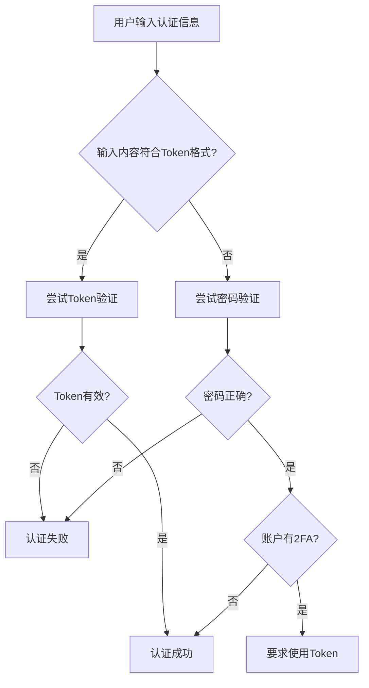

Если вы только начинаете заниматься разработкой программного обеспечения, то наверняка сталкивались с подобной путаницей: почему вы можете войти в систему с помощью пароля, а иногда вам нужен "токен"? Почему система говорит "доступ запрещен", когда вы вводите правильный пароль для Git? Сегодня мы рассмотрим реальную проблему входа в GitLab, чтобы понять механизм аутентификации в современной разработке программного обеспечения.

<!--more-->

## 故事从一个报错开始

Представьте, что вы бухгалтер, только что пришедший в технологическую компанию, и вам нужно использовать GitLab компании для работы с некоторыми файлами данных. Вы входите на сайт GitLab с паролем, выданным вам ИТ-отделом, и все работает нормально. Но когда вы пытаетесь загрузить файл с помощью команды Git, вы сталкиваетесь с этой ошибкой:

```
remote: HTTP Basic: Access denied. The provided password or token is incorrect 
or your account has 2FA enabled and you must use a personal access token 
instead of a password.
```

В этом сообщении об ошибке упоминаются два ключевых понятия: **пароль** и **токен**. Как новичок, вы можете спросить: в чем разница между ними? Почему иногда необходимо использовать токен вместо пароля?

## 从日常生活理解认证机制

### 密码：你的身份证

Пароль - это как ваш идентификационный номер, он обозначает "кто вы". Когда вы работаете в банке, сотрудники попросят вас предъявить удостоверение личности, чтобы подтвердить вашу личность. Точно так же, когда вы входите на веб-сайт, система проверяет, что "вы являетесь владельцем этой учетной записи", проверяя имя пользователя и пароль.

Характеристики пароля:
- **Уникальность**: существует только один пароль для входа в аккаунт
- **Полный доступ**: после проверки пароля вы получаете полный доступ к учетной записи
- **Рискованность**: взломанный пароль означает полную невозможность контроля над учетной записью.

### Token：你的特殊通行证

Токен больше похож на **пропуск специального назначения**. Представьте, что вы - сотрудник крупной компании:

- У вас есть **карточка доступа**, чтобы войти в офисное здание.
- У вас есть **карточка для печати**, чтобы пользоваться принтером.
- У вас есть **карточка на питание**, чтобы пользоваться столовой.
- У вас есть **библиотечный билет**, чтобы брать материалы.

У каждой карты свои полномочия и способы использования, и вы можете иметь несколько карт одновременно. Более того, если карта утеряна, вы можете отменить ее по отдельности, не затрагивая другие карты.

## GitLab中的Personal Access Token

В такой платформе управления кодом, как GitLab, персональный токен доступа является одним из таких "специальных пропусков".

### 为什么需要Token？

Давайте вернемся к первоначальному вопросу. Когда система предлагает "использовать персональный токен доступа вместо пароля", обычно это происходит по следующим причинам:

1. **Усиленная безопасность**: для входа на веб-страницу используются пароли, а для программного доступа - токены.
2. **Управление разрешениями**: токен можно создать с различными разрешениями для разных целей.
3. **Двухэтапная аутентификация**: когда для учетной записи включена двухфакторная аутентификация (2FA), инструмент командной строки не может обрабатывать SMS CAPTCHA и должен использовать токен.

### Token的权限范围

При создании токена в GitLab вы увидите различные варианты разрешений:

- **read_repository**: чтение репозитория кода (эквивалентно библиотечной карточке "можно только читать, изменять нельзя")
- **write_repository**: изменение репозитория (эквивалентно карточке редактора "можно редактировать")
- **api**: полный доступ к API (эквивалентно "дикой карте", с максимальными привилегиями).

Этот дизайн соответствует принципу **Least Privilege Principle**: предоставляйте программе только минимальные привилегии, которые ей необходимы, снижая риски безопасности.

## 系统如何区分密码和Token？

Вот интересная техническая деталь: когда вы вводите "password" в командной строке Git, как GitLab узнает, вводите ли вы настоящий пароль или токен?

Ответ - **интеллектуальное распознавание**. Логика суждений системы выглядит примерно так:



Персональный токен доступа обычно имеет определенную длину и формат, система может использовать эти характеристики, чтобы быстро определить, является ли вводимый пароль или токен, а затем использовать соответствующий процесс аутентификации.

## 一个有趣的边缘情况

Вот интересная мысль: что произойдет, если пользователь установит свой токен в качестве нового пароля?

Поскольку система предпочитает использовать аутентификацию по токену, пользователь все еще может "войти в систему", но он использует аутентификацию по токену вместо аутентификации по паролю. Это редкий случай, но он показывает продуманность дизайна системы - она обратно совместима, позволяя пользователям пользоваться более безопасным механизмом аутентификации, не меняя своих привычек.

Разумеется, ответственное проектирование системы обычно предусматривает меры предосторожности, чтобы пользователи не могли задать строку в формате Token в качестве пароля.

## 实际应用场景

### 开发环境中的Token使用

Будучи начинающим разработчиком, вы столкнетесь с Token в следующих сценариях:

1. **Git-операции**: клонирование, push, pull и другие операции командной строки
2. **CI/CD pipeline**: автоматизированное развертывание и тестирование требует программного доступа к коду
3. **Сторонние инструменты**: плагины для IDE, инструменты проверки качества кода и т. д.
4. **Вызовы API**: сценарии пакетной обработки данных проекта

### Token的安全最佳实践

1. **Минимальные привилегии**: Предоставьте токену только минимальные привилегии, которые ему необходимы.
2. **Периодическое обновление**: установите разумное время истечения срока действия, чтобы периодически менять токен.
3. **Защищенное хранение**: используйте менеджер паролей (например, KeePass) для шифрования и хранения Токена.
4. **Мониторинг использования**: регулярно проверяйте запись использования Токена и вовремя устраняйте любые отклонения от нормы.

## 从内网SSH说起：网络限制的现实

В реальной жизни мы столкнулись с еще одной распространенной проблемой: ограничениями среды интрасети.

Многие компании ограничивают SSH-соединения (порт 22) на сетевом уровне из соображений безопасности и разрешают только HTTPS Git-операции. В этом случае персональный токен доступа становится единственным решением.

Мы можем проверить подключение к SSH с помощью простого сетевого теста:

```bash
# 测试SSH端口连通性
nc -zv gitlab.example.com 22

# 如果超时，说明SSH被阻止
# 这时只能使用HTTPS + Token的方式
```

## 认证机制的发展趋势

Механизмы аутентификации постоянно развиваются: от паролей до токенов, а теперь еще и биометрии, аппаратных ключей и так далее. Понимание этих фундаментальных концепций поможет нам:

1. **Улучшение осведомленности о безопасности**: знать, когда следует использовать тот или иной метод аутентификации
2. **Решать практические проблемы**: быстро определять причину проблем с аутентификацией в случае их возникновения
3. **Следить за развитием технологий**: заложить основу для изучения более продвинутых концепций безопасности

## 总结

В ходе этого исследования мы узнали о проблемах входа в GitLab:

- **Основное различие между паролем и токеном**: ID-карта против специальных пропусков
- **Преимущества токена**: контроль полномочий, безопасность, гибкость
- **Интеллектуальный механизм идентификации системы**: как отличить пароль от токена
- **Вопросы практического применения**: сетевые ограничения, политика безопасности и т. д.

Когда вы в следующий раз столкнетесь с подобной проблемой аутентификации, помните о следующем: сначала поймите, какой тип аутентификации требуется системе, а затем выберите подходящий метод аутентификации для конкретного сценария.

В мире разработки программного обеспечения механизмы аутентификации являются первой линией обороны в обеспечении безопасности данных. Освоение этих базовых понятий не только поможет вам решить насущные проблемы, но и, что более важно, заложит прочный фундамент для дальнейшего обучения на технологическом пути.

---

*Когда в следующий раз вы увидите ошибку "доступ запрещен", не паникуйте. Проверьте, не нужно ли использовать токен вместо пароля, или правильно ли установлены разрешения. Помните: каждая ошибка - это возможность научиться. *