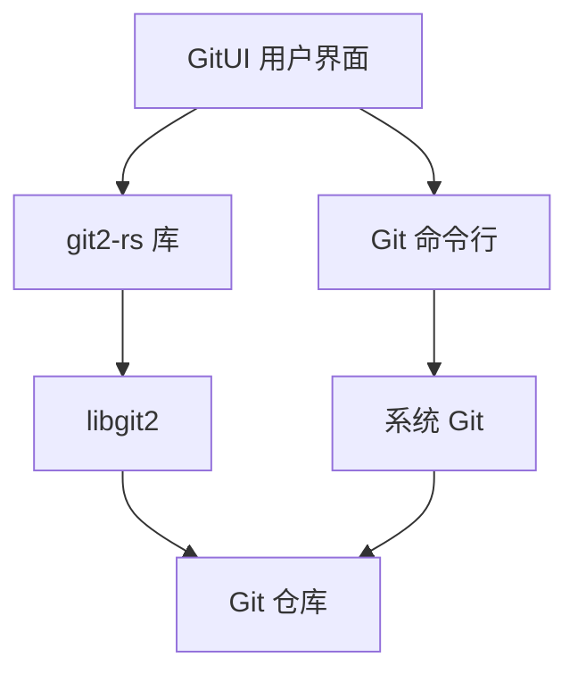
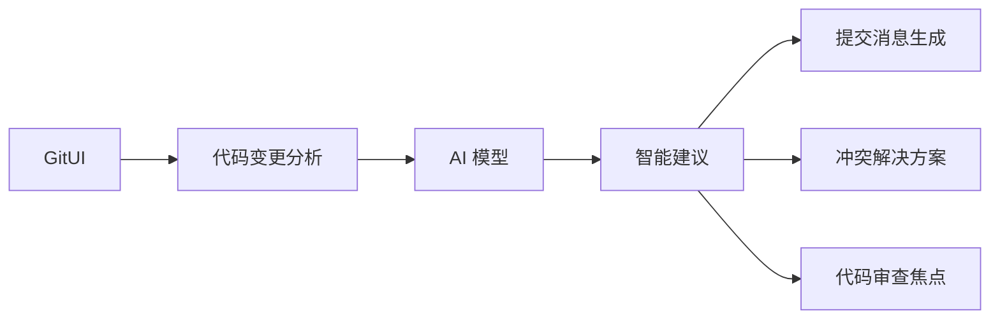

在现代软件开发流程中，版本控制已经成为不可或缺的一环，而 Git 作为最流行的版本控制系统，其操作的效率直接影响着开发者的工作体验。GitUI 作为一款基于终端的 Git 客户端，以其惊人的性能和友好的用户界面，正在改变开发者与 Git 交互的方式。

<!--more-->

## 引言

在代码仓库越来越大、版本历史越来越复杂的今天，传统的 Git 命令行操作对开发者提出了较高的记忆和使用门槛，而图形化 Git 客户端虽然直观，却往往在处理大型仓库时表现不佳。GitUI 的出现，为开发者提供了一种兼具命令行效率和图形界面直观性的新选择。

## GitUI 的技术架构

### Rust: 性能与安全的基石

GitUI 使用 Rust 语言开发，这是一门注重性能和内存安全的系统级编程语言。Rust 的零成本抽象、所有权系统和严格的类型检查，使 GitUI 在保持高性能的同时，几乎不会出现运行时崩溃或内存泄漏等问题。

Rust 的特性使 GitUI 能够处理大型仓库而不会卡顿，比如在处理 Linux 内核这样拥有超过 90 万次提交历史的巨型项目时，GitUI 仍然能够保持流畅的操作体验。

### 与 Git 的交互方式

GitUI 主要通过两种方式与 Git 交互：

1. **git2-rs 库**：这是 libgit2 的 Rust 绑定，提供了与 Git 仓库交互的高级接口。libgit2 是一个纯 C 语言实现的可移植、无依赖的 Git 核心功能库，专为被其他应用程序嵌入而设计。

2. **直接调用 Git 命令**：对于某些复杂操作，GitUI 会直接调用系统中安装的 Git 命令行工具，这确保了与标准 Git 工具链的完全兼容性。



### 异步架构与响应式 UI

GitUI 采用异步编程模型，将 UI 渲染与后台 Git 操作分离，确保即使在执行耗时操作时，界面依然保持响应。这种设计在处理大型仓库或复杂操作时尤为重要。

```rust
// GitUI 异步操作示例代码（简化版）
async fn fetch_commits(repo: &Repository) -> Result<Vec<Commit>> {
    // 在后台线程中执行耗时操作
    let commits = task::spawn_blocking(move || {
        // 查询 Git 仓库的提交历史
        repo.get_commits(100)
    }).await?;
    
    Ok(commits)
}
```

## 用户界面设计

### TUI（Terminal User Interface）架构

GitUI 使用 [tui-rs](https://github.com/fdehau/tui-rs)（现已更名为 ratatui）库构建其终端用户界面。这个库提供了丰富的组件和布局系统，使 GitUI 能够创建接近 GUI 应用的交互体验，同时保持终端应用的轻量特性。

界面分为几个主要组件：

1. **状态视图**：显示工作目录中的更改
2. **日志视图**：浏览提交历史
3. **分支视图**：管理分支
4. **差异视图**：查看文件的详细变更

### 上下文相关的帮助系统

GitUI 的一个重要设计理念是"无需记忆"。每个界面都会显示当前可用的操作和快捷键，使用户能够直观地了解可执行的操作，降低学习曲线。

### 键盘驱动的操作流

GitUI 完全通过键盘操作，为熟悉命令行的开发者提供了高效的工作流。默认键位设计考虑了人体工程学，同时也支持自定义键位映射，包括 Vim 风格的键位。

```ron
// key_bindings.ron 配置示例
(
    move_left: Some(( code: Char('h'), modifiers: "")),
    move_right: Some(( code: Char('l'), modifiers: "")),
    move_up: Some(( code: Char('k'), modifiers: "")),
    move_down: Some(( code: Char('j'), modifiers: "")),
    
    // 更多键位配置...
    commit: Some(( code: Enter, modifiers: "ALT")),
)
```

## 性能对比与技术优势

### 对比其他 Git 客户端

根据 GitUI 开发者的基准测试，在解析 Linux 内核 Git 历史这样的任务上，GitUI 与其他终端 Git 客户端相比展现出明显的性能优势：

| 工具 | 解析时间 | 内存使用 (GB) | 二进制大小 (MB) | 是否卡顿 | 是否崩溃 |
|------|----------|---------------|----------------|----------|----------|
| GitUI | 24 秒 | 0.17 | 10 | 否 | 否 |
| Lazygit | 57 秒 | 2.6 | 25 | 是 | 偶尔 |
| Tig | 4 分 20 秒 | 1.3 | 0.6 | 偶尔 | 否 |

这种显著的性能差异主要得益于 Rust 语言的高效内存管理和 GitUI 的优化设计。

### 内存效率与安全性

Rust 的所有权系统确保了 GitUI 的内存使用高效且安全，没有垃圾收集带来的性能波动。在内存效率方面：

1. **零拷贝设计**：尽可能减少数据复制
2. **精确内存控制**：只分配必要的内存空间
3. **确定性资源释放**：不依赖垃圾收集器，资源使用完毕即释放

### 跨平台兼容性

GitUI 支持所有主流操作系统：

- **Linux**：各种发行版包括 Arch、Fedora、Ubuntu 等
- **macOS**：通过 Homebrew 或二进制安装
- **Windows**：支持 Winget、Scoop 或 Chocolatey 安装

这种广泛的平台支持使开发者可以在不同环境中保持一致的工作流程。

## 已知限制和注意事项

尽管 GitUI 提供了出色的用户体验，但有一些值得注意的限制：

### SSH 配置和凭证问题

GitUI 使用 libgit2 库，目前在处理某些 SSH 配置时可能会遇到困难。特别是：

- **SSH 主机密钥验证**：可能会出现 "invalid or unknown remote ssh hostkey" 错误
- **自定义 SSH 配置**：`~/.ssh/config` 中的设置可能不被完全识别
- **特殊认证方式**：某些非标准的 SSH 认证机制可能不受支持

此问题已在 GitUI 的 [issue #2096](https://github.com/gitui-org/gitui/issues/2096) 中被确认，主要是因为底层的 libgit2 库尚未完全支持所有 OpenSSH 功能。

**临时解决方案**：
- 在 GitUI 中执行大部分操作，但使用命令行 Git 进行推送
- 尝试使用 HTTPS 而非 SSH URL（如果可行）
- 明确配置 credential.helper

```bash
# 在 .gitconfig 中
[credential]
    helper = store
```

### 其他限制

GitUI 也有一些其他已知限制：

- 不支持稀疏仓库（sparse repository）
- 不支持 Git LFS
- 对于 HTTPS 凭证需要显式配置 credential.helper

## 高级使用技巧

### 自定义与配置

GitUI 提供了全面的配置选项，包括：

#### 键位绑定

通过编辑 `~/.config/gitui/key_bindings.ron`（或相应平台的配置路径）自定义键位：

```ron
// 将提交操作绑定到 Alt+Enter
commit: Some(( code: Enter, modifiers: "ALT")),
```

#### 主题定制

GitUI 支持完全自定义的颜色主题，通过编辑 `theme.ron` 文件：

```ron
(
    selected_bg: Some(Blue),
    command_fg: Some(White),
    // 更多颜色配置...
)
```

#### 外部编辑器集成

GitUI 会尊重系统的 `GIT_EDITOR`、`VISUAL` 或 `EDITOR` 环境变量，也可在配置中指定：

```ron
(
    editor: Some("nvim"),
)
```

### 高级 Git 操作

GitUI 不仅支持基本的 Git 操作，还支持许多高级功能：

1. **交互式暂存**：选择性地暂存文件的特定部分
2. **提交修改**：支持 amend 操作修改最近的提交
3. **储藏操作**：完整的 stash 管理功能
4. **子模块支持**：管理 Git 子模块
5. **签名提交**：支持 GPG 签名提交（有一些限制）

这些高级功能使 GitUI 成为一个全功能的 Git 客户端，适合各种复杂的工作流程。

## 扩展与集成

### 与现有工具链的集成

GitUI 设计为与现有 Git 工具链和工作流程无缝协作：

1. **尊重 Git 配置**：使用与标准 Git 相同的配置文件和环境变量
2. **钩子兼容性**：完全支持 Git 钩子，包括 pre-commit、commit-msg 等
3. **凭证存储集成**：与系统凭证管理器协作

### 扩展性思考

虽然 GitUI 本身不是一个可扩展的框架，但其开源性质意味着开发者可以：

1. **贡献功能**：直接向项目贡献新功能
2. **定制构建**：为特定需求构建自定义版本
3. **学习资源**：作为学习 Rust TUI 应用开发的优秀案例

## 使用 GitUI 的实际场景

### 场景一：大型代码库管理

对于工作在 Linux 内核或其他大型代码库的开发者，GitUI 的高性能特性尤为重要：

```bash
# 在 Linux 内核仓库中启动 GitUI
cd linux
gitui
```

即使面对数十万次提交和数万个文件，GitUI 依然能够保持流畅的操作体验。

### 场景二：服务器远程管理

对于需要通过 SSH 管理远程服务器上代码的开发者，GitUI 的终端界面非常适合：

```bash
ssh user@server
cd /path/to/repo
gitui
```

不需要 X 转发或图形界面，即可获得直观的 Git 仓库可视化和管理体验。

### 场景三：CI/CD 流水线调试

在调试持续集成环境的 Git 相关问题时，GitUI 提供了清晰的仓库状态视图：

```bash
# 在 CI 环境中检查仓库状态
cd $WORKSPACE
gitui
```

这使开发者能够快速识别并解决与 Git 相关的 CI 问题。

## 未来展望与 AI 应用前景

### GitUI 的发展路线

根据 GitUI 项目的路线图，未来计划的主要功能包括：

1. **可视化分支结构**：在日志视图中展示分支关系
2. **交互式变基**：提供友好的交互式 rebase 界面
3. **更多自定义选项**：增强配置和扩展能力
4. **改进 SSH 支持**：一旦底层 libgit2 库增强其 SSH 功能，GitUI 也将受益

### AI 辅助版本控制的潜力

将 GitUI 与新兴的 AI 技术结合，有很多令人兴奋的可能性：

1. **智能提交消息生成**：基于变更内容自动生成高质量的提交消息
2. **变更模式识别**：识别常见的代码修改模式，提供相关建议
3. **冲突解决辅助**：智能分析并建议合并冲突的最佳解决方案
4. **代码审查增强**：突出显示潜在问题区域，辅助代码审查



这种集成可以大大提高开发工作流程的效率，减少人为错误，并使版本控制过程更加智能化。

## 结论

GitUI 代表了开发工具的一个重要趋势：结合现代编程语言的优势，为经典的开发任务提供更高效、更友好的体验。通过 Rust 语言的性能和安全保证，加上精心设计的用户界面，GitUI 成功地解决了传统 Git 客户端的许多痛点。

尽管存在一些限制，特别是在 SSH 处理方面，但 GitUI 的优势仍然非常明显。随着项目的持续发展和底层库的改进，这些问题有望得到解决。

对于那些追求效率的开发者来说，GitUI 不仅是一个工具，更是一种全新的工作理念：在命令行环境中，也可以拥有直观、高效且愉悦的用户体验。结合适当的工作流调整，如在需要时切换到命令行 Git 进行推送操作，GitUI 可以显著提升开发效率和体验。

## 实践建议

想要深入体验 GitUI 的强大功能，以下是一些实践建议：

1. **先熟悉基本操作**：从简单的状态查看、文件暂存和提交开始
2. **逐步探索高级功能**：随着熟练度提高，尝试更复杂的操作如分支管理和交互式暂存
3. **定制个人配置**：调整键位和主题以符合个人习惯
4. **结合现有工作流**：针对已知限制，制定混合工作流，例如在 GitUI 中进行大部分操作，但在命令行中执行推送
5. **关注项目发展**：随着 GitUI 和 libgit2 的进步，某些当前的限制可能会在未来版本中解决

最后，作为一个开源项目，GitUI 也欢迎社区贡献。无论是报告问题、改进文档，还是添加新功能，每个贡献都有助于使这个优秀的工具变得更好。

对于想深入了解终端用户界面和 Rust 应用开发的人来说，阅读 GitUI 的源码也是一次非常有价值的学习体验。它展示了如何在实际项目中应用 Rust 的各种核心概念，以及如何构建响应式、高性能的终端应用。

你是否已经准备好探索这个令人兴奋的终端 Git 客户端了？不妨现在就安装 GitUI，体验一下它带来的全新版本控制体验！
