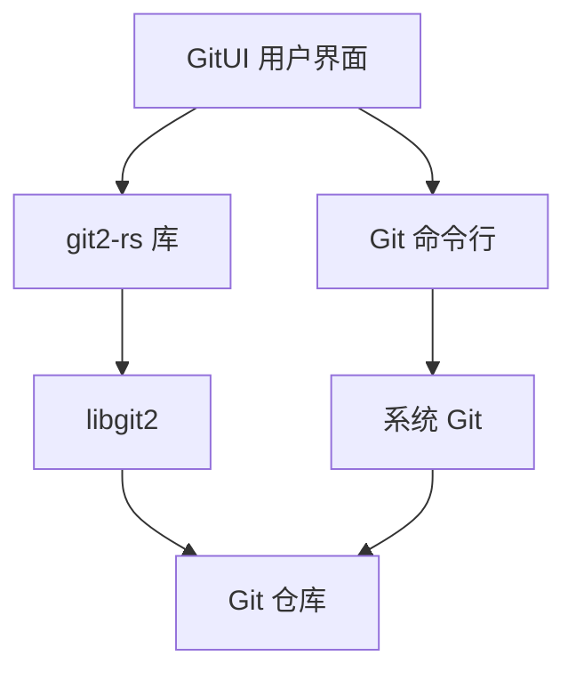
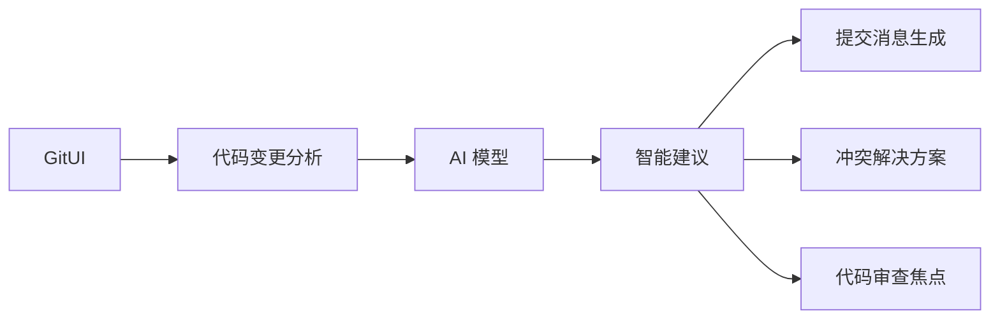

Контроль версий стал неотъемлемой частью современного процесса разработки программного обеспечения, и Git, как самая популярная система контроля версий, оказывает непосредственное влияние на эффективность работы разработчика. GitUI, как терминальный Git-клиент, меняет способ взаимодействия разработчиков с Git благодаря своей потрясающей производительности и дружественному пользовательскому интерфейсу.

<!--more-->

## 引言

По мере того как репозитории кода становятся все больше, а истории версий все сложнее, традиционные операции командной строки Git требуют от разработчиков больших усилий для запоминания и использования, а графические клиенты Git, хотя и интуитивно понятны, обычно плохо работают с большими репозиториями. Появление GitUI предоставляет разработчикам новую альтернативу, сочетающую эффективность командной строки и интуитивность графического интерфейса.

## GitUI 的技术架构

### Rust: 性能与安全的基石

GitUI разработан на Rust, языке программирования системного уровня, который фокусируется на производительности и безопасности памяти. Абстракция Rust с нулевыми затратами, система владения и строгая проверка типов делают GitUI практически неуязвимым для сбоев во время выполнения или утечек памяти, сохраняя при этом высокую производительность.

Возможности Rust позволяют GitUI без задержек работать с большими репозиториями, например, с такими огромными проектами, как ядро Linux, история которого насчитывает более 900 000 коммитов, и при этом сохранять плавность работы.

### 与 Git 的交互方式

GitUI взаимодействует с Git двумя основными способами:

1. **git2-rs library**: Это привязка к Rust библиотеки libgit2, которая предоставляет высокоуровневый интерфейс для взаимодействия с репозиториями Git. libgit2 - это переносимая, свободная от зависимостей библиотека основной функциональности Git, реализованная на чистом C и предназначенная для встраивания в другие приложения.

2. **Прямые вызовы команд Git**: для выполнения некоторых сложных операций GitUI напрямую вызывает инструменты командной строки Git, установленные в системе, что обеспечивает полную совместимость со стандартным набором инструментов Git.



### 异步架构与响应式 UI

GitUI использует асинхронную модель программирования, которая отделяет рендеринг пользовательского интерфейса от фоновых Git-операций, гарантируя, что интерфейс останется отзывчивым даже при выполнении трудоемких операций. Это особенно важно при работе с большими репозиториями или сложными операциями.

```rust
// GitUI 异步操作示例代码（简化版）
async fn fetch_commits(repo: &Repository) -> Result<Vec<Commit>> {
    // 在后台线程中执行耗时操作
    let commits = task::spawn_blocking(move || {
        // 查询 Git 仓库的提交历史
        repo.get_commits(100)
    }).await?;
    
    Ok(commits)
}
```

## 用户界面设计

### TUI（Terminal User Interface）架构

GitUI использует библиотеку [tui-rs](https://github.com/fdehau/tui-rs) (теперь переименованную в ratatui) для создания своего терминального пользовательского интерфейса. Эта библиотека предоставляет богатый набор компонентов и систем компоновки, которые позволяют GitUI создавать интерактивный опыт, близкий к GUI-приложению, сохраняя при этом легкий характер терминального приложения.

Интерфейс разделен на несколько основных компонентов:

1. **Вид состояния**: показывает изменения в рабочем каталоге
2. **Вид журнала**: просмотр истории фиксаций
3. **Вид ветки**: управление ветками
4. **Вид различий**: просмотр деталей изменений в файлах

### 上下文相关的帮助系统

Одна из ключевых концепций дизайна GitUI - "не нужно запоминать". На каждом экране отображаются доступные в данный момент действия и сочетания клавиш, что позволяет пользователю наглядно представить, что можно сделать, и сократить время обучения.

### 键盘驱动的操作流

GitUI управляется исключительно с клавиатуры, обеспечивая эффективный рабочий процесс для разработчиков, знакомых с командной строкой. Клавиши по умолчанию разработаны с учетом требований эргономики, также поддерживаются пользовательские сопоставления клавиш, включая клавиши в стиле Vim.

```ron
// key_bindings.ron 配置示例
(
    move_left: Some(( code: Char('h'), modifiers: "")),
    move_right: Some(( code: Char('l'), modifiers: "")),
    move_up: Some(( code: Char('k'), modifiers: "")),
    move_down: Some(( code: Char('j'), modifiers: "")),
    
    // 更多键位配置...
    commit: Some(( code: Enter, modifiers: "ALT")),
)
```

## 性能对比与技术优势

### 对比其他 Git 客户端

Согласно бенчмаркам, проведенным разработчиками GitUI, GitUI демонстрирует явное преимущество в производительности по сравнению с другими конечными Git-клиентами для таких задач, как разбор истории Git ядра Linux:

| Tools | Parsing Time | Memory Usage (GB) | Binary Size (MB) | Does it lag | Does it crash |
|------|----------|---------------|----------------|----------|----------|----------|
| GitUI | 24 секунды | 0.17 | 10 | нет | нет | нет |
| Lazygit | 57 секунд | 2.6 | 25 | Да | Время от времени |
| Tig | 4 мин 20 сек | 1,3 | 0,6 | время от времени | нет |

Такая значительная разница в производительности во многом объясняется эффективным управлением памятью в языке Rust и оптимизированным дизайном GitUI.

### 内存效率与安全性

Система владения Rust обеспечивает эффективное и безопасное использование памяти GitUI, без колебаний производительности, связанных со сбором мусора. С точки зрения эффективности использования памяти:

1. **Дизайн с нулевым копированием**: минимизация дублирования данных
2. **Точный контроль памяти**: выделение только необходимого пространства памяти
3. **Детерминированное освобождение ресурсов**: не полагается на сборщик мусора, ресурсы освобождаются по мере их использования

### 跨平台兼容性

GitUI поддерживает все основные операционные системы:

- **Linux**: различные дистрибутивы, включая Arch, Fedora, Ubuntu и т. д.
- **macOS**: установка через Homebrew или бинарная установка
- **Windows**: поддерживается установка через Winget, Scoop или Chocolatey.

Такая широкая поддержка платформ позволяет разработчикам поддерживать последовательный рабочий процесс в различных средах.

## 已知限制和注意事项

Хотя GitUI обеспечивает превосходный пользовательский опыт, стоит отметить некоторые ограничения:

### SSH 配置和凭证问题

GitUI использует библиотеку libgit2 и в настоящее время может испытывать проблемы с некоторыми конфигурациями SSH. В частности:

- **Аутентификация ключа хоста SSH**: может возникнуть ошибка `недействительный или неизвестный удаленный ключ хоста ssh`.
- **Нестандартная конфигурация SSH**: Настройки в файле `~/.ssh/config` могут быть не полностью распознаны.
- **Специальные методы аутентификации**: некоторые нестандартные механизмы аутентификации SSH могут не поддерживаться.

Эта проблема была выявлена в [issue #2096](https://github.com/gitui-org/gitui/issues/2096) GitUI и связана в основном с тем, что лежащая в основе библиотека libgit2 еще не полностью поддерживает все возможности OpenSSH.

**Временное решение**:
- Выполняйте большинство операций в GitUI, но используйте Git из командной строки для push
- Попробуйте использовать HTTPS вместо SSH URL (если это возможно).
- Явно настраивайте credential.helper

```bash
# 在 .gitconfig 中
[credential]
    helper = store
```

### 其他限制

У GitUI есть и другие известные ограничения:

- Разрозненные репозитории не поддерживаются.
- Git LFS не поддерживается
- Требуется явная настройка credential.helper для учетных данных HTTPS

## 高级使用技巧

### 自定义与配置

GitUI предоставляет широкие возможности настройки, включая:

#### 键位绑定

Настройте привязки клавиш, отредактировав `~/.config/gitui/key_bindings.ron` (или путь к конфигурации для соответствующей платформы):

```ron
// 将提交操作绑定到 Alt+Enter
commit: Some(( code: Enter, modifiers: "ALT")),
```

#### 主题定制

GitUI поддерживает полностью настраиваемые цветовые темы путем редактирования файла `theme.ron`:

```ron
(
    selected_bg: Some(Blue),
    command_fg: Some(White),
    // 更多颜色配置...
)
```

#### 外部编辑器集成

GitUI учитывает системные переменные окружения `GIT_EDITOR`, `VISUAL` или `EDITOR`, которые также могут быть указаны в конфигурации:

```ron
(
    editor: Some("nvim"),
)
```

### 高级 Git 操作

GitUI поддерживает не только основные операции с Git, но и множество дополнительных функций:

1. **Интерактивный стейджинг**: выборочное стейджирование определенных частей файла.
2. **Модификация коммита**: поддержка изменения последнего коммита.
3. **Операции с тайниками**: полная функциональность управления тайниками.
4. **Поддержка субмодулей**: управление подмодулями Git.
5. **Подписанные коммиты**: поддержка коммитов, подписанных GPG (с некоторыми ограничениями).

Эти расширенные возможности делают GitUI полнофункциональным Git-клиентом для различных сложных рабочих процессов.

## 扩展与集成

### 与现有工具链的集成

GitUI разработан для беспрепятственной работы с существующими цепочками инструментов и рабочими процессами Git:

1. **Относится к конфигурации Git**: Использует те же конфигурационные файлы и переменные окружения, что и стандартный Git.
2. **Совместимость с хуками**: полностью поддерживаются хуки Git, включая pre-commit, commit-msg и т. д.
3. **Интеграция с хранилищем учетных данных**: Работает с системным менеджером учетных данных.

### 扩展性思考

Хотя сам GitUI не является расширяемым фреймворком, его открытый исходный код означает, что разработчики могут это делать:

1. **Внесение функциональности**: вносите новую функциональность непосредственно в проект
2. **Заказные сборки**: создание пользовательских версий для конкретных нужд
3. **Учебный ресурс**: служит отличным примером для изучения разработки приложений Rust TUI.

## 使用 GitUI 的实际场景

### 场景一：大型代码库管理

Высокая производительность GitUI особенно важна для разработчиков, работающих с ядром Linux или другими большими базами кода:

```bash
# 在 Linux 内核仓库中启动 GitUI
cd linux
gitui
```

Даже при сотнях тысяч коммитов и десятках тысяч файлов GitUI остается плавным.

### 场景二：服务器远程管理

Терминальный интерфейс GitUI идеально подходит для разработчиков, которым необходимо управлять кодом на удаленных серверах через SSH:

```bash
ssh user@server
cd /path/to/repo
gitui
```

Получите интуитивно понятный опыт визуализации и управления репозиториями Git без использования X-форвардов и графического интерфейса.

### 场景三：CI/CD 流水线调试

GitUI предоставляет наглядное представление о состоянии репозитория при отладке связанных с Git проблем в среде непрерывной интеграции:

```bash
# 在 CI 环境中检查仓库状态
cd $WORKSPACE
gitui
```

Это позволяет разработчикам быстро выявлять и устранять проблемы CI, связанные с Git.

## 未来展望与 AI 应用前景

### GitUI 的发展路线

Согласно дорожной карте проекта GitUI, основные функции, запланированные на будущее, включают:

1. **Визуализация структуры ветвления**: показывает связи ветвления в журнале.
2. **Интерактивный rebase**: обеспечивает дружественный и интерактивный интерфейс rebase.
3. **Больше возможностей настройки**: улучшает конфигурацию и масштабируемость.
4. **Улучшенная поддержка SSH**: как только базовая библиотека libgit2 улучшит свою функциональность SSH, GitUI также выиграет!

### AI 辅助版本控制的潜力

Существует множество интересных возможностей для объединения GitUI с развивающимися технологиями искусственного интеллекта:

1. **Интеллектуальная генерация сообщений о фиксации**: автоматическая генерация высококачественных сообщений о фиксации на основе содержания изменений.
2. **Распознавание шаблонов изменений**: определение распространенных шаблонов модификации кода и предоставление соответствующих предложений.
3. **Помощь в разрешении конфликтов**: интеллектуальный анализ и предложение наилучшего решения для конфликтов слияния.
4. **Улучшение проверки кода**: выделение потенциальных проблемных областей для помощи в проверке кода.



Такая интеграция позволяет значительно повысить эффективность рабочих процессов разработки, уменьшить количество человеческих ошибок и сделать процесс контроля версий более интеллектуальным.

## 结论

GitUI представляет собой важную тенденцию в области инструментов разработки: объединение сильных сторон современных языков программирования для обеспечения более эффективной и удобной работы с классическими задачами разработки. Благодаря производительности и гарантиям безопасности языка Rust в сочетании с хорошо продуманным пользовательским интерфейсом GitUI успешно решает многие проблемы традиционных Git-клиентов.

Несмотря на некоторые ограничения, особенно в работе с SSH, преимущества GitUI все еще очень очевидны. Ожидается, что эти проблемы будут решены по мере развития проекта и совершенствования базовых библиотек.

GitUI - это не просто инструмент для разработчиков, которые хотят быть продуктивными, это новый способ работы: интуитивно понятный, эффективный и приятный пользовательский опыт в среде командной строки. В сочетании с соответствующими корректировками рабочего процесса, такими как переход на командную строку Git для операций push при необходимости, GitUI может значительно повысить эффективность и опыт разработки.

## 实践建议

Чтобы погрузиться в возможности GitUI, вот несколько практических предложений:

1. **Ознакомьтесь с основами**: начните с простого просмотра состояния, постановки и фиксации.
2. **Постепенно изучайте расширенные возможности**: по мере освоения попробуйте более сложные операции, такие как управление филиалами и интерактивный стейджинг.
3. **Настройте свою персональную конфигурацию**: настройте сочетания клавиш и темы в соответствии с вашими привычками.
4. **Комбинируйте с существующими рабочими процессами**: разрабатывайте гибридные рабочие процессы, чтобы устранить известные ограничения, например, выполняйте большинство операций в GitUI, а push из командной строки.
5. **Следить за развитием проекта**: по мере развития GitUI и libgit2 некоторые текущие ограничения могут быть устранены в будущих релизах.

Наконец, будучи проектом с открытым исходным кодом, GitUI также приветствует вклад сообщества. Будь то сообщение о проблеме, улучшение документации или добавление новой функции - каждый вклад помогает сделать этот замечательный инструмент еще лучше.

Чтение исходного кода GitUI также является ценным опытом обучения для всех, кто хочет глубже погрузиться в интерфейсы конечного пользователя и разработку приложений на языке Rust. Он показывает, как применять различные основные концепции Rust в реальных проектах и как создавать отзывчивые и высокопроизводительные приложения для конечных пользователей.

Готовы ли вы познакомиться с этим замечательным терминальным Git-клиентом? Почему бы не установить GitUI прямо сейчас и не испытать новые возможности контроля версий!