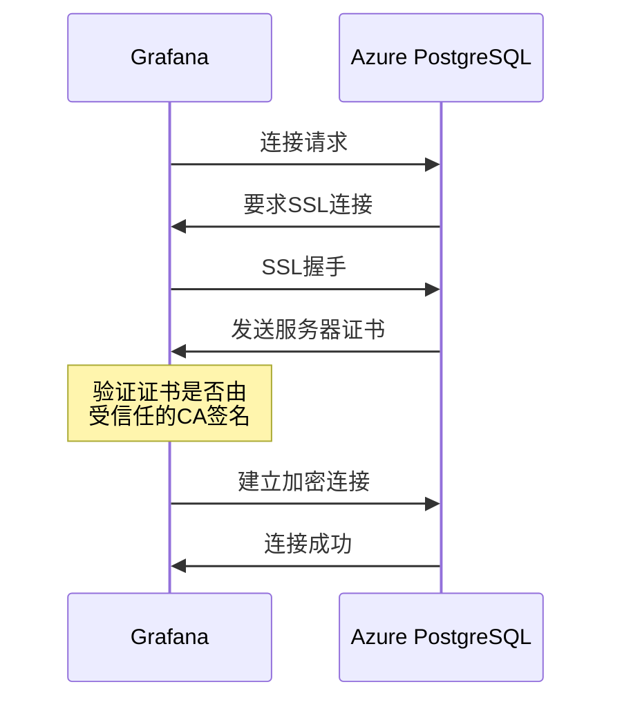

在配置Grafana连接Azure PostgreSQL数据库时，SSL/TLS连接问题常常让开发者感到困惑。本文将分享一个看似简单却不那么直观的解决方案，帮助你快速解决这类连接难题。

<!--more-->

## 问题背景

许多开发者在尝试将Grafana连接到Azure PostgreSQL灵活服务器时，会遇到SSL/TLS相关的错误。Azure的文档中通常没有详细说明如何处理这些特殊场景，特别是当你使用IP地址而非域名连接时。

最常见的错误包括：

- 启用SSL时：`x509: certificate signed by unknown authority`
- SSL模式设为verify-full时：`tls: failed to verify certificate: x509: cannot validate certificate for X.X.X.X because it doesn't contain any IP SANs`
- 禁用SSL时：`pq: no pg_hba.conf entry for host "X.X.X.X", user "username", database "database_name", SSL off`

这些错误表明Azure PostgreSQL强制要求SSL连接，但certificate验证又存在各种问题。

## 错误原因分析

### 1. Azure PostgreSQL强制SSL连接

Azure PostgreSQL服务默认配置为强制使用SSL连接以保障数据传输安全。这就是为什么当你尝试禁用SSL时会被拒绝连接。

### 2. 证书验证问题

当使用IP地址连接时，会遇到"IP SANs"错误，这是因为Azure的服务器证书通常只包含域名，不包含IP地址作为Subject Alternative Name (SAN)。

### 3. 根证书信任链问题

对于"certificate signed by unknown authority"错误，这通常意味着客户端不信任服务器证书的签发机构。

## 解决方案

经过多次测试，我们发现了一个出人意料的简单解决方案：

### 最佳配置方法

在Grafana PostgreSQL数据源设置中：

1. 保持SSL选项为"Required"或设置SSL模式为"verify-ca"
2. **不要**提供自定义CA证书（留空TLS/SSL Root Certificate字段）
3. 确保不选中"Skip TLS Verify"选项

就是这么简单！

### 为什么这样有效？

现代Grafana容器镜像已经包含了Microsoft和DigiCert的根证书，这些正是Azure PostgreSQL使用的证书颁发机构。当你不指定自己的CA证书时，Grafana会使用系统内置的证书存储，通常已包含这些根证书。

反而当你尝试手动提供这些证书时，可能因为格式问题、路径错误或证书链不完整而导致验证失败。

## 为什么不能使用其他SSL模式

- **SSL禁用(disabled)**：不可行，因为Azure强制要求SSL连接
- **SSL verify-full**：当使用IP地址连接时不可行，因为证书不包含IP SAN；只有使用完整域名连接时才能工作

## 图解SSL连接过程



## 验证配置

要验证SSL连接是否正确建立，可以使用PostgreSQL的内置功能：

```sql
SELECT datname as "Database name", usename as "User name", ssl, client_addr, application_name, backend_type
FROM pg_stat_ssl
JOIN pg_stat_activity
ON pg_stat_ssl.pid = pg_stat_activity.pid
ORDER BY ssl;
```

查询结果应显示Grafana连接的ssl列为"t"（true）。

## 总结与最佳实践

1. 在Grafana中使用"verify-ca"模式连接Azure PostgreSQL
2. 不要手动提供CA证书，依赖Grafana容器已有的系统证书存储
3. 保持Grafana容器镜像更新，以获得最新的CA证书更新
4. 如果可能，使用域名而非IP地址连接，这样可以使用更安全的"verify-full"模式

这种配置既保证了连接的安全性，又避免了不必要的复杂性。若未来Azure更新根证书，只要更新Grafana容器镜像，就能保持连接正常工作。

有时候，技术解决方案反而是"做得更少"而不是"做得更多"。希望这篇文章能帮助你避免在SSL配置上浪费时间！
