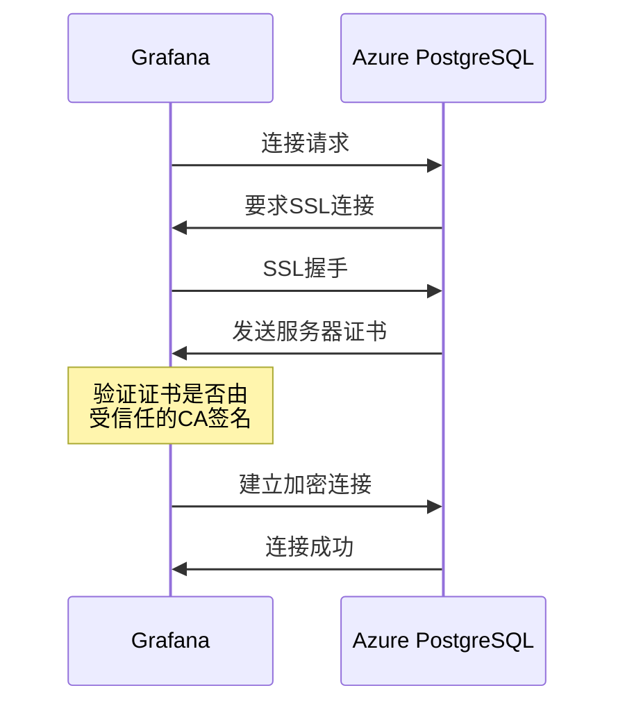

Проблемы с подключением SSL/TLS часто ставят разработчиков в тупик при настройке Grafana для подключения к базам данных Azure PostgreSQL. В этой статье мы расскажем о простом на первый взгляд, но не слишком интуитивном решении, которое поможет вам быстро устранить такие проблемы с подключением.

<!--more-->

## 问题背景

Многие разработчики сталкиваются с ошибками SSL/TLS при попытке подключить Grafana к гибкому серверу Azure PostgreSQL. Документация Azure обычно не содержит подробностей о том, как справиться с этими конкретными сценариями, особенно если вы подключаетесь, используя IP-адрес, а не доменное имя.

Самые распространенные ошибки включают:

- Когда SSL включен: `x509: сертификат подписан неизвестным авторитетом`.
- Когда режим SSL установлен на verify-full: `tls: failed to verify certificate: x509: cannot validate certificate for X.X.X.X because it does not contain any IP SANs`.
- Когда SSL отключен: `pq: нет записи в pg_hba.conf для хоста "X.X.X.X", пользователя "username", базы данных "database_name", SSL выключен`.

Эти ошибки указывают на то, что Azure PostgreSQL использует SSL-соединение, но возникают различные проблемы с проверкой сертификата.

## 错误原因分析

### 1. Azure PostgreSQL强制SSL连接

Служба Azure PostgreSQL по умолчанию настроена на принудительное использование SSL-соединений для защиты передачи данных. Поэтому при попытке отключить SSL вам будет отказано в подключении.

### 2. 证书验证问题

Ошибка "IP SANs" возникает при подключении с IP-адресом, поскольку сертификаты серверов Azure обычно содержат только доменное имя, а не IP-адрес в качестве альтернативного имени субъекта (SAN).

### 3. 根证书信任链问题

Ошибка "сертификат подписан неизвестным органом" обычно означает, что клиент не доверяет органу, выдавшему сертификат сервера.

## 解决方案

После многочисленных испытаний мы нашли удивительно простое решение:

### 最佳配置方法

В настройках источника данных Grafana PostgreSQL:

1. Оставьте опцию SSL "Required" или установите режим SSL на "verify-ca".
2. **НЕ** предоставьте пользовательский сертификат ЦС (оставьте поле TLS/SSL Root Certificate пустым).
3. убедитесь, что опция "Пропустить проверку TLS" снята.

Это так просто!

### 为什么这样有效？

Современные образы контейнеров Grafana уже содержат корневые сертификаты от Microsoft и DigiCert, которые являются теми самыми центрами сертификации, которые используются в Azure PostgreSQL. Если вы не указываете свой собственный сертификат центра сертификации, Grafana использует встроенное хранилище сертификатов системы, которое обычно уже содержит эти корневые сертификаты.

Вместо этого, когда вы пытаетесь предоставить эти сертификаты вручную, проверка может не пройти из-за проблем с форматированием, ошибок пути или неполной цепочки сертификатов.

## 为什么不能使用其他SSL模式

- **SSL disabled**: невыполнимо, поскольку Azure принудительно устанавливает SSL-соединения.
- **SSL verify-full**: не работает при подключении с IP-адресом, поскольку сертификат не включает IP SAN; работает только при подключении с полным доменным именем

## 图解SSL连接过程



## 验证配置

Чтобы убедиться, что SSL-соединение установлено правильно, можно воспользоваться встроенными функциями PostgreSQL:

```sql
SELECT datname as "Database name", usename as "User name", ssl, client_addr, application_name, backend_type
FROM pg_stat_ssl
JOIN pg_stat_activity
ON pg_stat_ssl.pid = pg_stat_activity.pid
ORDER BY ssl;
```

Запрос должен показать колонку ssl для соединения Grafana как "t" (true).

## 总结与最佳实践

1. Используйте режим "verify-ca" в Grafana для подключения к Azure PostgreSQL.
2. не создавайте сертификаты ЦС вручную, полагайтесь на существующее системное хранилище сертификатов контейнера Grafana.
3. поддерживайте образ контейнера Grafana в актуальном состоянии, чтобы получать последние обновления сертификатов ЦС.
4. по возможности подключайтесь, используя доменное имя вместо IP-адреса, чтобы использовать более безопасный режим "verify-full".

Такая конфигурация обеспечивает безопасность соединения, избегая излишней сложности. Если в будущем Azure обновит корневой сертификат, просто обновите образ контейнера Grafana, чтобы сохранить работоспособность соединения.

Иногда техническое решение заключается в том, чтобы "делать меньше", а не "делать больше". Надеюсь, эта статья поможет вам избежать пустой траты времени на настройку SSL!