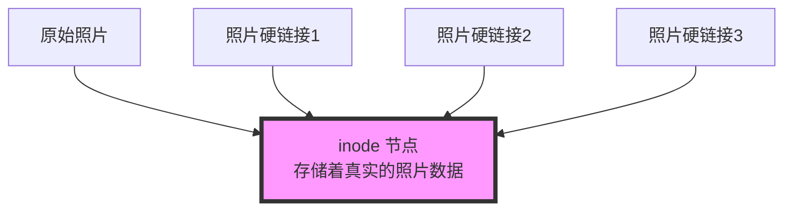

想象一下这个场景：你和你的室友合租一间公寓，每个人都需要一本《JavaScript高级程序设计》来学习。按照常规思维，你们可能会各自买一本 —— 这就像传统的文件拷贝。但是，如果有一种方式，让你们可以共享同一本书，却能各自在自己的房间随时查看，这不就既省钱又方便了吗？这就是 Hard Link（硬链接）的思维方式。

而 pnpm，这个日渐流行的包管理工具，正是基于类似的智慧来节省你的磁盘空间的。让我们通过这篇文章，用简单的方式理解这个看似复杂的技术概念。

<!--more-->

## Hard Link：不是复制，是分身术

### 什么是 Hard Link？

想象你有一张全家福照片：
- 如果你直接复制这张照片，就会得到两个独立的文件，各占用同样大的空间
- 但如果你创建这张照片的硬链接，就相当于在不同的相册中放入了同一张照片的"分身"，这些"分身"指向的都是同一张照片



硬链接的特点是：
1. 不占额外空间：所有硬链接都指向同一个实际文件内容
2. 保持同步：通过任何一个链接修改内容，所有链接都会看到变化
3. 安全性高：只有当最后一个硬链接被删除时，文件才会真正被删除

### 生活中的类比

这就像是：
- 一个家庭共享一台电视机，每个房间都有一个遥控器
- 无论用哪个遥控器换台，电视都会切换到相同的频道
- 只要还有一个遥控器在工作，你就能控制电视
- 电视（文件内容）占用空间，而遥控器（硬链接）几乎不占空间

## pnpm：聪明的包管理器

### pnpm 如何使用硬链接？

pnpm 巧妙地运用了硬链接和符号链接（软链接）的组合：

```mermaid
graph TD
    A[全局存储<br>.pnpm-store] --> B[react@18.2.0]
    A --> C[lodash@4.17.21]
    A --> D[typescript@5.0.0]
    
    subgraph "项目A"
    E[node_modules/.pnpm/react@18.2.0] -.硬链接.-> B
    F[node_modules/react] -.符号链接.-> E
    end
    
    subgraph "项目B"
    G[node_modules/.pnpm/react@18.2.0] -.硬链接.-> B
    H[node_modules/react] -.符号链接.-> G
    end

    style A fill:#f9f,stroke:#333,stroke-width:4px
```

运作方式：
1. 全局存储：所有的包都先安装到一个统一的地方（就像图书馆）
2. 硬链接：当项目需要某个包时，创建硬链接指向全局存储（就像在图书馆借书，但不用搬走书）
3. 符号链接：创建正确的依赖结构（就像图书馆的索引系统）

### 实际体验

这种设计带来的好处是：

1. 空间节省
```bash
# 传统方式：三个项目各自安装 react
项目A/node_modules/react  // 占用 5MB
项目B/node_modules/react  // 占用 5MB
项目C/node_modules/react  // 占用 5MB
总共占用：15MB

# pnpm 方式
.pnpm-store/react        // 占用 5MB
项目A/node_modules/react  // 几乎不占空间（硬链接）
项目B/node_modules/react  // 几乎不占空间（硬链接）
项目C/node_modules/react  // 几乎不占空间（硬链接）
总共占用：约 5MB
```

2. 安装速度快
- 因为多个项目共享同一个全局存储
- 如果包已经在全局存储中，只需要创建链接，无需重新下载

3. 依赖结构清晰
- 每个项目的 node_modules 结构都很干净
- 依赖关系更容易理解和管理

## 使用建议

1. 开发环境注意事项：
   - IDE 可能会显示多个相同的文件（因为硬链接）
   - 修改依赖包时要小心，因为会影响所有使用该包的项目

2. 调试技巧：
   - 如果需要临时修改某个包，最好先复制一份而不是直接修改
   - 使用 `pnpm store path` 可以查看全局存储位置
   - 使用 `pnpm store prune` 可以清理未使用的包

3. 团队协作：
   - 建议团队统一使用 pnpm，避免混用不同的包管理器
   - 在项目中使用 `.npmrc` 配置文件固定使用 pnpm

## 总结

通过硬链接这个巧妙的技术，pnpm 不仅节省了大量磁盘空间，还提供了更快的安装速度和更清晰的依赖管理。理解了这个概念，你就能更好地利用 pnpm 的优势，也能更深入地理解为什么它越来越受欢迎。

就像我们开始时说的共享书本的例子，pnpm 让所有项目能够智能地共享同一份依赖，既节省了资源，又保证了每个项目都能独立运作。这就是技术创新带来的美妙之处！

