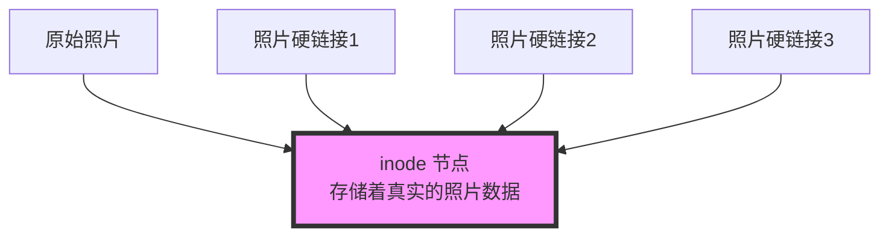

Представьте себе такой сценарий: вы с соседом по комнате живете в одной квартире, и каждому из вас нужна копия книги Advanced Programming in JavaScript для изучения. Если мыслить условно, то вы, вероятно, купили бы каждый по экземпляру книги - как традиционную файловую копию. Но разве это не сэкономит деньги и не будет удобнее, если вы сможете пользоваться одной и той же книгой, но при этом она будет доступна каждому из вас в своей комнате? Именно так рассуждает Hard Link.

И pnpm, все более популярный инструмент управления пакетами, основан на аналогичной мудрости, позволяющей экономить место на диске. Давайте разберемся в этой статье и поймем эту, казалось бы, сложную техническую концепцию простым способом.

<!--more-->

## Hard Link：不是复制，是分身术

### 什么是 Hard Link？

Представьте, что у вас есть семейная фотография:
- Если вы скопируете фотографию напрямую, то получите два отдельных файла, каждый из которых займет одинаковое количество места.
- Но если вы создадите жесткую ссылку на эту фотографию, вы разместите "фрагменты" одной и той же фотографии в разных альбомах, указывающих на одну и ту же фотографию!



Жесткие ссылки характеризуются:
1. не занимают дополнительного места: все жесткие ссылки указывают на одно и то же фактическое содержимое файла
2. синхронизация: измените содержимое по одной ссылке, и все ссылки увидят это изменение
3. высокая безопасность: только после удаления последней жесткой ссылки файл будет удален.

### 生活中的类比

Как будто:
- Семья пользуется одним телевизором, и в каждой комнате есть пульт дистанционного управления.
- Независимо от того, с какого пульта переключается канал, телевизор переключается на тот же канал.
- Пока есть работающий пульт, вы можете управлять телевизором.
- Телевизор (файловое содержимое) занимает место, а пульт (жесткая ссылка) - почти нет.

## pnpm：聪明的包管理器

### pnpm 如何使用硬链接？

pnpm ловко использует комбинацию жестких и символических ссылок (soft links):

```mermaid
graph TD
    A[全局存储<br>.pnpm-store] --> B[react@18.2.0]
    A --> C[lodash@4.17.21]
    A --> D[typescript@5.0.0]
    
    subgraph "项目A"
    E[node_modules/.pnpm/react@18.2.0] -.硬链接.-> B
    F[node_modules/react] -.符号链接.-> E
    end
    
    subgraph "项目B"
    G[node_modules/.pnpm/react@18.2.0] -.硬链接.-> B
    H[node_modules/react] -.符号链接.-> G
    end

style A fill:#f9f,stroke:#333,stroke-width:4px
```

Как это работает:
1. глобальное хранилище: все пакеты сначала устанавливаются в одном месте (как в библиотеке)
2. жесткие ссылки: когда пакет нужен для проекта, создаются жесткие ссылки, указывающие на глобальное хранилище (как взять книгу в библиотеке, но не перекладывать ее)
3. символические ссылки: создают правильную структуру зависимостей (как система индексирования библиотек)

### 实际体验

Преимущества такой конструкции заключаются в следующем:

1. 空间节省
```bash
# 传统方式：三个项目各自安装 react
项目A/node_modules/react  // 占用 5MB
项目B/node_modules/react  // 占用 5MB
项目C/node_modules/react  // 占用 5MB
总共占用：15MB

# pnpm 方式
.pnpm-store/react        // 占用 5MB
项目A/node_modules/react  // 几乎不占空间（硬链接）
项目B/node_modules/react  // 几乎不占空间（硬链接）
项目C/node_modules/react  // 几乎不占空间（硬链接）
总共占用：约 5MB
```

2. Быстрая установка
- Поскольку несколько проектов используют одно и то же глобальное хранилище.
- Если пакет уже находится в глобальном хранилище, просто создайте ссылку, не нужно скачивать его заново

3. Четкая структура зависимостей
- Структура node_modules каждого проекта чиста.
- Зависимости легче понять и управлять ими

## 使用建议

1. особенности среды разработки:
   - IDE может показать несколько одинаковых файлов (из-за жесткой привязки).
   - Будьте осторожны при изменении пакетов зависимостей, так как это повлияет на все проекты, использующие данный пакет

2. советы по отладке:
   - Если вам нужно внести временные изменения в пакет, лучше сначала сделать его копию, а не изменять его напрямую.
   - Используйте `pnpm store path`, чтобы узнать, где находится глобальное хранилище.
   - Используйте `pnpm store prune` для очистки неиспользуемых пакетов.

3. работа в команде:
   - Рекомендуется, чтобы команды последовательно использовали pnpm, чтобы избежать смешивания различных менеджеров пакетов.
   - Используйте конфигурационный файл `.npmrc` в проекте, чтобы закрепить использование pnpm.

## 总结

Благодаря умной технике жесткого связывания pnpm не только экономит много места на диске, но и обеспечивает более быструю установку и более четкое управление зависимостями. Понимание этой концепции позволит вам лучше использовать сильные стороны pnpm и даст более глубокое понимание причин роста его популярности.

Как и в примере с общей книгой, с которого мы начали, pnpm позволяет всем проектам разумно использовать одни и те же зависимости, экономя ресурсы и обеспечивая независимую работу каждого проекта. В этом и заключается красота технологических инноваций!

