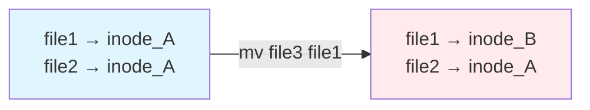
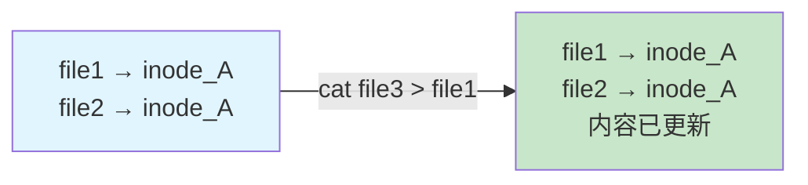
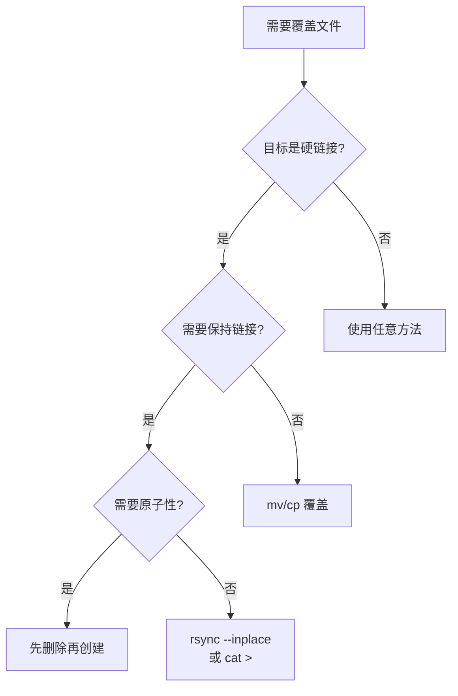

在日常的文件管理和系统迁移过程中，我们经常会遇到一些看似简单但实际上暗藏玄机的操作。最近在换新 Mac 的过程中，我发现了一个关于硬链接（hard link）的严重问题：在恢复备份时，原本通过硬链接关联的文件变成了独立的副本。深入研究后发现，**问题的根源不是备份工具，而是恢复时的覆盖操作**。这个发现彻底改变了我对文件操作的理解。

<!--more-->

## 问题的发现

在从旧 Mac 迁移到新 Mac 的过程中，我使用了标准的 tar 打包方式备份文件。tar 本身是能够正确保持硬链接的，但在恢复过程中，我需要覆盖一些已存在的文件，结果发现：

```bash
# 原本应该是硬链接的两个文件
# 文件A的状态
Inode: 1220909     Links: 1

# 文件B的状态  
Inode: 1206388     Links: 1
```

`Links: 1` 表明它们已经不再关联。如果硬链接关系正常，我们应该看到相同的 inode 号码和 `Links: 2`。

## 什么是硬链接

硬链接是 Unix/Linux 文件系统中的一个重要概念。简单来说，硬链接就是给同一份文件数据起多个名字。在文件系统中，多个文件名指向同一个 inode，这意味着：

- 修改任何一个硬链接，其他链接看到的内容也会同步变化
- 只有当所有硬链接都被删除时，文件数据才会真正被删除
- 所有硬链接都有相同的 inode 号码

```bash
# 查看文件的硬链接信息
ls -li filename
stat filename
```

## 核心发现：覆盖操作是罪魁祸首

经过深入测试，我发现了一个关键事实：**当你覆盖一个已存在的硬链接文件时，大多数常用工具会破坏硬链接关系**。

### 实验验证

我编写了完整的测试脚本来验证不同工具在覆盖操作时的行为。你可以在 [GitHub Gist](https://gist.github.com/donghao1393/f365cd6141fb8a0e6accbcda746cbe7c) 找到完整的测试代码，这个脚本包含了：

- 基础的移动和复制测试
- **关键的覆盖操作测试**（新增）
- 实际场景模拟（从备份恢复）
- macOS和Linux的兼容性处理

```bash
# 创建硬链接
echo "原始内容" > file1
ln file1 file2
stat file1 file2 | grep Inode
# 输出: 两个文件相同的 Inode，Links: 2

# 测试不同的覆盖方式
echo "新内容" > file3

# ❌ mv 覆盖 - 破坏硬链接
mv file3 file1
# 结果: file1 获得新 inode，file2 保持原 inode，链接断裂

# ❌ cp 覆盖 - 破坏硬链接  
cp file3 file1
# 结果: 同样破坏硬链接

# ❌ rsync 默认覆盖 - 破坏硬链接
rsync file3 file1
# 结果: 硬链接断裂

# ✅ rsync --inplace - 保持硬链接
rsync --inplace file3 file1
# 结果: inode保持，所有硬链接同步更新

# ✅ 重定向 - 保持硬链接
cat file3 > file1
# 结果: inode不变，硬链接关系维持
```

这解释了为什么我的备份恢复会失败：**在恢复过程中，如果目标位置已有文件，常规的文件操作会破坏硬链接**。

## 两种文件更新哲学的对立

深入研究后，我发现文件系统提供了两种根本不同的文件更新方式：

### 1. 原子替换（Atomic Replacement）- 默认行为



这是大多数工具的默认行为：
- **创建新文件** → **原子性替换旧文件**
- 优点：操作原子性，数据安全
- 缺点：破坏硬链接关系
- 使用场景：mv、cp、大多数编辑器保存

### 2. 原地修改（In-place Modification）- 保持inode



这种方式直接修改文件内容：
- **打开现有文件** → **覆写内容**
- 优点：保持inode和硬链接
- 缺点：非原子操作，可能导致数据损坏
- 使用场景：重定向、dd、rsync --inplace

## 完整的工具行为对照表

基于大量测试，这里是各种工具在**覆盖已存在文件**时的行为：

| 工具/命令 | inode行为 | 硬链接保持 | 原子性 | 适用场景 |
|----------|----------|-----------|--------|---------|
| `mv src dst` | ❌ 改变 | ❌ 断裂 | ✅ 是 | 普通文件移动 |
| `cp src dst` | ❌ 改变 | ❌ 断裂 | ✅ 是 | 普通文件复制 |
| `rsync src dst` | ❌ 改变 | ❌ 断裂 | ✅ 是 | 默认同步 |
| `rsync --inplace` | ✅ 保持 | ✅ 保持 | ❌ 否 | 保持硬链接 |
| `cat src > dst` | ✅ 保持 | ✅ 保持 | ❌ 否 | 内容替换 |
| `dd if=src of=dst` | ✅ 保持 | ✅ 保持 | ❌ 否 | 块级复制 |
| `tee dst < src` | ✅ 保持 | ✅ 保持 | ❌ 否 | 内容覆写 |
| 编辑器保存 | ❌ 改变 | ❌ 断裂 | ✅ 是 | 安全编辑 |

## 实际场景的解决方案

### 场景1：从备份恢复时保持硬链接

**❌ 错误方法（会破坏已存在的硬链接）：**
```bash
# 直接解压覆盖
tar -xzf backup.tar.gz -C /target/directory

# 使用 cp 或 mv 覆盖
cp -a extracted_files/* /existing/directory/
```

**✅ 正确方法：**
```bash
# 方法1：先清理目标目录
rm -rf /target/directory/*
tar -xzf backup.tar.gz -C /target/directory

# 方法2：解压到临时位置，然后用 rsync --inplace
tar -xzf backup.tar.gz -C /tmp/restore
rsync -avH --inplace /tmp/restore/ /target/directory/

# 方法3：对特定文件使用内容替换
for file in important_hardlinked_files; do
    cat /tmp/restore/$file > /target/$file
done
```

### 场景2：更新配置文件但保持硬链接

许多开发环境使用硬链接来共享配置：

**❌ 错误（断开链接）：**
```bash
# 这会导致各环境配置分离
mv new_config.yaml shared_config.yaml
```

**✅ 正确（保持链接）：**
```bash
# 所有硬链接同步更新
cat new_config.yaml > shared_config.yaml

# 或使用 rsync --inplace
rsync --inplace new_config.yaml shared_config.yaml
```

### 场景3：包管理器的文件更新

现代包管理器（npm、yarn、pnpm）大量使用硬链接优化存储：

```bash
# pnpm 使用硬链接去重包文件
# 更新包时必须小心处理

# 检查 node_modules 中的硬链接
find node_modules -type f -links +1 -ls

# 安全更新方法
pnpm update --force  # 重建硬链接结构
```

## 检测和修复硬链接

### 检测硬链接是否被破坏

```bash
#!/bin/bash
# 查找应该是硬链接但已断开的文件

# 方法1：比较文件内容和大小
for file1 in $(find . -type f); do
    for file2 in $(find . -type f); do
        if [ "$file1" != "$file2" ] && \
           [ "$(stat -f%i "$file1")" != "$(stat -f%i "$file2")" ] && \
           cmp -s "$file1" "$file2"; then
            echo "可能断开的硬链接: $file1 <-> $file2"
        fi
    done
done

# 方法2：检查特定目录的 inode 分布
find . -type f -exec stat -f "%i %N" {} \; | sort -n
```

### 修复断开的硬链接

```bash
#!/bin/bash
# 重建硬链接关系

# 保留一个作为源，删除其他并重建链接
source_file="file1"
for target in file2 file3 file4; do
    if cmp -s "$source_file" "$target"; then
        rm "$target"
        ln "$source_file" "$target"
        echo "重建硬链接: $source_file -> $target"
    fi
done
```

## 深度理解：为什么会这样设计？

这个看似"缺陷"的设计实际上是POSIX文件系统的一个重要特性：

### 硬链接的独立性原则

硬链接的设计理念是：**每个链接都是文件的独立入口**。当你通过一个名称删除或替换文件时，不应该影响通过其他名称访问的用户。

```bash
# 用户A通过 config.yaml 访问
# 用户B通过 app.config 访问（硬链接）

# 如果用户A执行 mv new_config config.yaml
# 用户B不应该突然发现文件内容变了
```

### 原子性 vs 一致性的权衡

- **原子替换**：保证操作要么完全成功，要么完全失败
- **原地修改**：保证所有访问路径看到一致的内容

没有完美的选择，只有根据场景的权衡。

## 最佳实践总结

### 🎯 核心原则

1. **理解你的需求**
   - 需要原子性？使用标准文件操作
   - 需要保持硬链接？使用原地修改

2. **覆盖前先检查**
   ```bash
   # 检查目标是否是硬链接
   [ $(stat -f%l "$file") -gt 1 ] && echo "警告：这是硬链接！"
   ```

3. **选择正确的工具**
   - 日常操作：标准命令（mv、cp）
   - 硬链接场景：rsync --inplace、重定向
   - 批量处理：编写脚本明确处理

### 🛠️ 实用决策流程



### ⚠️ 常见陷阱

1. **Finder 拖拽**：总是复制，会破坏硬链接
2. **编辑器保存**：大多创建新文件，破坏硬链接
3. **tar 直接解压到已有目录**：覆盖操作破坏硬链接
4. **自动化脚本**：默认使用 mv/cp 可能破坏生产环境

## 结语

这次探索让我深刻理解了一个道理：**工具的行为不仅取决于它是什么，更取决于你如何使用它**。同一个 rsync，加不加 `--inplace` 参数，结果完全不同。同样是恢复备份，先清空再恢复vs直接覆盖，结果天差地别。

硬链接的管理远比表面看起来复杂，特别是在覆盖操作时。理解这些细节，不仅能避免数据问题，更能让我们更好地利用文件系统的强大功能。

下次当你需要更新一个文件时，不妨先想想：这个文件可能是硬链接吗？如果是，我应该用什么方法来保持这个关系？