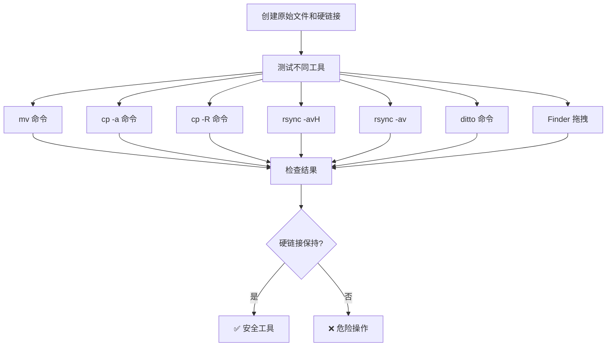
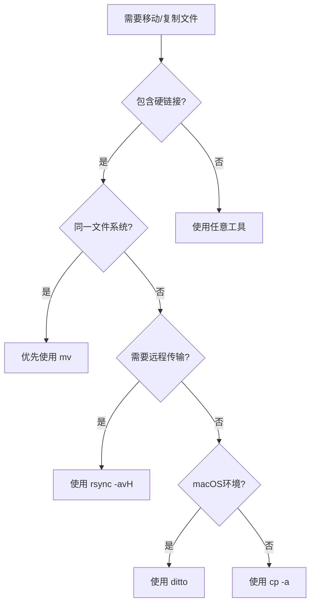

在日常的文件管理和系统迁移过程中，我们经常会遇到一些看似简单但实际上暗藏玄机的操作。最近在换新 Mac 的过程中，我发现了一个关于硬链接（hard link）的有趣现象：明明是相同的文件，在迁移后却变成了独立的副本。这个发现引发了我对不同文件操作工具的深入研究，结果令人意外——不同工具对硬链接的处理方式存在巨大差异。

<!--more-->

## 什么是硬链接

硬链接是 Unix/Linux 文件系统中的一个重要概念。简单来说，硬链接就是给同一份文件数据起多个名字。想象一下，你有一份重要的合同文档，你可以在桌子上放多个文件夹，每个文件夹里都有一个标签指向这份合同，但实际上合同只有一份。

在文件系统中，硬链接的工作原理是这样的：文件的实际数据存储在磁盘上，而 inode（索引节点）包含了文件的元数据信息。当你创建硬链接时，实际上是创建了一个新的目录项，但这个项指向的是同一个 inode。这意味着：

- 多个文件名指向同一份数据
- 修改任何一个硬链接，其他链接看到的内容也会同步变化
- 只有当所有硬链接都被删除时，文件数据才会真正被删除
- 所有硬链接都有相同的 inode 号码

你可以通过以下命令查看文件的硬链接信息：

```bash
# 查看文件的 inode 号码和链接计数
ls -li filename
# 或者使用 stat 命令获取详细信息
stat filename
```

## 问题的发现

在从旧 Mac 迁移到新 Mac 的过程中，我使用了标准的 tar 打包方式备份文件。原本以为一切都会顺利，但后来发现两个应该相关联的文件变成了独立的副本：

```bash
# 文件A的状态
Inode: 1220909     Links: 1

# 文件B的状态  
Inode: 1206388     Links: 1
```

这里的 `Links: 1` 表明每个文件都只有一个硬链接，也就是说它们已经不再关联。而如果是正常的硬链接关系，我们应该看到相同的 inode 号码和 `Links: 2` 或更高的数值。

## 深度实验：不同工具的硬链接处理行为

为了搞清楚问题的根源，我设计了两轮完整的测试来验证硬链接在不同操作场景下的行为表现。



我编写了完整的测试脚本来验证这些不同工具的行为，你可以在 [GitHub Gist](https://gist.github.com/donghao1393/f365cd6141fb8a0e6accbcda746cbe7c) 找到完整的代码。

### 第一轮测试：基础场景验证

```
📊 初始硬链接状态:
原始文件: Inode: 24073611, Links: 3
硬链接1:  Inode: 24073611, Links: 3  
硬链接2:  Inode: 24073611, Links: 3

🔄 方案1 - 直接解压缩:
✅ 硬链接关系保持完好

🚚 方案2 - cp移动（模拟拖拽）:
❌ 硬链接关系丢失

📦 方案3 - mv移动:
✅ 硬链接关系保持完好
```

### 第二轮测试：各种工具的详细对比

进一步的实验揭示了更详细的工具行为差异：

```
🟢 始终保持硬链接：
• mv命令: Inode保持不变，Links: 3 → 3
• cp -a命令: 新inode，但Links: 3 → 3
• ditto命令: 新inode，但Links: 3 → 3

🟡 可配置的硬链接处理：
• rsync -avH: Links: 3 → 3 (输出显示 file1 => file2)
• rsync -av: Links: 3 → 1 (每个文件独立)

🔴 破坏硬链接：
• cp -R命令: Links: 3 → 1 (创建独立副本)
• Finder拖拽: Links: 3 → 1 (相当于cp -R)
```

## 关键发现与深度分析

### 核心发现：mv 是最"原生"的操作

实验证实了一个重要假设：**`mv` 命令确实是最"native"的文件操作**。在同一文件系统内，`mv` 只是修改文件系统的目录结构（inode表），不涉及任何实际的数据复制。这就是为什么 `mv` 移动1GB文件和1KB文件的速度几乎相同——它只是在目录表中更改了一个条目。

### Finder 拖拽的真相

**macOS Finder 的拖拽"移动"操作实际上是复制+删除的组合操作**，相当于 `cp -R` 后删除源文件。这种设计虽然在大多数情况下用户无感，但会破坏硬链接、符号链接等特殊文件系统特性。

### 工具行为分类

根据实验结果，我们可以将文件操作工具分为三类：

**🟢 文件系统感知型工具**（始终保持硬链接）：
- `mv`：文件系统级别的重命名，完全保持原有属性
- `cp -a`：专门设计来保持所有文件属性的复制工具
- `ditto`：macOS 原生工具，针对 HFS+/APFS 优化

**🟡 可配置型工具**（需要特定参数）：
- `rsync -avH`：`-H` 参数专门处理硬链接
- `tar`：默认保持硬链接，除非特别指定不保持

**🔴 数据导向型工具**（忽略特殊属性）：
- `cp -R`：关注数据复制，忽略硬链接关系
- Finder 拖拽：用户友好但会丢失文件系统特性

### rsync 的巧妙设计

从 rsync 的输出可以看到一个有趣的细节：

```bash
# rsync -avH 显示硬链接关系
subdir1/hardlink1.txt => subdir2/hardlink2.txt
original.txt => subdir2/hardlink2.txt
```

这里的 `=>` 符号表明 rsync 不仅检测到了硬链接，还在目标位置智能地重建了这些关系。这使得 rsync 成为远程备份中保持硬链接的理想选择。

## 最佳实践指南

基于详细的实验结果，这里是保持硬链接的最佳实践：

### 🥇 首选方案：直接操作
```bash
# 方案1: 直接解压到目标位置
tar -xzf backup.tar.gz -C /target/directory

# 方案2: 使用 mv 移动（最 native 的操作）
tar -xzf backup.tar.gz
mv extracted_directory /target/location/
```

### 🥈 替代方案：专用工具
```bash
# 方案3: 使用 cp -a（GNU coreutils）
cp -a source_directory /target/location/

# 方案4: 使用 ditto（macOS 原生）
ditto source_directory /target/location/

# 方案5: 使用 rsync 带硬链接支持
rsync -avH source_directory/ /target/location/
```

### 🚫 应该避免的操作
```bash
# ❌ 这些操作会破坏硬链接
cp -R source_directory /target/location/     # 普通复制
rsync -av source_directory/ /target/location/ # 无 -H 参数
# ❌ Finder 拖拽移动
```

### 跨文件系统的特殊情况

需要注意的是，当操作跨越不同文件系统时（如不同磁盘分区），即使是 `mv` 也会退化为复制+删除模式：

```bash
# 检查是否在同一文件系统
df source_directory target_directory

# 如果跨文件系统，优先使用 rsync -avH
rsync -avH --progress source/ /different/filesystem/target/
```

## 检测和修复硬链接

如果你怀疑某些文件原本应该是硬链接关系，可以使用以下方法检查和修复：

### 检查文件是否应该是硬链接
```bash
# 比较文件内容
diff file1 file2

# 如果内容相同且文件大小、时间戳相同，很可能原本是硬链接
```

### 重新建立硬链接关系
```bash
# 删除其中一个文件并创建硬链接
rm duplicate_file
ln original_file duplicate_file

# 验证硬链接创建成功
ls -li original_file duplicate_file
```

## 实际应用场景与工具选择

理解不同工具的硬链接处理行为在以下场景中至关重要：

### 开发环境迁移
现代开发工具大量使用硬链接优化存储：
- **npm/yarn**：node_modules 中的包去重
- **Docker**：镜像层的存储优化
- **Git**：对象存储的空间节省
- **Homebrew**：软件包的版本管理

选择建议：使用 `ditto`（macOS）或 `rsync -avH`（跨平台）

### 服务器环境管理
服务器中硬链接的典型应用：
- **日志轮转**：logrotate 使用硬链接管理历史日志
- **配置管理**：多环境配置文件的版本控制
- **备份策略**：增量备份中的重复数据消除

选择建议：`rsync -avH` 用于远程同步，`cp -a` 用于本地操作

### 个人数据管理
普通用户的硬链接使用场景：
- **照片管理**：同一张照片在不同相册中的引用
- **文档版本**：重要文档的多版本管理
- **媒体文件**：大文件的多位置访问

选择建议：Finder 日常使用，重要迁移时使用 `ditto`

### 云存储同步
不同云服务对硬链接的处理：
- **Dropbox/OneDrive**：通常会将硬链接转换为独立文件
- **rsync + 远程服务器**：可以保持硬链接关系
- **Git LFS**：有自己的重复数据处理机制

选择建议：使用支持硬链接的同步方案，或接受转换为独立文件

## 深度总结与思考

通过这次深入的实验和分析，我们揭示了文件操作工具在处理硬链接时的本质差异。这些发现不仅解决了具体的迁移问题，更重要的是让我们理解了不同工具的设计哲学。

### 工具设计哲学的差异

- **`mv`**：追求最小化操作，文件系统级别的原子操作
- **`cp -a`**：追求完整性，保持所有可能的文件属性
- **`rsync`**：追求灵活性，可配置的同步策略
- **`ditto`**：追求兼容性，针对特定文件系统优化
- **Finder**：追求用户体验，隐藏复杂的技术细节

### 关键原则

1. **了解工具本质**：图形界面工具通常会简化操作，可能丢失特殊属性
2. **选择合适工具**：根据具体需求选择最合适的工具，而不是最熟悉的
3. **验证操作结果**：重要操作后验证文件完整性，特别是特殊属性
4. **理解跨平台差异**：不同操作系统的工具行为可能存在差异

### 实用决策树



### 最后的思考

这次探索让我们认识到，**工具的选择不仅仅是功能问题，更是对底层机制理解的体现**。当我们理解了 `mv` 是最"native"的操作、Finder 拖拽本质上是复制操作、rsync 的 `-H` 参数专门处理硬链接时，我们就能在遇到类似问题时做出明智的选择。

在这个图形界面主导的时代，偶尔深入到命令行和文件系统的底层，不仅能解决实际问题，更能加深我们对计算机系统的理解。毕竟，了解工具的本质，才能更好地使用工具。

下次在进行重要的文件操作时，不妨停下来想想：这个工具会如何处理我关心的文件属性？选择对的工具，往往比解决问题更重要。
