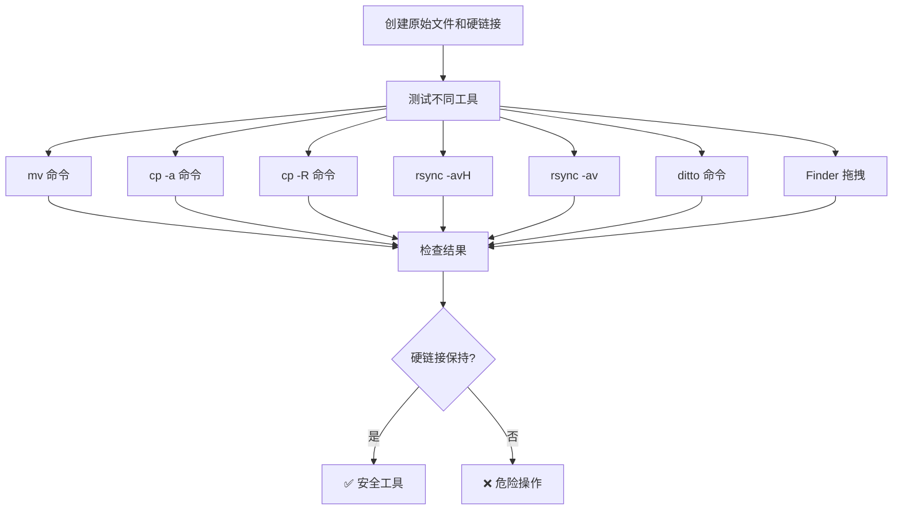
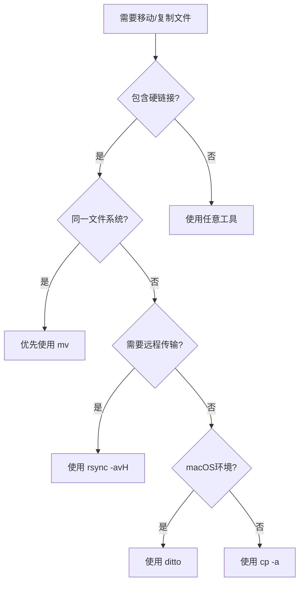

В процессе ежедневного управления файлами и миграции системы мы часто сталкиваемся с некоторыми, казалось бы, простыми, но на самом деле скрытыми тайнами. Недавно, в процессе перехода на новый Mac, я обнаружил интересный феномен, связанный с жесткими ссылками: одни и те же файлы после миграции превратились в отдельные копии. Это открытие заставило меня углубиться в изучение различных инструментов для работы с файлами, и результаты оказались удивительными - существует огромная разница в том, как разные инструменты обрабатывают жесткие ссылки.

<!--more-->

## 什么是硬链接

Жесткая привязка - это важная концепция файловой системы Unix/Linux. Проще говоря, жесткая привязка - это присвоение нескольких имен одному и тому же фрагменту файловых данных. Представьте, что у вас есть важный контрактный документ. У вас на столе может быть несколько папок, каждая из которых имеет ярлык, указывающий на этот контракт, но на самом деле существует только одна копия контракта.

В файловой системе жесткие ссылки работают следующим образом: фактические данные файла хранятся на диске, а inode (индексный узел) содержит информацию о метаданных файла. Когда вы создаете жесткую ссылку, вы фактически создаете новый элемент каталога, но этот элемент указывает на тот же инод:

- Несколько имен файлов указывают на одни и те же данные
- Если вы измените одну из жестких ссылок, содержимое, видимое другими ссылками, будет изменено одновременно.
- Данные файла действительно удаляются только после удаления всех жестких ссылок.
- Все жесткие ссылки имеют одинаковый номер inode.

Вы можете просмотреть информацию о жесткой ссылке файла с помощью следующей команды:

```bash
# 查看文件的 inode 号码和链接计数
ls -li filename
# 或者使用 stat 命令获取详细信息
stat filename
```

## 问题的发现

При переносе со старого Mac на новый я использовал стандартный tarball для резервного копирования файлов. Мне казалось, что все идет хорошо, но потом я понял, что два файла, которые должны быть связаны, стали отдельными копиями:

```bash
# 文件A的状态
Inode: 1220909     Links: 1

# 文件B的状态  
Inode: 1206388     Links: 1
```

Здесь `Links: 1` указывает на то, что каждый файл имеет только одну жесткую ссылку, то есть они больше не связаны. При нормальной жесткой связи мы бы увидели тот же номер inode и значение `Links: 2` или выше.

## 深度实验：不同工具的硬链接处理行为

Чтобы докопаться до сути проблемы, я провел два полных цикла испытаний, чтобы проверить поведение жестких связей в различных рабочих сценариях.



Я написал полные тестовые скрипты для проверки поведения этих различных инструментов, и вы можете найти полный код на [GitHub Gist](https://gist.github.com/donghao1393/f365cd6141fb8a0e6accbcda746cbe7c).

### 第一轮测试：基础场景验证

```
📊 初始硬链接状态:
原始文件: Inode: 24073611, Links: 3
硬链接1:  Inode: 24073611, Links: 3  
硬链接2:  Inode: 24073611, Links: 3

🔄 Вариант 1 - прямая распаковка.
✅ Жесткие связи остаются нетронутыми

🚚 Вариант 2 - перемещение cp (симуляция перетаскивания).
❌ Утрата жесткой связи

📦 方案3 - mv移动:
✅ 硬链接关系保持完好
```

### 第二轮测试：各种工具的详细对比

Дальнейшие эксперименты выявили более детальные различия в инструментальном поведении:

```
🟢 始终保持硬链接：
• mv命令: Inode保持不变，Links: 3 → 3
• cp -a命令: 新inode，但Links: 3 → 3
• ditto命令: 新inode，但Links: 3 → 3

🟡 Настраиваемая обработка жестких ссылок:
- rsync -avH: Ссылки: 3 → 3 (вывод показывает файл1 => файл2)
- rsync -av: Ссылки: 3 → 1 (каждый файл независимо)

🔴 破坏硬链接：
• cp -R命令: Links: 3 → 1 (创建独立副本)
• Finder拖拽: Links: 3 → 1 (相当于cp -R)
```

## 关键发现与深度分析

### 核心发现：mv 是最"原生"的操作

Эксперименты подтвердили важное предположение: **команда `mv` действительно является самой "родной" файловой операцией**. В пределах одной и той же файловой системы `mv` изменяет только структуру каталогов файловой системы (таблицу inode) и не предполагает никакого реального копирования данных. Вот почему `mv` перемещает файл размером 1 ГБ почти так же быстро, как файл размером 1 КБ - она просто изменяет запись в таблице каталогов.

### Finder 拖拽的真相

**Операция "перемещения" с помощью drag-and-drop в macOS Finder на самом деле представляет собой комбинацию copy + delete**, что эквивалентно удалению исходного файла после `cp -R`. Такая конструкция, в большинстве случаев не имеющая смысла для пользователя, нарушает специальные возможности файловой системы, такие как жесткие и символические ссылки.

### 工具行为分类

Основываясь на результатах экспериментов, мы можем разделить инструменты для работы с файлами на три категории:

**🟢 Инструмент, ориентированный на файловую систему** (всегда сохраняет жесткие ссылки):
- `mv`: переименование на уровне файловой системы с полным сохранением исходных атрибутов
- `cp -a`: инструмент копирования, специально разработанный для сохранения всех атрибутов файлов
- `ditto`: родной инструмент macOS, оптимизированный для HFS+/APFS

**🟡 Настраиваемый инструмент** (требует определенных параметров):
- `rsync -avH`: параметр `-H` предназначен для работы с жесткими ссылками
- `tar`: жесткие ссылки поддерживаются по умолчанию, если специально не указано, что они не должны поддерживаться

**🔴 Инструмент, ориентированный на данные** (игнорирует специальные атрибуты):
- `cp -R`: ориентирован на репликацию данных, игнорирует отношения жестких ссылок
- Finder drag-and-drop: удобен в использовании, но теряет свойства файловой системы

### rsync 的巧妙设计

Интересную деталь можно увидеть в выводе rsync:

```bash
# rsync -avH 显示硬链接关系
subdir1/hardlink1.txt => subdir2/hardlink2.txt
original.txt => subdir2/hardlink2.txt
```

Знак `=>` здесь указывает на то, что rsync не только обнаруживает жесткие связи, но и интеллектуально восстанавливает их в целевом месте. Это делает rsync идеальным средством для поддержания жестких связей в удаленных резервных копиях.

## 最佳实践指南

На основе подробных результатов экспериментов мы приводим лучшие практики поддержания жестких ссылок:

### 🥇 首选方案：直接操作
```bash
# 方案1: 直接解压到目标位置
tar -xzf backup.tar.gz -C /target/directory

# 方案2: 使用 mv 移动（最 native 的操作）
tar -xzf backup.tar.gz
mv extracted_directory /target/location/
```

### 🥈 替代方案：专用工具
```bash
# 方案3: 使用 cp -a（GNU coreutils）
cp -a source_directory /target/location/

# 方案4: 使用 ditto（macOS 原生）
ditto source_directory /target/location/

# 方案5: 使用 rsync 带硬链接支持
rsync -avH source_directory/ /target/location/
```

### 🚫 应该避免的操作
```bash
# ❌ 这些操作会破坏硬链接
cp -R source_directory /target/location/     # 普通复制
rsync -av source_directory/ /target/location/ # 无 -H 参数
# ❌ Finder 拖拽移动
```

### 跨文件系统的特殊情况

Обратите внимание, что даже `mv` деградирует до режима копирования+удаления, когда операция охватывает разные файловые системы (например, разные разделы диска):

```bash
# 检查是否在同一文件系统
df source_directory target_directory

# 如果跨文件系统，优先使用 rsync -avH
rsync -avH --progress source/ /different/filesystem/target/
```

## 检测和修复硬链接

Если вы подозреваете, что некоторые файлы изначально должны были быть жестко связаны между собой, вы можете проверить и исправить это с помощью следующих методов:

### 检查文件是否应该是硬链接
```bash
# 比较文件内容
diff file1 file2

# 如果内容相同且文件大小、时间戳相同，很可能原本是硬链接
```

### 重新建立硬链接关系
```bash
# 删除其中一个文件并创建硬链接
rm duplicate_file
ln original_file duplicate_file

# 验证硬链接创建成功
ls -li original_file duplicate_file
```

## 实际应用场景与工具选择

Понимание поведения различных инструментов при работе с жесткими ссылками очень важно в следующих сценариях:

### 开发环境迁移
现代开发工具大量使用硬链接优化存储：
- **npm/yarn**：node_modules 中的包去重
- **Docker**：镜像层的存储优化
- **Git**：对象存储的空间节省
- **Homebrew**：软件包的版本管理

Совет по выбору: используйте `ditto` (macOS) или `rsync -avH` (кросс-платформа).

### 服务器环境管理
服务器中硬链接的典型应用：
- **日志轮转**：logrotate 使用硬链接管理历史日志
- **配置管理**：多环境配置文件的版本控制
- **备份策略**：增量备份中的重复数据消除

Предлагаемые варианты: `rsync -avH` для удаленной синхронизации, `cp -a` для локальных операций

### 个人数据管理
普通用户的硬链接使用场景：
- **照片管理**：同一张照片在不同相册中的引用
- **文档版本**：重要文档的多版本管理
- **媒体文件**：大文件的多位置访问

Предлагаемые варианты: Finder для повседневного использования, `ditto` для крупных миграций.

### 云存储同步
不同云服务对硬链接的处理：
- **Dropbox/OneDrive**：通常会将硬链接转换为独立文件
- **rsync + 远程服务器**：可以保持硬链接关系
- **Git LFS**：有自己的重复数据处理机制

Выбор рекомендации: использовать решение для синхронизации, поддерживающее жесткие ссылки, или согласиться на преобразование в отдельные файлы.

## 深度总结与思考

В ходе углубленных экспериментов и анализа мы выявили существенные различия в том, как инструменты для работы с файлами обрабатывают жесткие ссылки. Эти выводы не только касаются конкретных проблем миграции, но и, что более важно, позволяют понять философию дизайна различных инструментов.

### 工具设计哲学的差异

- **`mv`**: стремится к минимальным операциям, атомарные операции на уровне файловой системы
- **`cp -a`**: стремление к целостности, сохранение всех возможных атрибутов файла
- **`rsync`**: стремление к гибкости, настраиваемые политики синхронизации
- **`ditto`**: для совместимости, оптимизированы для конкретных файловых систем
- **Finder**: для удобства пользователей, скрывает сложные технические детали

### 关键原则

1. **Понимание природы инструмента**: инструменты с графическим интерфейсом часто упрощают операции и могут потерять специальные свойства
2. **Выбор правильного инструмента**: выбирайте не самый привычный инструмент, а наиболее подходящий для ваших конкретных нужд.
3. **Проверяйте результаты**: проверяйте целостность файла после выполнения важных операций, особенно специальные свойства
4. **Понимание кроссплатформенных различий**: в поведении инструментов для разных операционных систем могут быть различия

### 实用决策树



### 最后的思考

Благодаря этому исследованию мы поняли, что **выбор инструмента - это не только функциональность, но и понимание механизмов**. Когда мы поймем, что `mv` - самая "родная" операция, что перетаскивание в Finder - это, по сути, операция копирования, а параметр `-H` в rsync работает исключительно с жесткими ссылками, мы сможем сделать осознанный выбор при столкновении с подобными проблемами.

В эпоху доминирования графических интерфейсов периодическое погружение в недра командной строки и файловой системы не только решает реальные проблемы, но и углубляет наше понимание компьютерных систем. В конце концов, понимание природы инструмента позволяет лучше его использовать.

В следующий раз, когда вы будете выполнять важную операцию с файлом, остановитесь и подумайте: как этот инструмент будет обрабатывать важные для меня атрибуты файла? Выбор правильного инструмента зачастую важнее решения проблемы.