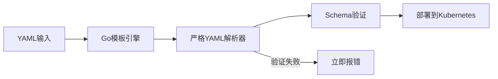
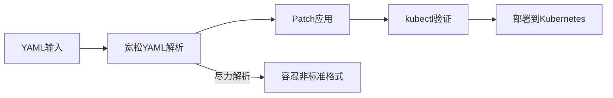
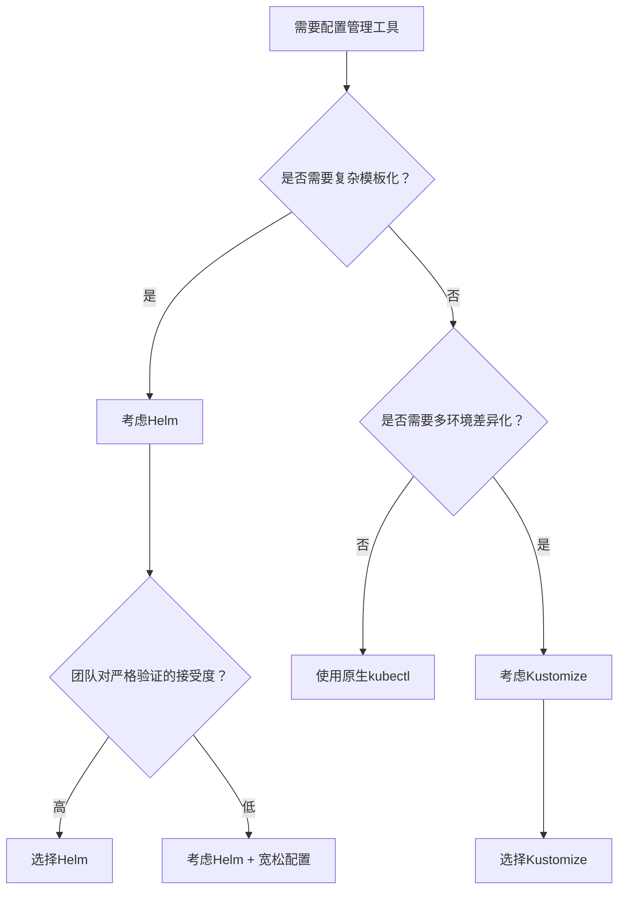

你是否遇过这样的情况：同样的YAML配置文件，在一个环境用Helm部署就报错，换到另一个环境用Kustomize却能成功？如果你曾经被这种"灵异现象"困扰过，那这篇文章将为你揭开真相。

<!--more-->

## 问题现象：同样的配置，不同的结果

最近我们在处理Kubernetes ingress配置时遇到了一个有趣的现象。同一份YAML配置文件：

```yaml
ingress:
  paths:
    - path: "/(?!service\/|admin)(.*)"
      pathType: ImplementationSpecific
```

在使用Helm管理的Stage环境中，这个配置会导致部署失败，错误信息如下：

```
Error: failed to parse helm/values.yaml: 
error converting YAML to JSON: yaml: line 64: found unknown escape character
```

但是在使用Kustomization管理的Test环境中，同样的配置却能成功部署并正常工作。

更奇怪的是，当我们查看已部署的资源时，发现两个环境中存储的路径格式竟然不同：

```bash
# Stage环境 (Helm管理)
$ kubectl get ingress web-portal -o yaml | yq .spec.rules[0].http.paths[0].path
/(?!service/|admin)(.*)

# Test环境 (Kustomization管理)  
$ kubectl get ingress web-portal -o yaml | yq .spec.rules[0].http.paths[0].path
/(?!service\/|admin)(.*)
```

## 根本原因：不同的YAML验证哲学

经过深入调研，我们发现这个现象背后反映的是两种不同的工具设计哲学和技术实现差异。

### Helm：严格验证的"完美主义者"

Helm采用了严格的YAML验证策略，其处理流程如下：



**技术细节：**
- 使用Go语言的`ghodss/yaml`库进行YAML解析
- 严格遵循YAML 1.2规范
- 对未知转义序列（如`\/`）会立即报错
- 采用"快速失败"(Fail Fast)策略

在我们的案例中，`\/`被Go YAML解析器识别为未知的转义序列，因为在YAML规范中，正斜杠`/`本身不需要转义。

### Kustomize：宽松处理的"实用主义者"

Kustomize采用了更加宽松的验证策略：



**技术细节：**
- 采用更宽松的YAML解析策略
- 将有争议的内容作为字面量处理
- 最终通过kubectl进行验证和部署
- 采用"尽力而为"(Best Effort)策略

## 深入技术细节：为什么会有这种差异？

### 1. YAML规范的灰色地带

YAML规范对转义字符的定义存在一些模糊性。在双引号字符串中：

- `\"` - 合法的转义序列（双引号）
- `\\` - 合法的转义序列（反斜杠）
- `\/` - 这个就有争议了

根据YAML 1.2规范，正斜杠`/`在YAML中不需要转义，因此`\/`技术上可以被认为是"未知转义序列"。

### 2. 不同的Go库实现差异

**Helm使用的解析库**更严格：
```go
// Helm使用的ghodss/yaml库会严格检查转义序列
func parseYAML(data []byte) error {
    if containsUnknownEscape(data) {
        return fmt.Errorf("unknown escape character")
    }
    // ...
}
```

**Kustomize和kubectl使用的解析库**更宽松：
```go
// 更宽松的解析策略
func parseYAML(data []byte) error {
    // 尝试解析，遇到可疑内容时作为字面量处理
    return tryBestEffortParse(data)
}
```

### 3. 处理流程的差异

让我们详细对比两者的处理流程：

| 阶段 | Helm | Kustomize | 结果差异 |
|------|------|-----------|----------|
| **YAML语法验证** | 严格验证 | 宽松解析 | Helm拒绝`\/`，Kustomize接受 |
| **转义字符处理** | Go YAML严格模式 | 兼容模式 | 不同的容忍度 |
| **模板处理** | 预处理Go模板 | 无模板层 | Helm有额外验证层 |
| **最终存储** | `/(?!service/|admin)(.*)` | `/(?!service\/|admin)(.*)` | 格式不同但功能等价 |

## 实际解决方案

基于我们的分析，这里提供几种解决方案：

### 方案1：使用单引号（推荐）

单引号在YAML中是字面量字符串，不进行转义处理：

```yaml
ingress:
  paths:
    - path: '/(?!service/|admin)(.*)'  # 推荐：使用单引号
      pathType: ImplementationSpecific
```

### 方案2：正确的双引号转义

如果必须使用双引号，那么正确的写法是：

```yaml
ingress:
  paths:
    - path: "/(?!service/|admin)(.*)"   # 正确：不转义正斜杠
      pathType: ImplementationSpecific
```

### 方案3：工具链兼容性检查

在CI/CD流程中添加YAML语法检查：

```bash
# 添加到CI/CD流程中
yamllint values.yaml
helm template . --dry-run --debug
```

## 更广泛的影响：选择合适的工具

这个案例反映了更深层的问题：如何选择合适的Kubernetes配置管理工具？

### Helm适合的场景：
- **复杂应用部署**：需要模板化和参数化的复杂应用
- **包管理需求**：需要版本控制、依赖管理的场景
- **严格规范环境**：希望在早期发现配置问题的团队

### Kustomize适合的场景：
- **环境差异化**：需要为不同环境定制配置的场景
- **渐进式迁移**：从传统YAML配置逐步迁移的项目
- **简单直观**：希望避免模板复杂性的团队

## 工程实践建议

基于这次深入分析，我们提出以下工程实践建议：

### 1. 统一配置规范
```yaml
# 团队YAML编写规范
rules:
  - 正则表达式路径使用单引号
  - 避免在YAML中使用不必要的转义
  - 在CI中添加多工具兼容性检查
```

### 2. 工具选择决策树



### 3. 混合方案

对于大型项目，可以考虑混合使用：

```bash
# 使用Helm进行基础应用打包
helm template my-app ./helm-chart > base-manifests.yaml

# 使用Kustomize进行环境定制
kustomize build overlays/production | kubectl apply -f -
```

## 技术展望：未来的发展方向

随着Kubernetes生态的成熟，配置管理工具也在不断进化：

### 1. 标准化趋势
- **OCI支持**：Helm和Kustomize都在向OCI标准靠拢
- **CUE集成**：新的配置语言CUE提供更强的类型安全

### 2. 工具融合
- **kubectl内置Kustomize**：kubectl已经内置了Kustomize功能
- **Helm与Kustomize结合**：越来越多的项目开始混合使用

### 3. AI辅助配置
- **智能验证**：AI可以帮助检测配置中的潜在问题
- **自动修复**：基于最佳实践自动修复常见配置错误

## 结语

这个看似简单的YAML转义字符问题，实际上揭示了不同工具背后的设计哲学差异。Helm的严格验证帮助我们在早期发现问题，而Kustomize的宽松处理让我们能够快速适应不同场景。

没有完美的工具，只有合适的选择。理解每个工具的特点和限制，才能在复杂的云原生环境中做出最佳决策。

作为云原生工程师，我们不仅要掌握工具的使用，更要理解工具背后的原理。只有这样，当我们遇到"灵异现象"时，才能快速定位问题的根本原因，并制定出有效的解决方案。

---

*你是否在实际工作中遇到过类似的工具差异问题？欢迎在评论区分享你的经验和见解。如果你觉得这篇文章有帮助，不妨分享给你的团队同事，一起提升云原生实践的水平。*
