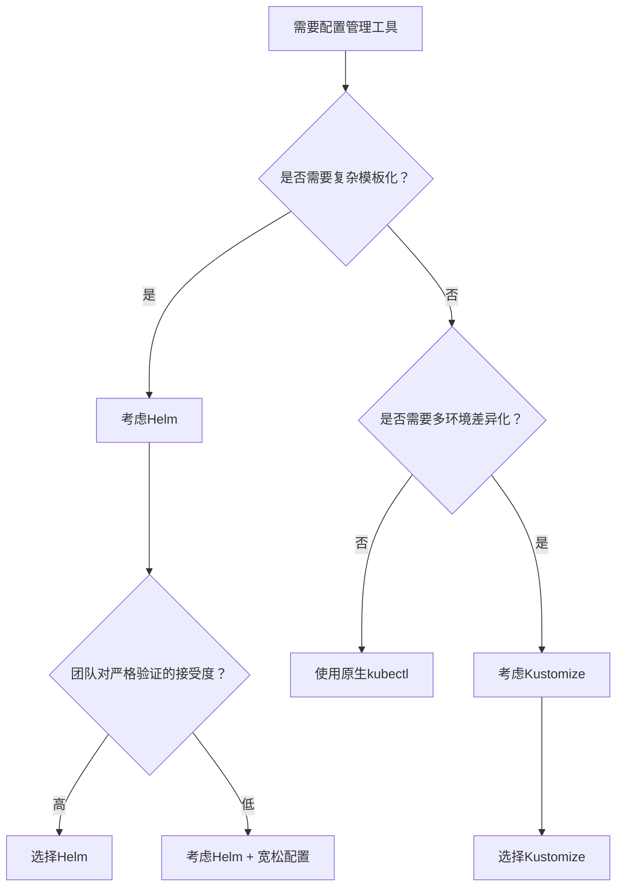

Сталкивались ли вы когда-нибудь с такой ситуацией: один и тот же файл конфигурации YAML в одном окружении с развертыванием Helm выдает ошибку, в другом окружении с Kustomize - ошибку, но успешно? Если вас когда-нибудь беспокоил этот "психический феномен", то эта статья раскроет вам правду.

<! --подробнее-->

## Проблема: одна и та же конфигурация, разные результаты

Недавно мы столкнулись с интересным феноменом при работе с конфигурацией Kubernetes ingress. Один и тот же конфигурационный файл YAML:

```yaml
ingress:
  paths:
    - path: "/(?!service\/|admin)(.*)"
      pathType: ImplementationSpecific
```.

В среде Stage, управляемой с помощью Helm, такая конфигурация приводит к сбою развертывания со следующим сообщением об ошибке:

```
Error: failed to parse helm/values.yaml: 
error converting YAML to JSON: yaml: line 64: found unknown escape character
```

Однако в тестовой среде, управляемой с помощью Kustomization, эта же конфигурация успешно развертывается и работает нормально.

Что еще более странно, так это то, что когда мы смотрим на развернутые ресурсы, мы обнаруживаем, что формат путей, сохраненных в двух средах, удивительно отличается:

```bash
# Stage环境 (Helm管理)
$ kubectl get ingress web-portal -o yaml | yq .spec.rules[0].http.paths[0].path
/(?!service/|admin)(.*)

# Test环境 (Kustomization管理)  
$ kubectl get ingress web-portal -o yaml | yq .spec.rules[0].http.paths[0].path
/(?!service\/|admin)(.*)
```.

## Коренная причина: разные философии проверки YAML.

После глубокого исследования мы обнаружили, что за этим явлением скрываются две разные философии разработки инструментов и различия в технической реализации.

### Helm: "Перфекционист" для строгой валидации

Helm использует строгую стратегию проверки YAML, которая осуществляется следующим образом:

```mermaid
graph LR
    A[YAML输入] --> B[Go模板引擎]
    B --> C[严格YAML解析器]
    C --> D[Schema验证]
    D --> E[部署到Kubernetes]
    
    C -->|验证失败| F[立即报错]
```.

**Технические детали:**.
- Использует библиотеку `ghodss/yaml` языка Go для разбора YAML
- Строго следует спецификации YAML 1.2
- Немедленно сообщает об ошибках для неизвестных управляющих последовательностей (например, `\/`).
- Принятие политики Fail Fast.

В нашем случае `\/` распознается парсером Go YAML как неизвестная управляющая последовательность, поскольку прямой слэш `/` не нуждается в экранировании в самой спецификации YAML.

### Kustomize: "прагматик" свободной обработки.

Kustomize использует более мягкую стратегию валидации:

```mermaid
graph LR
    A[YAML输入] --> B[宽松YAML解析]
    B --> C[Patch应用]
    C --> D[kubectl验证]
    D --> E[部署到Kubernetes]
    
    B -->|尽力解析| F[容忍非标准格式]
```.

**Технические подробности:**
- Применяет более мягкую стратегию разбора YAML
- Рассматривает спорное содержимое как литералы
- Окончательная проверка и развертывание через kubectl.
- Применяется стратегия Best Effort.

## Переходим к техническим тонкостям: в чем разница?

### 1. Серые зоны спецификации YAML.

В спецификации YAML есть некоторая двусмысленность в определении управляющих символов. В строках с двойными кавычками:

- `\"` - законная управляющая последовательность (двойные кавычки)
- `\\` - законная последовательность экранирования (обратная косая черта)
- `\/` - этот вариант является спорным

Согласно спецификации YAML 1.2, прямой слэш `/` не нужно экранировать в YAML, поэтому `\/` технически можно считать "неизвестной последовательностью экранирования".

### 2. Различия в реализации библиотек Go

**Helm использует более строгую библиотеку парсинга**:
```go
// Helm使用的ghodss/yaml库会严格检查转义序列
func parseYAML(data []byte) error {
    if containsUnknownEscape(data) {
        return fmt.Errorf("unknown escape character")
    }
    // ...
}
```.

**Kustomize и kubectl используют более мягкую библиотеку парсинга**: ```go
// Helm使用的ghodss/yaml库会严格检查转义序列
func parseYAML(data []byte) error {
    if containsUnknownEscape(data) {
        return fmt.Errorf("unknown escape character")
    }
    // ...
}
```:
```go
// 更宽松的解析策略
func parseYAML(data []byte) error {
    // 尝试解析，遇到可疑内容时作为字面量处理
    return tryBestEffortParse(data)
}
```.

### 3. Различия в потоке обработки

Давайте сравним поток обработки в этих двух системах:

| Stage | Helm | Kustomize | Result Difference |
|------|------|-----------|----------|
| **Проверка синтаксиса YAML** | Строгая проверка | Свободный парсинг | Helm отклоняет `\/`, Kustomize принимает |
| **Обработка индийских символов** | Переход на строгий режим YAML | Режим совместимости | Различные допуски |
| **Обработка шаблонов** | Предварительно обработанные шаблоны Go | Без слоя шаблонов | Рулевой с дополнительным слоем валидации |
| **Окончательное хранение** | `/(?!service/|admin)(.*)` | `/(?!service\/|admin)(.*)` | Разные форматы, но функционально эквивалентные |

## Практическое решение

На основе проведенного анализа мы предлагаем несколько решений:

### Решение 1: Использовать одинарные кавычки (рекомендуется)

Одиночные кавычки являются буквальными строками в YAML и не экранируются:

```yaml
ingress:
  paths:
    - path: '/(?!service/|admin)(.*)'  # 推荐：使用单引号
      pathType: ImplementationSpecific
```.

### Вариант 2: Правильное экранирование двойных кавычек

Если необходимо использовать двойные кавычки, то правильным способом их написания будет следующий:

```yaml
ingress:
  paths:
    - path: "/(?!service/|admin)(.*)"   # 正确：不转义正斜杠
      pathType: ImplementationSpecific
```.

### Вариант 3: Проверка совместимости с цепочкой инструментов

Добавьте проверку синтаксиса YAML в процесс CI/CD:

```bash
# 添加到CI/CD流程中
yamllint values.yaml
helm template . --dry-run --debug
```

## Более широкие последствия: выбор правильных инструментов

Этот случай отражает более глубокий вопрос: как правильно выбрать инструмент управления конфигурацией Kubernetes?

### Сценарии использования Helm:
- **Сложные развертывания приложений**: сложные приложения, требующие шаблонизации и параметризации.
- **Требования к управлению пакетами**: сценарии, требующие контроля версий, управления зависимостями
- **Строго регулируемые среды**: команды, которые хотят выявлять проблемы с конфигурацией на ранних стадиях.

### Kustomize соответствует сценариям:
- **Дифференциация сред**: сценарии, требующие индивидуальных конфигураций для разных сред.
- **Инкрементная миграция**: проекты, постепенно переходящие от традиционных конфигураций YAML
- **Простые и интуитивные**: команды, которые хотят избежать сложности шаблонов

## Рекомендации по инженерной практике

Основываясь на этом глубоком анализе, мы предлагаем следующие рекомендации по инженерной практике:

### 1. Согласовать спецификации конфигурации
```yaml
# 团队YAML编写规范
rules:
  - 正则表达式路径使用单引号
  - 避免在YAML中使用不必要的转义
  - 在CI中添加多工具兼容性检查
```.

### 2. Дерево принятия решений по выбору инструмента



### 3. Гибридные программы

Для крупных проектов рассмотрите возможность сочетания:

```bash
# 使用Helm进行基础应用打包
helm template my-app ./helm-chart > base-manifests.yaml

# 使用Kustomize进行环境定制
kustomize build overlays/production | kubectl apply -f -
```.

## Перспективы развития технологий: будущие направления

По мере развития экосистемы Kubernetes развиваются и инструменты управления конфигурациями:

### 1. Тенденции стандартизации
- Поддержка **OCI**: и Helm, и Kustomize приближаются к стандарту OCI.
- **Интеграция с CUE**: новый язык конфигурации CUE обеспечивает более высокую безопасность типов.

### 2. Интеграция инструментов
- **Kubectl встроил Kustomize**: kubectl уже имеет встроенную функциональность Kustomize
- **Helm в сочетании с Kustomize**: все больше и больше проектов начинают использовать сочетание

### 3. Конфигурация с помощью ИИ
- **Интеллектуальная проверка**: ИИ может помочь обнаружить потенциальные проблемы в конфигурации
- **Автоисправление**: автоматическое исправление распространенных ошибок конфигурации на основе лучших практик

### Заключение

Эта, казалось бы, простая проблема со сбегающими символами YAML на самом деле показывает разницу в философии проектирования различных инструментов. Строгая проверка Helm помогает нам обнаружить проблемы на ранней стадии, в то время как свободная обработка Kustomize позволяет нам быстро адаптироваться к различным сценариям.

Идеального инструмента не существует, есть только правильный выбор. Понимание особенностей и ограничений каждого инструмента - единственный способ принимать оптимальные решения в сложных облачных нативных средах.

Как инженеры облачных решений, мы должны не только освоить использование инструментов, но и понять принципы, лежащие в их основе. Только так мы сможем быстро определить первопричину проблемы и разработать эффективное решение, когда столкнемся с "психическим феноменом".

---

*Сталкивались ли вы в своей работе с подобными несоответствиями инструментов? Не стесняйтесь поделиться своим опытом и соображениями в разделе комментариев. Если вы нашли эту статью полезной, почему бы не поделиться ею с коллегами по команде и не улучшить свою практику использования облачных технологий вместе? *
