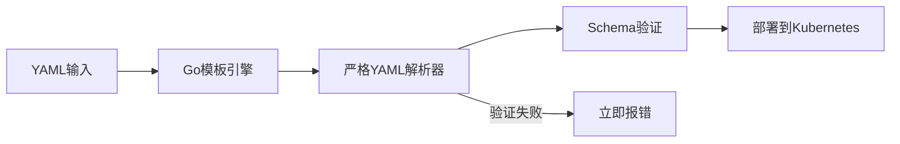
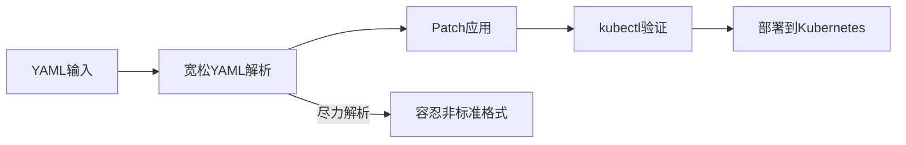
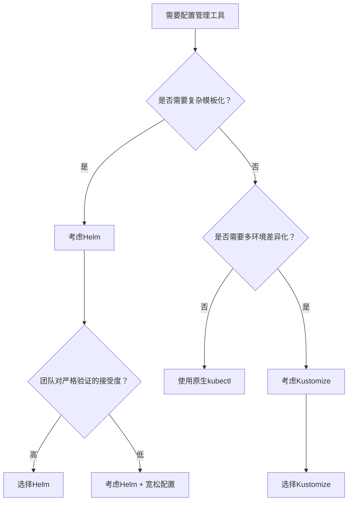

Сталкивались ли вы с такой ситуацией: один и тот же конфигурационный файл YAML в одном окружении с развертыванием Helm выдает ошибку, а изменение в другом окружении с Kustomize может быть успешным? Если вас когда-нибудь беспокоил этот "психический феномен", то эта статья откроет вам правду.

<!--more-->

## 问题现象：同样的配置，不同的结果

Недавно мы столкнулись с интересным явлением при работе с конфигурацией ингресса Kubernetes. Один и тот же конфигурационный файл YAML:

```yaml
ingress:
  paths:
    - path: "/(?!service\/|admin)(.*)"
      pathType: ImplementationSpecific
```

В средах Stage, управляемых с помощью Helm, такая конфигурация приводит к сбою развертывания со следующим сообщением об ошибке:

```
Error: failed to parse helm/values.yaml: 
error converting YAML to JSON: yaml: line 64: found unknown escape character
```

Однако в тестовой среде, управляемой с помощью Kustomization, та же конфигурация успешно развернута и работает нормально.

Еще более странно, что когда мы посмотрели на развернутые ресурсы, то обнаружили, что форматы путей, сохраненные в двух средах, удивительным образом отличаются:

```bash
# Stage环境 (Helm管理)
$ kubectl get ingress web-portal -o yaml | yq .spec.rules[0].http.paths[0].path
/(?!service/|admin)(.*)

# Test环境 (Kustomization管理)  
$ kubectl get ingress web-portal -o yaml | yq .spec.rules[0].http.paths[0].path
/(?!service\/|admin)(.*)
```

## 根本原因：不同的YAML验证哲学

После глубокого исследования мы обнаружили, что за этим явлением стоят две разные философии разработки инструментов и различия в технической реализации.

### Helm：严格验证的"完美主义者"

Helm использует строгую политику аутентификации YAML, которая обрабатывается следующим образом:



**Технические детали:**.
- Использует библиотеку `ghodss/yaml` языка Go для разбора YAML
- Строго следует спецификации YAML 1.2
- Строго следует спецификации YAML 1.2. Неизвестные управляющие последовательности (например, `\/`) немедленно выдаются как ошибки.
- Принята политика Fail Fast.

В нашем случае `\/` распознается парсером Go YAML как неизвестная управляющая последовательность, потому что сам прямой слэш `/` в спецификации YAML не требует экранирования.

### Kustomize：宽松处理的"实用主义者"

В Kustomize используется более спокойная стратегия аутентификации:



**Технические подробности:**
- Принята более спокойная стратегия разбора YAML
- Рассматривает противоречивое содержимое как литералы
- Окончательная проверка и развертывание через kubectl.
- Применяйте стратегию Best Effort.

## 深入技术细节：为什么会有这种差异？

### 1. YAML规范的灰色地带

В спецификации YAML есть некоторая двусмысленность в определении управляющих символов. В строках с двойными кавычками:

- \\\"\ - законная последовательность экранирования (двойные кавычки)
- \\\\\" - законная последовательность (обратная косая черта)
- `\/` - этот вариант является спорным

Согласно спецификации YAML 1.2, прямой слэш `/` не нужно экранировать в YAML, поэтому `\/` технически можно считать "неизвестной последовательностью экранирования".

### 2. 不同的Go库实现差异

**Helm使用的解析库**更严格：
```go
// Helm使用的ghodss/yaml库会严格检查转义序列
func parseYAML(data []byte) error {
    if containsUnknownEscape(data) {
        return fmt.Errorf("unknown escape character")
    }
    // ...
}
```

**Kustomize和kubectl使用的解析库**更宽松：
```go
// 更宽松的解析策略
func parseYAML(data []byte) error {
    // 尝试解析，遇到可疑内容时作为字面量处理
    return tryBestEffortParse(data)
}
```

### 3. 处理流程的差异

Давайте сравним эти два процесса подробнее:

| Stage | Helm | Kustomize | Result Difference |
|------|------|-----------|----------|
| **Валидация синтаксиса YAML** | Строгая валидация | Свободный парсинг | Helm отвергает `\/`, Kustomize принимает |
| **Обработка индийских символов** | Строгий режим YAML | Режим совместимости | Различные допуски |
| **Обработка шаблонов** | Предварительно обработанные шаблоны Go | Без слоя шаблонов | Helm имеет дополнительный слой валидации |
| **Окончательное хранение** | `/(? !service/|admin)(. *)` | `/(? !service\/|admin)(. *)` | `/(? !service\/|admin)(. *)` | Разный формат, но функционально эквивалентный |

## 实际解决方案

На основе проведенного анализа мы предлагаем несколько решений:

### 方案1：使用单引号（推荐）

Одиночные кавычки являются буквальными строками в YAML и не экранируются:

```yaml
ingress:
  paths:
    - path: '/(?!service/|admin)(.*)'  # 推荐：使用单引号
      pathType: ImplementationSpecific
```

### 方案2：正确的双引号转义

Если необходимо использовать двойные кавычки, то правильно будет написать так:

```yaml
ingress:
  paths:
    - path: "/(?!service/|admin)(.*)"   # 正确：不转义正斜杠
      pathType: ImplementationSpecific
```

### 方案3：工具链兼容性检查

Добавьте проверку синтаксиса YAML в процесс CI/CD:

```bash
# 添加到CI/CD流程中
yamllint values.yaml
helm template . --dry-run --debug
```

## 更广泛的影响：选择合适的工具

Этот случай отражает более глубокий вопрос: как выбрать правильный инструмент управления конфигурацией Kubernetes?

### Helm适合的场景：
- **复杂应用部署**：需要模板化和参数化的复杂应用
- **包管理需求**：需要版本控制、依赖管理的场景
- **严格规范环境**：希望在早期发现配置问题的团队

### Kustomize适合的场景：
- **环境差异化**：需要为不同环境定制配置的场景
- **渐进式迁移**：从传统YAML配置逐步迁移的项目
- **简单直观**：希望避免模板复杂性的团队

## 工程实践建议

На основе этого глубокого анализа мы предлагаем следующие рекомендации для инженерной практики:

### 1. 统一配置规范
```yaml
# 团队YAML编写规范
rules:
  - 正则表达式路径使用单引号
  - 避免在YAML中使用不必要的转义
  - 在CI中添加多工具兼容性检查
```

### 2. 工具选择决策树



### 3. 混合方案

Для более крупных проектов используйте смесь:

```bash
# 使用Helm进行基础应用打包
helm template my-app ./helm-chart > base-manifests.yaml

# 使用Kustomize进行环境定制
kustomize build overlays/production | kubectl apply -f -
```

## 技术展望：未来的发展方向

По мере развития экосистемы Kubernetes развиваются и инструменты управления конфигурациями:

### 1. 标准化趋势
- **OCI支持**：Helm和Kustomize都在向OCI标准靠拢
- **CUE集成**：新的配置语言CUE提供更强的类型安全

### 2. 工具融合
- **kubectl内置Kustomize**：kubectl已经内置了Kustomize功能
- **Helm与Kustomize结合**：越来越多的项目开始混合使用

### 3. AI辅助配置
- **智能验证**：AI可以帮助检测配置中的潜在问题
- **自动修复**：基于最佳实践自动修复常见配置错误

## 结语

Эта, казалось бы, простая проблема со сбегающими символами YAML на самом деле показывает разницу в философии проектирования различных инструментов: строгая проверка Helm помогает нам обнаружить проблемы на ранней стадии, в то время как свободная работа Kustomize позволяет нам быстро адаптироваться к различным сценариям.

Не существует идеального инструмента, есть только правильный выбор. Понимание особенностей и ограничений каждого инструмента - единственный способ принять оптимальное решение в сложной облачно-нативной среде.

Будучи инженерами облачных технологий, мы должны не только владеть инструментами, но и понимать принципы, лежащие в их основе. Только так, столкнувшись с "паранормальным явлением", мы сможем быстро найти первопричину проблемы и разработать эффективное решение.

---

* Сталкивались ли вы с подобными проблемами несоответствия инструментов на практике? Не стесняйтесь поделиться своим опытом и соображениями в разделе комментариев. Если вы нашли эту статью полезной, почему бы не поделиться ею со своими коллегами по команде и вместе улучшить практику использования "облачных" технологий? *