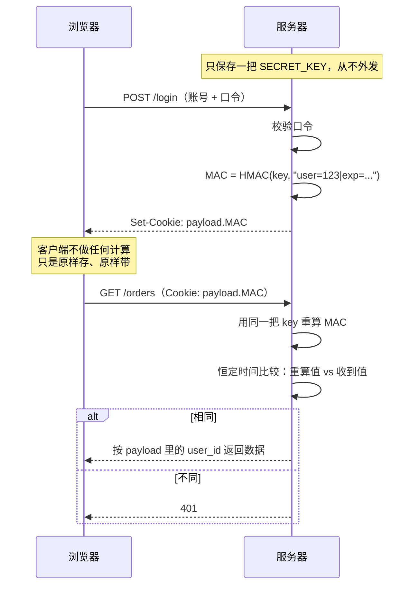

打开 DevTools 的 Cookies 面板，你会看到一串像 `eyJ1c2VyX2lkIjoxMjN9.a3f8c1...` 的值。服务器凭什么相信它？流行答案是一句话：「服务器算一次 MAC，浏览器原样带回来，服务器再算一次，两次相同就放行。」这句话对了一半——而没对上的那一半，正是攻击者要用的地方。

<!--more-->

## 一、先掰正一个用词：MAC 不是加密

很多人第一次听到 MAC，会把它归到「加密」这一大类里，然后顺着「加密」去猜它的性质。这一步走歪，后面全歪。**加密和 MAC 解决的是两个不同的问题：**

| | 目标 | 防御的攻击者 | 输出 |
|---|---|---|---|
| **加密**（AES-GCM、ChaCha20）| 机密性：别人看不懂 | 偷看的人 | 密文（可逆） |
| **MAC**（HMAC、Poly1305）| 完整性 + 真实性：别人改不了、伪造不了 | 篡改的人 | 定长短码（不可逆，也不需要可逆）|

抓一个要害：**加密是双向的，MAC 是单向的。** 加密必须能解回来，否则收信人也没法读；MAC 从来不需要「解回去」——验证者不是去还原什么，而是**重新算一遍，看能不能对上**。

所以「MAC 用的加密算法可不可逆」这个问题本身就问错了。MAC 里只有一个**带密钥的哈希函数**（keyed hash）：

```
MAC = F(密钥 k, 消息 m)
```

它的正确性要求只有两条：

- 同一把 k、同一条 m → 必然得到同一个 MAC
- **不知道 k → 算不出合法的 MAC**

第二条是 MAC 全部安全性的来源，记住它，后面会反复用到。

## 二、签名 Cookie 的完整动作分解

现在把开头那句话拆到原子级。一次签名 Cookie 的完整生命周期只有三个阶段：



用 Python 写出来不到 30 行：

```python
import base64, hashlib, hmac, json, time

SECRET_KEY = b"..."          # 只在服务器上，永不外发

def b64e(raw: bytes) -> str:
    return base64.urlsafe_b64encode(raw).rstrip(b"=").decode()

def b64d(s: str) -> bytes:
    return base64.urlsafe_b64decode(s + "=" * (-len(s) % 4))

def sign(payload: dict) -> str:
    """登录成功时调用一次。"""
    body = json.dumps(payload, separators=(",", ":")).encode()
    mac = hmac.new(SECRET_KEY, body, hashlib.sha256).digest()
    return f"{b64e(body)}.{b64e(mac)}"

def verify(cookie: str) -> dict | None:
    """每个请求调用一次。"""
    try:
        body_b64, mac_b64 = cookie.split(".", 1)
        body, given = b64d(body_b64), b64d(mac_b64)
    except Exception:
        return None                     # 格式不对，直接拒
    expected = hmac.new(SECRET_KEY, body, hashlib.sha256).digest()
    if not hmac.compare_digest(expected, given):
        return None                     # 对不上，拒绝
    data = json.loads(body)
    return data if data.get("exp", 0) > time.time() else None
```

这段代码里有三个容易讲漏、但决定成败的细节：

**① 服务器不存储那个 MAC。** 它只存密钥。验证时是拿「当场重算的值」比「客户端带回来的值」，不是比「这次算的」和「上次算的」——服务器根本没保存过上次算的那个值。

**② 这正是「无状态」的全部含义。** 服务器端没有任何 per-user 的记录，`SECRET_KEY` 一把，所有用户共用。这是它相对 session cookie 的核心卖点，也是它的代价：

| | Session Cookie | 签名 Cookie |
|---|---|---|
| 服务器存储 | 需要 session store（内存 / Redis / 数据库）| **零** |
| 横向扩展 | 需要共享存储或粘性会话 | 任意节点都能验，天然可扩展 |
| 主动吊销 | 删掉那条 session 记录即可 | **做不到**，只能等 `exp` 过期，或换密钥让全部 cookie 一起失效 |
| 服务端重启 | 内存型 session 全丢 | 无影响 |

**③ `hmac.compare_digest` 不是装饰。** 用 `==` 比较两个字节串，Python 会在第一个不同的字节处立刻返回——用时随「前多少个字节匹配」而变化。攻击者可以据此逐字节试出正确的 MAC 值，这叫**定时攻击**（timing attack）。`compare_digest` 无论如何都比完整个字符串，耗时恒定。

> 顺带说：这段代码里 payload 是**明文**（base64 只是编码，不是加密，浏览器把它 `atob` 一下就能读）。签名 Cookie 只保证「没被改」，不保证「看不见」。**把敏感字段放进 payload 是经典的翻车点**——用户 ID、过期时间可以，手机号、身份证、权限细节不行。

## 三、HMAC 为什么不是简单的 `Hash(key + message)`

看到 `HMAC(key, message)`，最自然的实现冲动是：

```python
mac = hashlib.sha256(SECRET_KEY + body).digest()   # ❌ 千万别这么写
```

它在数学上就是**不安全**的，漏洞叫**长度扩展攻击**（length extension attack）。

原因是 SHA-256 这类哈希采用 Merkle–Damgård 结构：它把输入按 64 字节分块，逐块滚动一个内部状态，**最后的哈希值就是最后的内部状态**。于是只要知道：

- 哈希值本身（也就是你手上的 MAC）
- 原始输入的长度

攻击者就能**把这个哈希值直接设为内部状态，从它继续往后喂数据**，算出 `SHA256(key ‖ message ‖ 补齐字节 ‖ 追加内容)` 的哈希。全程不需要知道 `key`。

换成攻击者的视角：你的 cookie 里是 `user=123&role=user`，他能把它变成 `user=123&role=user<padding>&role=admin`，并附上一个**数学上完全正确的 MAC**。服务器重算、比对、通过、放行。

HMAC 用嵌套结构堵死了这条路：

```
HMAC(k, m) = H( (k ⊕ opad) ‖ H( (k ⊕ ipad) ‖ m ) )

  ipad = 0x36 重复到分块长度
  opad = 0x5C 重复到分块长度
```

关键在于**验证方会从原始 m 重算内层哈希**。攻击者扩展出来的那串东西，代入验证公式算不出任何匹配值——外层的哈希是从一个全新的初始状态起步的，而它的输入里含有一个攻击者无法复现的内层结果。长度扩展的前提（「从这个状态接着往后加」）在结构上就不成立了。

这个例子顺手纠正了另一种常见归因错误：

> 「MAC 值可以公开，因为哈希是不可逆的。」

哈希不可逆是真的，但它**不是** MAC 安全的原因。上面那段 `SHA256(key + message)` 用的也是不可逆的 SHA-256，照样被伪造。MAC 的安全来源只有一条——**没有密钥就构造不出新的合法 MAC**。把原因记成「哈希不可逆」，下次遇到「那用个更强的哈希是不是就更安全」时，就会掉进同一个坑里。

（补充一个冷知识：长度扩展攻击对 MD5 / SHA-1 / SHA-2 有效，对 SHA-3 无效，因为 Keccak 用的是海绵结构。这也是 HMAC-SHA256 里那个「HMAC」不可省的原因——换成 SHA-3 才能直接用 `H(k‖m)`，但你没有任何理由这么省。）

## 四、「两次相同」到底证明了什么

现在回答那个真正要命的问题。上表里，「重算的 MAC == 收到的 MAC」能推出什么、不能推出什么：

| ✅ 证明了 | ❌ 没有证明 |
|---|---|
| 这个 cookie 是**持密钥方（我自己）签发的** | 发送请求的人是**用户本人** |
| 内容从签发到现在**没有被篡改** | 这个 cookie 没有被**复制、盗用** |
| payload 里的 `user_id=123` 是我当初写进去的 | 这次请求是**新鲜的**，不是录下来重放的 |

服务器的实际推理链是这样的：

```
MAC 通过 → payload 没被改 → user_id=123 是我自己写的 → 放行 123 的资源
```

「谁在发这个请求」——MAC 一个字都没说。

**这不是理论上的吹毛求疵，写一行 JS 就能验证。** 攻击者用 XSS 把你的 cookie 偷走，在自己的机器上带着它发请求：MAC 校验**完美通过**，服务器把你的订单列表原样返回给他。中间人抓包后原样重放，同样通过。

所以签名 cookie 的正确名字是 **bearer token（不记名凭证）**——像一张不记名的电影票，谁拿着谁进。这跟「防伪激光码」是同一个道理：激光码是真的，说明**票是公司印的、没被伪造**；但码是真的，**不等于持票的就是票上那个人**——票可能是偷来的。

验票真伪和验持票人身份，是**两道独立的工序**。

### 谁在回答「是你本人」

要证明「是你本人」，协议必须要求客户端**当场证明自己持有某个东西**，而不是**出示某个东西**。分水岭就在这：

| | 机制 | 客户端做什么 |
|---|---|---|
| **出示** | 签名 Cookie、JWT、API Key | 把凭证发过去 |
| **证明持有** | mTLS、SCRAM、WebAuthn / passkey、TOTP、挑战-响应 | 现场用私钥签一个挑战值 / 用共享密钥算一个 MAC |

### 那为什么签名 Cookie 这样设计还是对的？

因为 Web 的现实约束是：cookie 只能靠自己携带自己。要在每次请求上绑定「证明持有」，代价高到不现实。所以工程上的分工是：

- **MAC 只负责一件事**：这个 cookie 是不是我签的、有没有被改
- **其余的靠外围**：TLS 保护信道，`HttpOnly` 防 JS 读取（挡 XSS 偷取），`SameSite` 防跨站自动携带（挡 CSRF），短 `exp` 压缩泄露窗口

这也解释了为什么开头那句话「99% 情况下成立」反而危险——**这种模型平时不报错**，它只在攻击发生的那个下午暴露，而那时你已经少了一层防护。

## 五、三把钥匙的坐标系

前面所有内容可以压缩成一句提问：**这个系统里有几把钥匙？分别在谁手上？** 答案直接决定方案的性质。

| 方案 | 密钥持有 | 客户端计算？ | 验证方式 | 性质 |
|---|---|---|---|---|
| 签名 Cookie / JWT **HS256** | **只有服务器** | 否 | 服务器用**同一把**密钥重算比对 | MAC · 不记名 |
| 挑战-响应<br/>（HMAC-OTP、SCRAM、AWS SigV4、Kerberos、OAuth 1.0a）| 双方共享**同一把** | **是** | 服务器用**同一把**密钥重算比对 | MAC · 证明持有 |
| JWT **RS256** / 数字签名 | 服务器持私钥，公钥公开 | 签名方用私钥算 | 用公钥**验签**（不是重算比对）| 数字签名 |

三个必踩的认知坑，一次说清：

**坑 1：「双方各自用自己的密钥算 MAC，相同即通过。」** 这句话在密码学上自相矛盾。MAC 是带密钥的函数，**密钥不同，输出必然不同**。如果两端算出相同结果，那说明它们用的**本来就是同一把**密钥（第二行）。真正的「各持一把不同的钥匙」是数字签名（第三行）——那里不发生「重算比对」，发生的是**验证算法**。

**坑 2：「把密钥放进 cookie，服务器就能验了。」** 这是自毁。浏览器里的密钥等于公开，用户拿着它把 `user=123` 改成 `user=admin`，重算一个合法 MAC 发回去，服务器照单全收。**整个 MAC 机制的安全基石就是密钥只在服务器一侧。**

**坑 3：「mac 用的是非对称加密。」** MAC 从头到尾是**对称**的：签发和验证用同一把密钥。非对称那一支叫数字签名，两者是平行关系，不是同一件事的两种叫法。

数字签名多出来的那个能力叫**不可否认性**（non-repudiation）：因为只有签名方有私钥，他可以向第三方证明「这条消息确实是我发的」。MAC 做不到这一点——验证方自己也持有一份密钥，理论上他也能造出同样的 MAC，所以拿它去第三方仲裁是站不住的。

## 六、工程清单

如果你要自己实现签名 Cookie（或者审计别人的），逐条对照：

- [ ] **密钥只在服务器**，从环境变量 / 密钥管理服务读，不进代码库、不进 cookie、不进日志
- [ ] **恒定时间比较**：Python 用 `hmac.compare_digest`，Go 用 `hmac.Equal`，Node 用 `crypto.timingSafeEqual`。绝不用 `==`
- [ ] **用 HMAC，不用 `Hash(key + msg)`**。现成的库更省心：Flask 的 `itsdangerous`、Django 的 `signing`、Rails 的 `MessageVerifier` 都是这一类
- [ ] **payload 里不放敏感信息**。base64 ≠ 加密，浏览器和攻击者都能直接读
- [ ] **`exp` 必须有**，而且要短。MAC 不提供新鲜性保证，过期时间是唯一的兜底
- [ ] **cookie 属性三件套**：`HttpOnly`（防 JS 读取）、`Secure`（只走 HTTPS）、`SameSite=Lax/Strict`（防 CSRF）
- [ ] **密钥轮换方案**：因为无法主动吊销单个 cookie，出事后只能换密钥让全部失效——提前想好怎么平滑轮换（比如新旧双密钥并存一段时间）
- [ ] **用 JWT 的话，锁死算法**。经典的 `alg: none` 攻击，以及把 RS256 降级成 HS256、拿公钥当 HMAC 密钥用的算法混淆攻击，都是因为服务端「信任了 token 头部里写的算法」。验证时显式指定期望算法，绝不读头部

## 最后

签名 Cookie 是个设计得相当漂亮的机制：一把密钥、零存储、任意节点可验。它的漂亮之处恰恰来自它的克制——**它只承诺「这个 cookie 是我签的」，其余一概不管**。

知道一个机制**在哪里停止承诺**，比知道它怎么工作更重要。

留一个问题给你：你现在系统里的会话凭证，如果它今天被完整复制到另一台机器上发请求，你的服务器能区分出来吗？如果不能，你打算在哪一层补上这道工序——传输层（TLS / mTLS）、应用层（绑定设备指纹、一次性 nonce），还是干脆承认它就是个 bearer，然后把它能造成的损失压到最小（短过期、最小权限、敏感操作二次验证）？

## 参考

- [RFC 2104 — HMAC: Keyed-Hashing for Message Authentication](https://www.rfc-editor.org/rfc/rfc2104)
- [RFC 7518 — JSON Web Algorithms (JWA)，HS256 的定义](https://www.rfc-editor.org/rfc/rfc7518)
- [RFC 6750 — The OAuth 2.0 Authorization Framework: Bearer Token Usage](https://www.rfc-editor.org/rfc/rfc6750)
- [Python 官方文档 — hmac.compare_digest](https://docs.python.org/3/library/hmac.html#hmac.compare_digest)
- [Wikipedia — Length extension attack](https://en.wikipedia.org/wiki/Length_extension_attack)
- [Wikipedia — Merkle–Damgård construction](https://en.wikipedia.org/wiki/Merkle%E2%80%93Damg%C3%A5rd_construction)
