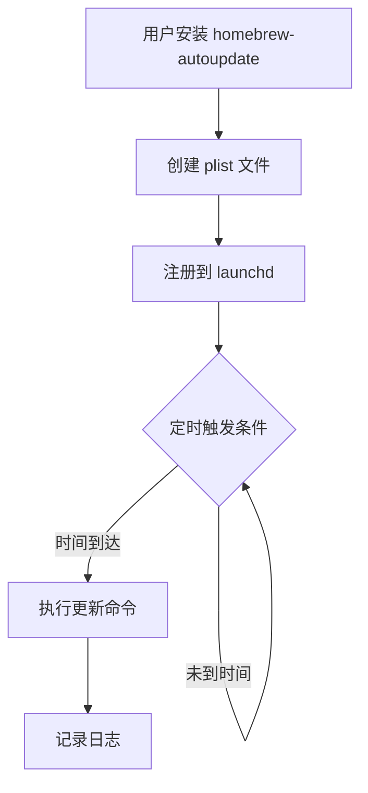

# 深入理解 Homebrew 自动更新：从原理到实践

在 macOS 生态系统中，Homebrew 已经成为开发者和高级用户管理软件包的首选工具。然而，手动维护 Homebrew 及其安装的软件包可能会变得繁琐，特别是当你的工作流依赖于多个工具时。本文将深入探讨如何通过 homebrew-autoupdate 实现自动化更新，并详细解析其工作原理和最佳实践。

<!--more-->

## Homebrew 更新机制解析

### Homebrew 的更新流程

Homebrew 的更新主要包含两个步骤：
1. `brew update`：更新 Homebrew 本身及其软件包索引
2. `brew upgrade`：升级已安装的软件包到最新版本

这个过程看似简单，但实际上涉及到复杂的依赖关系管理。当你运行 `brew upgrade` 时，Homebrew 会检查所有已安装包的依赖关系，并按照正确的顺序更新它们。这种全面更新虽然保证了系统的一致性，但也带来了潜在的风险：依赖包的更新可能会引入不兼容的变化，导致主要应用程序出现问题。

### 依赖更新的风险

想象一下这个场景：你安装了应用 A，它依赖于库 B 的 1.0 版本。某天，库 B 发布了 2.0 版本，引入了重大变化。如果你执行全面更新，库 B 会升级到 2.0 版本，但应用 A 可能尚未适配这个新版本，从而导致功能失效。

这就是为什么有时候我们需要一种更保守的更新策略，只更新那些我们直接安装的"顶层"包，而不是所有的依赖包。

## homebrew-autoupdate 工具详解

### 工作原理

homebrew-autoupdate 是一个 Homebrew 的第三方插件，它利用 macOS 的 launchd 系统（macOS 的服务管理框架，类似于 Linux 的 systemd）来定期执行 Homebrew 更新命令。

当你启动 homebrew-autoupdate 时，它会：
1. 创建一个 plist 文件，定义自动更新的配置
2. 将该文件注册到 launchd 系统
3. 根据配置定期执行更新命令

### 新特性：--leaves-only 选项

最近，homebrew-autoupdate 引入了一个重要的新特性：`--leaves-only` 选项。这个选项使用 `brew leaves` 命令来识别"顶层"包（即不是作为依赖项安装的包），并且只更新这些包。

在技术实现上，它通过以下步骤工作：
1. 使用 `brew leaves` 获取所有顶层包的列表
2. 创建一个临时脚本来处理这个列表
3. 只对这些包执行 `brew upgrade` 命令

这种方法大大减少了因依赖更新导致的兼容性问题，提供了一种更安全的自动更新策略。

## 高级配置与定制

### 使用 launchd 精确控制更新时间

虽然 homebrew-autoupdate 默认使用时间间隔（如每24小时）来触发更新，但我们可以通过修改 plist 文件来实现更精确的时间控制。

以下是 launchd 的 plist 文件结构示例，配置为每天凌晨 4 点 25 分运行：

```xml
<?xml version="1.0" encoding="UTF-8"?>
<!DOCTYPE plist PUBLIC "-//Apple//DTD PLIST 1.0//EN" "http://www.apple.com/DTDs/PropertyList-1.0.dtd">
<plist version="1.0">
<dict>
    <key>Label</key>
    <string>com.github.domt4.homebrew-autoupdate</string>
    <key>ProgramArguments</key>
    <array>
        <string>/bin/bash</string>
        <string>-c</string>
        <string>/opt/homebrew/bin/brew update && /opt/homebrew/bin/brew leaves | xargs /opt/homebrew/bin/brew upgrade --formula -v && /opt/homebrew/bin/brew cleanup</string>
    </array>
    <key>StartCalendarInterval</key>
    <dict>
        <key>Hour</key>
        <integer>4</integer>
        <key>Minute</key>
        <integer>25</integer>
    </dict>
    <key>StandardOutPath</key>
    <string>~/Library/Logs/com.github.domt4.homebrew-autoupdate/com.github.domt4.homebrew-autoupdate.out</string>
    <key>StandardErrorPath</key>
    <string>~/Library/Logs/com.github.domt4.homebrew-autoupdate/com.github.domt4.homebrew-autoupdate.err</string>
</dict>
</plist>
```

### 自定义更新策略

除了 `--leaves-only` 选项外，homebrew-autoupdate 还提供了其他选项来定制更新行为：

- `--cleanup`：自动清理旧版本和缓存文件
- `--immediate`：立即开始第一次更新，而不是等待一个间隔
- `--sudo`：如果某些 cask 需要 sudo 权限，会打开 GUI 请求密码
- `--greedy`：升级所有 cask，包括那些内置自动更新功能的

这些选项可以组合使用，以满足不同的需求。

## 实现每天凌晨 4 点 25 分自动更新

下面是一个完整的步骤，演示如何设置 homebrew-autoupdate 在每天凌晨 4 点 25 分自动更新，并且只更新顶层包：

### 步骤 1：安装 homebrew-autoupdate

```bash
brew tap domt4/autoupdate
```

### 步骤 2：初始配置

```bash
brew autoupdate start 86400 --upgrade --leaves-only --cleanup
```

### 步骤 3：修改 plist 文件

```bash
# 打开 plist 文件进行编辑
open -e ~/Library/LaunchAgents/com.github.domt4.homebrew-autoupdate.plist
```

将 `<key>StartInterval</key>` 和对应的 `<integer>86400</integer>` 替换为：

```xml
<key>StartCalendarInterval</key>
<dict>
    <key>Hour</key>
    <integer>4</integer>
    <key>Minute</key>
    <integer>25</integer>
</dict>
```

### 步骤 4：重新加载 plist 文件

```bash
launchctl unload ~/Library/LaunchAgents/com.github.domt4.homebrew-autoupdate.plist
launchctl load ~/Library/LaunchAgents/com.github.domt4.homebrew-autoupdate.plist
```

### 步骤 5：验证配置

```bash
# 查看当前状态
brew autoupdate status

# 查看 launchd 作业状态
launchctl list | grep homebrew-autoupdate
```

## 监控与故障排除

### 日志分析

homebrew-autoupdate 会将其输出记录到以下位置：

```
~/Library/Logs/com.github.domt4.homebrew-autoupdate/
```

这些日志文件对于排查问题非常有用。例如，你可以检查是否有包更新失败，或者是否有权限问题。

```bash
# 查看最近的日志
tail -f ~/Library/Logs/com.github.domt4.homebrew-autoupdate/com.github.domt4.homebrew-autoupdate.out
```

### 常见问题解决

1. **更新没有按计划运行**：
   - 检查 launchd 作业状态：`launchctl list | grep homebrew-autoupdate`
   - 确认 plist 文件格式正确
   - 尝试手动触发：`launchctl start com.github.domt4.homebrew-autoupdate`

2. **某些包更新失败**：
   - 检查日志文件了解具体错误
   - 尝试手动更新问题包：`brew upgrade <package-name>`
   - 检查是否有权限问题或网络问题

3. **系统负载问题**：
   - 如果更新过程导致系统负载过高，考虑在 plist 文件中添加资源限制
   - 或者调整更新时间到系统使用率较低的时段

## 技术原理：launchd 与定时任务

与 Linux 系统使用 cron 不同，macOS 使用 launchd 来管理系统服务和定时任务。launchd 提供了更强大的功能，包括：

- 按需启动服务
- 基于日历时间或时间间隔触发任务
- 监控任务执行并在失败时重启
- 资源限制和优先级控制

launchd 使用 plist（Property List）文件来定义任务。这些文件可以放在不同的位置，对应不同的作用范围：

- `/Library/LaunchDaemons/`：系统级守护进程，以 root 身份运行
- `/Library/LaunchAgents/`：系统级代理，以登录用户身份运行
- `~/Library/LaunchAgents/`：用户级代理，只对特定用户有效

homebrew-autoupdate 使用的是用户级代理，因此其 plist 文件位于 `~/Library/LaunchAgents/` 目录。



## 未来展望：AI 辅助的软件更新

随着人工智能技术的发展，未来的软件更新系统可能会变得更加智能。想象一下，一个 AI 系统可以：

1. **学习用户习惯**：分析你的软件使用模式，在你不使用电脑的时间段进行更新
2. **预测兼容性问题**：基于历史数据预测哪些更新可能导致问题，并提供更安全的更新路径
3. **自适应更新策略**：根据系统状态和网络条件自动调整更新策略
4. **智能回滚**：在检测到更新导致问题时自动回滚到稳定版本

虽然这些功能目前尚未实现，但 homebrew-autoupdate 的 `--leaves-only` 选项已经是朝着更智能、更安全的软件更新方向迈出的一步。

## 结论

通过 homebrew-autoupdate 工具，特别是其新增的 `--leaves-only` 选项，我们可以实现 Homebrew 包的安全自动更新，大大减少因依赖更新导致的兼容性问题。结合 macOS 的 launchd 系统，我们可以精确控制更新时间，例如设置在每天凌晨 4 点 25 分自动运行。

这种自动化不仅节省了时间，还确保了系统的安全性和稳定性。对于依赖多个开发工具的专业人士来说，这是一个不可或缺的工作流优化。

你是否有其他关于 Homebrew 或 macOS 自动化的经验？你是否遇到过因依赖更新导致的问题？欢迎在评论区分享你的见解和经验！
