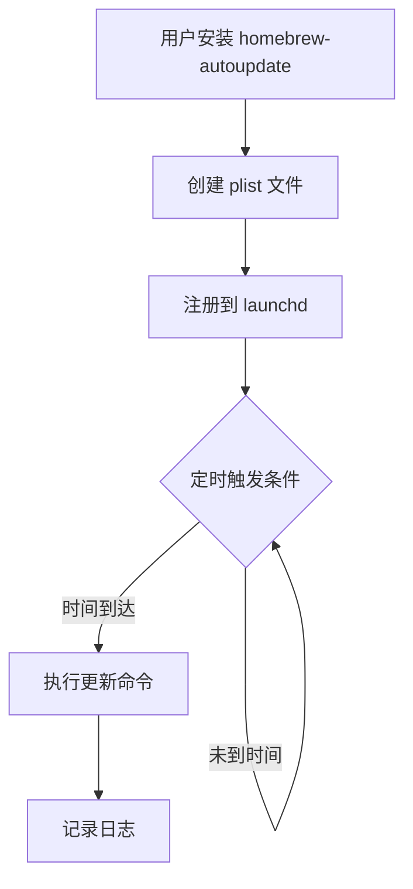

# 深入理解 Homebrew 自动更新：从原理到实践

В экосистеме macOS Homebrew стал предпочтительным инструментом для разработчиков и опытных пользователей для управления пакетами. Однако ручная поддержка Homebrew и установленных в нем пакетов может стать утомительной, особенно если ваш рабочий процесс опирается на несколько инструментов. В этой статье мы подробно рассмотрим автоматизацию обновлений с помощью homebrew-autoupdate, объясним, как она работает и каковы лучшие практики.

<!--more-->

## Homebrew 更新机制解析

### Homebrew 的更新流程

Обновление Homebrew состоит из двух основных этапов:
1. `brew update`: обновляет сам Homebrew и его индекс пакетов.
2. `brew upgrade`: обновляет установленные пакеты до последней версии.

Этот процесс может показаться простым, но на самом деле он включает в себя сложное управление зависимостями. Когда вы запускаете команду `brew upgrade`, Homebrew проверяет зависимости всех установленных пакетов и обновляет их в правильном порядке. Хотя такое комплексное обновление обеспечивает согласованность системы, оно также представляет потенциальный риск: обновления зависимых пакетов могут внести несовместимые изменения, которые могут вызвать проблемы с основными приложениями.

### 依赖更新的风险

Представьте себе такой сценарий: вы установили приложение A, которое полагается на версию 1.0 библиотеки B. Вы установили библиотеку A, которая полагается на версию 1.0 библиотеки B. В один прекрасный день библиотека B выпускает версию 2.0, в которую вносятся значительные изменения. Если вы выполните полное обновление, библиотека B будет обновлена до версии 2.0, но приложение A может быть еще не адаптировано к этой новой версии, что сделает его функциональность бесполезной.

Вот почему иногда нам нужна более консервативная стратегия обновления, обновляющая только пакеты "верхнего уровня", которые мы устанавливаем напрямую, а не все зависимости.

## homebrew-autoupdate 工具详解

### 工作原理

homebrew-autoupdate - это сторонний плагин для Homebrew, который использует систему macOS launchd (фреймворк управления сервисами для macOS, аналогичный systemd в Linux) для выполнения команд обновления Homebrew через регулярные промежутки времени.

Когда вы запускаете homebrew-autoupdate, он:
1. создаст plist-файл, определяющий конфигурацию автообновления
2. регистрирует этот файл в системе launchd
3. выполняет периодические команды обновления на основе конфигурации

### 新特性：--leaves-only 选项

Недавно в homebrew-autoupdate появилась новая важная функция: опция `--leaves-only`. Эта опция использует команду `brew leaves` для определения пакетов "верхнего уровня" (т.е. пакетов, которые не устанавливаются в качестве зависимостей) и обновления только этих пакетов.

С точки зрения технической реализации, она работает следующим образом:
1. используйте `brew leaves` для получения списка всех пакетов верхнего уровня
2. создаем временный скрипт для работы с этим списком
3. выполнить команду `brew upgrade` только для этих пакетов

Такой подход значительно снижает проблемы совместимости, вызванные зависимыми обновлениями, и обеспечивает более безопасную стратегию автоматического обновления.

## 高级配置与定制

### 使用 launchd 精确控制更新时间

Хотя по умолчанию homebrew-autoupdate использует временные интервалы (например, каждые 24 часа) для запуска обновлений, мы можем изменить plist-файл для более точного контроля времени.

Ниже приведен пример структуры файла plist для launchd, настроенного на запуск в 4:25 утра каждый день:

```xml
<?xml version="1.0" encoding="UTF-8"?>
<!DOCTYPE plist PUBLIC "-//Apple//DTD PLIST 1.0//EN" "http://www.apple.com/DTDs/PropertyList-1.0.dtd">
<plist version="1.0">
<dict>
    <key>Label</key>
    <string>com.github.domt4.homebrew-autoupdate</string>
    <key>ProgramArguments</key>
    <array>
        <string>/bin/bash</string>
        <string>-c</string>
        <string>/opt/homebrew/bin/brew update && /opt/homebrew/bin/brew leaves | xargs /opt/homebrew/bin/brew upgrade --formula -v && /opt/homebrew/bin/brew cleanup</string>
    </array>
    <key>StartCalendarInterval</key>
    <dict>
        <key>Hour</key>
        <integer>4</integer>
        <key>Minute</key>
        <integer>25</integer>
    </dict>
    <key>StandardOutPath</key>
    <string>~/Library/Logs/com.github.domt4.homebrew-autoupdate/com.github.domt4.homebrew-autoupdate.out</string>
    <key>StandardErrorPath</key>
    <string>~/Library/Logs/com.github.domt4.homebrew-autoupdate/com.github.domt4.homebrew-autoupdate.err</string>
</dict>
</plist>
```

### 自定义更新策略

В дополнение к опции `--leaves-only`, homebrew-autoupdate предоставляет другие опции для настройки поведения обновлений:

- `--cleanup`: автоматическая очистка старых версий и кэшированных файлов
- `--immediate`: немедленно запускать первое обновление вместо ожидания интервала
- `-sudo`: если некоторые бочки требуют привилегий sudo, открывает графический интерфейс для запроса пароля
- `--greedy`: обновление всех баз, включая те, в которых встроено автообновление.

Эти варианты можно комбинировать для удовлетворения различных потребностей.

## 实现每天凌晨 4 点 25 分自动更新

Вот полная пошаговая демонстрация того, как настроить homebrew-autoupdate на автоматическое обновление в 4:25 утра каждый день и обновление только пакетов верхнего уровня:

### 步骤 1：安装 homebrew-autoupdate

```bash
brew tap domt4/autoupdate
```

### 步骤 2：初始配置

```bash
brew autoupdate start 86400 --upgrade --leaves-only --cleanup
```

### 步骤 3：修改 plist 文件

```bash
# 打开 plist 文件进行编辑
open -e ~/Library/LaunchAgents/com.github.domt4.homebrew-autoupdate.plist
```

Замените `<key>StartInterval</key>` на соответствующее `<integer>86400</integer>`:

```xml
<key>StartCalendarInterval</key>
<dict>
    <key>Hour</key>
    <integer>4</integer>
    <key>Minute</key>
    <integer>25</integer>
</dict>
```

### 步骤 4：重新加载 plist 文件

```bash
launchctl unload ~/Library/LaunchAgents/com.github.domt4.homebrew-autoupdate.plist
launchctl load ~/Library/LaunchAgents/com.github.domt4.homebrew-autoupdate.plist
```

### 步骤 5：验证配置

```bash
# 查看当前状态
brew autoupdate status

# 查看 launchd 作业状态
launchctl list | grep homebrew-autoupdate
```

## 监控与故障排除

### 日志分析

homebrew-autoupdate будет записывать свои результаты в следующее место:

```
~/Library/Logs/com.github.domt4.homebrew-autoupdate/
```

Эти файлы журнала очень полезны для устранения проблем. Например, вы можете проверить, не завершилось ли обновление пакета, или не возникла ли проблема с разрешениями.

```bash
# 查看最近的日志
tail -f ~/Library/Logs/com.github.domt4.homebrew-autoupdate/com.github.domt4.homebrew-autoupdate.out
```

### 常见问题解决

1. **Обновление не выполняется по расписанию**:
   - Проверьте статус задания launchd: `launchctl list | grep homebrew-autoupdate`.
   - Убедитесь, что plist-файл отформатирован правильно.
   - Попробуйте запустить его вручную: `launchctl start com.github.domt4.homebrew-autoupdate`.

2. **Некоторые пакеты не удалось обновить**:
   - Проверьте файлы журнала на наличие конкретных ошибок
   - Попробуйте вручную обновить пакет, о котором идет речь: `brew upgrade <имя пакета>`.
   - Проверьте наличие разрешений или проблем с сетью

3. **Проблемы загрузки системы**:
   - Если процесс обновления вызывает чрезмерную нагрузку на систему, рассмотрите возможность добавления ограничения ресурсов в plist-файл
   - или перенести обновление на время, когда система менее загружена.

## 技术原理：launchd 与定时任务

В отличие от Linux-систем, использующих cron, macOS использует launchd для управления системными службами и задачами по расписанию. launchd предлагает более мощные функции, включая:

- Запуск службы по требованию
- Запуск задач на основе календарного времени или интервала.
- Мониторинг выполнения задач и перезапуск при сбое
- Ограничение ресурсов и контроль приоритетов

Для определения задач launchd использует файлы plist (Property List). Эти файлы могут быть размещены в разных местах, соответствующих разным областям применения:

- `/Library/LaunchDaemons/`: демон системного уровня, запускается от имени root
- `/Library/LaunchAgents/`: агент системного уровня, запускается от имени вошедшего пользователя
- `~/Library/LaunchAgents/`: агент пользовательского уровня, доступен только определенным пользователям

homebrew-autoupdate использует агент пользовательского уровня, поэтому его plist-файл находится в каталоге `~/Library/LaunchAgents/`.



## 未来展望：AI 辅助的软件更新

С развитием технологий искусственного интеллекта системы обновления программного обеспечения будущего могут стать еще умнее. Представьте себе систему искусственного интеллекта, которая может:

1. **Узнает привычки пользователя**: анализирует модели использования программ и обновляет их в те периоды, когда вы не пользуетесь компьютером.
2. **Предсказывает проблемы совместимости**: предсказывает, какие обновления могут вызвать проблемы, основываясь на исторических данных, и предлагает более безопасный путь обновления
3. **Адаптивная политика обновлений**: автоматически корректирует политику обновлений в зависимости от состояния системы и условий сети.
4. **Интеллектуальный откат**: автоматический откат до стабильной версии, если обнаружено, что обновление вызывает проблемы.

Хотя эти функции еще не реализованы, опция `--leaves-only` для homebrew-autoupdate уже является шагом к более разумному и безопасному обновлению программного обеспечения.

## 结论

С помощью утилиты homebrew-autoupdate, и в частности ее новой опции `--leaves-only`, мы можем безопасно автоматически обновлять пакеты Homebrew, значительно уменьшая проблемы совместимости, вызванные зависимыми обновлениями. В сочетании с системой launchd в macOS мы можем точно контролировать время обновления, например, устанавливая его запуск в 4:25 утра каждый день.

Такая автоматизация не только экономит время, но и обеспечивает безопасность и стабильность системы. Это незаменимая оптимизация рабочего процесса для специалистов, использующих несколько инструментов разработки.

Есть ли у вас другой опыт работы с Homebrew или автоматизацией macOS? Сталкивались ли вы с проблемами, связанными с обновлением зависимостей? Не стесняйтесь делиться своими мыслями и опытом в разделе комментариев!