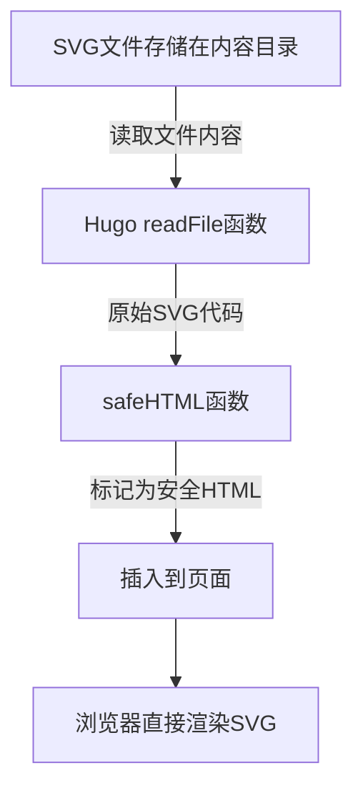
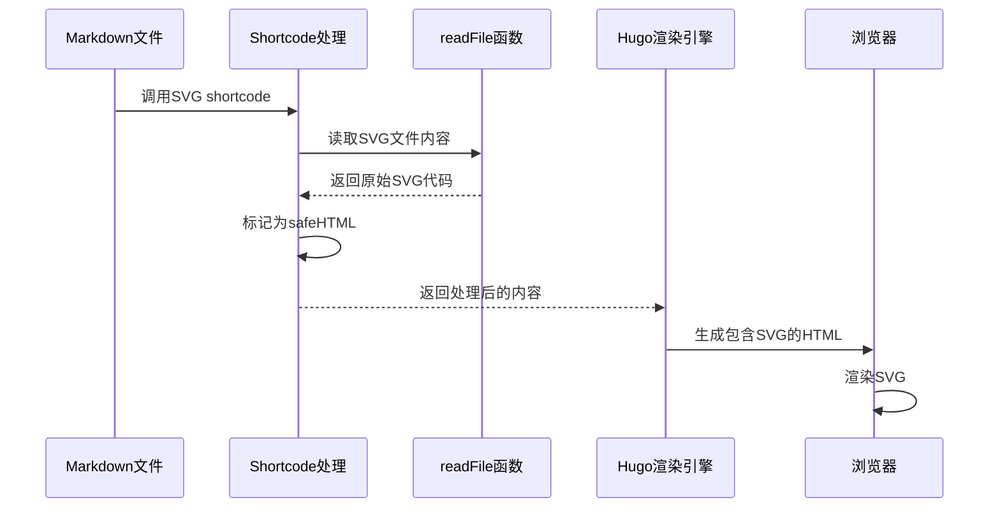
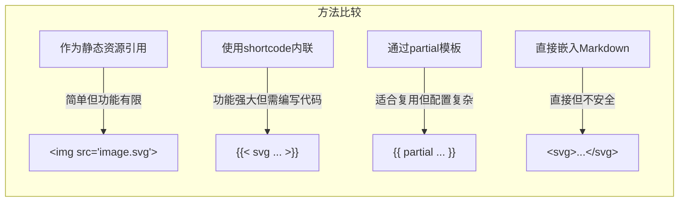

在现代网站开发中，SVG图形因其清晰度、可缩放性和交互能力而备受青睐。然而，在Hugo等静态站点生成器中正确集成SVG并不总是直观的。本文深入探讨如何在Hugo中无缝集成SVG，同时解释背后的技术原理和最佳实践。

<!--more-->

## SVG与静态站点生成的挑战

SVG（可缩放矢量图形）作为基于XML的图形格式，具有文件小、缩放无损、可交互等优势，已成为现代web开发中不可或缺的元素。然而，在Hugo等静态站点生成器中，SVG的集成面临几个挑战：

1. **安全考虑**：由于SVG可以包含执行代码的能力，Hugo默认会转义内联SVG代码
2. **资源管理**：静态站点生成器的文件和资源处理逻辑可能与动态SVG渲染需求不符
3. **渲染一致性**：跨浏览器和设备渲染SVG需要特定的处理方式

## 深入理解Hugo对SVG的处理机制

Hugo使用的是Go HTML模板引擎，它默认会转义所有HTML内容以防止潜在的安全风险。当我们想要在Hugo中嵌入SVG时，需要理解以下几个关键概念：

### 1. 内容安全处理

Hugo采用内容安全策略，默认情况下会转义任何看起来像HTML的内容，包括SVG标签。这种机制虽然提高了安全性，但也阻碍了SVG的直接使用。

### 2. 资源处理管道

Hugo提供了资源处理管道来处理各种资源文件，但SVG作为既是图像又是代码的混合形式，需要特殊处理。

### 3. 渲染方式

Hugo中处理SVG的方式主要有三种：
- 作为普通图像引用（``）
- 作为内联HTML直接嵌入
- 通过Hugo的shortcode或partial模板系统处理

## 构建高效的SVG集成方案

基于我们对Hugo处理机制的理解，以下是一套完整的SVG集成方案：

### 实现一个通用SVG Shortcode

首先，创建一个位于`layouts/shortcodes/svg.html`的文件：

```html
{{ $svg := .Get 0 }}
{{ $path := printf "%s" $svg }}
{{ $svgContent := readFile $path }}

{{ if $svgContent }}
  {{ $svgContent | safeHTML }}
{{ else }}
  {{ errorf "SVG文件无法读取：%s" $path }}
{{ end }}
```

这个shortcode的核心功能是：
1. 获取传递给shortcode的文件路径参数
2. 通过`readFile`函数读取SVG文件内容
3. 使用`safeHTML`函数将内容标记为安全HTML，绕过默认的HTML转义
4. 直接将SVG代码插入到页面中

### 技术原理解析

这个解决方案利用了Hugo的几个关键功能：

1. **`readFile`函数**：这是Hugo提供的一个强大函数，可以读取项目中任何文件的内容。它将文件内容作为字符串返回。

2. **`safeHTML`管道函数**：Hugo默认会转义所有HTML内容以防止XSS攻击。`safeHTML`函数告诉Hugo这段内容是安全的，可以直接插入到页面中而不需要转义。

3. **Shortcode机制**：Hugo的shortcode提供了扩展Markdown语法的能力，允许我们在内容文件中调用自定义函数。



### 在Markdown中使用方法

在内容文件中，你可以这样调用shortcode：

```markdown

```

存放路径应该是相对于Hugo项目根目录的`content/posts/your-post-folder/`，这样Hugo的`readFile`函数才能正确找到文件。

## 高级配置与优化

### 优化SVG文件

为了获得最佳性能和兼容性，建议对SVG文件进行以下优化：

1. **压缩SVG**：使用工具如SVGO移除不必要的元数据和空白
2. **添加viewBox属性**：确保SVG在各种尺寸下都能正确缩放
3. **确保可访问性**：添加适当的ARIA属性和title标签

```svg
<svg viewBox="0 0 100 100" xmlns="http://www.w3.org/2000/svg" aria-labelledby="title">
  <title id="title">简单示例图</title>
  <!-- SVG内容 -->
</svg>
```

### 处理响应式SVG

在响应式设计中，SVG需要适应不同的屏幕尺寸。以下是一些处理响应式SVG的技巧：

```css
.responsive-svg {
  width: 100%;
  height: auto;
  max-width: 600px; /* 设置最大宽度 */
}
```

然后在你的Hugo模板或内容中引用这个类：

```html
<div class="responsive-svg">
  
</div>
```

### 安全性考虑

虽然我们通过`safeHTML`函数绕过了Hugo的安全检查，但这也意味着我们需要自己确保SVG内容的安全性：

1. 只包含来自可信源的SVG
2. 避免在SVG中包含可执行的JavaScript代码
3. 如果需要从用户输入生成SVG，确保进行适当的输入验证和净化

## SVG在Hugo中的工作流程

SVG在Hugo中的处理流程可以通过以下时序图来说明：



## 与其他SVG集成方式的比较

Hugo中处理SVG有多种方式，每种方式都有其优缺点：



| 方法 | 优点 | 缺点 | 适用场景 |
|------|------|------|----------|
| 图片引用 | 简单、安全 | 无法交互、样式受限 | 简单图标、不需交互的图形 |
| Shortcode内联 | 保留交互性、可重用 | 需要编写代码 | 复杂交互图形、数据可视化 |
| Partial模板 | 高度可定制、适合模板共享 | 配置较复杂 | 站点通用组件、重复使用的SVG |
| 直接嵌入 | 最直接 | 安全风险、Markdown可读性差 | 只适合简单、可信环境 |

## 实际应用案例

### 案例1：技术博客中的流程图

一个技术作者需要在博客文章中展示复杂的系统架构图：

1. 使用专业工具(如Draw.io)创建SVG架构图，并保存到文章目录中
2. 在Markdown中通过shortcode引用该SVG
3. 读者可以看到高清晰度、可缩放的架构图，甚至可能包含交互元素

### 案例2：数据分析报告

一位数据分析师使用R或Python生成SVG数据可视化图表：

1. 导出分析结果为SVG格式
2. 放入对应的内容目录
3. 通过shortcode嵌入到Hugo文章中
4. 读者可以与数据可视化交互，比如悬停显示数据点详情

## 性能和SEO考虑

### 性能优化

内联SVG虽然增加了初始HTML文件大小，但实际上可以提高性能：

1. 减少HTTP请求数量
2. 允许SVG与页面CSS共享，减少冗余
3. 避免额外的文件加载延迟

对于大型或多次使用的SVG，考虑：

1. 使用SVG sprites技术
2. 利用浏览器缓存
3. 延迟加载非首屏SVG

### SEO优化

内联SVG对SEO有积极影响：

1. 搜索引擎可以索引SVG中的文本内容
2. 适当的title和desc标签提高可访问性和SEO
3. 减少页面加载时间，间接提升SEO排名

## 总结与最佳实践

通过使用本文介绍的shortcode方法，你可以在Hugo中优雅地集成SVG图形，同时保留其所有优势。回顾关键点：

1. **使用shortcode和readFile**：创建通用SVG处理shortcode
2. **了解安全性权衡**：明智使用safeHTML，仅用于可信内容
3. **优化SVG文件**：压缩并确保包含必要的viewBox和可访问性属性
4. **考虑响应式设计**：确保SVG在各种设备上正确显示
5. **选择正确的集成方式**：根据具体需求选择最适合的SVG集成方法

## 进一步探索

SVG与Hugo的集成还有更多可能性：

1. **交互式数据可视化**：结合JavaScript框架创建动态数据展示
2. **自定义主题元素**：使用SVG创建独特的导航、背景和UI元素
3. **动画效果**：利用CSS或SMIL为SVG添加动画

你如何在自己的Hugo站点中使用SVG？有没有发现其他有效的集成方法？在评论区分享你的经验和想法！
