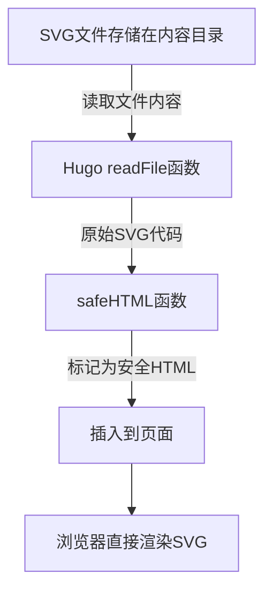
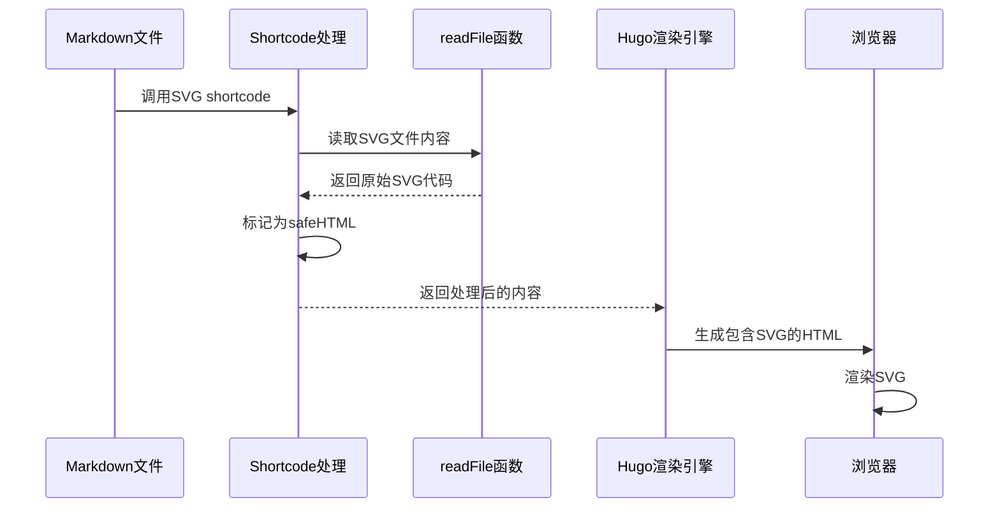
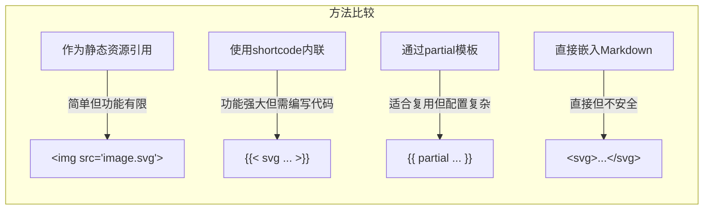

В современной веб-разработке предпочтение отдается SVG-графике за ее четкость, масштабируемость и интерактивность. Однако правильная интеграция SVG в генератор статических сайтов, такой как Hugo, не всегда интуитивно понятна. В этой статье мы подробно рассмотрим, как легко интегрировать SVG в Hugo, а также объясним технические принципы и лучшие практики, лежащие в основе этого.

<!--more-->

## SVG与静态站点生成的挑战

SVG (Scalable Vector Graphics), графический формат на основе XML, обладающий такими преимуществами, как малый размер файла, масштабирование без потерь и интерактивность, стал незаменимым элементом в современной веб-разработке. Однако интеграция SVG в генераторы статических сайтов, такие как Hugo, сталкивается с рядом проблем:

1. **Соображения безопасности**: Hugo по умолчанию экранирует встроенный SVG-код из-за способности SVG содержать исполняемый код.
2. **Управление ресурсами**: логика работы с файлами и ресурсами генератора статических сайтов может не соответствовать требованиям динамического рендеринга SVG.
3. **Согласованность рендеринга**: рендеринг SVG на разных браузерах и устройствах требует особой обработки.

## 深入理解Hugo对SVG的处理机制

Hugo использует шаблонизатор Go HTML, который по умолчанию экранирует все содержимое HTML, чтобы предотвратить потенциальные риски безопасности. Вот несколько ключевых понятий, которые необходимо понять, когда мы хотим внедрить SVG в Hugo:

### 1. 内容安全处理

Hugo использует политику безопасности контента, которая по умолчанию экранирует все, что выглядит как HTML, включая теги SVG. Хотя этот механизм повышает безопасность, он также препятствует прямому использованию SVG.

### 2. 资源处理管道

Hugo предоставляет конвейер обработки ресурсов для работы с различными файлами ресурсов, но SVG, являясь гибридной формой изображения и кода, требует особого обращения.

### 3. 渲染方式

Существует три основных способа работы с SVG в Hugo:
- ссылка как на обычное изображение (``)
- непосредственно вставляется как встроенный HTML
- через систему шорткодов или частичных шаблонов Hugo

## 构建高效的SVG集成方案

Основываясь на нашем понимании механизмов обработки Hugo, мы предлагаем полное решение для интеграции SVG:

### 实现一个通用SVG Shortcode

Сначала создайте файл по адресу `layouts/shortcodes/svg.html`:

```html
{{ $svg := .Get 0 }}
{{ $path := printf "%s" $svg }}
{{ $svgContent := readFile $path }}

{{ if $svgContent }}
  {{ $svgContent | safeHTML }}
{{ else }}
  {{ errorf "SVG文件无法读取：%s" $path }}
{{ end }}
```

Основными функциями этого шорткода являются:
1. получение параметра пути к файлу, переданного шорткоду
2. прочитать содержимое SVG-файла с помощью функции `readFile`.
3. с помощью функции `SafeHTML` пометить содержимое как безопасный HTML, минуя стандартное экранирование HTML
4. непосредственно вставьте код SVG в страницу

### 技术原理解析

Это решение использует несколько ключевых особенностей Hugo:

1. **`readFile` функция**: Это мощная функция, предоставляемая Hug для чтения содержимого любого файла в проекте. Она возвращает содержимое файла в виде строки.

2. **`safeHTML` pipeline function**: Hugo по умолчанию экранирует все HTML-содержимое для предотвращения XSS-атак. Функция `safeHTML` сообщает Hugo, что это содержимое можно вставить непосредственно в страницу, не экранируя его.

3. **Механизм шорткодов**: шорткоды Hugo предоставляют возможность расширить синтаксис Markdown, позволяя нам вызывать пользовательские функции в файле содержимого.



### 在Markdown中使用方法

В файле содержимого вы можете вызвать шорткод следующим образом:

```markdown

```

Путь хранения должен быть `content/posts/your-post-folder/` относительно корневого каталога проекта Hugo, чтобы функция `readFile` Hugo могла правильно найти файл.

## 高级配置与优化

### 优化SVG文件

Для лучшей производительности и совместимости рекомендуется использовать следующие оптимизации для файлов SVG:

1. **Сжатие SVG**: используйте такие инструменты, как SVGO, чтобы удалить ненужные метаданные и пробельные символы.
2. **Добавьте атрибут viewBox**: убедитесь, что SVG правильно масштабируется при любом размере.
3. **Убедитесь в доступности**: добавьте соответствующие атрибуты ARIA и теги заголовков.

```svg
<svg viewBox="0 0 100 100" xmlns="http://www.w3.org/2000/svg" aria-labelledby="title">
  <title id="title">简单示例图</title>
  <!-- SVG内容 -->
</svg>
```

### 处理响应式SVG

При отзывчивом дизайне SVG должны адаптироваться к различным размерам экрана. Вот несколько советов по работе с отзывчивым SVG:

```css
.responsive-svg {
  width: 100%;
  height: auto;
  max-width: 600px; /* 设置最大宽度 */
}
```

Затем ссылайтесь на этот класс в шаблоне или контенте Hugo:

```html
<div class="responsive-svg">
  
</div>
```

### 安全性考虑

Хотя мы обошли проверки безопасности Hugo с помощью функции `safeHTML`, это также означает, что мы должны сами защитить содержимое SVG:

1. включайте SVG только из проверенных источников
2. избегайте включения в SVG исполняемого кода JavaScript
3. если SVG должны генерироваться на основе пользовательского ввода, обеспечьте надлежащую проверку и санацию ввода.

## SVG在Hugo中的工作流程

Процесс обработки SVG в Hugo можно проиллюстрировать следующей временной диаграммой:



## 与其他SVG集成方式的比较

Существует несколько способов работы с SVG в Hugo, каждый из которых имеет свои преимущества и недостатки:



| Методы | Преимущества | Недостатки | Сценарии применения |
|------|------|------|----------|
| Ссылки на изображения | Простые, безопасные | Невозможно взаимодействовать, ограниченные стили | Простые иконки, графика, не требующая взаимодействия |
| Shortcode inline | Interactivity preserved, reusable | Code required | Сложная интерактивная графика, визуализация данных |
| Частичные шаблоны | Высокая настраиваемость, подходит для совместного использования шаблонов | Сложная конфигурация | Общие для сайта компоненты, многократно используемые SVG |
| Прямое встраивание | Наиболее прямое | Риск безопасности, плохая читаемость Markdown | Только для простых, доверенных сред |

## 实际应用案例

### 案例1：技术博客中的流程图

Техническому писателю необходимо показать в блоге сложные схемы системной архитектуры:

1. создайте SVG-схему архитектуры с помощью профессионального инструмента (например, Draw.io) и сохраните ее в каталоге статей
2. ссылайтесь на SVG в Markdown с помощью шорткода.
3. читатель может увидеть диаграмму с высоким разрешением и возможностью масштабирования, которая может содержать интерактивные элементы

### 案例2：数据分析报告

Аналитик данных использует R или Python для создания графиков визуализации данных в формате SVG:

1. Экспортируйте результаты анализа в формат SVG.
2. Поместите их в соответствующий каталог контента
3. встраивание в статью Hugo с помощью шорткода.
4. Читатели могут взаимодействовать с визуализацией данных, например, наводить на нее курсор, чтобы показать детали точек данных.

## 性能和SEO考虑

### 性能优化

Встроенный SVG, хотя и увеличивает начальный размер HTML-файла, на самом деле может повысить производительность:

1. уменьшить количество HTTP-запросов
2. разрешить совместное использование SVG с CSS страницы для уменьшения избыточности
3. Избегайте дополнительных задержек при загрузке файлов

Для больших или многократно используемых SVG рассмотрите вариант:

1. использование технологии спрайтов SVG
2. использование кэширования в браузере
3. отложенная загрузка SVG, не относящихся к первому экрану

### SEO优化

Встраивание SVG положительно сказывается на SEO:

1. поисковые системы могут индексировать текстовый контент в SVG.
2. Правильные теги title и desc улучшают доступность и SEO
3. сокращение времени загрузки страницы, косвенное улучшение SEO-рейтинга

## 总结与最佳实践

Используя шорткоды, представленные в этой статье, вы сможете элегантно интегрировать SVG-графику в Hugo, сохранив при этом все ее преимущества. Ознакомьтесь с ключевыми моментами:

1. **Использование шорткода и readFile**: создание общего SVG для работы с шорткодом
2. **Понимание компромиссов безопасности**: используйте safeHTML с умом и только для доверенного контента
3. **Оптимизируйте SVG-файлы**: сжимайте и обязательно включайте необходимые атрибуты viewBox и доступности
4. **Учитывайте отзывчивый дизайн**: убедитесь, что SVG корректно отображается на различных устройствах
5. **Выберите правильный метод интеграции**: выберите наиболее подходящий метод интеграции SVG для ваших конкретных нужд.

## 进一步探索

Возможности интеграции SVG с Hugo еще больше:

1. **Интерактивная визуализация данных**: создание динамических презентаций данных в сочетании с фреймворками JavaScript
2. **Элементы пользовательских тем**: используйте SVG для создания уникальных элементов навигации, фона и пользовательского интерфейса.
3. **Анимационные эффекты**: добавление анимации в SVG с помощью CSS или SMIL

Как вы используете SVG на своем сайте Hugo и нашли ли вы другие эффективные методы интеграции? Поделитесь своим опытом и мыслями в разделе комментариев!