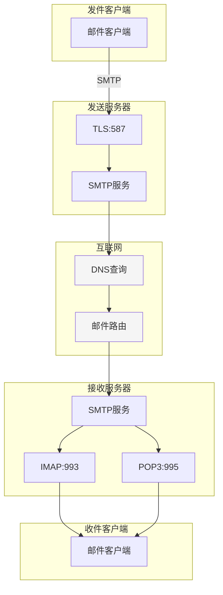
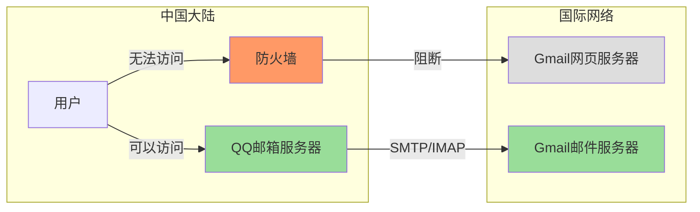

在这个全球互联的时代，电子邮件早已成为我们日常生活中不可或缺的通信工具。然而，当我们发送一封跨国邮件时，这看似简单的过程背后，其实隐藏着复杂的技术机制和多重安全考量。本文将深入剖析国际邮件传输的完整过程，帮助你理解其中的技术原理。

<!--more-->

## 从案例说起

小李在迪拜分公司收到了一封来自国内银行的电子账单，他需要将其转发到自己的私人邮箱存档。按下发送按钮后，这封邮件将经历一段漫长而复杂的旅程。让我们通过这个实际场景，深入了解现代电子邮件系统的工作原理。

## 邮件协议架构

现代电子邮件系统主要基于三个核心协议：

1. SMTP（Simple Mail Transfer Protocol）

   - 运行在TCP 25端口（加密版本使用587端口）
   - 负责邮件的发送和中转
   - 采用存储转发机制，确保可靠传输
2. IMAP/POP3（接收协议）

   - IMAP: 993端口，支持双向同步
   - POP3: 995端口，用于邮件下载
   - 两种协议采用不同的邮件管理策略

### 展示邮件协议架构的流程图

## 邮件加密机制

邮件系统采用多层次的加密策略：

1. 传输层加密（TLS）

   - 保护邮件在传输过程中的安全
   - 预防中间人攻击
   - 但不保护邮件在服务器上的存储状态
2. 端到端加密（如PGP）

   - 提供真正的端到端安全
   - 邮件内容只对发件人和收件人可见
   - 使用非对称加密技术

## 国际传输路径分析

### 物理基础设施

国际邮件传输主要依赖于海底光缆网络：

- 光纤中的光速约为200,000公里/秒
- 实际传输速度受限于网络设备和路由策略
- 地理距离导致的延迟无法避免

### 邮件传输时序

以一封包含760.9KB附件的邮件为例，让我们看看它的详细传输时序：

```mermaid
%%{init: {'theme': 'default', 'gantt': {'useWidth': 600} } }%%
gantt
    title 国际邮件传输时间轴
    dateFormat ss
    axisFormat %S秒
  
    section 发送阶段
    身份验证与检查 :active, task1, 00, 0.5s
    附件病毒扫描   :task2, after task1, 2s
  
    section 传输阶段
    阿联酋出口检查 :task3, after task2, 1.5s
    网络传输      :task4, after task3, 0.6s
    中国防火墙检查 :task5, after task4, 3.4s
  
    section 接收阶段
    QQ邮箱安全检查 :task6, after task5, 2s
    邮件分类与投递 :task7, after task6, 1s

```

## 安全检查机制

### 发送端安全措施

1. SPF（发件人策略框架）

   - 验证发件人身份
   - 防止邮件欺诈
   - 检查发送服务器是否授权
2. DKIM（域名密钥识别邮件）

   - 使用加密签名确保邮件完整性
   - 防止内容被篡改
   - 验证发件域名的真实性

### 网关检查

1. 国际出口检查

   - 流量监控
   - 内容合规性检查
   - 反垃圾邮件过滤
2. 防火墙策略

   - 协议级别的控制
   - 流量整形
   - 安全威胁检测

### 接收端处理

1. 反垃圾邮件机制

   - 基于内容的过滤
   - 发件人信誉系统
   - 行为特征分析
2. 病毒扫描

   - 附件安全检查
   - 恶意链接检测
   - 宏病毒防护

## 特殊情况剖析：Gmail访问机制

一个有趣的现象是：虽然Gmail的网页界面在中国大陆无法访问，但通过QQ邮箱等本地邮箱服务，仍然可以与Gmail账户进行邮件收发。这涉及到电子邮件系统的几个关键特性：

1. 协议分离

   - Web访问（HTTP/HTTPS）与邮件收发（SMTP/IMAP）使用不同协议
   - 防火墙可以精确控制不同协议的访问权限
   - 邮件专用端口仍然保持开放
2. 基础设施分离

   - 邮件服务器与Web服务器分别部署
   - 全球分布式的邮件中转节点
   - 本地邮箱服务器作为中转站

### Gmail访问机制示意图

## 性能优化建议

对于需要频繁处理国际邮件的用户，可以采取以下措施提升体验：

1. 技术层面

   - 使用IMAP而非POP3协议
   - 合理配置同步间隔
   - 考虑启用邮件压缩
2. 实践建议

   - 大文件考虑使用云存储分享
   - 关键通知配合即时通讯工具
   - 避免触发深度安全检查

## 未来展望

随着技术的发展，国际邮件传输可能会出现新的变革：

1. 新技术应用

   - 量子加密的应用
   - AI辅助的智能路由
   - 区块链技术在邮件认证中的应用
2. 基础设施升级

   - 新一代海底光缆部署
   - 卫星通信补充方案
   - 边缘节点优化

## 结语

了解电子邮件系统的工作原理，不仅能帮助我们理解延迟的原因，也能让我们更好地利用这个重要的通信工具。随着技术的不断进步，我们期待看到更快速、更安全的国际邮件传输服务。
