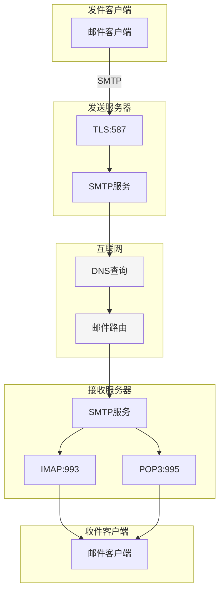
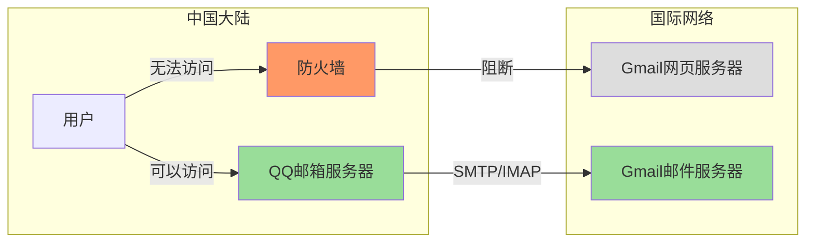

В эпоху глобальной взаимосвязи электронная почта давно стала незаменимым инструментом общения в нашей повседневной жизни. Однако когда мы отправляем трансграничную почту, за этим, казалось бы, простым процессом на самом деле скрываются сложные технические механизмы и многочисленные соображения безопасности. В этой статье мы проанализируем весь процесс международной передачи электронной почты, чтобы помочь вам понять технические принципы.

<!--more-->

## 从案例说起

Ли получает электронный счет от своего банка в филиале в Дубае, который ему нужно переслать на свой личный адрес электронной почты для архивации. После нажатия кнопки "Отправить" это письмо проделает долгий и сложный путь. Давайте погрузимся в работу современной системы электронной почты на примере этого реального сценария.

## 邮件协议架构

Современные системы электронной почты основаны на трех основных протоколах:

1. SMTP (простой протокол передачи почты)

- Работает через TCP-порт 25 (зашифрованная версия использует порт 587).
   - Отвечает за отправку и ретрансляцию электронной почты
   - Использует механизм хранения и пересылки для обеспечения надежной передачи.
2. IMAP/POP3 (протокол получения)

- IMAP: порт 993, поддерживает двунаправленную синхронизацию.
   - POP3: порт 995, используется для загрузки почты.
   - Эти два протокола используют различные политики управления почтой

### 展示邮件协议架构的流程图

## 邮件加密机制

В почтовой системе используется многоуровневая стратегия шифрования:

1. Криптография транспортного уровня (TLS)

- Защита почты в пути
   - Предотвращает атаки типа "человек посередине".
   - Но не защищает состояние хранения почты на сервере.
2. сквозное шифрование (например, PGP)

- Обеспечивает настоящую сквозную безопасность
   - Содержимое почты видно только отправителю и получателю
   - Используется асимметричное шифрование

## 国际传输路径分析

### 物理基础设施

Международная почтовая связь в значительной степени зависит от подводных волоконно-оптических кабельных сетей:

- Скорость света в волоконной оптике составляет около 200 000 км/с.
- Фактическая скорость передачи ограничена сетевым оборудованием и политикой маршрутизации.
- Невозможно избежать задержки из-за географического расстояния

### 邮件传输时序

Возьмем для примера электронное письмо, содержащее вложения размером 760,9 КБ, и посмотрим на подробное время его передачи:

```mermaid
%%{init: {'theme': 'default', 'gantt': {'useWidth': 600} } }%%
gantt
    title 国际邮件传输时间轴
    dateFormat ss
    axisFormat %S秒
  
    section 发送阶段
    身份验证与检查 :active, task1, 00, 0.5s
    附件病毒扫描   :task2, after task1, 2s
  
    section 传输阶段
    阿联酋出口检查 :task3, after task2, 1.5s
    网络传输      :task4, after task3, 0.6s
    中国防火墙检查 :task5, after task4, 3.4s
  
    section 接收阶段
    QQ邮箱安全检查 :task6, after task5, 2s
    邮件分类与投递 :task7, after task6, 1s

```

## 安全检查机制

### 发送端安全措施

1. SPF (Sender Policy Framework)

- Удостоверение личности отправителя
   - Предотвращение почтового мошенничества
   - Проверка авторизации сервера-отправителя
2. DKIM (Domain Key Identification Mail)

- Обеспечьте целостность электронной почты с помощью криптографических подписей.
   - Предотвращение фальсификации содержимого
   - Проверка подлинности домена-отправителя

### 网关检查

1. международные экспортные инспекции

- Мониторинг трафика
   - Проверка соответствия контента
   - Антиспамовая фильтрация
2. политика межсетевого экрана

- Контроль уровня протокола
   - Формирование трафика
   - Обнаружение угроз безопасности

### 接收端处理

1. механизмы защиты от спама

- Фильтрация на основе содержимого
   - Система репутации отправителя
   - Поведенческое профилирование
2. Вирусное сканирование

- Проверка безопасности вложений
   - Обнаружение вредоносных ссылок
   - Защита от макровирусов

## 特殊情况剖析：Gmail访问机制

Интересный феномен: хотя веб-интерфейс Gmail недоступен в континентальном Китае, с помощью аккаунта Gmail можно отправлять и получать электронные письма через местные почтовые сервисы, такие как почтовый ящик QQ. Это связано с несколькими ключевыми особенностями системы электронной почты:

1. разделение протоколов

- Веб-доступ (HTTP/HTTPS) и отправка/прием почты (SMTP/IMAP) используют разные протоколы.
   - Брандмауэр может точно контролировать права доступа к различным протоколам.
   - Порты, предназначенные для почты, остаются открытыми
2. разделение инфраструктуры

- Раздельное развертывание почтовых и веб-серверов
   - Глобально распределенные узлы ретрансляции почты
   - Локальные почтовые серверы в качестве узлов ретрансляции

### Gmail访问机制示意图

## 性能优化建议

Для пользователей, которым приходится часто обрабатывать международную электронную почту, можно принять следующие меры для повышения удобства работы:

1. Технические аспекты

- Используйте протокол IMAP вместо POP3
   - Настройте интервал синхронизации соответствующим образом
   - Рассмотрите возможность включения сжатия почты.
2. Практические рекомендации

- Рассмотрите возможность использования облачного хранилища для обмена большими файлами
   - Критические уведомления с помощью мессенджера
   - Избегайте запуска глубоких проверок безопасности

## 未来展望

С развитием технологий могут произойти новые изменения в пересылке международных почтовых отправлений:

1. Применение новых технологий

- Области применения квантового шифрования
   - Интеллектуальная маршрутизация с помощью искусственного интеллекта
   - Применение технологии блокчейн для аутентификации почты
2. модернизация инфраструктуры

- Развертывание подводных волоконно-оптических кабелей следующего поколения
   - Дополнительные программы в области спутниковой связи
   - Оптимизация пограничных узлов

## 结语

Понимание того, как работает система электронной почты, не только поможет нам разобраться в причинах задержек, но и позволит лучше использовать этот важный инструмент коммуникации. По мере развития технологий мы надеемся, что услуги по передаче международной почты станут более быстрыми и безопасными.