你是否遇到过这样的情况：发出一封国际邮件后，即使是发给自己的另一个邮箱，也要等待很久才能收到。这种延迟到底是为什么呢？让我们一起来了解下邮件在跨国旅行时都经历了什么。

<!--more-->

## 从迪拜到深圳的邮件旅程

小李在迪拜的分公司收到了国内银行的电子账单，想转发到自己的个人邮箱存档。按下发送按钮后，他以为几秒钟就能收到邮件，结果等了好几分钟都没看到。这种情况其实很常见，因为邮件要经过一段"漫长"的旅程。

## 邮件为什么会延迟？

就像国际快递要经过海关检查一样，国际邮件也要经过多个"检查站"：

1. 发件地检查
   你按下发送按钮后，公司的邮件服务器会先检查你的身份、邮件大小是否超限等等。这就像是快递员上门取件时要检查包裹是否符合要求。
2. 跨国传输
   邮件会经过多个网络节点传输，就像飞机需要经过多个中转站。每经过一个节点，都可能因为网络拥堵而产生一些延迟。

3. 入境检查
   进入目的地国家时，邮件要经过网关检查，就像快递要通过海关一样。这个过程可能会占用几秒到几分钟不等。
4. 最终投递
   最后，目的地邮箱服务器（比如QQ邮箱）还要进行垃圾邮件过滤、病毒扫描等安全检查，确认安全后才会让你看到这封邮件。

## 实际案例分析

我们来看一个实际的例子：一封带有760.9KB附件的空白邮件，从阿联酋发往中国的QQ邮箱。在理想情况下：

- 纯网络传输仅需不到1秒
- 但各种必要的检查和处理需要10秒以上
- 实际投递通常要1-3分钟

```mermaid
%%{init: {'theme': 'default', 'gantt': {'useWidth': 600} } }%%
gantt
    title 国际邮件传输时间轴
    dateFormat ss
    axisFormat %S秒
  
    section 发送阶段
    身份验证与检查 :active, task1, 00, 0.5s
    附件病毒扫描   :task2, after task1, 2s
  
    section 传输阶段
    阿联酋出口检查 :task3, after task2, 1.5s
    网络传输      :task4, after task3, 0.6s
    中国防火墙检查 :task5, after task4, 3.4s
  
    section 接收阶段
    QQ邮箱安全检查 :task6, after task5, 2s
    邮件分类与投递 :task7, after task6, 1s
```

## 为什么网页版比客户端更快？

有趣的是，有时你会发现用浏览器登录邮箱已经能看到新邮件，但Outlook等客户端还没有显示。这是因为：

- 网页版直接连接邮件服务器，能立即看到新邮件
- 客户端则需要按照预设的时间间隔同步，可能要等几分钟

## 实用建议

如果你经常需要收发国际邮件，可以：

- 避免在邮件中使用敏感词汇
- 控制附件大小，必要时使用网盘分享
- 对于紧急事务，建议配合使用即时通讯工具
- 适当调整客户端的同步频率

现在，当你发送国际邮件时遇到延迟，就知道这是正常的了——毕竟它要经过这么多道"检查关卡"呢！
