```mermaid
%%{init: {'theme': 'default', 'gantt': {'useWidth': 600} } }%%
gantt
    title 国际邮件传输时间轴
    dateFormat ss
    axisFormat %S秒
  
    section 发送阶段
    身份验证与检查 :active, task1, 00, 0.5s
    附件病毒扫描   :task2, after task1, 2s
  
    section 传输阶段
    阿联酋出口检查 :task3, after task2, 1.5s
    网络传输      :task4, after task3, 0.6s
    中国防火墙检查 :task5, after task4, 3.4s
  
    section 接收阶段
    QQ邮箱安全检查 :task6, after task5, 2s
    邮件分类与投递 :task7, after task6, 1s
```

Приходилось ли вам сталкиваться с ситуацией, когда после отправки международного электронного письма приходится долго ждать его получения, даже если оно отправлено на другой ваш электронный адрес? В чем причина такой задержки? Давайте узнаем, что происходит с электронной почтой, когда она пересекает границы.

<!--more-->

## 从迪拜到深圳的邮件旅程

Ли получил электронный счет от своего внутреннего банка в филиале в Дубае и хотел переслать его на свою личную электронную почту для архивации. Когда он нажал кнопку "Отправить", то ожидал получить письмо через несколько секунд, но прождал несколько минут, так и не увидев его. На самом деле это довольно частое явление, поскольку электронные письма совершают "долгое" путешествие.

## 邮件为什么会延迟？

Как международные курьеры проходят через таможню, так и международные почтовые отправления проходят через множество "контрольных пунктов":

1. проверка места отправки
   После того как вы нажмете кнопку отправки, почтовый сервер компании сначала проверит вашу личность, превысит ли размер письма установленный лимит и так далее. Это похоже на то, как курьер забирает посылку из вашей двери, чтобы проверить, соответствует ли она требованиям.
2. Трансграничная передача
   Электронные письма будут передаваться через несколько сетевых узлов, подобно тому как самолету необходимо пройти через несколько транзитных станций. Каждый раз, когда вы проходите через узел, может возникать некоторая задержка из-за перегрузки сети.

3. Въездная проверка
   При въезде в страну назначения почта проходит проверку на шлюзе, как курьер проходит таможню. Этот процесс может занять от нескольких секунд до нескольких минут.
4. окончательная доставка
   Наконец, почтовый сервер назначения (например, почтовый ящик QQ) должен провести фильтрацию спама, проверку на вирусы и другие проверки безопасности, чтобы подтвердить безопасность, прежде чем позволить вам увидеть письмо.

## 实际案例分析

Рассмотрим практический пример: пустое письмо с вложениями размером 760,9 КБ, отправленное из ОАЭ на почтовый ящик QQ в Китае. В идеальной ситуации:

- Чистая передача данных по сети занимает менее секунды.
- Но все необходимые проверки и обработка занимают более 10 секунд.
- Фактическая доставка обычно занимает 1-3 минуты.

## 为什么网页版比客户端更快？

Интересно, что иногда вы можете обнаружить, что вход в почтовый ящик через браузер уже показывает новые письма, но такие клиенты, как Outlook, их еще не показывают. Это происходит потому, что:

- Веб-версия подключается непосредственно к почтовому серверу и позволяет сразу же просматривать новые сообщения.
- Клиентам необходимо синхронизироваться через заданные интервалы времени, что может занять несколько минут.

## 实用建议

Если вам часто приходится отправлять и получать международную почту, вы можете это сделать:

- Избегайте использования в электронных письмах важных слов
- Контролируйте размер вложений и при необходимости делитесь ими на сетевом диске.
- Для решения срочных вопросов рекомендуется использовать средства мгновенного обмена сообщениями.
- Настройте частоту синхронизации клиентов соответствующим образом

Теперь вы знаете, что задержки при отправке международной почты - это нормальное явление, ведь ей приходится проходить через множество "контрольных пунктов"!