Приходилось ли вам сталкиваться с ситуацией, когда после отправки международного электронного письма приходится долго ждать его получения, даже если оно отправлено на другой ваш электронный адрес? В чем причина такой задержки? Давайте узнаем, что происходит с электронными письмами, когда они пересекают границы.

<! -еще-->

## Путешествие электронной почты из Дубая в Шэньчжэнь

Ли получил электронный счет из своего банка в Дубае и хотел переслать его на свою личную электронную почту для архивации. После нажатия кнопки "Отправить" он думал, что получит письмо через несколько секунд, но прождал несколько минут, так и не увидев его. На самом деле это довольно частое явление, поскольку электронные письма совершают "долгое" путешествие.

## Почему электронные письма задерживаются?

Как международные курьеры проходят через таможню, так и международная почта проходит через множество "контрольных пунктов":

1. проверка в пункте отправления
   Когда вы нажимаете кнопку "Отправить", почтовый сервер компании проверяет вашу личность, размер сообщения и т. д. Это похоже на то, как курьер забирает посылку от двери. Это похоже на то, как курьер забирает посылку и проверяет, соответствует ли она требованиям.
2. Трансграничная передача
   Электронные сообщения будут передаваться через несколько сетевых узлов, подобно тому как самолету необходимо пройти через несколько транзитных станций. Каждый раз, когда вы проходите через узел, может возникать некоторая задержка из-за перегрузки сети.

.

3. Входной контроль
   При входе в страну назначения почта проверяется шлюзом, так же как курьер должен пройти через таможню. Этот процесс может занимать от нескольких секунд до нескольких минут.
4. окончательная доставка
   Наконец, почтовый сервер назначения (например, почтовый ящик QQ) должен провести фильтрацию спама, проверку на вирусы и другие проверки безопасности, чтобы подтвердить безопасность, прежде чем позволить вам увидеть письмо.

## Практический пример

Рассмотрим практический пример: пустое письмо с вложением размером 760,9 КБ отправляется из ОАЭ на почтовый ящик QQ в Китае. При идеальных обстоятельствах:

- чисто сетевая передача занимает менее 1 секунды.
- Но на все необходимые проверки и обработку уходит более 10 секунд.
- Фактическая доставка обычно занимает 1-3 минуты

```mermaid
%%{init: {'theme': 'default', 'gantt': {'useWidth': 600} } }%%
gantt
    title 国际邮件传输时间轴
    dateFormat ss
    axisFormat %S秒
  
    section 发送阶段
    身份验证与检查 :active, task1, 00, 0.5s
    附件病毒扫描   :task2, after task1, 2s
  
    section 传输阶段
    阿联酋出口检查 :task3, after task2, 1.5s
    网络传输      :task4, after task3, 0.6s
    中国防火墙检查 :task5, after task4, 3.4s
  
    section 接收阶段
    QQ邮箱安全检查 :task6, after task5, 2s
    邮件分类与投递 :task7, after task6, 1s
```

## Почему веб-версия работает быстрее, чем клиентская?

Интересно, что иногда вы обнаруживаете, что вход в почтовый ящик через браузер уже показывает новые письма, а клиент, например Outlook, их еще не показывает. Это происходит потому, что:

- Веб-версия подключается непосредственно к почтовому серверу, и вы можете сразу же увидеть новые письма.
- Клиенты должны синхронизироваться через заданные интервалы времени, что может занять несколько минут.

## Практические советы

Если вам часто приходится отправлять и получать международные сообщения электронной почты, вы можете:

- Избегайте использования в сообщениях конфиденциальных слов.
- Контролируйте размер вложений и при необходимости делитесь ими на сетевом диске.
- Для решения срочных вопросов рекомендуется использовать средства мгновенного обмена сообщениями
- Настройте частоту синхронизации клиента соответствующим образом

Теперь вы знаете, что задержки при отправке международной электронной почты - нормальное явление, ведь ей приходится проходить через множество "контрольных точек"!
