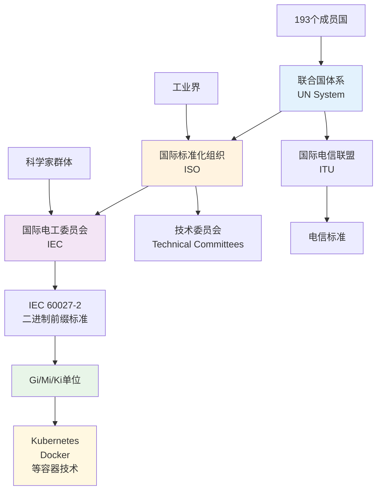
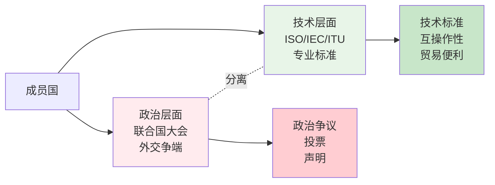

当你在 Kubernetes 配置文件中写下 `memory: 2Gi` 时，你是否想过这个简单的 "Gi" 背后隐藏着怎样的故事？这个看似平凡的单位，实际上连接着一个横跨150年的国际合作史诗。

<!--more-->

## 那个让人困惑的"Gi"

在 Kubernetes 的 YAML 配置中，我们经常看到这样的配置：

```yaml
resources:
  requests:
    memory: 2Gi
    cpu: 1
```

这里的 `Gi` 并不是 "Gigabyte" 的缩写，而是 "Gibibyte" 的简化表示。这是一个**二进制单位**，表示 2³⁰ = 1,073,741,824 字节，而不是十进制的 10⁹ = 1,000,000,000 字节。

**为什么会有这种区别？**

计算机的内存在底层是按照 2 的幂次方组织的，所以：
- **二进制单位（IEC标准）**：Gi (Gibibyte) = 1024³ 字节
- **十进制单位（SI标准）**：GB (Gigabyte) = 1000³ 字节

"Gibibyte" 这个词来自 "**Gi**ga" + "**bi**nary"，意思是"Gigabyte 的二进制版本"。同样地：
- Kibi = Ki(lo) + bi(nary) = 1024 字节
- Mebi = Me(ga) + bi(nary) = 1024² 字节
- Tebi = Te(ra) + bi(nary) = 1024⁴ 字节

## 标准背后的标准制定者

这套二进制单位体系是由 **国际电工委员会（IEC）** 在 1999 年制定的。但你知道吗？IEC 本身就是一个有着160年历史的国际组织，而它只是一个更庞大的国际标准化体系的一部分。

让我用一个可视化来展示这个体系的结构：



## 从电报线到互联网：技术推动的国际化

这个故事要从 19 世纪说起。当时，世界正在经历第一次真正的技术全球化浪潮。

### 1865年：第一根国际标准的"线"

1865年，20个欧洲国家聚集在巴黎，签署了第一个国际电报公约，成立了**国际电报联盟**（后来的 ITU）。为什么？因为各国的电报系统互不兼容，跨国通信根本无法实现。

想象一下：德国商人想给法国客户发电报，结果发现两国的电报设备根本接不上！这种技术壁垒直接影响了贸易和交流。

### 1875年：科学家的米尺

10年后，17个国家在巴黎签署了《米制公约》，建立了**国际度量衡局**。这不仅仅是为了统一长度和重量标准，更是为了让科学研究和国际贸易有一个共同的"语言"。

### 商人、工程师与政治家的三角关系

有趣的是，这些早期的国际标准化努力有一个共同特点：
- **科学家**提供理论基础（物理学、数学）
- **工程师**把理论转化为技术标准
- **商人**推动标准的采用（因为统一标准能降低贸易成本）
- **政治家**提供法律框架和外交支持

这种分工一直延续到今天。当苹果和三星的工程师在制定下一代 USB 标准时，他们用的还是这种合作模式。

## 二战：国际合作的转折点

两次世界大战深刻地改变了人们对国际合作的认识。

### 战间期的尝试

1920年代，欧洲国家成立了**国际标准化协会（ISA）**，这是现代 ISO 的直接前身。但二战的爆发中断了这种合作。

### 罗斯福的愿景

1944年，44个国家的代表在美国新罕布什尔州的布雷顿森林小镇开会。这次会议不仅建立了国际货币基金组织和世界银行，更重要的是确立了一个原则：**技术合作可以超越政治分歧**。

### 1947年：现代体系的诞生

1947年，25个国家在伦敦重新开始，成立了**国际标准化组织（ISO）**。这次，他们采用了一个天才的设计：



## 分层治理的智慧

这种设计的精妙之处在于**分层治理**：
- 政治家们在联合国大会里辩论和投票
- 工程师们在 ISO 技术委员会里安静地制定标准
- 两个层面相对独立，技术合作不会因为政治分歧而停止

### 现实案例

今天，即使以色列和巴勒斯坦在政治上冲突不断，但：
- 两国的工程师都在使用同样的 USB 接口
- 都在遵循同样的网络协议（TCP/IP）
- 都在 GitHub 上合作开发开源软件

这就是分层治理的威力：**让懂技术的人制定技术标准，让外交家处理政治争端**。

## 从Gi到全球化的启示

回到我们开头的 `2Gi` 内存配置。这个简单的单位背后，体现了现代国际合作的几个核心特征：

### 1. 技术标准的客观性
1 Gibibyte 就是 1,073,741,824 字节，不存在"美式 Gi"或"中式 Gi"。技术标准的客观性让它能够超越文化和政治差异。

### 2. 自愿参与的有效性
没有人强迫 Kubernetes 使用 IEC 标准，但因为这样做有利于互操作性，所以全世界的开发者都自愿采用。

### 3. 专业化的分工
制定二进制单位标准的是计算机科学家和工程师，不是政治家。专业的事情交给专业的人做。

### 4. 网络效应
越多的人使用同一套标准，这套标准就越有价值。这创造了一种"合作比冲突更有利可图"的局面。

## 国际化的真正含义

通过这个故事，我们可以重新理解什么是真正的"国际化"：

**国际化不是政治口号，而是在实验室里、工厂里、代码中自然形成的合作需求。**

当你写下 `memory: 2Gi` 时，你实际上是在参与一个跨越150年、涉及193个国家、包含数万名科学家和工程师的协作项目。这种协作的规模和深度，远远超过了任何单一国家或企业的能力。

### 现代启示

在今天这个似乎充满分裂和对抗的世界里，技术标准化提醒我们：
- 合作仍然是可能的
- 专业精神可以超越政治分歧  
- 自下而上的国际化比自上而下的政治设计更持久
- 真正的全球化是由具体的需求和利益驱动的，而不是抽象的理念

下次当你在终端里看到那些熟悉的单位和协议时，不妨想想：你正在使用的不仅仅是技术工具，更是人类合作智慧的结晶。

---

*这篇文章展示了技术标准如何连接着更广阔的国际合作历史。从 Kubernetes 的内存单位到联合国体系，看似无关的事物实际上都是同一个故事的不同章节。*
