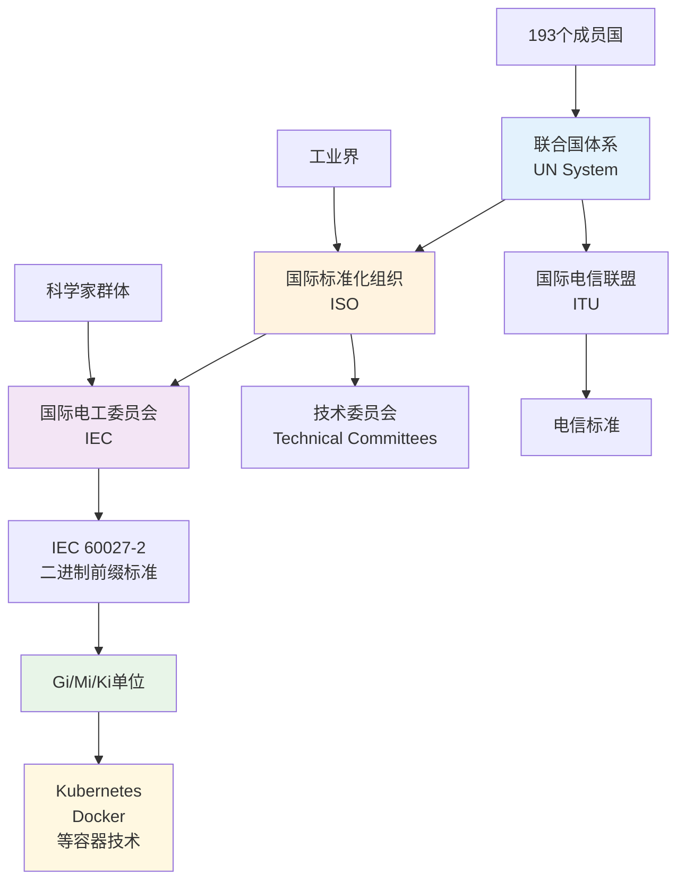
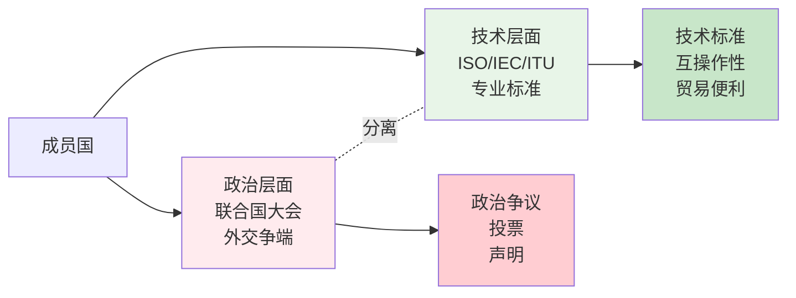

Когда вы пишете `memory: 2Gi` в конфигурационном файле Kubernetes, задумывались ли вы когда-нибудь, какая история скрывается за этим простым "Gi"? Эта, казалось бы, обыденная единица на самом деле связана с эпопеей международного сотрудничества длиной в 150 лет.

<!--more-->

## 那个让人困惑的"Gi"

Мы часто видим эту конфигурацию в YAML-конфигурации Kubernetes:

```yaml
resources:
  requests:
    memory: 2Gi
    cpu: 1
```

Здесь `Gi` - это не сокращение от "гигабайта", а упрощенное представление "гибибайта". Это **двоичная единица**, что означает, что 2³⁰ = 1 073 741 824 байт, вместо 10⁹ = 1 000 000 000 байт в десятичной системе.

**Почему это имеет значение? **

Память компьютера в нижней части организована в степени 2, так что:
- **Двоичные единицы (стандарт МЭК)**: Gi (Гибибайт) = 1024³ байт
- **Десятичные единицы (стандарт СИ)**: ГБ (гигабайт) = 1000³ байт

Слово "Гибибайт" происходит от "**Gi**ga" + "**bi**nary", что означает "двоичная версия Гигабайта". Аналогично:
- Kibi = Ki(lo) + bi(nary) = 1024 байта
- Mebi = Me(ga) + bi(nary) = 1024² байт
- Tebi = Te(ra) + bi(nary) = 1024⁴ байт

## 标准背后的标准制定者

Эта система двоичных единиц была разработана **Международной электротехнической комиссией (МЭК)** в 1999 году. Но знаете ли вы, что сама МЭК - это международная организация, которой 160 лет, и что она является лишь частью гораздо более крупной системы международной стандартизации?

Позвольте мне использовать визуализацию, чтобы показать структуру этой системы:



## 从电报线到互联网：技术推动的国际化

История начинается в девятнадцатом веке. В то время мир переживал первую настоящую волну технологической глобализации.

### 1865年：第一根国际标准的"线"

В 1865 году 20 европейских стран собрались в Париже, чтобы подписать первую международную телеграфную конвенцию, создав **Международный телеграфный союз** (позднее МСЭ). Почему? Потому что телеграфные системы разных стран были несовместимы друг с другом, и трансграничная связь была просто невозможна.

Представьте себе: немецкий бизнесмен хочет отправить телеграмму французскому клиенту, но обнаруживает, что телеграфное оборудование двух стран просто не соединено! Такие технические барьеры напрямую влияют на торговлю и связь.

### 1875年：科学家的米尺

Десять лет спустя 17 стран подписали в Париже Конвенцию о метре, учредив **Международное бюро мер и весов**. Это было сделано не только для унификации стандартов длины и веса, но и для создания общего "языка" для научных исследований и международной торговли.

### 商人、工程师与政治家的三角关系

Интересно, что у этих ранних международных усилий по стандартизации была одна общая черта:
- **Ученые** обеспечивали теоретическую основу (физика, математика).
- **Инженеры** переводили теорию в технические стандарты
- **Бизнесмены** стимулировали принятие стандартов (потому что гармонизация снижает стоимость торговли)
- **Политики** обеспечивают правовую базу и дипломатическую поддержку

Такое разделение труда продолжается и по сей день. Когда инженеры Apple и Samsung работали над следующим поколением стандартов USB, они использовали ту же модель сотрудничества.

## 二战：国际合作的转折点

Две мировые войны коренным образом изменили представление о международном сотрудничестве.

### 战间期的尝试

В 1920-х годах европейские страны основали **Международное общество по стандартизации (ISA)**, прямого предшественника современной ISO. Однако начало Второй мировой войны прервало это сотрудничество.

### 罗斯福的愿景

В 1944 году представители 44 стран встретились в небольшом городке Бреттон-Вудс, штат Нью-Гэмпшир, США. На этой встрече не только были созданы Международный валютный фонд и Всемирный банк, но и, что еще важнее, заложен принцип, согласно которому **техническое сотрудничество может преодолеть политические разногласия**.

### 1947年：现代体系的诞生

В 1947 году 25 стран заново собрались в Лондоне, чтобы создать **Международную организацию по стандартизации (ISO)**. На этот раз они приняли гениальный дизайн:



## 分层治理的智慧

Тонкость этой конструкции заключается в **стратифицированном управлении**:
- Политики обсуждают и голосуют на Генеральной Ассамблее ООН.
- Инженеры спокойно разрабатывают стандарты в технических комитетах ISO.
- Эти два уровня относительно независимы, и техническое сотрудничество не прекращается из-за политических разногласий.

### 现实案例

Сегодня, несмотря на то что Израиль и Палестина находятся в состоянии постоянного политического конфликта:
- инженеры в обеих странах используют одни и те же USB-порты
- обе придерживаются одних и тех же сетевых протоколов (TCP/IP)
- обе сотрудничают в области открытого программного обеспечения на GitHub

В этом и заключается сила многоуровневого управления:** Пусть технически подкованные люди устанавливают технические стандарты, а дипломаты решают политические споры**.

## 从Gi到全球化的启示

Возвращаясь к нашей начальной конфигурации памяти `2Gi`. За этим простым блоком скрываются несколько основных черт современного международного сотрудничества:

### 1. 技术标准的客观性
1 Gibibyte 就是 1,073,741,824 字节，不存在"美式 Gi"或"中式 Gi"。技术标准的客观性让它能够超越文化和政治差异。

### 2. 自愿参与的有效性
没有人强迫 Kubernetes 使用 IEC 标准，但因为这样做有利于互操作性，所以全世界的开发者都自愿采用。

### 3. 专业化的分工
制定二进制单位标准的是计算机科学家和工程师，不是政治家。专业的事情交给专业的人做。

### 4. 网络效应
越多的人使用同一套标准，这套标准就越有价值。这创造了一种"合作比冲突更有利可图"的局面。

## 国际化的真正含义

Благодаря этой истории мы можем переосмыслить, что такое интернационализация:

**Интернационализация - это не политический лозунг, а естественная потребность в сотрудничестве в лаборатории, на заводе, в коде. **

Когда вы пишете `память: 2Gi`, вы фактически участвуете в совместном проекте, который охватывает 150 лет, 193 страны и десятки тысяч ученых и инженеров. Масштаб и глубина этого сотрудничества намного превосходят возможности любой отдельной страны или предприятия.

### 现代启示

В сегодняшнем, казалось бы, разобщенном и конфронтационном мире технологическая стандартизация напоминает нам об этом:
- Сотрудничество все еще возможно
- Профессионализм может преодолеть политические разногласия
- Интернационализация "снизу вверх" более устойчива, чем политические проекты "сверху вниз".
- Настоящая глобализация обусловлена конкретными потребностями и интересами, а не абстрактными идеями.

Когда в следующий раз вы увидите на своем терминале знакомые блоки и протоколы, подумайте вот о чем: вы используете не просто технический инструмент, а продукт совместного человеческого интеллекта.

---

* Эта заметка показывает, как технические стандарты связаны с более широкой историей международного сотрудничества. От единиц памяти Kubernetes до системы ООН - казалось бы, несвязанные вещи на самом деле являются разными главами одной истории. *